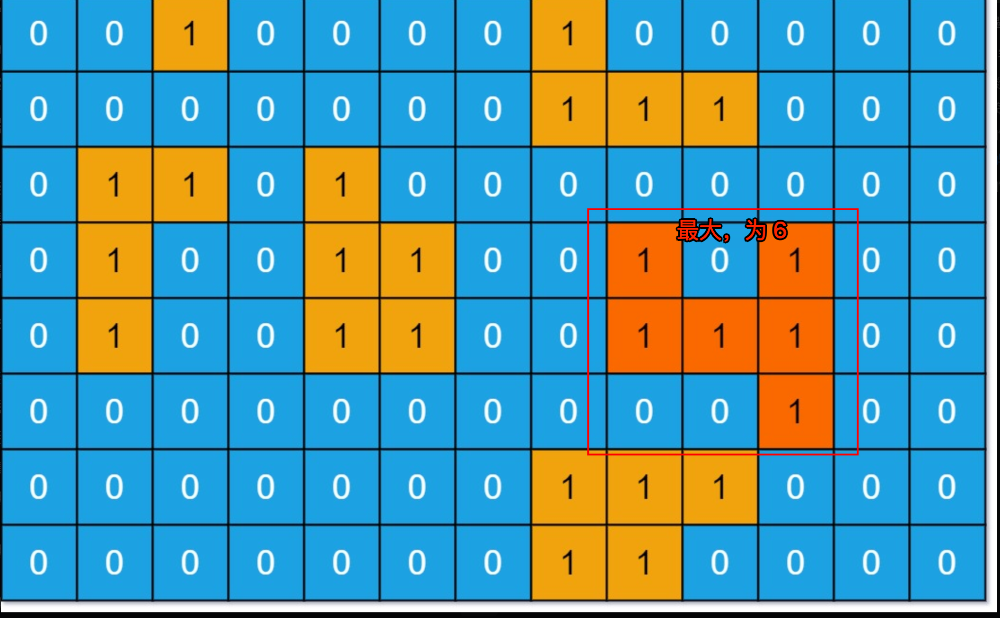

# 使用 DFS 解决岛屿问题

`#算法/DFS` 

岛屿系列题目的核心考点就是：用 DFS/BFS 算法遍历二维数组，本文都使用 DFS 算法


## 目录
<!-- toc -->
 ## 1. 二维矩阵遍历框架 

二维矩阵就可以抽象成一幅`网状的「图」结构`

```javascript hl:7,12
// 二维矩阵遍历框架
var dfs = function (grid, i, j, visited) {
  var m = grid.length,
    n = grid[0].length;

  if (i < 0 || j < 0 || i >= m || j >= n) {
    // 超出索引边界
    return;
  }

  if (visited[i][j]) {
    // 已遍历过 (i, j)
    return;
  }

  // 进入当前节点 (i, j)
  visited[i][j] = true;

  // 进入相邻节点（四叉树）
  // 上
  dfs(grid, i - 1, j, visited);
  // 下
  dfs(grid, i + 1, j, visited);
  // 左
  dfs(grid, i, j - 1, visited);
  // 右
  dfs(grid, i, j + 1, visited);
};

```


## 2. 岛屿数量

>  第 200 题「[岛屿数量](https://leetcode.cn/problems/number-of-islands)」


如上图，`0` 代表`海水`，`1` 代表`陆地`，返回独立岛屿的数量为 `4`

思路：
- 使用上面的遍历框架，只要发现一个陆地，就把它周边的陆地都变成海水
- 这样主要是为了省事，避免维护 `visited` 数组
	- 因为 `dfs` 函数遍历到值为 `0` 的位置会直接返回，所以只要把经过的位置都设置为 `0`，就可以起到不走回头路的作用


```javascript
var numIslands = function (grid) {
  let res = 0;
  let m = grid.length,
    n = grid[0].length;
  // 遍历 grid
  for (let i = 0; i < m; i++) {
    for (let j = 0; j < n; j++) {
      if (grid[i][j] === "1") {
        // 每发现一个岛屿，岛屿数量加一
        res++;
        // 然后使用 DFS 将岛屿淹了
        dfs(grid, i, j);
      }
    }
  }
  return res;
};

// 从 (i, j) 开始，将与之相邻的陆地都变成海水
var dfs = function (grid, i, j) {
  let m = grid.length,
    n = grid[0].length;
  if (i < 0 || j < 0 || i >= m || j >= n) {
    // 超出索引边界
    return;
  }
  if (grid[i][j] === "0") {
    // 已经是海水了
    return;
  }
  // 将 (i, j) 变成海水
  grid[i][j] = "0";
  // 淹没上下左右的陆地
  dfs(grid, i + 1, j);
  dfs(grid, i, j + 1);
  dfs(grid, i - 1, j);
  dfs(grid, i, j - 1);
};

```


## 3. 封闭岛屿的数量

> 力扣第 1254 题「[统计封闭岛屿的数目](https://leetcode.cn/problems/number-of-closed-islands)」

### 3.1. 要点

- `1` 代表陆地，`0` 代表`海水`
- 所谓「封闭岛屿」就是上下左右全部被 `1` 包围的 `0`，也就是说`靠边的陆地不算作「封闭岛屿」`

即`半岛`不算，`全岛`才算

### 3.2. 思路

- 先把靠边的都淹掉
	- 把靠上边的岛屿淹掉
	- 把靠下边的岛屿淹掉
	- 把靠左边的岛屿淹掉
	- 把靠右边的岛屿淹掉
- 然后再遍历，思路就和上题一样了
	- 从 `(i, j)` 开始，将与之相邻的陆地都变成海水

### 3.3. 代码

```javascript hl:6,12,8,14
var closedIsland = function (grid) {
  var m = grid.length,
    n = grid[0].length;
  // 主函数：计算封闭岛屿的数量
  for (let j = 0; j < n; j++) {
    // 把靠上边的岛屿淹掉
    dfs(grid, 0, j);
    // 把靠下边的岛屿淹掉
    dfs(grid, m - 1, j);
  }
  for (let i = 0; i < m; i++) {
    // 把靠左边的岛屿淹掉
    dfs(grid, i, 0);
    // 把靠右边的岛屿淹掉
    dfs(grid, i, n - 1);
  }
  // 遍历 grid，剩下的岛屿都是封闭岛屿
  let res = 0;
  for (let i = 0; i < m; i++) {
    for (let j = 0; j < n; j++) {
      if (grid[i][j] == 0) {
        res++;
        dfs(grid, i, j);
      }
    }
  }
  return res;

  // 从 (i, j) 开始，将与之相邻的陆地都变成海水
  function dfs(grid, i, j) {
    let m = grid.length,
      n = grid[0].length;
    if (i < 0 || j < 0 || i >= m || j >= n) {
      return;
    }
    if (grid[i][j] == 1) {
      // 已经是海水了
      return;
    }
    // 将 (i, j) 变成海水
    grid[i][j] = 1;
    // 淹没上下左右的陆地
    dfs(grid, i + 1, j);
    dfs(grid, i, j + 1);
    dfs(grid, i - 1, j);
    dfs(grid, i, j - 1);
  }
};

```

## 4. 岛屿的最大面积




只不过 `dfs` 函数淹没岛屿的同时，还应该想办法`记录`这个岛屿的面积。

```javascript
var maxAreaOfIsland = function (grid) {
  // 记录岛屿的最大面积
  let res = 0;
  let m = grid.length,
    n = grid[0].length;
  for (let i = 0; i < m; i++) {
    for (let j = 0; j < n; j++) {
      if (grid[i][j] == 1) {
        // 淹没岛屿，并更新最大岛屿面积
        res = Math.max(res, dfs(grid, i, j));
      }
    }
  }
  return res;

  // 淹没与 (i, j) 相邻的陆地，并返回淹没的陆地面积
  function dfs(grid, i, j) {
    let m = grid.length,
      n = grid[0].length;
    if (i < 0 || j < 0 || i >= m || j >= n) {
      // 超出索引边界
      return 0;
    }
    if (grid[i][j] == 0) {
      // 已经是海水了
      return 0;
    }
    // 将 (i, j) 变成海水
    grid[i][j] = 0;

    return (
      dfs(grid, i + 1, j) +
      dfs(grid, i, j + 1) +
      dfs(grid, i - 1, j) +
      dfs(grid, i, j - 1) +
      1
    );
  }
};

```

