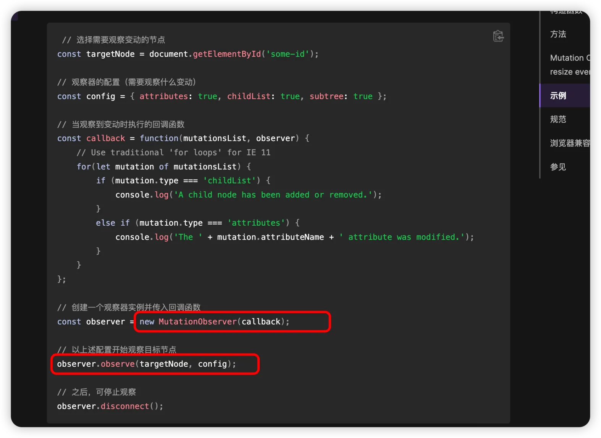

# rrweb

`#前端埋点` `#rrweb`


## 目录
<!-- toc -->
 ## 1. 总结 

- 定义：Web 会话录制和回放工具
- 作用：对于**用户行为分析、bug 复现和用户体验研究**非常有价值
- 三个核心部分
	- 记录器（recorder）
	- 回放器（player）
	- 数据存储（storage）
- 技术原理
	- DOM 序列化
		- 特殊元素：canvas & iframe svg 、音视频等
	- 事件收集
	- 增量更新：增量更新机制
	- 数据存储
		- JSON 格式
		- 支持压缩存储
	- 回放重现
		- 按时间轴线搞
	- 隐私&安全
	- 性能
		- **采样率**等
			- 比如：对于鼠标移动等高频事件，适当降低采样率
				- 每 50ms 采样一次鼠标移动
				- 每 150ms 采样一次滚动事件
				- 每 500ms 采样一次输入事件
		- 分片存储大量事件&增量上传
		- 使用 WebWorker 处理数据
		- 额外的压缩算法
		- 存储容量：定时清理
	- 扩展：通过插件等

## 2. rrweb 简介

 - rrweb (Record and Replay Web) 是一个开源的 Web 会话录制和回放工具
	 - **可以记录用户在网页上的所有操作**，并能够**完整地重现这些操作**。
	 - 这个工具对于**用户行为分析、bug 复现和用户体验研究**非常有价值
	 - 它主要包含三个核心部分：
		 - 记录器（recorder）
		 - 回放器（player）
		 - 数据存储（storage）

## 3. 基本使用方法

### 3.1. 安装

```bash
npm install rrweb
// 或
yarn add rrweb
```

### 3.2. 录制

```javascript
import rrweb from 'rrweb';

// 开始录制
let events = [];
rrweb.record({
  emit(event) {
    events.push(event);
  },
});
```

### 3.3. 回放

```javascript
import rrweb from 'rrweb';

// 回放录制的事件
const replayer = new rrweb.Replayer(events);
replayer.play();
```

## 4. 技术原理

rrweb 的实现原理主要包含以下几个关键部分：
- DOM 序列化
	- 遍历整个 DOM 树
	- 将 DOM 节点转换为可序列化的数据结构
	- 记录节点的属性、样式和内容
	- **处理特殊元素（如 iframe、canvas 等）**
- 事件捕获
	- 监听用户交互事件（如点击、输入、滚动等）
	- 记录鼠标移动轨迹
	- 捕获 DOM 变更
	- 记录时间戳以确保回放的时序准确性
- 增量更新：增量更新机制
	- 只记录 DOM 变化的部分
	- 使用 `MutationObserver` 监听 DOM 变更
	- 优化存储空间和传输效率
- 数据存储
	- 将捕获的事件序列化为 JSON 格式
	- 支持压缩存储
	- 提供事件过滤机制
- 回放重现
	- 重建初始 DOM 快照
	- 按时间顺序重放事件
	- 模拟用户交互
	- 保持时间同步
- **隐私保护**
	- 支持元素屏蔽
	- 敏感信息过滤
	- 自定义录制规则
- **性能优化**
	- 支持采样率调整
	- 提供事件节流
	- 支持按需加载
- **扩展功能**
	- 支持插件系统
	- 提供自定义事件
	- 支持录制控制

### 4.1. 录制原理

- **初始快照**
	- 在录制开始时，rrweb 会对整个 DOM 树进行序列化
	- 记录所有元素的属性、样式和位置信息
	- 收集所有相关的资源（如图片、字体等）
- **变更记录**
	- 使用 `MutationObserver` 监听 DOM 变化
	- 记录鼠标移动和点击事件
	- 捕获用户输入
	- 监听滚动事件
	- 记录窗口大小变化


代码展示 DOM 变更的监听过程：

```javascript
// DOM 变更监听示例
const observer = new MutationObserver((mutations) => {
  mutations.forEach((mutation) => {
    switch (mutation.type) {
      case 'childList':
        // 处理节点的添加和删除
        handleNodeChanges(mutation);
        break;
      case 'attributes':
        // 处理属性变更
        handleAttributeChanges(mutation);
        break;
      case 'characterData':
        // 处理文本内容变更
        handleTextChanges(mutation);
        break;
    }
  });
});

// 配置观察选项
const config = {
  attributes: true,
  childList: true,
  characterData: true,
  subtree: true
};

// 开始观察
observer.observe(document.documentElement, config);
```

### 4.2. 数据结构

rrweb 记录的事件主要包含以下类型：

```typescript
interface Event {
  type: EventType;
  data: EventData;
  timestamp: number;
}

enum EventType {
  DomContentLoaded,
  Load,
  FullSnapshot,
  IncrementalSnapshot,
  Meta,
  Custom
}
```

### 4.3. 回放原理

- **虚拟 DOM 重建**
	- 基于初始快照重建 DOM 树
	- 创建沙箱环境，避免对实际页面造成影响
- **增量更新**
	- 按时间顺序应用记录的事件
	- 重现 DOM 变更
	- 模拟用户交互
- **时间控制**
	- 维护事件时间线
	- 支持播放、暂停、快进等操作

## 5. 高级功能

### 5.1. 压缩存储

```javascript
import { pack, unpack } from 'rrweb';

// 压缩事件数据
const packedEvents = pack(events);

// 解压事件数据
const unpackedEvents = unpack(packedEvents);
```

### 5.2. **采样控制**

```javascript hl:6,7,8
rrweb.record({
  emit(event) {
    // 存储事件
  },
  sampling: {
    mousemove: 50, // 每 50ms 采样一次鼠标移动
    scroll: 150,   // 每 150ms 采样一次滚动事件
    input: 500     // 每 500ms 采样一次输入事件
  }
});
```

## 6. 性能优化建议

- **采样率调整**
	- 根据实际需求调整不同事件的采样频率
	- 对于鼠标移动等高频事件，适当降低采样率
- **数据压缩**
	- 使用内置的压缩功能
	- 考虑**使用额外的压缩算法**
- **存储优化**
	- 分片存储大量事件
	- 实现增量上传
- **回放优化**
	- 使用 WebWorker 处理数据
	- 实现懒加载机制
- **直接上传存储服务**
	- 如果要完全重新的话，

## 7. 完全重现的话，建议上传存储服务

因为所有数据都要上传，包括所有的仅在资源，你说呢？？？？

## 8. 安全考虑

### 8.1. **隐私保护**

```javascript
rrweb.record({
  emit(event) {
    // 存储事件
  },
  maskAllInputs: true, // 自动屏蔽所有输入框的内容
  maskInputOptions: {
    password: true,    // 屏蔽密码输入
    creditCard: true   // 屏蔽信用卡输入
  }
});
```

### 8.2. **数据脱敏**

- 配置敏感数据过滤规则
- 实现自定义脱敏逻辑

## 9. 常见应用场景

- **错误重现**
	- 记录用户操作步骤
	- 辅助开发人员复现问题
- **用户行为分析**
	- 统计用户操作路径
	- 生成热力图
- **产品优化**
	- 分析用户使用习惯
	- 优化用户体验
- **质量保证**
	- 自动化测试
	- 回归测试

## 10. 注意事项

1. **性能影响**
	- 监控内存使用
	- 控制事件采样率
	- 及时清理不需要的记录
2. **兼容性**
	- 检查浏览器支持
	- 处理特殊场景（如 iframe）
		- **SVG**
		- **音视频视频**
		- Canvas 等等特殊元素
3. **存储容量**
	- 评估存储需求
	- 实现数据**清理策略**
4. **网络带宽**
	- 考虑数据上传策略
	- 实现断点续传