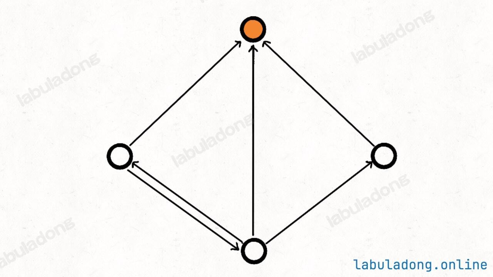
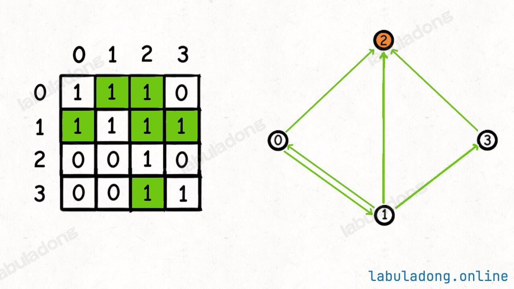

# 搜寻名人：返回名人的编号，不存在返回 -1


> [277. 搜寻名人](https://leetcode.cn/problems/find-the-celebrity/)


## 目录
<!-- toc -->
 ## 1. 名人节点定义 

- 出度为 `0`
- 入度为 `n - 1`

下图中的`橙色节点`就是`名人节点`



>   `n` 个人的社交关系

## 2. 邻接矩阵

邻接矩阵来表示人和人之间的社交关系更合适些

下图中，`2 节点`是`名人节点`，所以返回 `2`



## 3. 暴力解法

- 关键点：
	-  `knows(a,b)` ： a 是否认识 b 
	- 遍历每个人，检查是否是名人
		- `isSuperStar(i) {` 检查 `i`是否是名人

```javascript
/**
 * @param {function} knows() ： a 是否认识 b 
 * @return {function}
 */
var solution = function (knows) {
    /**
     * @param {integer} n Total people
     * @return {integer} The celebrity
     */
    return function (n) {
        // 遍历每个人，检查是否是名人
        for (let i = 0; i < n; i++) {
            if (isSuperStar(i, n)) {
                return i;
            }
        }
        return -1;
        function isSuperStar(i) {
            // 检查规则1：i 不应该认识任何其他人
            for (let j = 0; j < n; j++) {
                if (j === i) continue; // 跳过自己
                // 如果 i 认识了其他人，就不是名人
                if (knows(i, j)) {
                    return false;
                }
            }
            // 检查规则2：所有其他人都应该认识 i
            for (let j = 0; j < n; j++) {
                if (j === i) continue; // 跳过自己
                // 如果有人不认识 i，那 i 就不是名人
                if (!knows(j, i)) {
                    return false;
                }
            }
            // 通过所有检查，是名人
            return true;
        }
    };
};

```

## 4. 优化解法

>  ① 你认识我我不认识你
>  ② 我认识你你不认识我
>  ③ 咱俩互相认识
>  ④ 咱两互相不认识

下面分析这四种情况：
-  `i` 认识 `j`， `j` 不认识 `i`
	- 排除 `i` ， 因为名人不可能认识别人
-  `i` 不认识 `j` , 但`j` 认识 `i`
	- 排除 `j` ， 因为名人不可能认识别人
- 咱俩互相认识
	- 肯定都不是名人，可以排除
- 咱两互相不认识
	- 肯定都不是名人，可以随便排除一个。因为名人应该被所有其他人认识。

思路：
- 使用列队：将所有候选人装入
- `while (q.length >= 2) {`
	- 一直排除，直到只剩下一个候选人停止循环
- 排除得只剩一个候选人，判断他是否真的是名人

```javascript
var solution = function (knows) {
    return function (n) {
        if (n === 1) {
            return 0;
        }
        // 将所有候选人装进队列
        let q = Array.from({ length: n }, (_, i) => i);
        // 一直排除，直到只剩下一个候选人停止循环
        while (q.length >= 2) {
            // 每次取出两个候选人，排除一个
            let cand = q.shift();
            let other = q.shift();
            if (knows(cand, other) || !knows(other, cand)) {
                // cand 不可能是名人，排除，让 other 归队
                q.unshift(other);
            } else {
                // other 不可能是名人，排除，让 cand 归队
                q.unshift(cand);
            }
        }

        // 现在排除得只剩一个候选人，判断他是否真的是名人
        let cand = q.shift();
        for (let other = 0; other < n; other++) {
            if (other === cand) {
                continue;
            }
            // 保证其他人都认识 cand，且 cand 不认识任何其他人
            if (!knows(other, cand) || knows(cand, other)) {
                return -1;
            }
        }
        // cand 是名人
        return cand;
    };
};

```