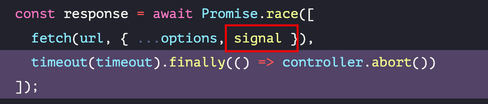

# 常见面试题：篇七

`#前端面试` `#R1` 

## 目录
<!-- toc -->
 ## 1. 递归导致的栈溢出问题如何解决 

- 尾递归调用
- 改成迭代解法
	- 比如：**蹦床函数**可以==把递归函数改造成循环执行==
- 生成器函数（Generator）
- 使用 Promise 来异步执行递归
	- 使用 `Promise.resolve()` 来异步执行下一次递归

## 2. JWT (JSON Web Token) →  就是一种**特定规则签名**

总结：
- ==Token 是一种用于身份验证的凭证==，最常见的实现签名规则是 **JWT (JSON Web Token)**
- 签名规则，以 `,` 分割
	- Header (算法和类型)
	- Payload (数据)
	- Signature (签名)
- 安全
	- 设置合理的过期时间
	- 定期清理过期 token
	- 使用 HttpOnly Cookie
	- 设置正确的 CORS 策略
	- 添加 CSRF 防护

## 3. Bearer Token 介绍

### 总结

- Bearer Token ==是一种 HTTP 身份验证方案，在 OAuth 2.0 中广泛使用==。
	- "Bearer" 的含义是"持有者"，即**谁持有这个 token，谁就能访问资源，类似于"持票人入场"的概念**。
	- `Authorization: Bearer <token>`
- 放到 Header 中
- 前端
	- Header
		- Authorization: `Bearer ${token}`
	- Header
		- Content-Type：`'application/json'`
- 安全
	- 使用 HttpOnly Cookie 存储
	- 设置合理的过期时间
	- Token 刷新机制

## 4. Axios Timeout 原理

- 浏览器中的 XHR对象 专门有一个 `timeout 属性` 和 `ontimeout 方法`
	- `xhr.ontimeout = function handleTimeout() {`
- Node.js 的 http.request `timeout 事件`

## 5. 前端请求超时设置方法

- 使用 Fetch API
	- 
		- 实现一个 timeout 
			- 看 fetch 和 timeout 哪个快
		-  `const { signal } = controller;` →   `const controller = new AbortController();`
-  使用 Axios
	- 全局配置：`axios.defaults.timeout = 5000;`
	- 有个叫 `cancelToken` 的参数
- XMLHttpRequest 方式
	- timeout 属性
	- xhr.ontimeout 方法

>  最后，最好封装统一的工具