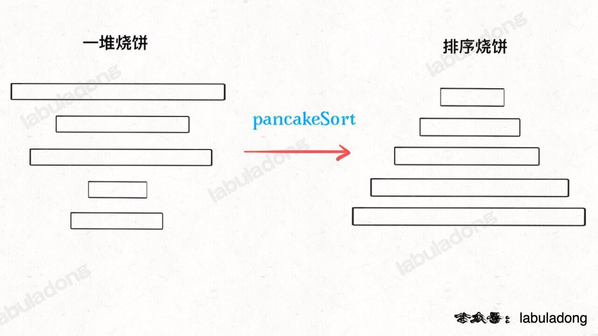

# 煎饼排序


| LeetCode                                                               | 力扣                                                         | 难度  |
| ---------------------------------------------------------------------- | ---------------------------------------------------------- | --- |
| [969. Pancake Sorting](https://leetcode.com/problems/pancake-sorting/) | [969. 煎饼排序](https://leetcode.cn/problems/pancake-sorting/) | 🟠  |




## 目录
<!-- toc -->
 ## 思路：递归遍历 

假设有数组 `[3, 2, 4, 1]`，我们要将其排序为 `[1, 2, 3, 4]`：

1. 第一轮（i = 4）：
    - 找到最大值 4，位置在索引 2
    - 翻转前 3 个元素：`[4, 2, 3, 1]`
    - 翻转前 4 个元素：`[1, 3, 2, 4]`
    - 4 已经到达正确位置
2. 第二轮（i = 3）：
    - 找到最大值 3，位置在索引 1
    - 翻转前2个元素：`[3, 1, 2, 4]`
    - 翻转前3个元素：`[2, 1, 3, 4]`
    - 3 已经到达正确位置
3. 第三轮（i = 2）：
    - 找到最大值2，位置在索引0
    - 翻转前 2 个元素：`[1, 2, 3, 4]`
    - 2已经到达正确位置
最终数组已经排序完成：`[1, 2, 3, 4]`

## 代码

这个问题具有递归性质，你想把 `n` 个烧饼排序，可以按如下步骤操作：
1、先把 `n` 个烧饼中最大的那个烧饼找出来。
2、把这个最大的烧饼放在最下面。
3、对剩下 `n - 1` 个烧饼排序。

```javascript hl:11,14
var pancakeSort = function (cakes) {
    const res = [];
    // n 反转第几个？
    const sort = function (cakes, n) {
        if (n == 1) return;
        // 寻找最大饼的索引
        let newArr = cakes.slice(0, n);
        let max = Math.max(...newArr);
        let maxIndex = newArr.indexOf(max);

        // 第一次翻转，将最大饼翻到最上面
        reverse(cakes, 0, maxIndex);
        res.push(maxIndex + 1);
        // 第二次翻转，将最大饼翻到最下面
        reverse(cakes, 0, n - 1);
        res.push(n);
        // 递归调用
        sort(cakes, n - 1);
    };

    const reverse = function (arr, i, j) {
        while (i < j) {
            var temp = arr[i];
            arr[i] = arr[j];
            arr[j] = temp;
            i++;
            j--;
        }
    };

    sort(cakes, cakes.length);
    return res;
};
```