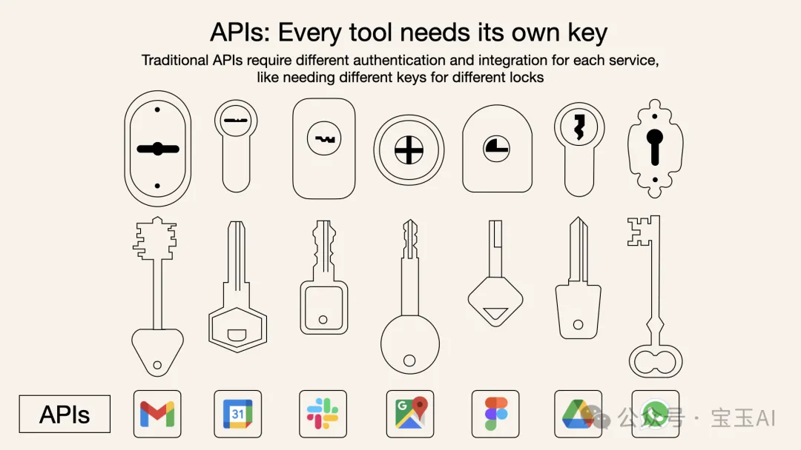

# 模型上下文协议（MCP）

`#AI` 

模型上下文协议（Model Context Protocol，简称MCP）

为AI模型`量身定制的“USB-C接口”`，可以标准化地连接AI系统与各类外部工具和数据源

## 目录
<!-- toc -->
 ## 背景：为什么不是 API？ 

- AI系统想连接外部工具时，需要单独整合多个不同的API。
- 每个API都有独立的代码、文档、认证方式、错误处理和后续维护，极大地增加了开发复杂度。
- 传统的API要求开发者为每个服务或数据源单独编写代码和整合方案

>   API 就像不同的门，每扇门都需要自己的钥匙和特定的规则，如上图

## 目的

目的是帮助AI模型（如Claude）**更容易地连接工具和数据源**。

## 参考

- https://modelcontextprotocol.io/introduction
- https://mp.weixin.qq.com/s/oyewbUXalcfjjKo6R6YOdA
	- 同 https://waytoagi.feishu.cn/wiki/EHOjwN37KiRzXak4xm6cqfBCnYC