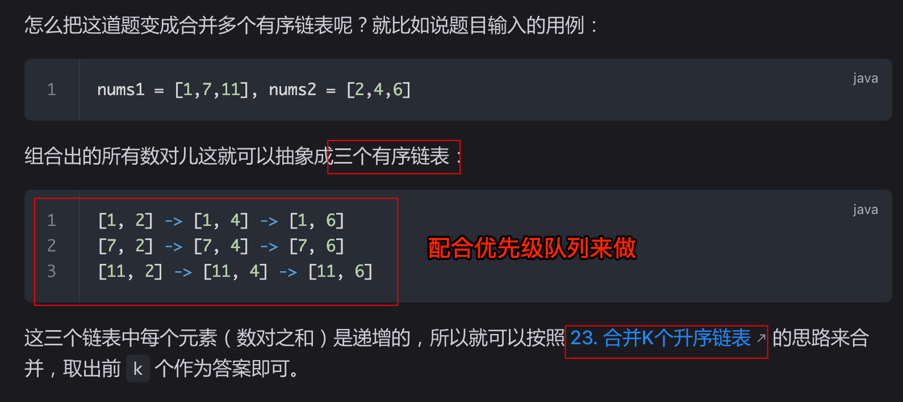

# 查找和最小的 K 对数字


> [373. 查找和最小的 K 对数字](https://leetcode.cn/problems/find-k-pairs-with-smallest-sums/)


## 目录
<!-- toc -->
 ## 1. 思路 



>  [23. 合并 K 个升序链表](/post/bAnXiD4w.html) 的变体

## 2. 代码

关键点：
- 优先级队列的元素：
	- 存储三元组 `[num1[i], nums2[i ~ n2], i]`

```javascript
var kSmallestPairs = function (nums1, nums2, k) {
  let n1 = nums1.length;
  let n2 = nums2.length;
  let pq = [];
  let res = [];

  // 存储三元组 [num1[i], nums2[i ~ n2], i]
  function enqueue(item) {
    pq.push(item);
    pq.sort((a, b) => {
      return a[0] + a[1] - (b[0] + b[1]);
    });
  }

  for (let i = 0; i < n1; i++) {
    enqueue([nums1[i], nums2[0], 0]);
  }

  while (pq.length > 0 && res.length < k) {
    // 先从优先级队列中取出对头，肯定是满足条件的，加入 res
    let cur = pq.shift();
    res.push([cur[0], cur[1]]);
    // 下一个节点加入优先级队列
    let next_index = cur[2] + 1;
    if (next_index < n2) {
      enqueue([cur[0], nums2[next_index], next_index]);
    }
  }

  return res;
};
```

上面会超时，入队函数修改为**二分查找位置，然后插入**

```javascript
function enqueue(item) {
  const sum = item[0] + item[1];
  let left = 0,
    right = pq.length;

  while (left < right) {
    const mid = Math.floor((left + right) / 2);
    if (pq[mid][0] + pq[mid][1] > sum) {
      right = mid;
    } else {
      left = mid + 1;
    }
  }
  pq.splice(left, 0, item);
}
```

还是不行

```javascript
for (let i = 0; i < Math.min(k, n1); i++) {
	enqueue([nums1[i], nums2[0], 0])
}
```


最后，如果还是不行，就老实的使用优先级队列吧

```javascript
let pq = new MinPriorityQueue({
  compare: (a, b) => {
	// 按照数对的元素和升序排序
	return a[0] + a[1] - (b[0] + b[1]);
  },
});
```


> 更多参考 [5. 优先级队列：Leetcode 中提供的数据结构介绍](/post/b9TQxqhE.html)
