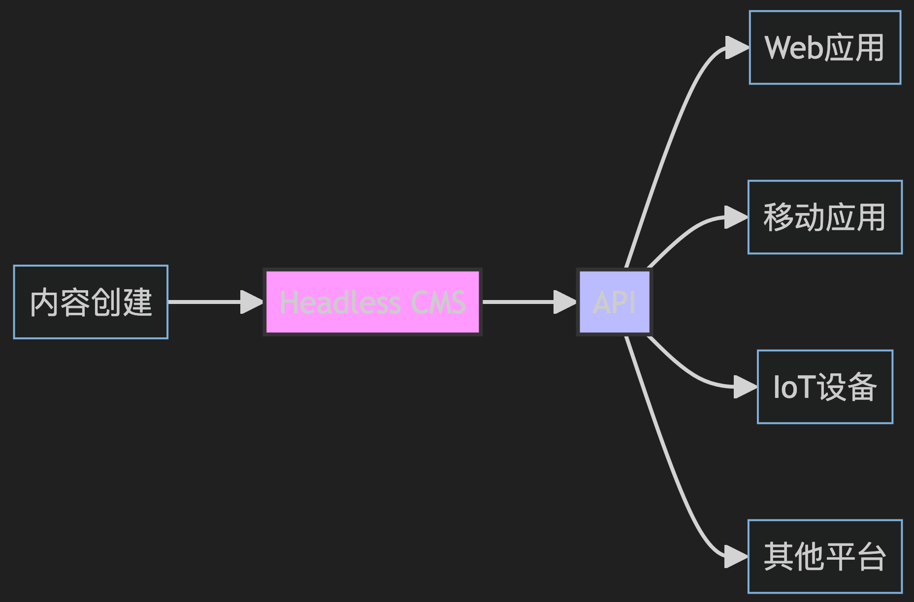
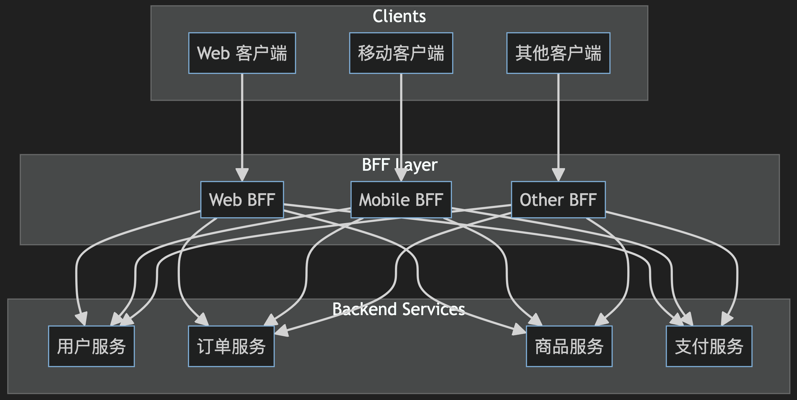
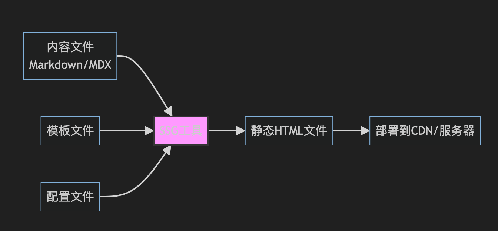
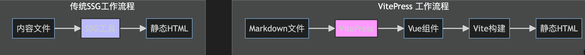
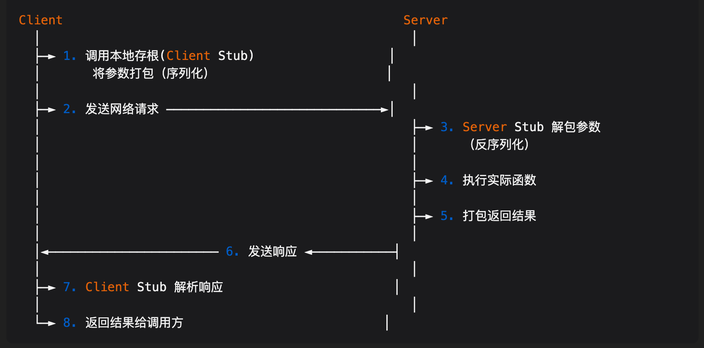

# 前端相关的技术点

`#前端` 

> 以下是一些`相对不过时的前端技术关键词`及其简要介绍

## 目录
<!-- toc -->
 ## 1. React 和 React Hooks 

- **React**：
	- 一个由 Facebook 开发的用于构建用户界面的 JavaScript 库。它的虚拟 DOM 和组件化设计使其非常受欢迎。
- **React Hooks**：
	- React 16.8 引入的一组新特性，允许在函数组件中使用状态和其他 React 特性
		- 如 `useState`、`useEffect` 等。

## 2. Vue 3

- **Vue.js**：一个用于构建用户界面的渐进式 JavaScript 框架。
	- Vue 3 引入了 Composition API、性能改进和更好的 TypeScript 支持。

## 3. Svelte 和 SvelteKit

- `Svelte`：一个新的前端框架，与传统框架不同
- **Svelte 在编译时将组件转换为高效的命令式代码，而不是在运行时解释代码**。
	- Svelte 是一种全新的构建用户界面的方法。
		- 传统框架如 React 和 Vue 在浏览器中需要做大量的工作
		- 而 Svelte 将这些工作放到构建应用程序的**编译阶段**来处理
	- Svelte 在 `构建/编译阶段` 将你的应用程序转换为理想的 JavaScript 应用
		- 而不是在`运行阶段` 解释应用程序的代码
		- 这意味着你不需要为框架所消耗的性能付出成本，并且在应用程序首次加载时没有额外损失
- `SvelteKit`：
	- 一个用于构建 `Svelte` 应用的全栈框架，支持服务器端渲染、静态站点生成等功能

## 4. Next.js 和 Nuxt.js

- **Next.js**：
	- 一个基于 `React` 的框架（元框架）
	- 支持服务器端渲染（SSR）、静态站点生成（`SSG`）和增量静态再生（`ISR`）。
- **Nuxt.js**：
	- 一个基于 `Vue.js` 的框架，提供类似的功能，如 SSR 和 SSG。

## 5. JAMstack

- **JAMstack**：
	- 一种现代 Web 开发架构，强调使用 JavaScript、API 和 Markup。
	- 常用工具包括**静态站点生成器**（如 Gatsby、Next.js）和无服务器函数（如 Netlify Functions）。

> 后文会详细说明 [8. JAMstack 架构](/post/beBNemRn.html)

## 6. WebAssembly (Wasm)

- **WebAssembly**：
	- 一种新的==二进制指令格式==，设计用于在浏览器中实现高性能应用。
	- 它允许开发者使用多种编程语言（如 C、C++、Rust）编写代码，并在浏览器中运行。

## 7. TypeScript

- **TypeScript**：微软开发的一种 JavaScript 的超集，增加了类型检查和其他特性
	- TypeScript 近年来在前端开发中变得非常流行，尤其是在大型项目中。

## 8. GraphQL

- **GraphQL**：
	- 由 Facebook 开发的一种用于 API 的查询语言，允许客户端指定所需的数据结构
	- 与传统的 REST API 相比，GraphQL 提供了更高效的数据获取方式

## 9. Tailwind CSS

- **Tailwind CSS**：
	- 一个实用优先的 CSS 框架，允许开发者直接在 HTML 中使用类名来应用样式。
	- 它的灵活性和可定制性使其在前端开发中越来越受欢迎。

> 有点类似于之前的 `bootstrap`
> 基于大模型要求 token 限制，其实大模型 与 Tailwind CSS 友好度更好

## 10. Headless CMS 

> 有点类似于 BFF

- **Headless CMS**：
	- Headless CMS 是一个后端内容管理系统，它将内容管理（"后端"）与内容展示（"前端"）完全分离。
	- 与传统的 CMS 不同，Headless CMS **只负责内容的存储和管理，不负责内容的展示方式**。
	- 常见的 Headless CMS 有 Contentful、Strapi 和 Sanity。

## 11. Progressive Web Apps (PWA)

- **PWA**：
	- 渐进式 Web 应用，通过使用现代 Web 技术（如 `Service Worker` 和 `Web App Manifest`）提供类似本地应用的体验，包括`离线访问`和`推送通知`

## 12. 微前端：Micro Frontends 

- **Micro Frontends**：
	- 一种将前端应用拆分为多个小型、独立的模块的架构
	- 每个模块可以独立开发、部署和运行

## 13. Web Components

- **Web Components**：
	- 一组标准技术，允许开发者创建可重用的自定义 HTML 元素
	- 包括 Custom Elements、Shadow DOM 和 HTML Templates

## 14. Server-side Rendering (SSR) 和 Static Site Generation (SSG)

- **SSR** 和 **SSG**：
	- 通过在服务器端生成 HTML，提高了页面加载速度和 SEO 性能。
		- Next.js 和 Nuxt.js 都支持这些功能

## 15. Modern Build Tools

- **Webpack**、**Rollup**、**Parcel** 和 **Vite**：
	- 现代 JavaScript 构建工具，提供代码打包、模块化和性能优化等功能。
	- 更现代的，比如 ==esbuild ，rspack ，或者 turbopack==

## 16. WebRTC

- **WebRTC**：
	- 一种支持浏览器和移动应用进行实时通信（如视频、音频、数据传输）的技术。
	- 它使得开发者可以构建视频会议、实时聊天和 P2P 文件共享等应用。

## 17. WebSockets

- **WebSockets**：
	- 一种在客户端和服务器之间建立持久连接的协议，允许==双向通信==。
	- 适用于实时应用，如在线游戏、实时聊天和实时更新的仪表盘。

## 18. SSE 

现在大模型应用经常会使用这个这种协议，本质也是 HTTP

## 19. Service Workers

- **Service Workers**
	- 一种在后台运行的脚本，能够拦截和处理网络请求，提供离线支持、缓存管理和推送通知等功能
	- 是 PWA 的核心技术之一

## 20. Single Page Applications (SPA)

- **SPA**：
	- 单页应用，通过动态加载内容和更新 URL 实现不重新加载整个页面的用户体验
	- 常用框架包括 React、Vue.js 和 Angular 

## 21. Microservices Architecture：微服务架构

- **Microservices**：
	- 将应用拆分为一组小的、独立部署的服务，每个服务负责特定的业务功能
	- 前端可以通过 API 网关或服务编排与这些微服务进行交互

## 22. APIs and Backend for Frontend (BFF)

- **BFF**：
	- 一种设计模式，为每个前端应用（如 Web、移动）创建专门的后端服务，优化 API 调用和数据处理。
	- 是一种架构模式，在前端应用和后端服务之间添加一个中间层，专门用于服务特定的前端应用或客户端。

## 23. 状态管理库：State Management Libraries

> 用于数据流管理的

- **Redux**：
	- 一个流行的 JavaScript 状态管理库，常与 React 一起使用
- **MobX**：
	- 另一种状态管理库，基于`响应式编程`，适用于需要更灵活状态管理的应用
- vuex
- pinia
	- 响应式
- umi / dva

## 24. Component Libraries and Design Systems：组件库&设计系统

- **Material-UI**：
	- 基于 Google 的 Material Design 规范的 React 组件库
- **Ant Design**：
	- 一个企业级的 UI 设计语言和 React 组件库。
- Element UI
- 等等

## 25. Serverless Architecture

- **Serverless**：
	- 一种云计算模型，开发者只需编写代码而**无需管理服务器**。
	- 常用的服务包括 AWS Lambda、Azure Functions 和 Google Cloud Functions。
- 国内各个云商也都有提供，比如腾讯云和阿里云
	- 个人用过的 亚马逊、腾讯云

## 26. Static Site Generators (SSG)

SSG 是一种将模板和数据转换为静态 HTML 网站的工具。它在**构建时（而不是运行时）生成所有页面**。

常见的
- vitepress：**自己常用的**
	- 
- **Hugo**：
	- 一个用 Go 语言编写的静态站点生成器，构建速度非常快
	- 听过，没用过，一些网站都是用它来搭建的
- rspack 也有类似的

## 27. CSS-in-JS

- **Styled Components**：
	- 一种将 CSS 直接写在 JavaScript 中的技术，提供组件级的样式隔离 
- **Emotion**：
	- 一个高性能的 CSS-in-JS 库，支持标签模板和对象样式

### 27.1. 它是如何做样式隔离的？

1. **命名空间隔离**
    - 通过生成唯一的类名或前缀
    - 使用**哈希算法**确保唯一性
    - 组件级别的样式封装
2. **运行时隔离**
    - 动态创建 style 标签
    - 使用 Shadow DOM 提供原生隔离
    - 样式注入时进行作用域限定
3. **编译时转换**
    - 在构建过程中转换类名
    - 添加唯一标识符
    - 生成隔离的样式代码

## 28. Modern CSS Features

- **CSS Grid**：
	- 一种用于创建二维布局的 CSS 布局系统。
- **CSS Variables**：
	- 也称为自定义属性，允许定义可重用的值。
- **Flexbox**：
	- 一种用于创建一维布局的 CSS 布局系统。

## 29. Web Animations API

- **Web Animations API**：
	- 一种用于在 Web 上创建高性能动画的 API，提供了对动画的精细控制。

## 30. Web Components 

- **LitElement**：
	- 一个用于构建 Web Components 的轻量级库，简化了自定义元素的创建。
- **Stencil**：
	- 一个用于构建高性能 Web Components 的编译器，支持 TypeScript 和 JSX。

> 都没用过，现在市面完全使用 Web Components 还是较少

## 31. Testing Frameworks and Tools

- **Jest**：
	- 一个由 Facebook 开发的 JavaScript 测试框架，支持快照测试和并行测试
- **Cypress**：
	- 一个用于端到端测试的现代 JavaScript 测试框架，提供了直观的 API 和强大的调试功能
- **Playwright**：
	- 一个用于端到端测试的工具，由 Microsoft 开发，支持多种浏览器

## 32. Web Vitals

- **Web Vitals**：
	- 一组由 Google 定义的指标，用于衡量和优化 Web 性能，
	- 包括
		- Largest Contentful Paint (LCP)
		- First Input Delay (FID) 
		- Cumulative Layout Shift (CLS)

## 33. 边缘计算：Edge Computing

- **Edge Computing**：
	- 一种在`靠近数据源的地方`进行计算和数据处理的技术，减少了延迟，提高了性能。
	- 常见的服务包括 Cloudflare Workers 和 AWS Lambda@Edge。

## 34. Low-Code/No-Code Platforms

- **Low-Code/No-Code**：
	- 一种通过图形化界面和拖放组件来构建应用的开发方式，降低了开发门槛
	- 常见平台包括 `Mendix` 和 `Webflow`
	- 国内各大云平台都有自己的低代码产品

## 35. Remote Procedure Calls (RPC)

- RPC：
	- 通过网络调用远程服务的方法
	- RPC 允许程序==调用另一个地址空间==（通常是网络上的另一台机器）的程序
	- 使程序能像调用本地方法一样调用远程服务
	- 适用于高性能的前后端通信。
		- 
- **主要特点**
	- **透明性**：调用方感知不到远程调用的存在
	- **高效性**：通常比 REST API 更高效
	- **强类型**：通过 IDL 定义接口，提供类型安全
	- **双向通信**：支持请求-响应模式
- **主流 RPC 框架**
	- gRPC (Google)
	- Dubbo (Apache/Alibaba)
	- `Thrift` (Apache) 
	- Spring Cloud (VMware)

## 36. Module Federation：模块联邦

- Module Federation：
	- Webpack 5 的新特性，支持在不同应用之间动态加载模块，**适用于微前端架构**
- vite 也有类似的功能点，

## 37. 增量静态再生（Incremental Static Regeneration, ISR）

- 增量静态再生（Incremental Static Regeneration, ISR）是 Next.js 提供的一种功能，
- 结合了静态站点生成（Static Site Generation, SSG）和服务器端渲染（Server-Side Rendering, SSR）的优点。
	- 它允许开发者在`构建时`生成静态页面
	- 并在`运行时`**按需更新**这些页面，从而实现高性能和最新数据的平衡。
- 但==不适合==高实时、更新频繁的页面

## 38. Storybook

- 介绍：
	- 用于 开发 和 测试UI组件 的工具
- 特点：
	- 独立环境、组件文档、交互测试

## 39. 参考

- [GPT-4o](https://chatgpt.com/)
- [Claude 3.5 Sonnet](https://www.anthropic.com/news/claude-3-5-sonnet?locale=zh_CN)
- [web 入门 - 学习 Web 开发 | MDN](https://developer.mozilla.org/zh-CN/docs/Learn/Getting_started_with_the_web)
- [Web 和 Web 标准 - 学习 Web 开发 | MDN](https://developer.mozilla.org/zh-CN/docs/Learn/Getting_started_with_the_web/The_web_and_web_standards)
- [万维网 - MDN Web 文档术语表：Web 相关术语的定义 | MDN](https://developer.mozilla.org/zh-CN/docs/Glossary/World_Wide_Web)
- [万维网是如何工作的 - 学习 Web 开发 | MDN](https://developer.mozilla.org/zh-CN/docs/Learn/Getting_started_with_the_web/How_the_Web_works)
- [什么是 JAMstack？](https://www.cloudflare.com/zh-cn/learning/performance/what-is-jamstack/)
- [什么是JAMStack前端架构](https://juejin.cn/post/6999897855695683614)
- [前端知识图谱](https://f2e.tech/mindmap?)

