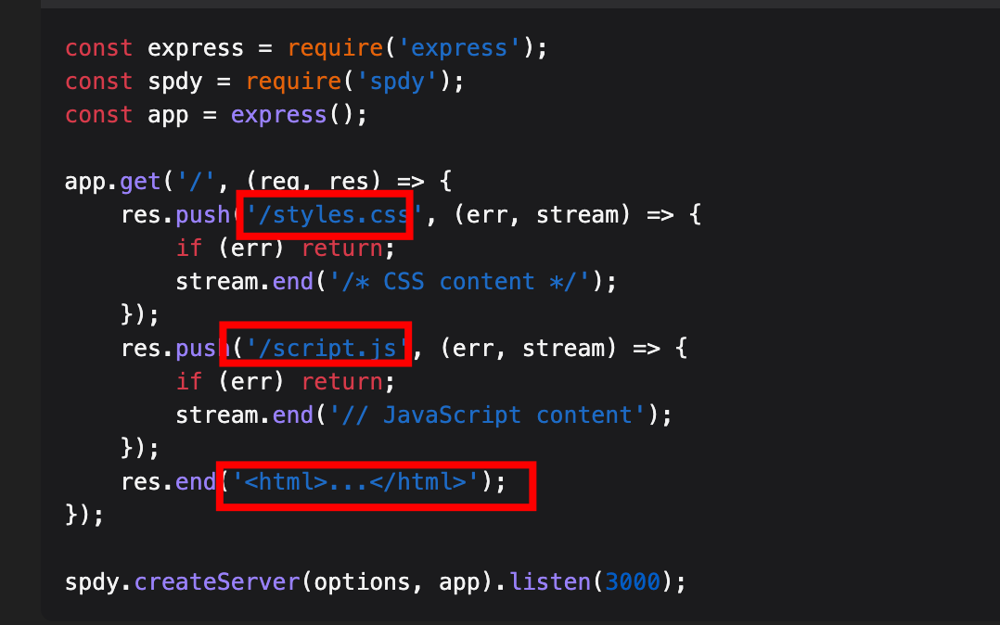
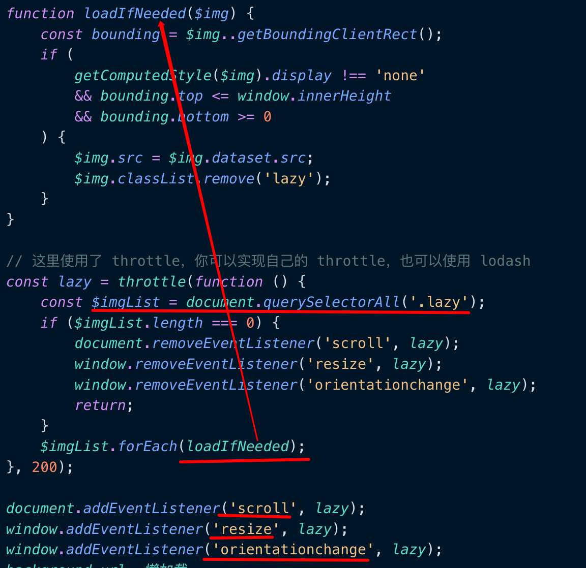
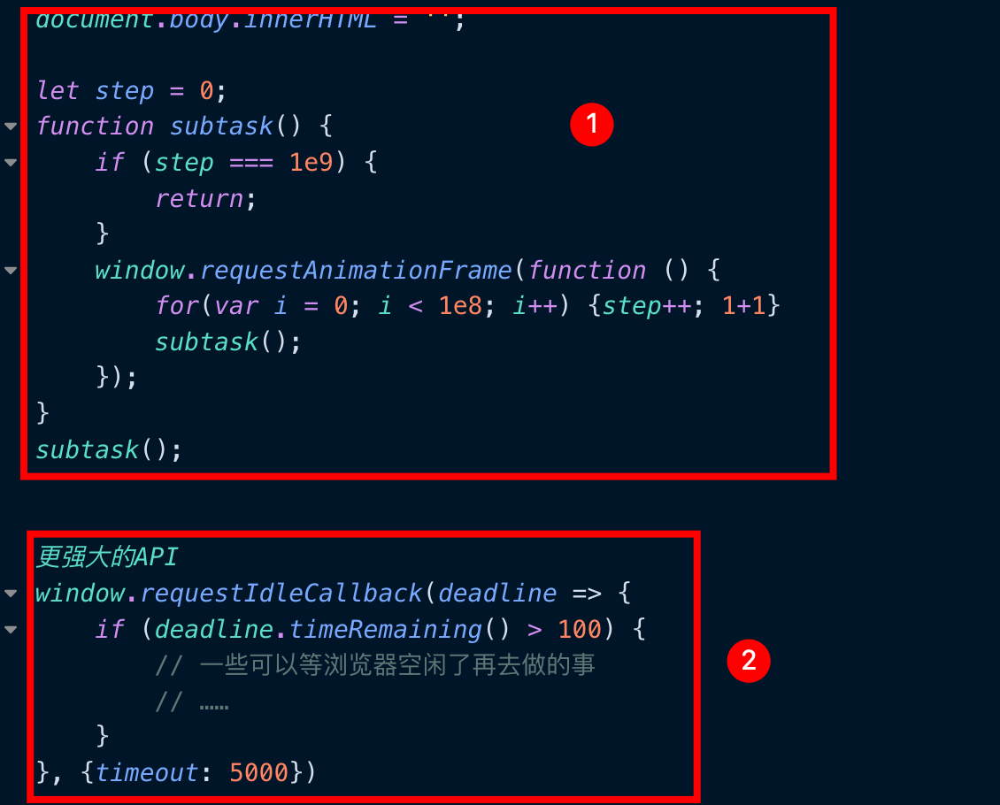

# 常见性能优化思路

## 目录
<!-- toc -->
 ## 1. 缓存 

- 本地缓存：localStorage、sessionStorage、indexedDB
- 内存缓存：Memory Cache
- Cache API：Service Worker
- HTTP 缓存
	- 强缓存：
		- 控制强制缓存的字段分别是`Expires`和`Cache-Control`，其中 `Cache-Control：max-age=xxx`优先级更高
		- 浏览器会在`js和图片等文件`解析执行后直接存入`内存缓存`中，即 `from Memory Cache`
		- css文件：每次渲染页面都需要从硬盘读取缓存，即 from disk cache
	- 协商缓存：
		- 即 问一问服务器本地资源可以用吗
			- 200 更新了
			- 304 没更新，直接用吧
		- `Etag / If-None-Match`的优先级比 `Last-Modified / If-Modified-Since`高
	- Push Cache ： HTTP2 支持，访问 index.html ，同时推送必要css 和 js 等
		- 

## 2. 客户端请求

- 避免过多多余重重定向
- `<link rel="dns-prefetch" href="//yourwebsite.com">`
- `<link rel="preconnect" href="//sample.com" crossorigin>`

## 3. 服务端响应

- 流响应
- 前端聚合与后端聚合：
	- nodejs 局域网内聚合后端多个服务肯定快于前端聚合，另外注意**首屏数据就绪就好**
- Nodejs
	- 能并行的并行，少串行：async await 
	- 守护进程（pm2/supervisor）又将进程重启，频繁重启肯定会导致接口变量
	- 异常监控，少重启
	- 代码问题
		- JSON.parse 大对象
		- 闭包，内存泄漏

## 4. 静态资源

### 4.1. js  

- 拆、按需加载  
- 合并压缩  
- Tree Shaking  
- 避免 Long Task  
- 反其道而行之，不用框架  
- 基础库代码打包合并 

### 4.2. css  

- 避免使用昂贵的属性 ：
	- border-radius box-shadow opacity transform filter position: fixed  
- flex 布局取代 float  
- 选择器简化  

### 4.3. 图片

- 根据设备的分辨率优化图片大小  
- 使用图片的缩略图  
- 提前占位，防止抖动
- 首屏优先加载，懒加载
	- background-url 懒加载规则
		- 这个样式规则，如果不应用到具体的元素，浏览器不会去下载该图片。
		- 所以你可以通过切换 className 的方式，放心得进行 CSS 中图片的懒加载。
	- 自己实现
		- 
- 选择适合大小和分辨率
- 图片压缩，删除冗余信息，比如jpg大小能减少15%
- webp
- `svg`压缩

### 4.4. 字体

- 最简单的优化方式是尽可能使用**系统字体**。这样可以避免额外的字体文件下载，从而提高页面加载速度
- 内联关键字体，`base64`
- 字体子集化（Subsetting）
	- 如果必须使用自定义字体，可以考虑**字体子集化**。这意味着只包含网站实际使用的字符，而不是整个字体文件
	- 其实不少工具支持的
- 使用 WOFF2 格式的字体文件。
	- 这是目前**压缩率最高的字体格式**，可以显著减小文件大小
- 字体预加载：
	- 使用 `<link rel="preload">` 来预加载关键字体文件，这可以确保字体尽早开始下载
- 使用 `font-display` 属性来控制字体加载时的显示行为
- 异步加载非关键字体：
	- 使用 `new FontFace` 类似于 `new Image`

### 4.5. 视频

- 压缩
- 选择合适格式
- 使用流

## 5. 运行时优化

- 使用 window.requestAnimationFrame 避免**同步布局**
- 批量化操作，或者说是读写分离
- 长列表优化
- 任务分解：把 10 亿次分散为十个 1 亿次的子任务
	- 
- 非关键路径延迟执行：
	- `setTimeout()/ requestIdleCallback`
- 新开线程辅助计算: `worker`
- 善用合成： `Composite`
	- 会交由 GPU 合成，比 CPU 处理要快
- 节流 和 防抖
- Passive event listeners 优化滚动性能
	- 随着移动端普及，浏览器在处理某些事件（如 scroll、touchstart、touchmove 等）时面临一个**困境**：
		- 浏览器不知道事件监听器是否会调用 preventDefault()
		- 为了安全起见，浏览器必须等待事件监听器执行完毕
		- 这导致了主线程阻塞，造成滚动响应延迟
	- 浏览器开发者面临一个两难选择：
		- 等待 JavaScript 执行完毕再滚动，保证正确性但牺牲性能
		- 立即滚动，提高性能但可能导致不正确的行为
	- 解决方案：
		- 当添加事件监听器时，指定 `{passive: true}` 选项
			- 允许开发者明确告知浏览器：事件监听器不会调用 preventDefault()
				- 即使 JavaScript 尝试调用 preventDefault()，也会被忽略
			- 浏览器可以立即开始滚动，而不必等待 JavaScript 执行

## 6. 预加载与预渲染

- `<link rel="preload" href="./nextpage.js" as="script">`
- `<link rel="preload" as="video" href="/static/sample.mp4">
- `<link rel="prerender" href="//sample.com/nextpage.html">`

## 7. 其他渲染相关的可优化点

- DOM元素`读写分离`
- 让进行大量动画的元素`脱离文档流，`减少重排开销
- 通过改变元素的`class或csstext一次性的更改样式`
- `缓存DOM元素的位置信息`，避免不必要的属性读取
- 尽量使用`离线DOM`
- 使用`css3 transform`优化动画性能
- 精简DOM，合理布局
- 使用`transform`代替`left`、`top`减少使用引起页面重排的属性
- 开启`硬件加速`
- 尽量`避免浏览器创建不必要的图形层`
- 尽量减少`js动画`，如需要，使用对性能友好的`requestAnimationFrame`
- 使用`chrome performance工`具调试动画性能
- `requestIdleCallback(fn);`

## 8. 其他

- CI/CD 集成分析工具 lighthouse 等
- 接入性能监控平台
- 需要关注真实场景，而非个人实验数据
