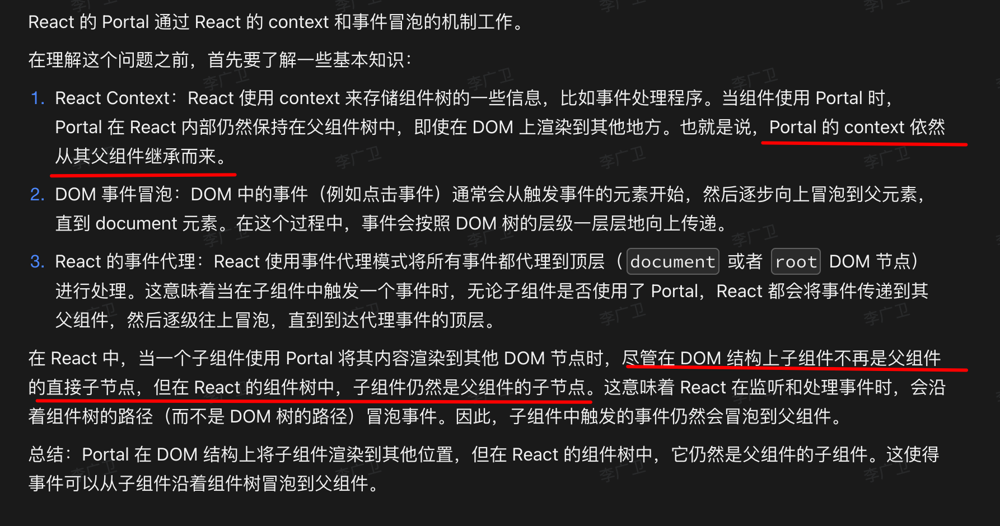

# React 中的 Portal  事件冒泡机制

`#react` 


## 目录
<!-- toc -->
 ## 1. 总结 

- React 中的 Portal 的点击事件，同样遵循 ==React 事件系统==的冒泡机制，不依赖于它真实的渲染结构(与实际的 DOM 结构无关)
	- ReactDOM.createPortal
		- 使用 `e.stopPropagation()` 来阻止事件冒泡
- Portal 的 context 同样从父组件继承而来

## 2. 展开



首先，让我们明确一下什么是 Portal：

```jsx
import ReactDOM from 'react-dom';

function Modal({ children }) {
  return ReactDOM.createPortal(
    children,
    document.getElementById('modal-root')
  );
}
```

Portal 允许我们将子节点渲染到存在于父组件以外的 DOM 节点中。

现在，关于你的问题：**在 React 中，即使子组件是一个 Portal，发生在其中的点击事件仍然能够冒泡到父组件。**

这看起来可能有点反直觉，因为在 DOM 结构中，Portal 的内容实际上是在父组件之外的。但是 React 特意设计了这种行为，以保持一致性和方便性。

这种行为有几个重要的特点：

1. **一致性**：无论子组件是否通过 Portal 渲染，事件冒泡的行为都是一致的。这使得开发者可以更容易地理解和预测事件的流动。
2. **灵活性**：你可以在 Portal 内部处理事件，同时也可以让事件冒泡到 Portal 之外的父组件。
3. **控制**：如果你不想让事件冒泡到 Portal 外部，你可以在 Portal 内部的事件处理函数中调用 `e.stopPropagation()`。
4. **注意 DOM 结构**：虽然在 React 的事件系统中事件会冒泡，但在实际的 DOM 结构中，Portal 的内容是在父组件之外的。这意味着如果你使用原生 DOM 事件监听器，行为可能会有所不同。

总结：
- 在 React 中，Portal 内部的事件可以冒泡到 Portal 外部的父组件。
- 这是 React 特意设计的行为，为了保持一致性和方便性。
- 你可以使用 `e.stopPropagation()` 来阻止事件冒泡，如果需要的话。
- 这个行为是 React 事件系统的特性，与实际的 DOM 结构无关。

这种设计使得 Portal 在保持灵活性的同时，也能够与 React 的组件树结构保持一致的事件传播行为。
