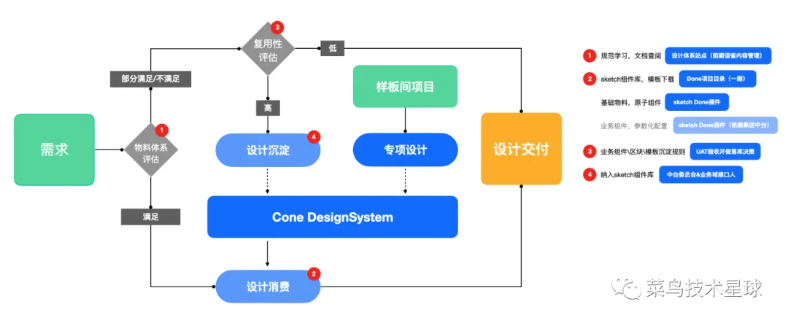
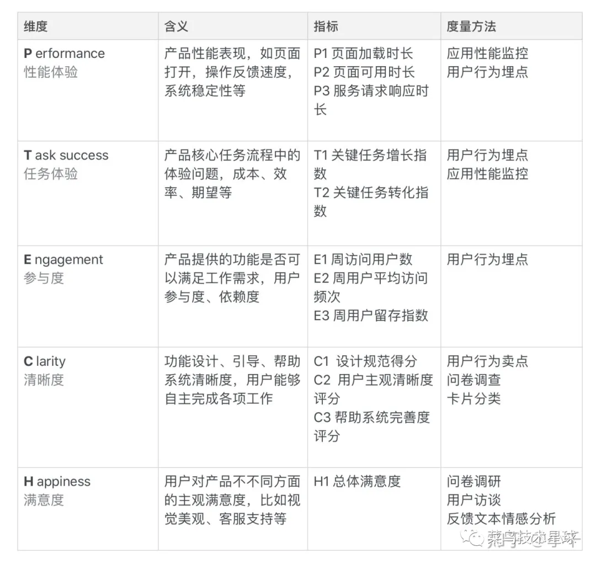

# 前端的思考：随记

`#前端职业` 

## 目录
<!-- toc -->
 ## 1. 出现前端工程师的原因 

- 解决切图、浏览器特性、兼容性、体验、工程化、性能、安全、稳定性、端兼容性、生态异构等问题
- 前端三大主题：
	- `用户体验、稳定性、交付效率`
- 在 `设计师` 和 `工程师` 之间创建可视化的语言
- 用可视化的设计，定义一组代表内容、品牌和功能的组件
- 现在还是未来，用户时`客户体验第一`

> 但本质是**业务价值创造**

## 2. 前端的发展历史

几个关键**里程碑**
- 浏览器大战
- Ajax
- nodejs
- 三大框架
- 跨端
	- 端兼容性、Web/小程序/App生态的异构、跨端
- 卷底层工具链（Rust 等）
- 到当下 **AI 的时代**

## 3. 当下背景

- C 端 
	- 流量见顶
- B端 → **收敛交互的复杂度或标准化交互**
	- 富应用的体验以及开发效率被广泛关注
		- 富应用：
			- 比如飞书文档、在线 Office 等等
		- 开发效率：
			- 比如低代码

## 4. 围绕着`交付效率、工程质量、业务价值` 来卷，大方向错不了

- 先看看交付效率
	- C端
		- 从追求 0 像素误差还原到`追求交互的标准封装` 
			- 各类 UI 校对工具&插件来支持
	- B端中后台的标准化重塑 → 收敛交互的复杂度
		- 通过**收敛交互的复杂度**，来提升`业务交付的效率`，比如 `低代码或者无代码`
			- 布局高度**标准化**
			- 表单高度**标准化**
			- 可视化图标高度**标准化**

> 各类标准化 →  低代码平台的必要条件

对于前端而言，这里的**工程质量**包括：前端性能、前端体验、前端工程质量、前端稳定性、前端交互性能等等

## 5. 一个好的前端团队

- 一个好的前端专家：具备解决各种用户交互问题的工程师
- 一个好的前端团队：可以`屏蔽各种用户交互问题`
	- 让一线开发`专注于业务的团队`
	- 做需求时，能够**持续沉淀**
		- 

## 6. 前端与产品体验

- 性能体验
	- 白屏、加载时长
	- 服务响应时长
	- 性能埋点
- 任务体验
	- 任务转化 → 行为埋点
- 参与度：
	- 周 PV
	- 周 UV
	- 周留存
- 清晰度
	- 新手引导、新手帮助、易用性
	- 指标：
		- 设计规范得分
		- 用户主观清晰度评审
		- 帮助系统完善度
- 满意度
	- 用户主观满意度
	- 视觉是否美观
	- 度量
		- 问卷
		- 用户访谈

## 7. 前端本质是人机交互

- 好的**前端交互体验**也是前端的本质工作
- 性能那是前端的本职工作

