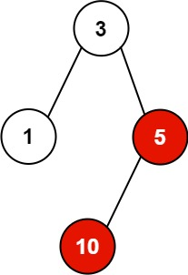

# 杀掉进程


> [582. 杀掉进程](https://leetcode.cn/problems/kill-process/)


## 目录
<!-- toc -->
 ## 代码 

```javascript
var killProcess = function (pid, ppid, kill) {
    // ① 构建进程关系图
    let mapping = {};
    for (let i = 0; i < pid.length; i++) {
        let c = pid[i];
        let p = ppid[i];
        if (!mapping[p]) {
            mapping[p] = [];
        }
        mapping[p].push(c);
    }
    console.log(mapping);
    // ② BFS 遍历
    let res = [];
    let q = [kill];
    while (q.length) {
        let cur = q.shift();
        res.push(cur);
        if (mapping[cur]) {
            q.push(...mapping[cur]);
        }
    }
    return res;
};
```

## 思路




```javascript
// 示例：
const pid =  [1, 3, 10, 5];
const ppid = [3, 0, 5, 3];
const kill = 5;

// 执行过程：
// 1. 首先构建进程关系图：
// mapping = {
//     "0": [3],
//     "3": [1, 5],
//     "5": [10]
// }

// 2. 从kill=5开始BFS遍历：
// - 首先将5加入结果
// - 查找5的子进程：找到10
// - 将10加入队列
// - 处理10，将10加入结果
// - 10没有子进程，遍历结束

// 最终返回：[5, 10]
```