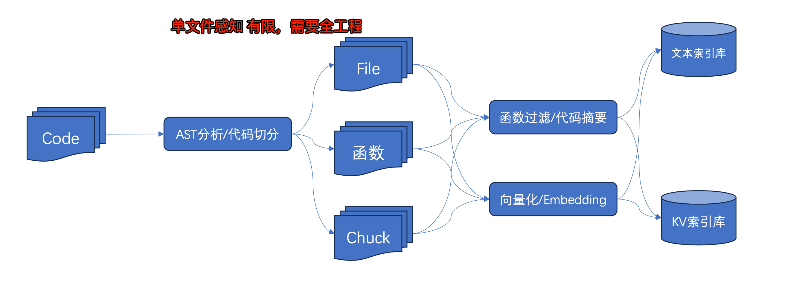
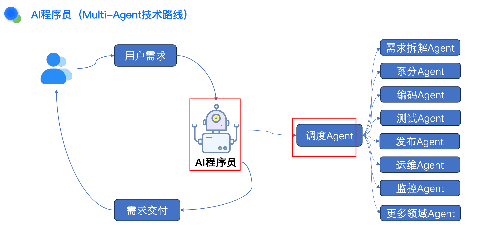

# 大模型背景下的前端研发模式随记

`#ai` `#前端职业` 

## 目录
<!-- toc -->
 ## 1. 智能研发新范式 

- 智能开发领域正在经历**由辅助到协同、由补全到生成、由代码到工程**的进化
- `Embedding` 具备 “吃下” **全库代码**的能力
- 模型天生具备强大的总结与解释能力
- 描述要什么，而非代码长啥样
	- 使用`自然语言`进行代码的检索与理解

>  Embedding 是将文本、图像等高维数据转换成密集的**数值向量**的过程。这些向量能够捕捉**原始数据的语义信息**。

## 2. AI 打通研发流

- 辅助开发 → 协同效能平台（新建一个迭代、发布上线） → 一个异常（ 给可能原因，并给出解决方案）
- 比如之前做的一个军事预警系统：
	- 结合前端研发模式，加上 AI 的能力，发现线上故障来，并**从知识库中分析出原因并给解决方案**

>  需要打通**内部效能平台**

## 3. 整合打通公司各平台的能力  →  产研一体化平台

> 和研发效能平台的结合

- 单纯问答形式无法满足智能化需求，需要整合平台的能力进行智能化改造
	- **整合平台的能力**
- 以领域 Agent 为核心，对**效能平台**进行全面升级，增加超级会话及 Agent 调度与执行能力
	- 比如：创建一个迭代，结合公司内部**产研一体化平台** ，**用大模型去调度**，整合打通公司各平台的能力
	- 
- 代码辅助研发
	- 代码补全
	- **生成注释**
	- 解释代码
	- 代码分析
	- **生成测试用例**
	- 智能问答等
- **单文件感知有限，需要全工程，全仓库**
	- 
- AI 程序员，需要调度整合所有平台，Agent 的能力
	- 

## 4. 超级程序员？

-  AI 
	- 什么都会
	- 会很多很多种编程语言
	- 会各种各样的技术
- 人的价值 ？ 
	-  AI 擅长加速已知模式的实现，但**软件开发中最难的部分（需求理解、系统设计、安全性等）仍需要人工判断**

