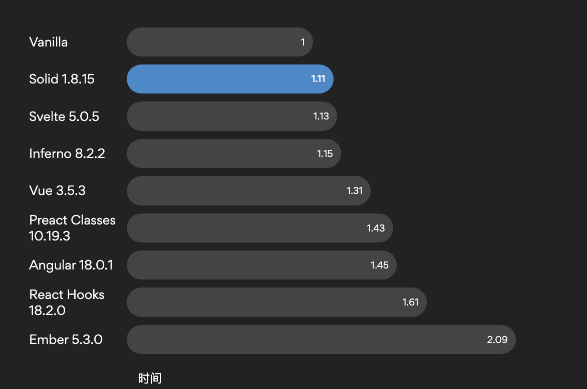

# Vue3  生态最新动态

`#vue3` 

## 目录
<!-- toc -->
 ## 1. R1 

- V3.5
	- 无虚拟 DOM 的编译策略
	- watch 的 deep 可以指定`具体层级`

## 2. Vue 3.5 版本发布

- Vue 3.5 已于2024年9月发布
- 在 Vue 3.5 中，`watch` 函数的深度监听功能得到了增强。
	- 之前的 `deep` 属性是一个布尔值，而现在可以指定监听的层级
- Vue3.5的`模板解析器`重构，内存占用减少了 56%
	- **据说响应式也重构了**
- 生成类似于 React 的 `useId`

## 3. Vapor 模式开发

- Vapor 模式是 Vue 3 推出的一种`无虚拟DOM`的编译策略
- Vapor 模式将只支持 Vue 的一部分功能

### 3.1. 还是 受 solid.js 的影响吧

- 没有虚拟DOM，直接操作真实DOM
- Solid 是一个用于制作交互式 Web 应用程序的 JavaScript 框架。
	- 它利用自定义编译器将 JSX 转换为高性能的 DOM 操作。更新则由细粒度的响应式系统提供支持，响应式系统减少了对比差异的开销，从而获得最佳性能
- Solid 的性能表型
	- 

### 3.2. Vue 3.x 主要版本

#### 3.2.1. Vue 3.4 (2023年12月)

- **性能优化**
	- 编译器性能提升约 2 倍
	- 运行时性能优化
- **新特性**
	- 改进的 defineModel 宏
	- v-model 支持多个参数
	- 更好的 TypeScript 支持
- **推荐同时更新**
	- Volar / vue-tsc
	- @vitejs/plugin-vue
	- @vue/language-server

#### 3.2.2. Vue 3.3 (2023年5月)

- **开发体验改进**
	- 改进的类型推断
	- defineEmits 宏的类型检查增强
	- defineProps 宏的默认值类型推断
- **新功能**
	- defineOptions 宏
	- defineSlots 宏
	- 通用组件支持 

#### 3.2.3. Vue 3.2 (2021年8月)

- **性能优化**
	- 更快的 diff 算法
	- 更高效的 ref 实现
- **新特性**
	- `<script setup>` 正式发布
	- CSS v-bind
	- 响应式转换的改进

