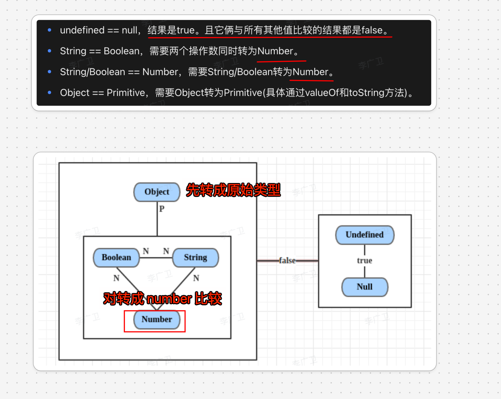
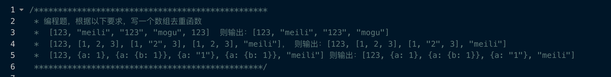
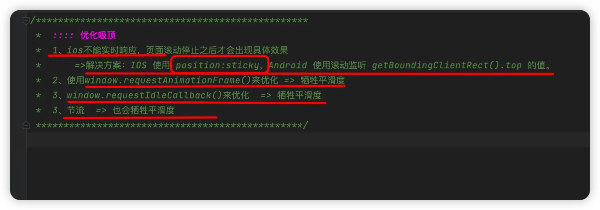
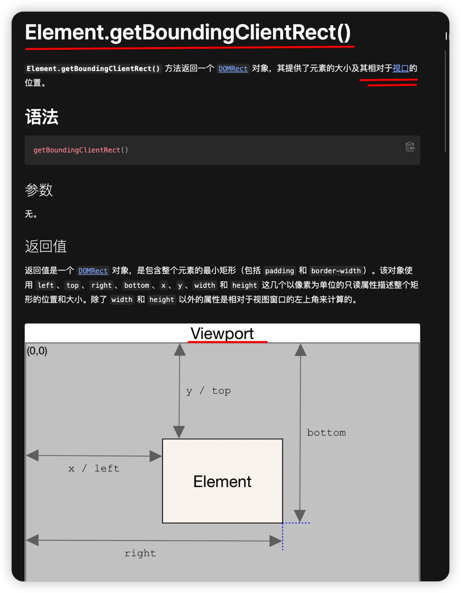
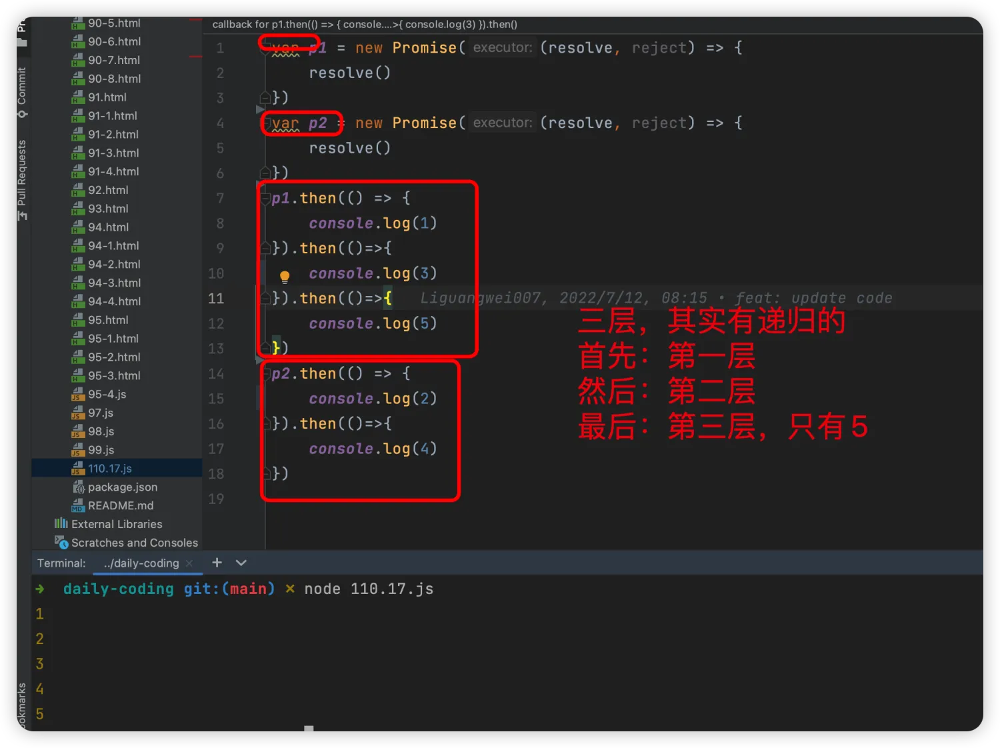
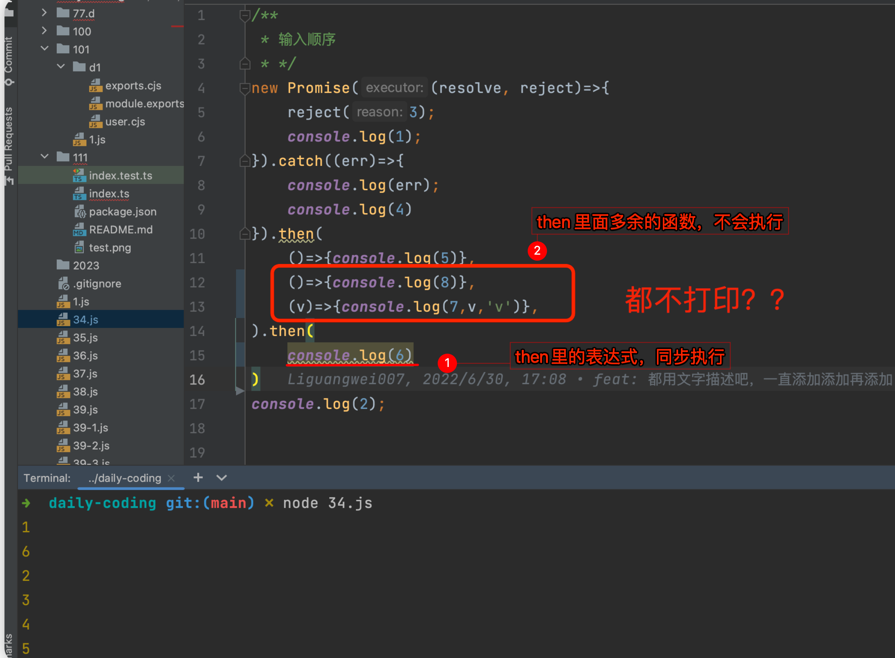
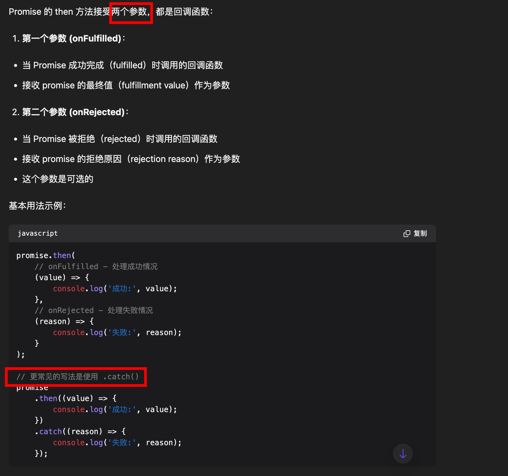
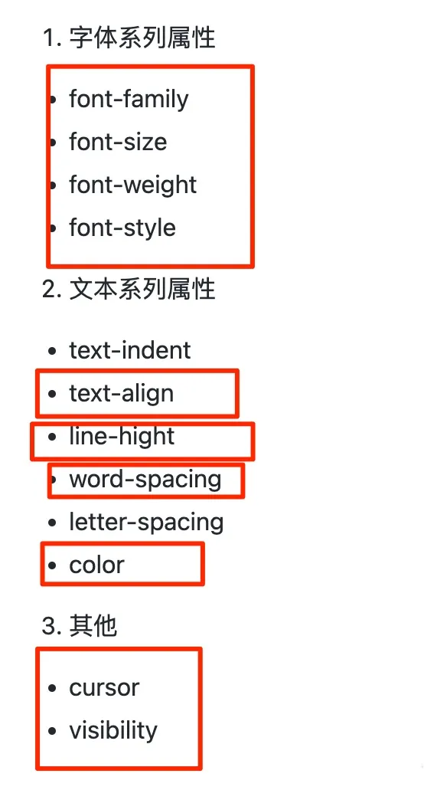

# 常见面试题：篇三


## 目录
<!-- toc -->
 ## 1. js 的 `==` 机制 



> 实际工程中还是使用 `===` 吧

- ① true == undefined
- ② Number 和 （字符串 或者 布尔类型） 比较，转成数字比较
- ③ 对象 和 原始值比较，对象先转 `valueOf()` ，然后再转 `toString()`

## 2. a+++b 、a++++b 、 a+++++b 的结果？

> [!danger]
> 关键是看如何断句的，即空格在哪儿

```javascript
var a = 1;
var b = 2;
console.log(a+++ b);  // 3
console.log(a++ + b); // 3

var a = 1;
var b = 2;
console.log(a + ++b); // 4

var a = 1;
var b = 2;
console.log(a ++++ b); // 报错
console.log(a++ + +b); // 3

var a = 1;
var b = 2;
console.log(a++ + ++b); // 4
console.log(a+++++b); // 报错
```

## 3. 说说你平时常用的命令行

- `tail web.2016-06-06.log -n 300 -f` 查看底部即最新300条日志记录，并实时刷新
- 根据端口查进程并杀死进程： 
	- `lsof -i tcp:8080`
	- `kill -9 pid`
- 清除 Git 缓存：`git rm --cached  .idea`

## 4. 根据以下要求，写一个数组去重函数



### 4.1. 使用 JSON.stringify 

```javascript hl:6
function fn(arr) {
	
    let map = new Map();
    for (let i = 0; i < arr.length; i++) {
        let item = arr[i];
        let itemStr = JSON.stringify(item, (k, v) => {
            console.log('k:',k);
            console.log('v:',v);
        });
        if (!map.get(itemStr)) {
            map.set(itemStr, item);
        }
    }
    return [...map.values()];
}

```

### 4.2. 对于下面这种情况呢

```javascript
const ss = [
    {
        a: 'c',
        b: 'b',
        c: 'c',
    },
    {
        c: 'c',
        b: 'b',
        a: 'c',
    }
]
```

### 4.3. 通用情况

```javascript hl:2,5,9,18
function isEqual(val1, val2) {
  // 处理基础类型
  if (val1 === val2) return true;

  // 如果不是对象类型，直接返回false
  if (typeof val1 !== "object" || typeof val2 !== "object") return false;
  if (!val1 || !val2) return false;

  // 处理数组
  if (Array.isArray(val1) && Array.isArray(val2)) {
    if (val1.length !== val2.length) return false;
    for (let i = 0; i < val1.length; i++) {
      if (!isEqual(val1[i], val2[i])) return false;
    }
    return true;
  }

  // 处理对象
  const keys1 = Object.keys(val1);
  const keys2 = Object.keys(val2);
  if (keys1.length !== keys2.length) return false;

  for (let key of keys1) {
    if (!isEqual(val1[key], val2[key])) return false;
  }
  return true;
}
```

## 5. 打平一个树形结构

```javascript
let ss = [
  {
    id: "1",
    name: "1",
    pid: "0",
    children: [
      {
        id: "1-1",
        name: "1-1",
        pid: "1",
      },
      {
        id: "1-2",
        name: "1-2",
        pid: "1",
        children: [
          {
            id: "1-2-1",
            name: "1-2-1",
            pid: "1-2",
          },
        ],
      },
    ],
  },
  {
    id: "2",
    name: "2",
    pid: "0",
    children: [
      {
        id: "2-1",
        name: "2-1",
        pid: "2",
      },
    ],
  },
];

// 打平一个树形结构
function flatTree(tree) {
  let res = [];

  function traverse(tree) {
    for (let i = 0; i < tree.length; i++) {
      let item = tree[i];
      res.push(item);
      if (Array.isArray(item.children)) {
        traverse(item.children);
      }
    }
  }

  traverse(tree);

  return res;
}

console.log(flatTree(ss));


```

## 6. 判断一个数是否是 `素数` ，列举出 `n` 以内的`素数` 的个数

```javascript
// 断一个数是否是素数
// 关键点： i * i < n
function isPrime(n) {
  if (n < 2) {
    return false;
  }
  for (let i = 2; i * i < n; i++) {
    if (n % i === 0) {
      return false;
    }
  }
  return true;
}

// 列举出 n 以内的所有素数
function listPrimes(n) {
  const res = [];
  for (let i = 2; i <= n; i++) {
    if (isPrime(i)) {
      res.push(i);
    }
  }
  return res;
}

// :::: 优化
//  首先 2 是一个素数，那么 2 × 2 = 4, 3 × 2 = 6, 4 × 2 = 8… 都不可能是素数了。
//  然后我们发现 3 也是素数，那么 3 × 2 = 6, 3 × 3 = 9, 3 × 4 = 12… 也都不可能是素数了
function listPrimes(n) {
  const res = [];
  // primes.flll(true) ,表示所有的数都是素数
  const primes = new Array(n).fill(true);
  for (let i = 2; i <= n; i++) {
    // 如果 i 是素数, 那么 i 的倍数都不是素数
    if (isPrime(i)) {
      res.push(i);
      for (let j = i * i; j < n; j += i) {
        primes[j] = false;
      }
    }
  }
  return res;
}

```

## 7. 实现 `子元素宽度`永远是`父元素的一半`，且`宽高比`永远为 `2 :1`

原理：**如果 paading/left 为百分比时，都是以父元素的 width 为参考的**


## 8. 关于 DOM 操作的一些细节点

- `isConnect` 表示是否在文档中
- DOM 树中有`前后兄弟节点`的指针引用属性
- `document.elementFromPoint(x,y)` 方法返回位于页面指定位置`最上层的元素节点`
- `Event.composedPath()` 返回冒泡经过的 DOM 节点
- `Navigator.sendBeacon()` 常使用在**埋点场景**，浏览器会把放在队列里，所以**页面关闭也会正常发送**

## 9. 普通函数和箭头函数在 this 绑定上的区别

### 9.1. 普通函数的 this

普通函数的 this 是**动态绑定**的，取决于**函数在哪儿调用**：

```javascript hl:1,7,16,23
// 1. 直接调用：this 指向全局对象（非严格模式）或 undefined（严格模式）
function normalFunc() {
    console.log(this);
}
normalFunc(); // window 或 undefined

// 2. 作为对象方法调用：this 指向调用该方法的对象
const obj = {
    name: 'object',
    method: function() {
        console.log(this.name);
    }
};
obj.method(); // 'object'

// 3. 构造函数调用：this 指向新创建的实例
function Person(name) {
    this.name = name;
}
const person = new Person('John');
console.log(person.name); // 'John'

// 4. call/apply/bind 调用：this 指向指定的对象
const context = { name: 'custom' };
normalFunc.call(context);   // { name: 'custom' }
normalFunc.apply(context);  // { name: 'custom' }
const boundFunc = normalFunc.bind(context);
boundFunc();               // { name: 'custom' }
```

### 9.2. 箭头函数的 this

箭头函数的 this 是**定义时绑定的，继承自定义时所在的上下文**：

继承外层作用域的 this
```javascript hl:1,20,12
// 1. 继承外层作用域的 this
const obj = {
    name: 'object',
    normalMethod: function() {
        // 箭头函数继承 normalMethod 的 this
        const arrowFunc = () => {
            console.log(this.name);
        };
        arrowFunc();
    },
    arrowMethod: () => {
        // 这里的 this 继承全局作用域的 this
        console.log(this.name);
    }
};

obj.normalMethod(); // 'object'
obj.arrowMethod();  // undefined


```

#### 9.2.1. 不能通过 call/apply/bind 改变 this

```javascript
// 2. 不能通过 call/apply/bind 改变 this
const arrowFunc = () => {
    console.log(this);
};

const context = { name: 'custom' };
arrowFunc.call(context);   // window
arrowFunc.apply(context);  // window
const boundFunc = arrowFunc.bind(context);
boundFunc();              // window
```

### 9.3. 常见问题和解决方案

#### 9.3.1. **定时器中的 this**

```javascript hl:1,11,21,25
// 问题：普通函数
const obj = {
    name: 'object',
    delayLog: function() {
        setTimeout(function() {
            console.log(this.name); // undefined
        }, 1000);
    }
};

// 解决方案 1：使用箭头函数
const obj1 = {
    name: 'object',
    delayLog: function() {
        setTimeout(() => {
            console.log(this.name); // 'object'
        }, 1000);
    }
};

// 解决方案 2：保存 this
const obj2 = {
    name: 'object',
    delayLog: function() {
        const self = this;
        setTimeout(function() {
            console.log(self.name); // 'object'
        }, 1000);
    }
};
```

#### 9.3.2. **事件处理中的 this**

```javascript hl:1,15,26,21,30
// 问题：类方法作为事件处理器
class Handler {
    constructor() {
        this.name = 'handler';
    }
    
    handleClick() {
        console.log(this.name);
    }
}

const handler = new Handler();
button.addEventListener('click', handler.handleClick); // undefined

// 解决方案 1：箭头函数
class Handler1 {
    constructor() {
        this.name = 'handler';
    }
    
    handleClick = () => {
        console.log(this.name);
    }
}

// 解决方案 2：bind
class Handler2 {
    constructor() {
        this.name = 'handler';
        this.handleClick = this.handleClick.bind(this);
    }
    handleClick() {
        console.log(this.name);
    }
}
```

#### 9.3.3. **回调函数中的 this**

```javascript hl:1,10,16
// 问题：回调函数中的 this 丢失
class DataFetcher {
    constructor() {
        this.data = [];
    }
    
    fetchData() {
        fetch('api/data')
            .then(function(response) {
                // this 指向 undefined 或 window
                this.data = response.json();
            });
    }
}

// 解决方案：使用箭头函数
class DataFetcher1 {
    constructor() {
        this.data = [];
    }
    
    fetchData() {
        fetch('api/data')
            .then(response => {
                // this 正确指向 DataFetcher 实例
                this.data = response.json();
            });
    }
}
```

### 9.4. 总结

1. 普通函数的 this 是**动态的，取决于调用方式**
2. 箭头函数的 this 是**静态的，继承定义时的上下文**
3. 选择使用哪种函数取决于你是否需要动态的 this 绑定
4. 在需要保持 this 上下文的场景（如**回调、事件处理器**）中，**箭头函数**很有用
5. 在需要动态 this 的场景（如**对象方法、原型方法**）中，使用**普通函数**更合适

## 10. js 实现继承的方式有哪些？

### 10.1. es6

```javascript
class Parent {
  constructor(name) {
    this.name = name;
    this.colors = ["red", "blue"];
  }

  getName() {
    return this.name;
  }
}

class Child extends Parent {
  constructor(name, age) {
    super(name);
    this.age = age;
  }

  getAge() {
    return this.age;
  }
}

```
### 10.2. es5：原型链继承

```javascript
// 缺点：引用类型属性被所有示例共享
Child.prototype = new Parent();
```

### 10.3. es5：借用构造函数继承

```javascript
/*********************************************
 // 832: 借用构造函数继承
 优点1：避免引用类型属性被所有示例共享
 优点2：可以在 Child 中向 Parent 传参
 缺点：每次创建实例都会创建一遍方法
 *********************************************/
function Child(name) {
    // 832: 使用call函数
    Parent.call(this, name);
}
```

### 10.4. es5：原型链继承 + 借用构造函数

```javascript
/*********************************************
 // 832: 原型链继承 + 借用构造函数
 优点1：避免引用类型属性被所有示例共享
 优点2：可以在 Child 中向 Parent 传参
 优点3：方法不用重新创建，在原型链上
 *********************************************/
// 关键点1：
function Child(name) {
    Parent.call(this, name);
}

// 关键点2：
Child.prototype = new Parent();
Child.prototype.constructor = Child;
```

### 10.5. ES5： Object.create

```javascript
/*********************************************
 // 832: 即ES5 Object.create ， 将传入的对象作为创建的对象的原型
 缺点：引用类型属性被所有示例共享，和原型链一样
 *********************************************/
function myCreate(o) {
    function F() {
    }

    F.prototype = o;
    return new F();
}
```

### 10.6. es5：寄生式继承

```javascript
/*********************************************
 // 832: 寄生式继承
 缺点：每次创建实例都会创建一遍方法
 *********************************************/
function createObj(o) {
    let clone = Object.create(o);
    clone.sayName = function () {
        console.log('hi');
    }
    return clone;
}
```

### 10.7. es5：寄生组合式继承：最佳方式

```javascript
/*********************************************
 // 832: 寄生组合式继承
 优点1：这种方式的高效率体现它只调用了一次 Parent 构造函数，
 优点2：并且因此避免了在 Parent.prototype 上面创建不必要的、多余的属性。
 优点3：与此同时，原型链还能保持不变；因此，还能够正常使用 instanceof 和 isPrototypeOf。
 *********************************************/
function prototype(child, parent) {
    let p = Object.create(parent.prototype);
    p.constructor = child;
    child.prototype = p;
}
```

## 11. 手写 promise.all 、race 、retry

```javascript hl:4,26,53,22
Promise._race = (tasks) => {
  return new Promise((resolve, reject) => {
    for (let i = 0; i < arr.length; i++) {
      // ::::Promise.resolve 包一层，以兼容非promise的情况
      Promise.resolve(arr[i])
        .then((res) => {
          // 某一promise完成后直接返回其值
          // 只要有一个promise完成，就返回
          resolve(res);
        })
        .catch((e) => {
          //如果有错误则直接结束循环，并返回错误
          reject(e);
        });
    }
  });
};

Promise.retry = function (fn, times = 3) {
  return new Promise(async (resolve, reject) => {
    // times: 重试次数
    while (times--) {
      try {
        let res = await fn();
        resolve(res);
        // 如果成功了，就直接break了
        break;
      } catch (error) {
        if (!times) reject(error);
      }
    }
  });
};

Promise._all = (tasks) => {
  return new Promise((resolve, reject) => {
    let length = arr.length; //传入的promise的个数
    let count = 0; // 进入fullfilled 的promise个数
    const result = []; //创建一个等长的数组,放置结果
    // 当传递是一个空数组，返回一个为fulfilled状态的promise
    if (arr.length === 0) {
      return new Promise.resolve([]);
    }
    // 遍历数组
    for (let i = 0; i < arr.length; i++) {
      // ::::Promise.resolve 包一层，以兼容非promise的情况
      Promise.resolve(arr[i])
        .then((res) => {
          //// ::::这里是关键逻辑
          result[i] = res; //将每次结果保存在result数组中
          count++; //个数加1
          //是否所有的promise都进入fullfilled状态
          if (count === length) {
            resolve(result); //返回结果
          }
        })
        .catch((e) => {
          reject(e); //如果有错误则直接结束循环，并返回错误
        });
    }
  });
};

```

## 13. 遍历对象的方式都有哪些？

- 使用 `Object.keys()` 当：
    - 只需要`可枚举`属性
    - 不返回继承的属性
    - 不需要 Symbol 属性
    - 性能是主要考虑因素
        - `Object.keys()` 通常性能更好，因为它只处理可枚举属性
- 使用 `Reflect.ownKeys()` 当：
    -  返回对象的**所有有属性键的数组** ，包括：
        - 所有字符串键（可枚举和不可枚举）
        - 所有 Symbol 键（可枚举和不可枚举）
        - 不返回继承的属性
    - 返回顺序：
        1. 数字键（按升序）
        2. 字符串键（按添加顺序）
        3. Symbol 键（按添加顺序）
- **for...in 循环**
	- 返回**所有可枚举**属性，包括**继承**的
	- 不返回 Symbol 属性
- 在开发工具、框架或需要完整反射功能的场景中，`Reflect.ownKeys()` 是更好的选择

### 13.1. 选择指南

1. **需要遍历继承的属性**
    - 使用 `for...in`
2. **只需要自身可枚举属性**
    - 使用 `Object.keys()`
3. **需要所有属性（包括不可枚举）**
    - 使用 `Object.getOwnPropertyNames()`
4. **需要 Symbol 属性**
    - 使用 `Object.getOwnPropertySymbols()`
    - 只返回对象的 Symbol 类型的
        - 包括可枚举和不可枚举的 Symbol
        - 不包含字符串键
5. **需要所有类型的属性**
    - 使用 `Reflect.ownKeys()`
6. **需要键值对**
    - 使用 `Object.entries()`
7. **只需要值**
    - 使用 `Object.values()`

## 14. 柯里化

### 14.1. 参数固定场景

实现 add(1)(2)(3) 或者 add(1,2)(3) 等等都相等

```javascript hl:4,8
function curry(fn, ...arg1) {
  // fn.length 函数的形参个数
  // arg1.length 传入的实参个数
  // 如果传入的实参个数大于等于函数的形参个数，则直接执行函数
  if (arg1.length >= fn.length) {
    return fn(...arg1);
  }
  // 否则，返回一个新函数，接收剩余的参数
  return (...arg2) => {
    return curry(fn, ...arg1, ...arg2);
  };
}

// 三个参数的函数
function add(a, b, c) {
  return a + b + c;
}

const curryAdd = curry(add);

console.log(curryAdd(1)(2)(3)); // 6
console.log(curryAdd(1, 2)(3)); // 6
console.log(curryAdd(1)(2, 3)); // 6

// 四个参数的函数
function add2(a, b, c, d) {
  return a + b + c + d;
}

const curryAdd2 = curry(add2);

console.log(curryAdd2(1)(2)(3)(4)); // 10
console.log(curryAdd2(1, 2)(3)(4)); // 10
console.log(curryAdd2(1)(2, 3)(4)); // 10
console.log(curryAdd2(1)(2)(3, 4)); // 10
console.log(curryAdd2(1, 2, 3)(4)); // 10
console.log(curryAdd2(1, 2)(3, 4)); // 10
console.log(curryAdd2(1)(2, 3, 4)); // 10

```

### 14.2. 参数不固定场景

闭包函数中实现真正的逻辑

```javascript hl:8,17,26
function add(...args) {
  let vars = [];
  // 闭包,返回一个函数，并且把所有参数都保存在vars中
  const curry = (...args2) => {
    vars = [...vars, ...args2];
    return curry;
  };
  // 真正的求和函数
  curry.sumof = () => {
    let res = 0;
    for (let i = 0; i < vars.length; i++) {
      res += vars[i];
    }
    return res;
  };

  // 真正的求积函数
  curry.product = () => {
    let res = 1;
    for (let i = 0; i < vars.length; i++) {
      res *= vars[i];
    }
    return res;
  };

  // 返回一个这个闭包函数
  return curry(...args);
}

console.log(add(1, 2, 3).sumof()); // 6
console.log(add(1, 2, 3)(4).sumof()); // 10
console.log(add(1, 2, 3)(4, 5).sumof()); // 15
console.log(add(1, 2, 3)(4, 5)(6).sumof()); // 21

console.log(add(1, 2, 3).product()); // 6
console.log(add(1, 2, 3)(4).product()); // 24
console.log(add(1, 2, 3)(4, 5).product()); // 120
console.log(add(1, 2, 3)(4, 5)(6).product()); // 720
console.log(add(1)(2)(3)(4)(5)(6).product()); // 720

```

### 14.3. 总结

柯里化是将一个多参数函数转换为一系列单参数函数的过程，使用场景为：
- 参数复用
- 延迟计算
- 动态创建函数
- 参数验证
- 日志系统

但其实，问题更多，比如
- 过度使用柯里化可能降低代码`可读性`
- 柯里化会创建多个闭包，可能影响性能
- 调试困难

## 15. 实现一个简单的classname

### 15.1. 使用示例

```javascript
// 使用示例
console.log(
  className(
    "button",
    {
      "btn-primary   btn-large": true,
      "btn-disabled": false,
    },
    ["active", ["nested", "  multiple   spaces  "]],
    null,
    undefined,
    { error: true },
  ),
); // 'button btn-primary btn-large active nested multiple spaces error
```

### 15.2. 实现一个classname

```javascript hl:4,9,15,18
function classNames(...args) {
  let res = [];
  // 遍历参数
  for (let item of args) {
    // 如果是字符串或者数字，直接放到arr里面，需要判断是否为真
    if (typeof item === "string" || typeof item === "number" && !!item) {
      res.push(item);
      // 如果是数组，递归调用,使用 item.flat(Infinity)
    } else if (Array.isArray(item)) {
      item.flat(Infinity).forEach((it) => {
        res.push(it);
      });
    }
    //  如果是对象，需要过滤掉 null
    else if (typeof item === "object" && item !== null) {
      Object.entries(item).forEach(([k, v]) => {
        if (v) {
          res.push(k);
        }
      });
    }
  }

  // 返回
  return res;
}
```

## 16. 实现一个 Array.map

```javascript hl:1,15
// 不指定指定上下文参数
Array.prototype._map = function (fn) {
  // 错误处理
  if (!Array.isArray(this) || typeof fn != "function") {
    throw new Error("has Error, please check!");
  }
  let arr = this;
  let res = [];
  for (let i = 0; i < arr.length; i++) {
    res[i] = fn(arr[i], i, arr);
  }
  return res;
};

// 指定上下文参数
Array.prototype._map1 = function (fn, context) {
  // 错误处理
  if (!Array.isArray(this) || typeof fn !== "function") {
    throw new Error("has Error, please check!");
  }

  let arr = this;
  let res = [];
  for (let i = 0; i < arr.length; i++) {
    res[i] = fn.call(context, arr[i], i, arr);
  }
  return res;
};

```

## 17. 实现一个双向绑定

### 17.1. 使用 proxy 

```javascript
`<input id="input" type="text"/>
<div id="text"></div>
`;

let input = document.getElementById("input");
let text = document.getElementById("text");

let data = { value: "" };

new Proxy(data, {
  /**
   * @param target 指向data
   * @param p 属性值，比如value
   * */
  get(target, p, receiver) {
    return input.value;
  },
  set(target, p, value, receiver) {
    target[p] = value;
    // 直接做渲染,更好做法是写一个render函数放外面去
    text.innerHTML = target[p];
    input.value = target[p];
  },
});

// 需要监听onkeyup事件
input.onkeyup = function (e) {
  data.value = e.target.value;
};

```

### 17.2. 使用 `Object.defineProperty`

```javascript
`
<input id="input" type="text"/>
<div id="text"></div>
`;
let input = document.getElementById("input");
let text = document.getElementById("text");

let data = { value: "" };

Object.defineProperty(data, "value", {
  set: function (val) {
    text.innerHTML = val;
    input.value = val;
  },
  get: function () {
    return input.value;
  },
});

// 需要监听onkeyup事件
input.onkeyup = function (e) {
  data.value = e.target.value;
};

```

## 18. 如何判断一个对象中是否循环引用了

### 18.1. 方法1：直接遍历，借助一个 `weakSet` 对象，如果已经命中了，则说明循环引用了

```javascript
function hasCircularReference(obj) {
    const seen = new WeakSet();
    
    function detect(value) {
        // 处理基础类型
        if (value === null || typeof value !== 'object') {
            return false;
        }
        
        // 检测循环引用
        if (seen.has(value)) {
            return true;
        }
        
        seen.add(value);
        
        // 处理数组
        if (Array.isArray(value)) {
            return value.some(item => detect(item));
        }
        
        // 处理对象
        return Object.values(value).some(item => detect(item));
    }
    
    return detect(obj);
}

// 测试用例
// 1. 简单循环引用
const obj1 = { a: 1 };
obj1.b = obj1;
console.log(hasCircularReference(obj1));  // true

// 2. 数组循环引用
const arr = [1, 2, 3];
arr.push(arr);
console.log(hasCircularReference(arr));  // true

// 3. 深层循环引用
const obj2 = {
    a: {
        b: {
            c: {}
        }
    }
};
obj2.a.b.c.d = obj2.a;
console.log(hasCircularReference(obj2));  // true

// 4. 无循环引用
const obj3 = {
    a: 1,
    b: {
        c: 2,
        d: [1, 2, 3]
    }
};
console.log(hasCircularReference(obj3));  // false

```

### 18.2. 方法二：借助`JSON.toString()` 捕获报错信息

## 19. 手写一个 new

```javascript
function _new(fn, ...args) {
  const obj = Object.create(fn.prototype);
  const res = fn.apply(obj, args);
  return res instanceof Object ? res : obj;
}
```

## 20. 实现一个拖拽会话框

### 20.1. 轮廓代码

```javascript
class Dialog {
  constructor(text) {
    this.lastX = 0;
    this.lastY = 0;
    this.x;
    this.y;
    this.text = text || "";
    this.isMoving = false;
    this.dialog;
  }
  // 打开对话框
  open() {}
  // 关闭对话框
  close() {}
  // 鼠标按下
  handleMousedown(e) {}
  // 鼠标移动
  handleMousemove(e) {}
  // 鼠标抬起
  handleMouseup(e) {}
}

let dialog = new Dialog("Hello");
dialog.open();

```

### 20.2. 具体实现和使用

```javascript
class Dialog {
  constructor(text) {
    this.lastX = 0;
    this.lastY = 0;
    this.x;
    this.y;
    this.text = text || "";
    this.isMoving = false;
    this.dialog;
  }
  open() {
    const model = document.createElement("div");
    model.id = "model";
    model.style = `
        position:absolute;
        top:0;
        left:0;
        bottom:0;
        right:0;
        background-color:rgba(0,0,0,.3);
        display:flex;
        justify-content: center;
        align-items: center;`;
    model.addEventListener("click", this.close.bind(this));
    document.body.appendChild(model);
    this.dialog = document.createElement("div");
    this.dialog.style = `
        padding:20px;
        background-color:white`;
    this.dialog.innerText = this.text;
    this.dialog.addEventListener("click", (e) => {
      e.stopPropagation();
    });
    this.dialog.addEventListener("mousedown", this.handleMousedown.bind(this));
    document.addEventListener("mousemove", this.handleMousemove.bind(this));
    document.addEventListener("mouseup", this.handleMouseup.bind(this));
    model.appendChild(this.dialog);
  }
  close() {
    this.dialog.removeEventListener("mousedown", this.handleMousedown);
    document.removeEventListener("mousemove", this.handleMousemove);
    document.removeEventListener("mouseup", this.handleMouseup);
    document.body.removeChild(document.querySelector("#model"));
  }
  handleMousedown(e) {
    this.isMoving = true;
    this.x = e.clientX;
    this.y = e.clientY;
  }
  handleMousemove(e) {
    if (this.isMoving) {
      this.dialog.style.transform = `translate(${e.clientX - this.x + this.lastX}px,${e.clientY - this.y + this.lastY}px)`;
    }
  }
  handleMouseup(e) {
    this.lastX = e.clientX - this.x + this.lastX;
    this.lastY = e.clientY - this.y + this.lastY;
    this.isMoving = false;
  }
}
let dialog = new Dialog("Hello");
dialog.open();

```
## 21. 说出下面代码的执行顺序

```javascript hl:14,15
setTimeout(() => {
  console.log("1");
  Promise.resolve().then(function () {
    console.log("2");
  });
}, 0);
setTimeout(() => {
  console.log("3");
  Promise.resolve().then(function () {
    console.log("4");
  });
}, 0);

// 1 2 3 4
// nodejs 12 以上 和 浏览器一样
```

## 22. 下面代码的执行顺序

setTimeout 和 setImmediate 都是宏任务
- setTimeout **通常**会先于 setImmediate 执行
- 但如果**涉及到 I/O 操作**，setImmediate 这更快执行，
	- **因为 setImmediate 总是在 I/O 操作之后执行**

```javascript hl:2,18,22
setImmediate(function () {
  console.log(6);
});
setTimeout(function () {
  console.log(7);
}, 0);

setTimeout(function () {
  console.log("7-1s");
}, 1);

setTimeout(function () {
  console.log("7-2s");
}, 2);

setTimeout(function () {
  console.log("7-4s");
}, 4);

setTimeout(function () {
  console.log("7-100s");
}, 100);

console.log(1);

process.nextTick(() => {
  console.log(4);
});
new Promise(function (resolve, rejected) {
  console.log(2);
  resolve();
}).then((res) => {
  console.log(5);
});

console.log(3);

// 1
// 2
// 3
// 4
// 5
// 7
// 7-1s
// 7-2s
// 7-4s
// 6
// 7-100s
```

下面代码就会很**稳定的输出**，因为代码会进入 I/O callback阶段，然后check阶段，再然后是timers阶段

```javascript 

const fs = require('fs');

fs.readFile('test.js', () => {
  setTimeout(() => console.log(1));
  setImmediate(() => console.log(2));
});

// 2 1 
```

## 23. promise的兼容性：es6

## 24. Vue 的 nextTick 如何实现的？

由于 Vue 的异步更新策略，如果我们在修改数据后立即操作 DOM，可能会得到更新前的旧 DOM。nextTick 提供了一种机制，确保我们的代码在 DOM 更新后执行

所以当数据发生变化时，Vue 不会立即更新 DOM，而是将更新操作推入一个队列中，这种做法可以提高性能

Vue会尝试使用原生的 Promise.then、MutationObserver 和 setImmediate，如果执行环境不支持，则会采用`setTimeout(fn, 0)` 代替

nextTick 的**核心思想**：利用 JavaScript 的事件循环，将回调推迟到 `下一个"tick"`执行

```javascript
// 一个简单的 nextTick 实现

// 用于存储回调函数的数组
let callbacks = [];

// 代表是否正在执行回调
let pending = false;

function nextTick(cb) {
  callbacks.push(cb);

  if (!pending) {
    pending = true;
    // 使用setTimeout来调度一个刷新操作
    setTimeout(flushCallbacks, 0);
  }
}

// flushCallbacks函数负责执行所有的回调
function flushCallbacks() {
  pending = false;
  const copies = callbacks.slice(0);
  callbacks.length = 0;
  for (let i = 0; i < copies.length; i++) {
    copies[i]();
  }
}

// 使用示例
nextTick(() => {
  console.log("这是在下一个tick执行的回调");
});

console.log("这是同步代码");

```

## 25. `async`和`await`的串行并行问题

```javascript hl:2,7,10
async function main() {
  // 串行
  var name1 = await foo();
  // 这里会等待foo执行完后在执行
  var name2 = await bar();

  // 并行
  var [name1, name2] = await Promise.all([foo(), bar()]);

  // 并行
  var foo2 = foo();
  var bar2 = bar();
  var name1 = await foo2;
  var name2 = await bar2;
}

```

## 26. 假设本地机器无法做加减乘除法，需要通过远程请求让服务端来实现

- 并行请求
- 记得云端缓存结果

```javascript hl:12,27,49
// 假设本地机器无法做加减乘除法，需要通过远程请求让服务端来实现

// 本地模拟远程请求
async function addRemote(a, b) {
  return new Promise((resolve, reject) => {
    setTimeout(() => {
      resolve(a + b);
    }, 1000);
  });
}

// 基本实现
async function add(...args) {
  let res = 0;

  // base case
  if (args.length === 0) return res;
  if (args.length === 1) return args[0];

  for (const item of args) {
    res = await addRemote(res, item);
  }

  return res;
}

// 优化 1：分组并行请求
async function add(...args) {
  let res = 0;

  // base case
  if (args.length === 0) return res;
  if (args.length === 1) return args[0];

  const tasks = [];
  for (const item of args) {
    tasks.push(addRemote(res, item));
  }

  const values = await Promise.all(tasks);

  values.forEach((value) => {
    res += value;
  });

  return res;
}

// 优化 2：缓存请求，减少请求次数
async function add(...args) {
  let res = 0;

  // base case
  if (args.length === 0) return res;
  if (args.length === 1) return args[0];

  const cache = new Map();
  for (const item of args) {
    if (cache.has(item)) {
      res = cache.get(item);
    } else {
      res = await addRemote(res, item);
      cache.set(item, res);
    }
  }

  return res;
}

```

## 27. 在循环中使用 async、await 的注意事项

- `forEach` 不能很好地与 `async/await` 配合使用，因为它不会等待异步操作完成；
	- 如果一定使用，注意使用**立即执行函数**包装
- `map` 可以配合 `Promise.all` 使用
- `for...of` 是在循环中使用 async/await **最自然和推荐**的方式
- `while` 循环可以很好地与 async/await 配合使用
- `for...in` 主要用于遍历对象的可枚举属性，一般不用，如果使用，注意使用**立即执行函数**包装
- 传统的 `for 循环`也可以与 async/await 一起使用
- 使用`filter`，完全没用，因为回调返回 `都是promise对象，都为true`

## 28. 一个经典的循环与闭包的问题

```javascript hl:8
// 可能出现问题的代码
for (var i = 0; i < 5; i++) {
  setTimeout(async () => {
    await someAsyncOperation(i);
  }, 1000);
}

// 修正后的代码，使用 let，不使用 var
for (let i = 0; i < 5; i++) {
  setTimeout(async () => {
    await someAsyncOperation(i);
  }, 1000);
}

```

## 29. 最后来一段代码的执行顺序

```javascript
async function async1() {
  console.log("2");
  await async2();
  console.log("9");
}
async function async2() {
  console.log("3");
}
console.log(1);

setTimeout(function () {
  console.log("11");
}, 0);
setTimeout(function () {
  console.log("13");
}, 300);

setImmediate(() => console.log("12"));

process.nextTick(() => console.log("7"));

async1();

process.nextTick(() => console.log("8"));

new Promise(function (resolve) {
  console.log("4");
  resolve();
  console.log("5");
}).then(function () {
  console.log("10");
});
console.log("6");

1
2
3
4
5
6
7
8
9
10
11
12
13
```

## 30. 同级的先清空，然后再到下一级

```javascript
// 111
// 222
// 333
// 444
// 555
// 666
// 777

// :::: 同级的先清空，然后再到下一级
new Promise(resolve => {
    setTimeout(() => {
        console.log(666);
        new Promise(resolve => {
            resolve();
        }).then(() => {
            console.log(777);
        })
    })
    resolve();
}).then(() => {
    new Promise(resolve => {
        resolve(); // 所以继续执行111 、 222
    }).then(() => {
        console.log('111');
    }).then(() => {
        console.log('222');
    });
}).then(() => {
    new Promise((resolve) => {
        resolve()
    }).then(() => {
        // ::::又多了一层
        new Promise((resolve) => {
            resolve()
        }).then(() => {
            console.log(444)
        })
    }).then(() => {
        console.log(555);
    })
}).then(() => {
    console.log(333);
})

```

## 31. 如何实现吸顶效果



## 32. `Element.getBoundingClientRect()` 的 6 个属性

返回相对视口的 6 个属性，如下图：



## 33. 实现模糊搜索结果的关键词高亮显示

```javascript hl:3,5
let value = "北京";
let str = "北京谢谢你，北京再见";
// 使用 new RegExp() 创建正则表达式对象,因为 value 是变量
let reg = new RegExp(`\(${value}\)`, "g");
// 这是关键，第二个参数是字符串
let s = str.replace(reg, "<i>$1</i>");
console.log(s); 
// <i>北京</i>谢谢你，<i>北京</i>再见

```

## 34. 如何实现 `(5).add(3).minus(2)`

```javascript hl:5,11
Number.prototype.add = function (i) {
  if (typeof i !== "number") {
    throw new Error("请输入数字～");
  }
  return this + i;
};
Number.prototype.minus = function (i) {
  if (typeof i !== "number") {
    throw new Error("请输入数字～");
  }
  return this + i;
};

let s = (5).add(3).minus(2);

console.log(s);

```

## 35. 实现下面的诉求（`==`）

```javascript
/**
 * 下面的代码什么情况下打印1
 * var a = ?; 能保证下面log 出 1
 * if(a == 1 && a == 2 && a == 3){
 *  	console.log(1);
 * }
 * */

```

### 35.1. 使用 valueOf 方法

```javascript
var a = {
    value: 0,
    valueOf: function() {
        return ++this.value;
    }
};

if(a == 1 && a == 2 && a == 3) {
    console.log(1); // 会打印 1
}
```

### 35.2. 使用 toString 方法

```javascript
var a = {
    value: 0,
    toString: function() {
        return ++this.value;
    }
};

if(a == 1 && a == 2 && a == 3) {
    console.log(1); // 会打印 1
}
```

### 35.3. 使用 getter (Object.defineProperty)

```javascript hl:2
var value = 0;
Object.defineProperty(window, 'a', {
    get: function() {
        return ++value;
    }
});

if(a == 1 && a == 2 && a == 3) {
    console.log(1); // 会打印 1
}
```

### 35.4. 使用数组和 toString

```javascript hl:2
var a = [1,2,3];
a.toString = a.shift;

if(a == 1 && a == 2 && a == 3) {
    console.log(1); // 会打印 1
}
```

### 35.5. 使用 Symbol.toPrimitive

```javascript
var a = {
    [Symbol.toPrimitive]: function(hint) {
        if (this.value === undefined) {
            this.value = 0;
        }
        return ++this.value;
    }
};

if(a == 1 && a == 2 && a == 3) {
    console.log(1); // 会打印 1
}
```

### 35.6. 使用 Proxy

```javascript
let value = 0;
var a = new Proxy({}, {
    get: function(target, property) {
        return () => ++value;
    }
});

if(a == 1 && a == 2 && a == 3) {
    console.log(1); // 会打印 1
}
```

原理解释：

1. 这些方法都利用了 JavaScript 的类型转换机制。当使用 `==` 进行比较时，如果操作数类型不同，JavaScript 会进行类型转换。
2. **在进行类型转换时，JavaScript 会按以下顺序调用对象的方法**：
   - 首先检查 `Symbol.toPrimitive`
   - 然后是 `valueOf()`
   - 最后是 `toString()`
3. 每次进行比较时，都会触发这些转换方法，我们可以在这些方法中返回递增的值。
4. getter 方法的实现利用了属性访问时会调用 get 方法的特性。
5. Proxy 方案利用了代理对象可以拦截各种操作的特性。

### 35.7. 注意事项

- 这些实现都是一些技巧性的代码，在实际开发中**应该避免使用**
- 这类代码可能会导致代码难以理解和维护
- 主要用于理解 JavaScript 的`类型转换机制`和对象属性访问机制

## 36. 实现下面的诉求（`===`）

```javascript
/**
 * 下面的代码什么情况下打印1
 * var a = ?; 能保证下面log 出 1
 * if(a === 1 && a === 2 && a === 3){
 *  	console.log(1);
 * }
 * */

```

如果使用严格相等 `===`，情况会更加受限，因为 `===` 不会进行类型转换，它要求类型和值都相等。不过仍然有几种方法可以实现：

### 36.1. 使用 Object.defineProperty 定义 getter

```javascript
let value = 0;
Object.defineProperty(window, 'a', {
    get: function() {
        return ++value;
    }
});

if(a === 1 && a === 2 && a === 3) {
    console.log(1); // 会打印 1
}
```

### 36.2. 使用全局变量和 Proxy

```javascript
let value = 0;
const a = new Proxy({}, {
    get: function(target, property) {
        return ++value;
    }
});

if(a === 1 && a === 2 && a === 3) {
    console.log(1); // 会打印 1
}
```

### 36.3. 使用类的 getter

```javascript
class NumberClass {
    constructor() {
        this._value = 0;
    }
    
    get a() {
        return ++this._value;
    }
}

const obj = new NumberClass();
if(obj.a === 1 && obj.a === 2 && obj.a === 3) {
    console.log(1); // 会打印 1
}
```

### 36.4. 使用闭包

```javascript
let getA = (function() {
    let value = 0;
    return function() {
        return ++value;
    }
})();

if(getA() === 1 && getA() === 2 && getA() === 3) {
    console.log(1); // 会打印 1
}
```

## 37. 说说 `Symbol.toPrimitive`

`Symbol.toPrimitive` 从字面意思拆解来看：

- **Symbol**：
	- 这是 JavaScript 中的一个基本数据类型
	- 用于创建唯一的标识符
	- ES6 引入的新特性
- **toPrimitive**：
	- "to" 表示转换到
	- "Primitive" 表示`原始值/基本类型`
	- 合起来就是"转换为原始值"

所以 `Symbol.toPrimitive` 字面意思就是"`转换为原始值的符号`"。它是一个内置的 Symbol 值，作为对象的一个属性，用来指定将对象转换为原始值的方法。

在 JavaScript 中，原始值（primitive values）包括：
- 数字（Number）
- 字符串（String）
- 布尔值（Boolean）
- undefined
- null
- Symbol
- BigInt

使用示例：
```javascript
// Symbol.toPrimitive 的基本使用
const obj = {
    // 定义对象转换为原始值的行为
    [Symbol.toPrimitive](hint) {
        console.log(`Converting to ${hint}`);
        switch(hint) {
            case 'number':  // 需要转换为数字时
                return 42;
            case 'string':  // 需要转换为字符串时
                return 'hello';
            default:        // 默认转换行为
                return 'default';
        }
    }
};

// 不同场景下的转换
Number(obj);    // 打印 "Converting to number" 返回 42
String(obj);    // 打印 "Converting to string" 返回 "hello"
obj + '';       // 打印 "Converting to default" 返回 "default"
```

hint 参数可能的值：

1. `"number"` - 当需要转换为数字时
2. `"string"` - 当需要转换为字符串时
3. `"default"` - 当转换可以是任意类型时

```javascript
// 实际应用示例
const date = {
    day: 1,
    month: 12,
    year: 2024,
    [Symbol.toPrimitive](hint) {
        switch(hint) {
            case 'number':
                // 转换为时间戳
                return new Date(this.year, this.month - 1, this.day).getTime();
            case 'string':
                // 转换为日期字符串
                return `${this.year}-${this.month}-${this.day}`;
            default:
                // 默认行为
                return `${this.day}/${this.month}/${this.year}`;
        }
    }
};

console.log(+date);         // 时间戳
console.log(`${date}`);     // "2024-12-1"
console.log(date + '');     // "1/12/2024"
```

总结：

1. Symbol.toPrimitive 是一个特殊的 Symbol 值
2. 它用作对象的方法名，定义对象转换为原始值的行为
3. 这个名字直观地表明了其功能：将对象转换（to）为原始值（primitive）
4. 它是 JavaScript 类型转换系统中的一个重要部分

## 38. 编程题：请实现一个函数，输入为数据 data 和 id，输出为从根节点到 id 的完整路径

本质是`多叉树`的遍历，找到一条路径即可

```javascript
const data = [
  {
    id: "1",
    name: "test1",
    children: [
      {
        id: "11",
        name: "test11",
        children: [
          {
            id: "111",
            name: "test111",
          },
          {
            id: "112",
            name: "test112",
          },
        ],
      },
      {
        id: "12",
        name: "test12",
        children: [
          {
            id: "121",
            name: "test121",
          },
          {
            id: "122",
            name: "test122",
          },
        ],
      },
    ],
  },
];

```

### 38.1. 实现

注意点：
- 三个参数：`dfs(data, id, path)`
- 选择与取消选择

```javascript hl:10,7,16
// 请实现一个函数，输入为数据 data 和 id，输出为从根节点到 id 的完整路径
function findPath(data, id) {
  const res = [];

  function dfs(data, id, path) {
    for (let i = 0; i < data.length; i++) {
      // 选择
      path.push(data[i].id);
      if (data[i].id === id) {
        res.push(...path); // 浅拷贝下，否则有问题
        return;
      }
      if (data[i].children) {
        dfs(data[i].children, id, path);
      }
      // 撤销选择
      path.pop();
    }
  }

  dfs(data, id, []);

  return res;
}

console.log(findPath(data, "122")); // ["1", "12", "122"]
console.log(findPath(data, "111")); // ["1", "11", "111"]
```

## 39. 关于异步的一些细节点

- `then(console.log(1))` ， 表达式会同步执行
- 如果没有 `resolve`，永远不会往下执行
- 注意层级
	- 

如下图：



- 上面 `7` 不打印，是因为这个参数多余
- `8` 不打印，是因为已经在上面 `catch` 了 

## 40. Promise 的 then 方法接受两个参数



## 41. promise 里 `return 2` 相等于 `resolve(2)`

```javascript hl:4
Promise.resolve(1)
  .then((res) => {
    console.log(res);
    //  返回 return 2 实际上是包装成了 return resolve(2)
    return 2;
  })
  .catch((err) => {
    return 3;
  })
  .then((res) => {
    console.log(res);
  });

```

## 42. 再看一段代码

```javascript hl:4,26
console.log(1);
setTimeout(() => {
  console.log(5);
  // process.nextTick 可是优先级高于 promise 的 then 的
  process.nextTick(() => {
    console.log(7);
  });
  new Promise((resolve) => {
    console.log(6);
    resolve();
  }).then(() => {
    console.log(8);
  });
});
new Promise((resolve) => {
  console.log(2);
  resolve();
}).then(() => {
  console.log(3);
});

process.nextTick(() => {
  console.log(4);
});

// 这里有两个settimeout ，完全分开吧，虽然时间都是 0ms
setTimeout(() => {
  console.log(9);
  // :::: nextTick 可是高于 promise 的
  process.nextTick(() => {
    console.log(11);
  });
  new Promise((resolve) => {
    console.log(10);
    resolve();
  }).then(() => {
    console.log(12);
  });
});

```

## 43. 自己实现 Promise：setTimeout 模拟

```javascript hl:5,34,56
const PENDING = "pending";
const FULFILLED = "fulfilled";
const REJECTED = "rejected";

// 传入参数为一个函数，函数接受两个参数，分别是resolve和reject
function MyPromise(executor) {
  this.state = PENDING;
  this.value = null;
  this.reason = null;
  this.onFulfilledCallbacks = [];
  this.onRejectedCallbacks = [];

  const resolve = (value) => {
    if (this.state === PENDING) {
      this.state = FULFILLED;
      this.value = value;
      this.onFulfilledCallbacks.forEach((fun) => {
        fun();
      });
    }
  };

  const reject = (reason) => {
    if (this.state === PENDING) {
      this.state = REJECTED;
      this.reason = reason;
      this.onRejectedCallbacks.forEach((fun) => {
        fun();
      });
    }
  };

  try {
    // 执行传入的函数, 传入上面定义好的resolve和reject
    executor(resolve, reject);
  } catch (reason) {
    reject(reason);
  }
}

// then方法接受两个参数，onFulfilled和onRejected，分别是成功和失败的回调
MyPromise.prototype.then = function (onFulfilled, onRejected) {
  // 如果onFulfilled不是函数，就返回一个函数，这个函数会把值传递下去
  if (typeof onFulfilled != "function") {
    onFulfilled = function (value) {
      return value;
    };
  }
  // 如果onRejected不是函数，就返回一个函数，这个函数会把错误传递下去
  if (typeof onRejected != "function") {
    onRejected = function (reason) {
      throw reason;
    };
  }

  // 返回一个新的Promise, 用于链式调用
  const promise2 = new MyPromise((resolve, reject) => {
    switch (this.state) {
      case FULFILLED:
        // 使用setTimeout来模拟异步
        setTimeout(() => {
          try {
            const x = onFulfilled(this.value);
            resolve(x);
          } catch (reason) {
            reject(reason);
          }
        }, 0);
        break;
      case REJECTED:
        setTimeout(() => {
          try {
            const x = onRejected(this.reason);
            resolve(x);
          } catch (reason) {
            reject(reason);
          }
        }, 0);
        break;
      case PENDING:
        // 如果状态是PENDING，说明是异步操作，将回调函数存起来
        this.onFulfilledCallbacks.push(() => {
          setTimeout(() => {
            try {
              const x = onFulfilled(this.value);
              resolve(x);
            } catch (reason) {
              reject(reason);
            }
          }, 0);
        });
        // 如果状态是PENDING，说明是异步操作，将回调函数存起来
        this.onRejectedCallbacks.push(() => {
          setTimeout(() => {
            try {
              const x = onRejected(this.reason);
              resolve(x);
            } catch (reason) {
              reject(reason);
            }
          }, 0);
        });
        break;
    }
  });
  return promise2;
};

// catch方法是then方法的语法糖，只传入onRejected
MyPromise.prototype.catch = function (onRejected) {
  return this.then(null, onRejected);
};

// finally方法无论如何都会执行，不会改变Promise的状态
MyPromise.prototype.finally = function (fn) {
  return this.then(
    (value) => {
      fn();
      return value;
    },
    (reason) => {
      fn();
      throw reason;
    },
  );
};

// resolve方法返回一个成功的Promise
MyPromise.resolve = function (value) {
  return new MyPromise((resolve, reject) => {
    resolve(value);
  });
};

// reject方法返回一个失败的Promise
MyPromise.reject = function (reason) {
  return new MyPromise((resolve, reject) => {
    reject(reason);
  });
};

// all方法接受一个Promise数组，只有所有的Promise都成功才会返回成功，否则返回失败
MyPromise.all = function (promises) {
  return new Promise((resolve, reject) => {
    if (promises.length === 0) {
      resolve([]);
    } else {
      let result = [];
      let index = 0;
      for (let i = 0; i < promises.length; i++) {
        promises[i].then(
          (data) => {
            result[i] = data;
            if (++index === promises.length) {
              resolve(result);
            }
          },
          (err) => {
            reject(err);
            return;
          },
        );
      }
    }
  });
};

// race方法接受一个Promise数组，只要有一个Promise成功就返回成功，否则返回失败
MyPromise.race = function (promises) {
  return new Promise((resolve, reject) => {
    if (promises.length === 0) {
      resolve();
    } else {
      let index = 0;
      for (let i = 0; i < promises.length; i++) {
        promises[i].then(
          (data) => {
            resolve(data);
          },
          (err) => {
            reject(err);
            return;
          },
        );
      }
    }
  });
};

```

## 44. 自己实现 Promise ： class

核心特性：
1. 三种状态（PENDING、FULFILLED、REJECTED）
2. 状态只能由 PENDING 转变为 FULFILLED 或 REJECTED，且状态转变不可逆
3. then 方法支持链式调用
4. 使用 `queueMicrotask` 确保回调在微任务中执行

```javascript
class MyPromise {
  static PENDING = 'pending';
  static FULFILLED = 'fulfilled';
  static REJECTED = 'rejected';

  constructor(executor) {
    // 初始状态为 pending
    this.status = MyPromise.PENDING;
    // 存储成功值
    this.value = undefined;
    // 存储失败原因
    this.reason = undefined;
    // 存储成功回调函数
    this.onFulfilledCallbacks = [];
    // 存储失败回调函数
    this.onRejectedCallbacks = [];

    // resolve 函数
    const resolve = (value) => {
      if (this.status === MyPromise.PENDING) {
        this.status = MyPromise.FULFILLED;
        this.value = value;
        // 执行所有成功回调
        this.onFulfilledCallbacks.forEach(fn => fn());
      }
    };

    // reject 函数
    const reject = (reason) => {
      if (this.status === MyPromise.PENDING) {
        this.status = MyPromise.REJECTED;
        this.reason = reason;
        // 执行所有失败回调
        this.onRejectedCallbacks.forEach(fn => fn());
      }
    };

    try {
      // 立即执行executor
      executor(resolve, reject);
    } catch (error) {
      // 发生异常时执行reject
      reject(error);
    }
  }

  then(onFulfilled, onRejected) {
    // 参数校验，确保一定是函数
    onFulfilled = typeof onFulfilled === 'function' ? onFulfilled : value => value;
    onRejected = typeof onRejected === 'function' ? onRejected : reason => { throw reason };

    // 返回新的Promise以实现链式调用
    const promise2 = new MyPromise((resolve, reject) => {
      if (this.status === MyPromise.FULFILLED) {
        // 创建微任务
        queueMicrotask(() => {
          try {
            const x = onFulfilled(this.value);
            resolve(x);
          } catch (error) {
            reject(error);
          }
        });
      }

      if (this.status === MyPromise.REJECTED) {
        queueMicrotask(() => {
          try {
            const x = onRejected(this.reason);
            resolve(x);
          } catch (error) {
            reject(error);
          }
        });
      }

      if (this.status === MyPromise.PENDING) {
        // 如果是pending状态，将回调存储起来
        this.onFulfilledCallbacks.push(() => {
          queueMicrotask(() => {
            try {
              const x = onFulfilled(this.value);
              resolve(x);
            } catch (error) {
              reject(error);
            }
          });
        });

        this.onRejectedCallbacks.push(() => {
          queueMicrotask(() => {
            try {
              const x = onRejected(this.reason);
              resolve(x);
            } catch (error) {
              reject(error);
            }
          });
        });
      }
    });

    return promise2;
  }
}

```

### 44.1. 待完善

1. 实现 Promise 的 resolve 和 reject 静态方法
2. 实现 catch 方法
3. 实现 finally 方法
4. 实现 all、race、allSettled 等静态方法
	- Promise.allSettled() 所有异步操作都完成，而不管成功或失败，主要用于移除 `loading` 效果
5. 完善 Promise 解决过程（Promise Resolution Procedure）
6. 处理 thenable 对象

## 45. 包装请求图片为 Promise

```javascript hl:2
function loadImageAsync(url) {
  return new Promise(function (resolve, reject) {
    const image = new Image();

    image.onload = function () {
      resolve(image);
    };

    image.onerror = function () {
      reject(new Error("Could not load image at " + url));
    };

    image.src = url;
  });
}

const preloadImage = function (url) {
  return new Promise(function (resolve, reject) {
    const image = new Image();
    image.onload = resolve;
    image.onerror = reject;
    image.src = url;
  });
};

```

## 46. 包装 XHR 为 Promise

```javascript hl:2
const getJSON = function (url) {
  const promise = new Promise(function (resolve, reject) {
    const handler = function () {
      if (this.readyState !== 4) {
        return;
      }
      if (this.status === 200) {
        resolve(this.response);
      } else {
        reject(new Error(this.statusText));
      }
    };
    const client = new XMLHttpRequest();
    client.open("GET", url);
    client.onreadystatechange = handler;
    client.responseType = "json";
    client.setRequestHeader("Accept", "application/json");
    client.send();
  });

  return promise;
};

getJSON("/posts.json").then(
  function (json) {
    console.log("Contents: " + json);
  },
  function (error) {
    console.error("出错了", error);
  },
);

```

## 47. 伪类与伪元素

- **伪类**使用单冒号 `:`
- **伪元素**使用双冒号 `::`（CSS3 规范）
    - 注：为了兼容旧浏览器，一些伪元素也可以使用单冒号，比如 `:after` 和 `::after` 都行

### 47.1. 常见伪类

```less
/* 未访问的链接 */
a:link {
    color: blue;
}

/* 已访问的链接 */
a:visited {
    color: purple;
}

/* 鼠标悬停 */
button:hover {
    background-color: yellow;
}

/* 激活状态 */
button:active {
    background-color: red;
}

/* 获得焦点 */
input:focus {
    border-color: blue;
}

/* 第一个子元素 */
li:first-child {
    font-weight: bold;
}

/* 最后一个子元素 */
li:last-child {
    margin-bottom: 0;
}

/* 奇数项 */
tr:nth-child(odd) {
    background-color: `#f2f2f2;`
}

```

### 47.2. 常见伪元素

```less
/* 在元素内容之前插入 */
.element::before {
    content: "★";
    color: red;
}

/* 在元素内容之后插入 */
.element::after {
    content: "→";
    margin-left: 5px;
}

/* 选择第一行 */
p::first-line {
    font-weight: bold;
    color: blue;
}

/* 选择第一个字母 */
p::first-letter {
    font-size: 2em;
    float: left;
}

/* 选择文本 */
p::selection {
    background-color: yellow;
    color: black;
}

```

## 48. `行内元素`的 padding 和 margin 是否有效

- 水平有效
- 垂直无效

## 49. `link` 和 `@import` 有什么区别

- `@import` 只能引入样式，并且页面加载完成才会加载
- `link` 可引入样式、rss、`rel`，网站图标等；
	- 比如 `<link rel="preload" href="critical.css" as="style"> `
	- rel 还可以为 icon  modulepreload  manifest next/prev   preconnect   dns-prefetch   prefetch 等等
	- CSS 文件会**并行下载**，不会阻塞其他 CSS 文件的下载
	- 但会阻塞页面渲染（render-blocking）

## 50. min-width > max-width > width 

即使设置了 important

## 51. CSS 中哪些属性可以继承



## 52. 常见的浏览器内核

- safari：webkit
- chrome： blink ，webkit 的一个分支
- edge 也使用  webkit 了
- firfox: Gecko 内核

## 53. 如何判断浏览器是否支持 webp 格式

`image.src = 'xxx.wep'` ，如果能获取到宽高，则支持

