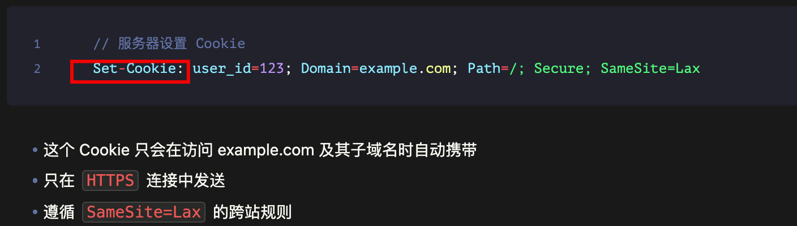

# HTTP 请求是否携带 Cookie

`#前端安全`  


## 目录
<!-- toc -->
 ## 总结 

- 浏览器只会自动携带**与请求的域名匹配的 Cookie**
	- 所以关键还是看 cookie（**Set-Cookie**） 是如何设置的，需要满足以下条件才会被自动携带
		- ① 域名匹配（Domain 属性）
		- ② 路径匹配（Path 属性）
		- ③ 未过期（Expires/Max-Age 属性）
		- ④ 符合 SameSite 策略
		- 比如
			- 
- 影响 Cookie 发送的**关键属性**
	- Domain
	- Path
	- Secure
	- SameSite
		- Strict
		- Lax
		- None：允许跨站
- 跨域请求（CORS）
	- 前端：
		- fetch 
			- credentials: 'include'
		- XHR
			- axios.defaults.withCredentials = true
			- xhr.withCredentials = true;
	- 后端配置
		- Access-Control-Allow-Credentials = true
		- Access-Control-Allow-Origin = xxx
- 其他注意事项
	- 单个 Cookie 通常限制为 **4KB**
	- 域名总 Cookie 数量有限制（因浏览器而异）

## 1. **不是自动携带所有 Cookie**

- 浏览器只会自动携带与请求的域名匹配的 Cookie
- Cookie 必须满足以下条件才会被自动携带：
	- 域名匹配（Domain 属性）
	- 路径匹配（Path 属性）
	- 未过期（Expires/Max-Age 属性）
	- 符合 SameSite 策略

## 2. **影响 Cookie 发送的关键属性**：

   - `Domain`：指定 Cookie 可以发送到哪些域名
   - `Path`：指定 Cookie 在哪些路径下可用
   - `Secure`：只在 HTTPS 连接中发送
   - `SameSite`：控制跨站请求时是否发送
     - `Strict`：最严格，完全禁止跨站发送
     - `Lax`：默认值，允许部分跨站（如链接跳转）
     - `None`：**允许跨站（需要配合 Secure 使用）**

## 3. **常见场景**：

   ```javascript
   // 服务器设置 Cookie
   Set-Cookie: user_id=123; Domain=example.com; Path=/; Secure; SameSite=Lax
   ```
   
   - 这个 Cookie 只会在访问 example.com 及其子域名时自动携带
   - 只在 `HTTPS` 连接中发送
   - 遵循 `SameSite=Lax` 的跨站规则

## 4. **跨域请求（CORS）**：

- 默认情况下，跨域请求不会携带 Cookie
- 需要特别设置才能在跨域请求中发送 Cookie：


```javascript
// 前端设置
fetch(url, {
	credentials: 'include'  // 允许发送跨域 Cookie
});

// 后端设置
Access-Control-Allow-Credentials: true
```

我来系统地总结一下关于 HTTP 请求携带 Cookie 的重要知识点：

## 5. Cookie 携带的基本原则

### 5.1. 同源请求

- 默认情况下，**同源请求会自动携带相应的 Cookie**
- 同源指：
	- 协议（Protocol）
	- 域名（Domain）
	- 端口（Port）都相同

### 5.2. 跨域请求

- 默认不携带 Cookie
- 需要同时满足前后端的特定配置才能携带

## 6. Cookie 属性对携带的影响

### 6.1. Domain 属性

- 决定 Cookie 可以被发送到哪些域名
- 示例：
```plaintext
Domain=example.com     // 可以发送到 example.com 及其子域名
Domain=sub.example.com // 只能发送到特定子域名
```

### 6.2. Path 属性

- **指定在哪些路径下可以发送 Cookie**
- 示例：
  ```plaintext
  Path=/       // 所有路径
  Path=/admin  // 只在 /admin 及其子路径
  ```

### 6.3. Secure 属性

- 设置后只在 `HTTPS 连接`中发送
- 提高安全性
```plaintext
Set-Cookie: name=value; Secure
```

### 6.4. SameSite 属性

- 控制跨站请求时的 Cookie 发送行为
```plaintext
Set-Cookie: name=value; SameSite=Strict  // 禁止跨站发送
Set-Cookie: name=value; SameSite=Lax     // 默认值，允许部分跨站
Set-Cookie: name=value; SameSite=None    // 允许跨站（需要 Secure）
```

## 7. 跨域请求携带 Cookie 的配置

### 7.1. 前端配置

```javascript
// 使用 fetch
fetch(url, {
  credentials: 'include'  // 允许跨域携带 Cookie
});

// 使用 axios ，它使用的就是 xhr 
axios.defaults.withCredentials = true;

// 使用 XMLHttpRequest
xhr.withCredentials = true;
```

### 7.2. 后端配置

```javascript
// Node.js Express 示例
res.header('Access-Control-Allow-Credentials', 'true');
res.header('Access-Control-Allow-Origin', 'https://specific-origin.com');
// 注意：允许携带凭证时，Access-Control-Allow-Origin 不能为 *
```

## 8. 特殊场景

### 8.1. 第三方 Cookie

- 现代浏览器increasingly限制第三方 Cookie
- Safari 和 Firefox 默认阻止第三方 Cookie
- Chrome 计划在2024年逐步淘汰第三方 Cookie

### 8.2. 移动端 WebView

- Cookie 行为可能因平台而异
- iOS WKWebView 需要特别配置才能支持 Cookie

## 9. 安全考虑

### 9.1. CSRF 防护

- Cookie 自动携带可能导致 CSRF 攻击
- 建议：
	- 使用 **CSRF Token**
	- 合理设置 `SameSite` 属性
	- 实施其他安全措施

### 9.2. Cookie 大小限制

- 单个 Cookie 通常限制为 **4KB**
- 域名总 Cookie 数量有限制（因浏览器而异）

## 11. 最佳实践

1. **安全性**
	- 总是使用 Secure 属性（HTTPS）
	- 适当设置 SameSite 属性
	- 设置合适的过期时间
1. **性能**
- 控制 Cookie 大小
- 只在必要时携带 Cookie
2. **兼容性**
   - 考虑浏览器兼容性
   - 做好降级处理
3. **维护性**
   - 规范 Cookie 命名
   - 及时清理过期 Cookie

