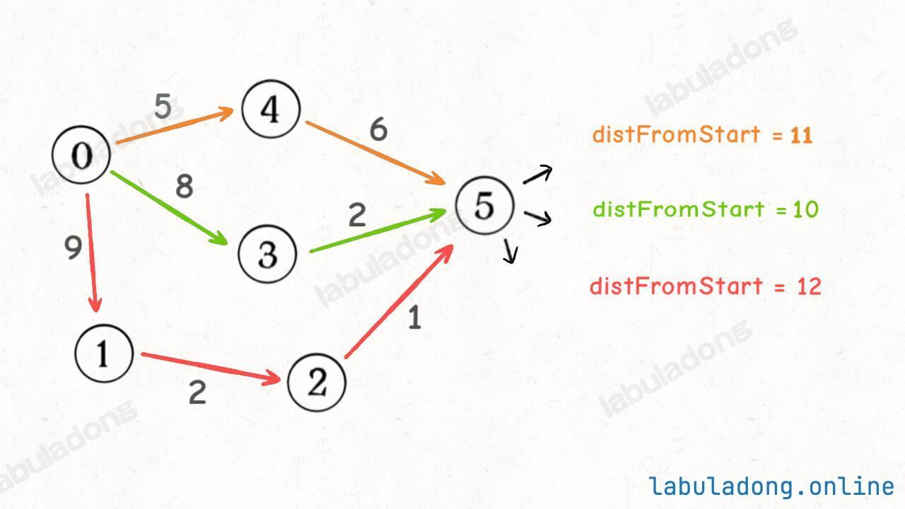

# Dijkstra 算法


## 目录
<!-- toc -->
 ## 定义 

 - Dijkstra 算法本质上就是一个经过特殊改造的 BFS 算法
	 - 使用`优先级列队`而不是`普通列队`
	 - 添加了一个`备忘录`，记录起点到每个可达节点的最短路径权重和

## 使用第三种 BFS 写法来改造

第三种写法多维护了一个 State 类

### 多叉树的层序遍历

```javascript
// 每个节点自行维护 State 类，记录深度等信息
class State {
    constructor(node, depth) {
        this.node = node;
        this.depth = depth;
    }
}

var levelOrderTraverse = function (root) {
    if (root === null) {
        return;
    }
    var q = [new State(root, 1)];
    while (q.length !== 0) {
        var state = q.shift();
        var cur = state.node;
        var depth = state.depth;
        // 访问 cur 节点，同时知道它所在的层数
        console.log("depth = " + depth + ", val = " + cur.val);
        for (var i = 0; i < cur.children.length; i++) {
            var child = cur.children[i];
            q.push(new State(child, depth + 1));
        }
    }
};
```

### 图的 BFS 遍历

```javascript
// 图结构的 BFS 遍历，从节点 s 开始进行 BFS，且记录路径的权重和
// 每个节点自行维护 State 类，记录从 s 走来的权重和
class State {
    constructor(node, weight) {
        // 当前节点 ID
        this.node = node;
        // 从起点 s 到当前节点的权重和
        this.weight = weight;
    }
}

var bfs = function (graph, s) {
    var visited = new Array(graph.size()).fill(false);
    var q = [new State(s, 0)];
    visited[s] = true;
    while (q.length !== 0) {
        var state = q.shift();
        var cur = state.node;
        var weight = state.weight;
        console.log("visit " + cur + " with path weight " + weight);
        var neighbors = graph.neighbors(cur);
        for (var i = 0; i < neighbors.length; i++) {
            var e = neighbors[i];
            if (!visited[e.to]) {
                q.push(new State(e.to, weight + e.weight));
                visited[e.to] = true;
            }
        }
    }
};

```


> 更多请参考 [5. 图的 BFS 遍历](/post/AhlclR1c.html)

## Dijkstra 算法原理

### 函数签名

```javascript
var dijkstra = function(start, graph) {
    // 输入一幅图和一个起点 start，计算 start 到其他节点的最短距离
    // code
}

// 节点 `3` 作为起点到其他节点的最小路径和数组
// 从起点 `3` 到节点 `6` 的最短路径权重和就是 `distTo[6]`
let distTo = dijkstra(3, graph);
```

### State 类

```javascript hl:4
function State(id, distFromStart) {
    // 图节点的 id
    this.id = id;
    // 从 start 节点到当前节点的距离
    this.distFromStart = distFromStart;
}
```

### distTo 记录最短路径：备忘录

加权图中的 Dijkstra 算法和无权图中的普通 BFS 算法不同
- 在 Dijkstra 算法中，你第一次经过某个节点时的路径权重，不见得就是最小的
	- 所以对于同一个节点，我们可能会经过多次，而且每次的 `distFromStart` 可能都不一样，比如下图



- 我会经过节点 `5` 三次，每次的 `distFromStart` 值都不一样
- 那我取 `distFromStart` 最小的那次，不就是从起点 `start` 到节点 `5` 的最短路径权重了么？
- 所以我们需要一个 `distTo` 数组来记录从起点 `start` 到每个节点的最短路径权重和，起到一个==备忘录==的作用。
- 当重复遍历到同一个节点时，我们可以比较一下当前的 `distFromStart` 和 `distTo` 中的值，
	- 如果当前的更小，就更新 `distTo`，
	- 反之，就==不用再往后继续遍历==了

## 代码模板

```javascript
/**
 * Dijkstra 算法模板
 * @param {number} n - 节点数量
 * @param {number[][]} edges - 边的信息 [from, to, weight]
 * @param {number} start - 起点
 * @returns {number[]} 从起点到所有节点的最短距离
 */
function dijkstra(n, edges, start) {
    // 1. 构建邻接表
    const graph = Array.from({ length: n }, () => []);
    for (const [from, to, weight] of edges) {
        // 如果是无向图，需要双向添加
        graph[from].push([to, weight]);
        // graph[to].push([from, weight]); // 无向图时取消注释
    }
    // 2. start 到 0 - n 的最短路径权重
    const dist = new Array(n).fill(Infinity);
    // 自己到自己最短距离为 0
    dist[start] = 0;

    // 3. 优先队列 [distance, node]
    // distance: 从 start 到 node 的最短距离
    // node: 节点编号
    const pq = [0, start](/post/Ucb84iUz.html#0,-start);
    while (pq.length) {
        // 取出当前最短距离的节点
        const [d, cur] = pq.shift();

        // 如果当前距离大于已知距离，跳过
        if (d > dist[cur]) continue;

        // 遍历所有相邻节点
        for (const [item, weight] of graph[cur]) {
            const newDist = dist[cur] + weight;
            // 如果找到更短的路径
            if (newDist < dist[item]) {
                dist[item] = newDist;
                // 插入优先队列（保持队列按距离排序）
                let inserted = false;
                for (let i = 0; i < pq.length; i++) {
                    if (pq[i][0] > newDist) {
                        pq.splice(i, 0, [newDist, item]);
                        inserted = true;
                        break;
                    }
                }
                if (!inserted) pq.push([newDist, item]);
            }
        }
    }

    return dist;
}

```

## 相关题目

- [743. 网络延迟时间](/post/3HO46KKs.html)
- [1631. 最小体力消耗路径](/post/R8HRba5H.html)
- [1514. 概率最大的路径](/post/hRjECgi7.html)