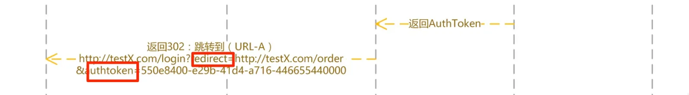
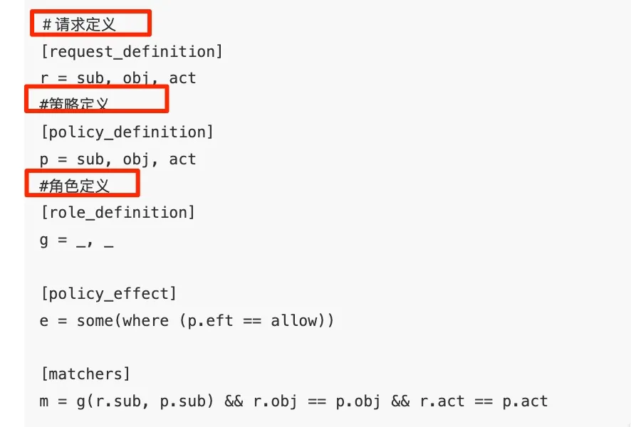

# SSO 系统与权限系统设计

`#系统设计` 

## 目录
<!-- toc -->
 ## 1. SSO 系统要素 

- 需要有一个`sso.domain.com`的站点
	- 同域，都会携带一个`AuthToken` 来校验身份就好
	- `跨域`，主要流程就是`sso`系统会上生成一个`service ticket` 
		- 然后重定向到应用服务，应用服务再根据`st` 想sso服务发送验证，成功后写入应用域名cookie，如下图
			- 
- redis 缓存登录信息
- 数据库存储用户信息等
- 权限系统
	- 一般都会 sso 服务配合使用

## 2. 权限系统

- 一般和`sso`服务是搭起来的
- `RBAC`（Role-Based Access Control ）基于角色的访问控制
	- 当初用的这个权限引擎方案 `Casbin` 
		- go 语言和 nodejs 版本
- 在这个模型中，有三种实体：
	- 角色：`subject`(用户可以与角色合并成为 subject，于是角色组也可以表示了)；
	- 资源：`object`;
	- 操作：`action`;
- 举例：模型对象：规则
	- p, alice, data1, read
	- p, bob, data2, write  
    

