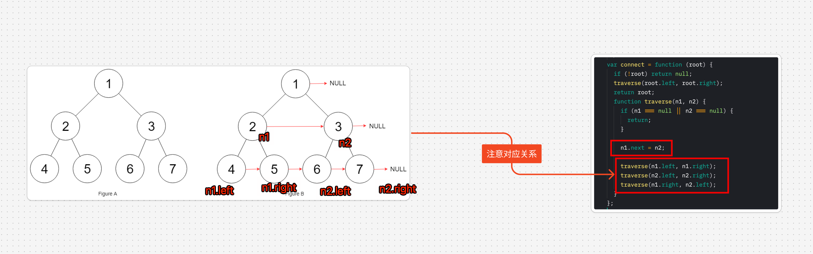

# 填充每个节点的下一个右侧节点指针


> [116. 填充每个节点的下一个右侧节点指针](https://leetcode.cn/problems/populating-next-right-pointers-in-each-node/)


## 目录
<!-- toc -->
 ## 分析 

注意点：
- n2.next = null 不用考虑，因为默认就为 null
- 注意两个 base case

如下图：



## 代码

```javascript hl:2,6
var connect = function (root) {
  if (!root) return null;
  traverse(root.left, root.right);
  return root;
  function traverse(n1, n2) {
    if (n1 === null || n2 === null) {
      return;
    }
    n1.next = n2;
    traverse(n1.left, n1.right);
    traverse(n2.left, n2.right);
    traverse(n1.right, n2.left);
  }
};
```

## 最后：分解问题

这题能不能用「分解问题」的思维模式解决