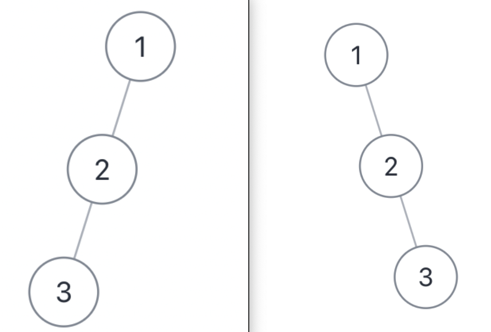

# 根据前序和后序遍历构造二叉树


>  [889. 根据前序和后序遍历构造二叉树](https://leetcode.cn/problems/construct-binary-tree-from-preorder-and-postorder-traversal/)


> 根据后序构建 `mapping` ，而另外两个都是根据中序构建 `mapping`

同样的思路：
- 找根节点：
	- 前序的第一元素 或 后序的最后一个元素
- 构造左、右子树
	- 前序的`第二个元素` 作为`左子树的根`
	- 后序中寻找左子树根节点的值
		- 从而确定了 `左子树` 的索引边界
			- 进而确定`右子树的索引边界`，递归构造左右子树

如下图


## 目录
<!-- toc -->
 ## 1. 代码  

```javascript
var constructFromPrePost = function (preorder, postorder) {
    let n = preorder.length;
    let mapping = {};
    postorder.forEach((item, index) => {
        mapping[item] = index;
    });
    return build(0, n - 1, 0, n - 1);
    
    function build(preStart, preEnd, postStart, postEnd) {
        // 基础情况
        if (preStart > preEnd) return null;
        // 处理只有一个节点的情况
        if (preStart === preEnd) {
            return new TreeNode(preorder[preStart]);
        }
        // 构造根节点
        let rootVal = preorder[preStart];
        // 左子树的根节点值
        let leftRootVal = preorder[preStart + 1];
        // 在后序中找到左子树根节点的位置
        let leftRootIndex = mapping[leftRootVal];
        // 计算左子树的大小
        let leftSize = leftRootIndex - postStart + 1;
        // 构造根节点
        let root = new TreeNode(rootVal);
        // 递归构造左子树
        root.left = build(
            preStart + 1, // 左子树在前序中的起始位置
            preStart + leftSize, // 左子树在前序中的结束位置
            postStart, // 左子树在后序中的起始位置
            leftRootIndex, // 左子树在后序中的结束位置
        );
        // 递归构造右子树
        root.right = build(
            preStart + leftSize + 1, // 右子树在前序中的起始位置
            preEnd, // 右子树在前序中的结束位置
            leftRootIndex + 1, // 右子树在后序中的起始位置
            postEnd - 1, // 右子树在后序中的结束位置
        );
        return root;
    }

};

```

## 2. 为什么不唯一？



上面两棵树结构不同，但是它们的前序遍历和后序遍历结果是相同的

前序和后序遍历构造二叉树结果不唯一，是因为**无法确定空节点的位置**
- 前序遍历：根 -> 左 -> 右
- 后序遍历：左 -> 右 -> 根
	- 当一个节点只有一个子节点时，仅通过前序和后序遍历，**无法确定这个子节点是左子节点还是右子节点**
	- 而中序遍历可以帮助确定这一点（因为中序遍历是 左 -> 根 -> 右）

示例：

