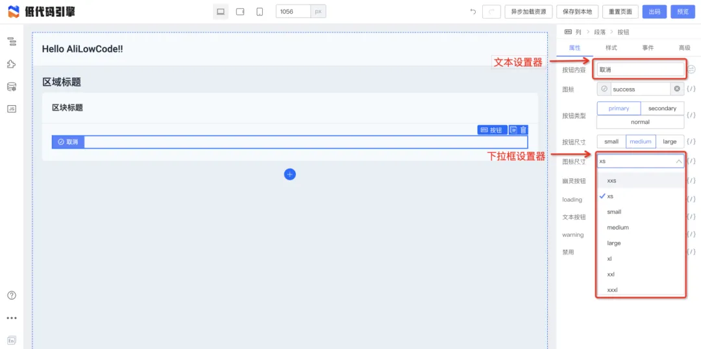
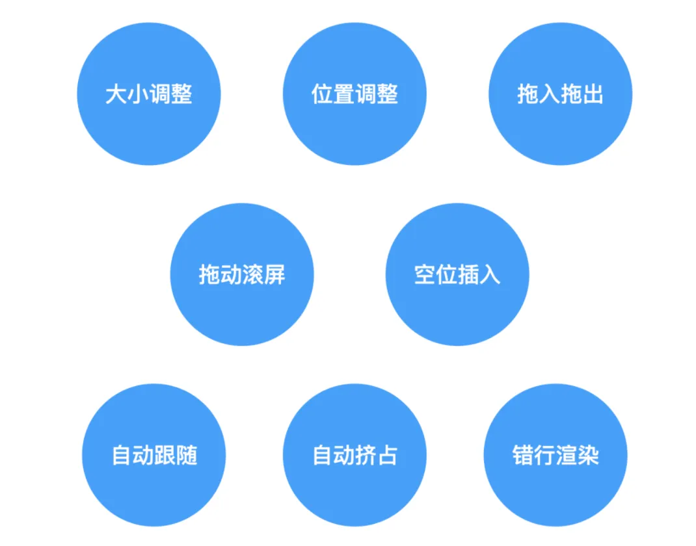
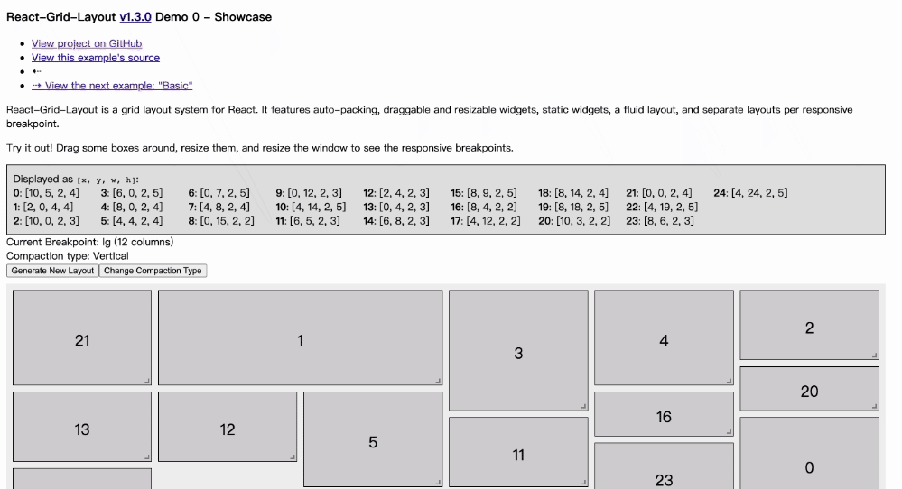
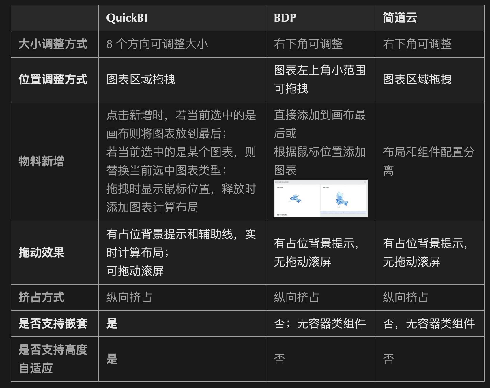

# 调研：设计器交互体验

`#lowcode` 

## 目录
<!-- toc -->
 ## 设计器定制 

- 通过设计器插件，我们可以直接使用生态中流通的插件，也可以根据我们自己的需求进行插件的开发。
- 通过编写不同的插件同引擎核心模块进行交互，在满足多样化的功能的同时，同时也与低代码引擎解耦。

## 设置器定制

如何设计一个组件？

- 文本组件：
	- 文本设置器
		- 

## 组件类型分类

- 内置基础组件，低代码组件，可开箱即用
- 存量组件，源码组件、或者 Pro 组件，如何转换低代码组件？
- 扩充低代码组件：
	- 开发能力
	- 低代码组件项目初始化
	- 低代码组件调试
	- 低代码组件配置等能力

## 磁贴布局

### 报表场景非常通用

- 各类 BI 产品（QuickBI、BDP）以及和宜搭同类型低代码产品（简道云、氚云）
- 报表/仪表盘页面搭建场景基本上都使用磁贴布局，这也说明**磁贴布局适用于报表场景**是经过了充分验证的

### 基础能力

先看看两种布局方式

- **纵向挤占布局**时，元素会在垂直方向（y轴方向）紧凑布局
	- 
- **横向挤占布局**时，元素会在横轴方向（x轴方向）紧凑布局
	- .gif)

由于页面是从上往下排的，因此整体来说**纵向挤占布局更加符合直觉**，这也是大部分产品使用纵向挤占的原因

### 竞品分析

## 磁贴 & 流式布局混排

- 页面整体为磁贴布局
- 由**容器和分栏组件**来支持原来的流式布局

## 关于布局组件

- https://dsmorse.github.io/gridster.js/#demos
- Muuri-vue
- https://github.com/react-grid-layout/react-grid-layout
- https://github.com/SortableJS/vue.draggable.next

## 参考

- https://mp.weixin.qq.com/s/PSTut5ahAB8nlJ9kBpBaxw
- https://mp.weixin.qq.com/s/TY3VXjkSmsQoT47xma3wig