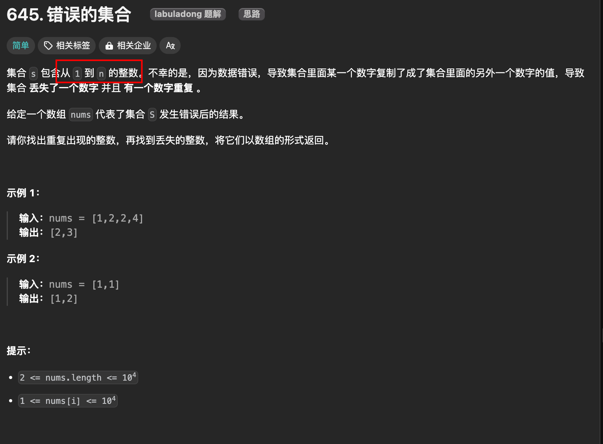

# 如何同时寻找缺失和重复的元素

`#数学运算`

|LeetCode|力扣|难度|
|---|---|---|
|[645. Set Mismatch](https://leetcode.com/problems/set-mismatch/)|[645. 错误的集合](https://leetcode.cn/problems/set-mismatch/)|🟢|


## 目录
<!-- toc -->
 ## 第 645 题「[错误的集合](https://leetcode.cn/problems/set-mismatch)」 



给一个长度为 `N` 的数组 `nums`，其中本来装着 `[1..N]` 这 `N` 个元素，无序。但是现在出现了一些错误，`nums` 中的一个元素出现了重复，也就同时导致了另一个元素的缺失。请你写一个算法，找到 `nums` 中的**重复元素和缺失元素的值**

比如说输入：`nums = [0,1,2,4,4]`，算法返回 `[4,3]`。

## 思路一：hash

先遍历一次数组，用一个哈希表记录每个数字出现的次数，然后遍历一次 `[1..N]`，看看那个元素重复出现，那个元素没有出现


## 思路二：通过将每个索引对应的元素变成负数，以表示这个索引被对应过一次了

### 分析

- 如果说 `nums` 中不存在重复元素和缺失元素，那么每个元素就和唯一一个索引值对应，
- 现在的问题是，有一个元素重复了，同时导致一个元素缺失了，这会产生什么现象呢？
	- 会导致有两个元素对应到了同一个索引
	- 而且会有一个索引没有元素对应过去


```bash
输入：nums = [1,2,2,4]
过程：
1. 第一次遍历：
   - 遇到 1：将 index=0 (1-1) 处变为负数 → [-1,2,2,4]
   - 遇到 2：将 index=1 (2-1) 处变为负数 → [-1,-2,2,4]
   - 遇到 2：发现 index=1 (2-1) 处已经是负数，说明 2 是重复数字
   - 遇到 4：将 index=3 (4-1)  处变为负数 → [-1,-2,2,-4]

2. 第二次遍历：
   - 发现 index=2 处是正数
   - 说明数字 3 (index+1) 是丢失的数字

输出：[2,3]  // 重复的是 2，丢失的是 3

```

### 代码

```javascript
var findErrorNums = function (nums) {
  let n = nums.length;
  // 用于存储重复的数字
  let dup = -1;

  // 第一次遍历 - 找重复数：
  for (let i = 0; i < n; i++) {
    // 获取当前数字对应的索引，比如 -2 对应的索引应该为 3
    let index = Math.abs(nums[i]) - 1;
    // 如果该位置已经是负数，说明遇到重复数字
    if (nums[index] < 0) {
      dup = Math.abs(nums[i]);
      // 如果是正数，将访问过的位置标记为负数
    } else {
      nums[index] *= -1;
    }
  }
  // 用于存储丢失的数字
  let missing = -1;
  // 遍历完成后，唯一保持正数的位置对应的就是丢失的数字
  for (let i = 0; i < n; i++) {
    // 如果某个位置的数字是正数，说明这个位置没被访问过
    if (nums[i] > 0) {
      // 将索引转换成元素,该位置对应的数字就是丢失的数字
      missing = i + 1;
    }
  }
  return [dup, missing];
};
```

## 总结


对于这种数组问题，**关键点在于元素和索引是成对儿出现的，常用的方法是排序、异或、映射**。

- 映射的思路就是我们刚才的分析，**将每个索引和元素映射起来**，通过**正负号记录**某个元素是否被映射。
- 排序的方法也很好理解，对于这个问题，可以想象如果元素都被从小到大排序，如果发现索引对应的元素如果不相符，就可以找到重复和缺失的元素。
- 异或运算也是常用的，因为异或性质 `a ^ a = 0, a ^ 0 = a`，如果将索引和元素同时异或，就可以消除成对儿的索引和元素，留下的就是重复或者缺失的元素

