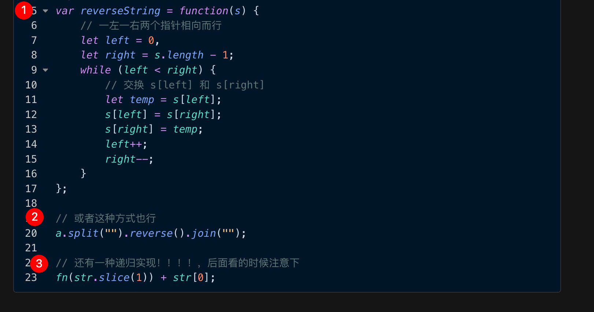
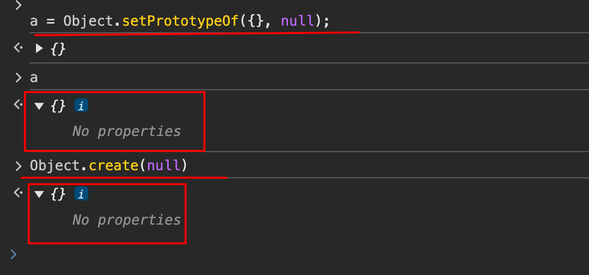

# 常见面试题：篇五

`#前端面试` `#R1` 


## 目录
<!-- toc -->
 ## 1. 实现字符串的翻转的 5 种方法 



==④== `[...'abc'].reverse().join("")`

==⑤== 递归实现反转字符串

```javascript hl:9
let str = "1234";
function fn(str) {
  // base case
  if (str === "") {
    return str;
  }
  return fn(str.slice(1)) + str[0];
}
console.log(fn(str));
```

## 2. 实现一个 Object.create(null)：两种方式

```javascript hl:15
Object.myCreate = function (proto) {
  function F() {}
  F.prototype = proto;
  return new F();
};

Object.myCreate = function (proto) {
  return Object.setPrototypeOf({}, proto);
};


// 如下图：
Object.create(null)
// 等价于 
Object.setPrototypeOf({}, null);
```

**

## 3. 实现 `classNames` 库的能力

```javascript

function classNames(...args) {
    let arr = [];
    for (let item of args) {
        // 必须if/else if ,一个经验是尽量这么写，别分开，不然可能会重复命中
        if (typeof item === "string" || typeof item === "number") {
            arr.push(item);
        } else if (Array.isArray(item)) {
            // 彻底打平，然后把它放到args参数里面去
            item.flat(Infinity).forEach((it) => {
                args.push(it);
            })
        }
        // 这里需要过滤掉 null
        else if (typeof item === "object" && item !== null) {
            Object.entries(item).forEach(([k, v]) => {
                if(v){
	                arr.push(k)
                }
            })
        }
    }
    return arr;
}

console.log(
    // :::: BigInt 可以表示任意大的整数。1n是一种表达方式， 1n == 1 相等
    classNames(
        null, undefined, Symbol(), 1n, true, false
    ) || ''
)

console.log(
    classNames('BFE', 'dev', 100)
)

const obj = new Map()
obj.cool = '!'

// 'BFE dev is cool'
console.log(
    classNames({BFE: [], dev: true, is: 3}, obj)
)

console.log(
    classNames(['BFE', [{dev: true}, ['is', [obj]]]])
)

```

## 5. 自己实现`Array.prototype.splice`

```javascript
Array.prototype.splice =
  Array.prototype.splice ||
  function (start, deleteCount, ...addList) {
    ////  处理开始 startIndex
    if (start < 0) {
      if (Math.abs(start) > this.length) {
        start = 0;
      } else {
        start += this.length;
      }
    }
    // 处理删除的的个数，如果没传，直接等于长度 - start
    if (typeof deleteCount === "undefined") {
      deleteCount = this.length - start;
    }
    // 处理，移除的
    const removeList = this.slice(start, start + deleteCount);

    const right = this.slice(start + deleteCount);
    ////  重新修改this -> 原数组 ，即加入addlist数组片段 + right剩余的数组片段
    //   关键是这里，没有发现所谓的left,因为left还在this里呢，也就是本身没变
    let addIndex = start;
    addList.concat(right).forEach((item) => {
      this[addIndex] = item;
      addIndex++;
    });
    this.length = addIndex;
    return removeList;
  };

```

## 6. 实现`1,2,3,5,7,8,9` => `1~3,5,7~9`

```javascript
function compressNumbers(numbers) {
  numbers.sort((a, b) => a - b);
  const ranges = [];
  let start = numbers[0];
  let prev = numbers[0];

  for (let i = 1; i <= numbers.length; i++) {
    const current = numbers[i];
    if (current !== prev + 1 || i === numbers.length) {
      if (start === prev) {
        ranges.push(start.toString());
      } else {
        ranges.push(`${start}~${prev}`);
      }
      start = current;
    }
    prev = current;
  }

  return ranges.join(",");
}
compressNumbers([1, 2, 3, 5, 7, 8, 9]); // 返回 "1~3,5,7~9"

```

## 7. 要求设计 `LazyMan` 类，实现以下功能


```javascript
LazyMan('Tony');
// Hi I am Tony

LazyMan('Tony').sleep(10).eat('lunch');
// Hi I am Tony
// 等待了10秒...
// I am eating lunch

LazyMan('Tony').eat('lunch').sleep(10).eat('dinner');
// Hi I am Tony
// I am eating lunch
// 等待了10秒...
// I am eating diner

LazyMan('Tony').eat('lunch').eat('dinner').sleepFirst(5).sleep(10).eat('junk food');
// Hi I am Tony
// 等待了5秒...
// I am eating lunch
// I am eating dinner
// 等待了10秒...
// I am eating junk food
```

- 关键点：tasklist 任务队列，注意优先级
- `next` 实际执行下一个任务

```javascript
class LazyManClass {
    constructor(name) {
        this.taskList = [];
        this.name = name;
        console.log(`Hi I am ${this.name}`);
        setTimeout(() => {
            this.next();
        }, 0);
    }
    eat (name) {
        var that = this;
        // 这里包装了一下，放在一个函数里面
        var fn = (function (n) {
            return function () {
                console.log(`I am eating ${n}`)
                that.next();
            }
        })(name);
        this.taskList.push(fn);
        return this;
    }
    sleepFirst (time) {
        var that = this;
        var fn = (function (t) {
            return function () {
                setTimeout(() => {
                    console.log(`等待了${t}秒...`)
                    that.next();
                }, t * 1000);
            }
        })(time);
         // 优先级较高
        this.taskList.unshift(fn);
        return this;
    }
    sleep (time) {
        var that = this
        var fn = (function (t) {
            return function () {
                setTimeout(() => {
                    console.log(`等待了${t}秒...`)
                    that.next();
                }, t * 1000);
            }
        })(time);
        this.taskList.push(fn);
        return this;
    }
    next () {
        var fn = this.taskList.shift();
        fn && fn();
    }
}
function LazyMan(name) {
    return new LazyManClass(name);
}
LazyMan('Tony').eat('lunch').eat('dinner').sleepFirst(5).sleep(4).eat('junk food');
```

## 8. `[abc[bcd[def]]]` 转成对象

- 注意点
	- 正则 ：`/[\[\]]/`
		- 需要 `[]` 包裹起来
	-  for 倒着遍历
### 题目

```javascript
/**
 * 字符串仅由小写字母和 [] 组成，且字符串不会包含多余的空格。
 * 示例一: 'abc' --> {value: 'abc'}
 * 示例二：'[abc[bcd[def]]]' -->
 *			{value: 'abc', children: {value: 'bcd', children: {value: 'def'}}}
 */
```

### for 倒着遍历

```javascript
const str = "[abc[bcd[def]]]";
let values = str.split(/[\[\]]/).filter((item) => !!item);

// 从后往前遍历构建对象
let result = null;
for (let i = values.length - 1; i >= 0; i--) {
  if (result === null) {
    // 第一次遍历，创建最内层对象
    result = { value: values[i] };
  } else {
    // 后续遍历，将之前的结果作为 children
    result = {
      value: values[i],
      children: result,
    };
  }
}
console.log(result);
```


### reduce 的方案

```javascript


let str = "[abc[bcd[def]]]";
// 先转成数组，再递归处理
let arr = str.split(/[\[\]]/).filter((item) => {
  return !!item;
});

let res = {};
arr.reduce((prev, curent, index, array) => {
  prev.value = curent;
  // 除了最后一个，都返回 prev.children
  if (array.length - 1 !== index) {
    prev.children = {};
    return prev.children;
  }
}, res);

console.log(JSON.stringify(res));
```

## 9. howOld(tree,name)实现

```javascript
var tree = {
  age: 100,
  name: "a",
  child: [
    {
      age: 88,
      name: "b",
    },
    {
      age: 66,
      name: "c",
      child: [
        {
          age: 0,
          name: "d",
          child: [
            {
              age: -1,
              name: "e",
            },
          ],
        },
      ],
    },
  ],
};

function howOld(tree, name) {
  let res = null;
  function dfs(root, name) {
    // base case
    if (root.name === name) {
      res = root.age;
      return;
    }
    // 如果是数组，则遍历子节点
    if (Array.isArray(root.child)) {
      root.child.forEach((item) => {
        dfs(item, name);
      });
    }
  }
  dfs(tree, name);
  return res;
}
console.log(howOld(tree, "e"));
console.log(howOld(tree, "c"));
```

## 10. 罗马数字转化整数

```javascript
let map = {
  I: 1,
  V: 5,
  X: 10,
  L: 50,
  C: 100,
  D: 500,
  M: 1000,
};
var romanToInt = function (s) {
  let arr = s.split("");
  let res = [];
  arr.forEach((item) => {
    res.push(map[item]);
  });
  let val = 0;
  for (let i = 0; i < res.length; i++) {
    let a = res[i];
    let b = res[i + 1];
    if (b && b > a) {
      val += b - a;
      i++;
    } else {
      val += a;
    }
  }
  console.log(val);
  return val;
};
```

## 11. 整数转成罗马数字

```javascript
let intToRoman = function (num) {
    let values = [1000, 900, 500, 400, 100, 90, 50, 40, 10, 9, 5, 4, 1],
        strs = ["M", "CM", "D", "CD", "C", "XC", "L", "XL", "X", "IX", "V", "IV", "I"],
        result = '';
    for (let i = 0; i < values.length; i++) {
        while (num >= values[i]) {
            num -= values[i];
            result += strs[i];
        }
    }
    return result;
};
```

## 12. 实现 retry 并指定尝试次数

- `while(times--)`

```javascript hl:8
Promise.retry = function (fn, times = 3) {
  return new Promise(async (resolve, reject) => {
    while (times--) {
      try {
        let ret = await fn();
        resolve(ret);
        // 成功了就直接break了
        break;
      } catch (error) {
        if (!times) reject(error);
      }
    }
  });
};
```

## 13. 柯里化参数固定场景 `add(1)(2)(3)`

```javascript
/**
 * 柯里化
 * 参数固定场景
 * add(1)(2)(3)
 * add(4)(5)(6)
 * */
const curry = (fn, ...args1) => {
    if (args1.length >= fn.length) {
        return fn(...args1)
    } 
   // 两个return 
	return (...args2) => {
		return curry(fn, ...args1, ...args2);
	}
}
function add1(x, y, z) {
    return x + y + z;
}
const add = curry(add1);
console.log(add(1, 2, 3));
console.log(add(1)(2)(3));
console.log(add(1, 2)(3));
console.log(add(1)(2, 3));
```

## 14. 参数不固定的柯里化场景

```javascript
/**
 * 柯里化
 * 参数不固定场景
 * add(1)(2)(3,4).sumof()
 * */

const add = (...args) => {
    let vars = [];
    // 写一个函数，形成闭包
    const curried = (...arg2) => {
        // ::::这里 vars,记住了
        vars = [...vars, ...arg2];
        return curried
    }
    curried.sumof = () => {
        //todo 做你想做的事情
        return vars;
    }
    return curried(...args)
}

console.log(add(1)(2)(3, 4).sumof())
console.log(add(1)(2)(3, 4)(7, 8).sumof())
```

## 15. 封装一个支持请求超时和重试机制的请求函数

```javascript
/**
 * 延迟函数
 * @param {number} ms 延迟时间（毫秒）
 * @returns {Promise<void>}
 */
const delay = (ms) => new Promise(resolve => setTimeout(resolve, ms));
/**
 * 带有超时和重试机制的请求函数
 * @param {Function} fetchFn - 实际的请求函数
 * @param {Object} options - 配置选项
 * @param {number} options.timeout - 超时时间（毫秒）
 * @param {number} options.retries - 重试次数
 * @param {number} options.retryDelay - 重试间隔（毫秒）
 * @param {Function} options.retryCondition - 重试条件函数
 * @param {AbortSignal} options.signal - 取消信号
 * @returns {Promise}
 */
async function fetchWithRetry(fetchFn, {
  timeout = 5000,
  retries = 3,
  retryDelay = 1000,
  retryCondition = (error) => true, // 默认所有错误都重试
  signal = null
} = {}) {
  let lastError;
  // 创建超时 Promise
  const timeoutPromise = (ms) => new Promise((_, reject) => {
    setTimeout(() => {
      reject(new Error(`Request timeout after ${ms}ms`));
    }, ms);
  });

  // 重试循环
  for (let i = 0; i <= retries; i++) {
    try {
      // 如果已经被取消，直接抛出错误
      if (signal?.aborted) {
        throw new Error('Request aborted');
      }

      // 创建实际的请求 Promise
      const fetchPromise = fetchFn();

      // 使用 Promise.race 实现超时控制
      const result = await Promise.race([
        fetchPromise,
        timeoutPromise(timeout)
      ]);

      return result; // 如果成功，直接返回结果
    } catch (error) {
      lastError = error;
      // 如果是最后一次重试，或者不满足重试条件，直接抛出错误
      if (i === retries || !retryCondition(error)) {
        throw error;
      }
      // 如果需要重试，等待指定时间
      console.log(`Retry attempt ${i + 1} of ${retries} after ${retryDelay}ms`);
      await delay(retryDelay);
    }
  }
  throw lastError;
}
// 使用示例：
async function example4() {
  try {
    const result = await fetchWithRetry(
      () => axios.get('https://api.example.com/data'),
      {
        timeout: 3000,
        retries: 3,
        retryCondition: (error) => {
          // axios 特定的错误处理
          return axios.isAxiosError(error) && 
                 (!error.response || error.response.status >= 500);
        }
      }
    );
    console.log(result.data);
  } catch (error) {
    console.error('Final error:', error);
  }
}
```
