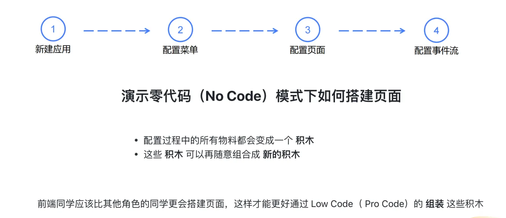
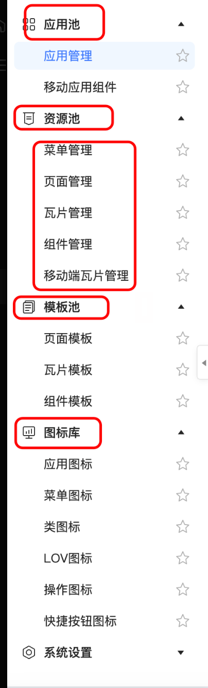
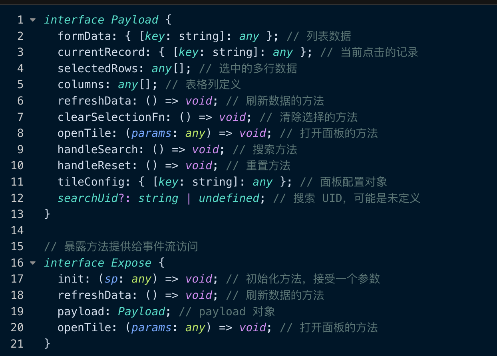
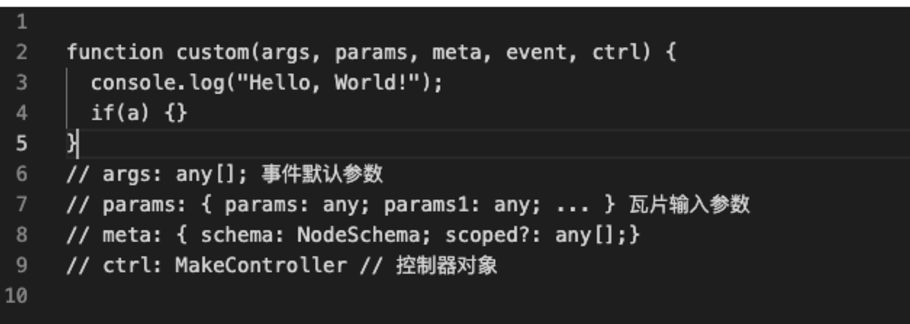
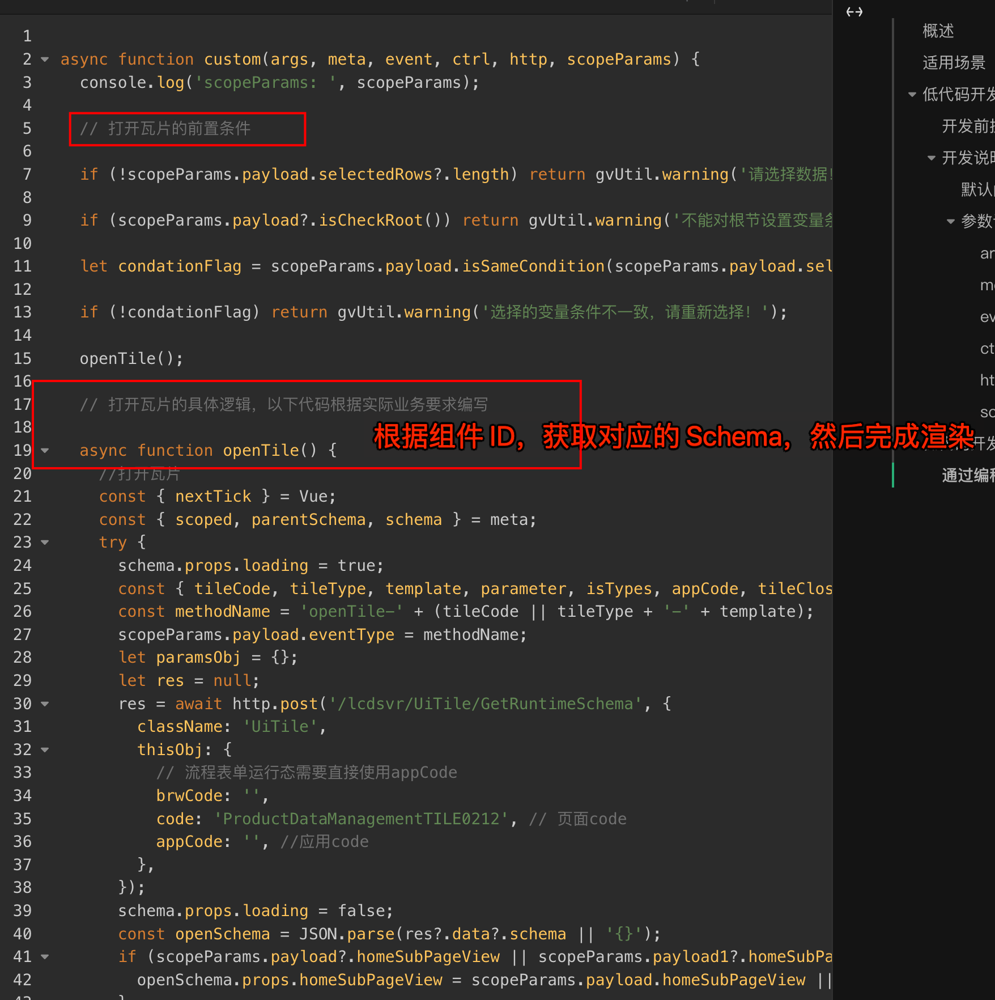
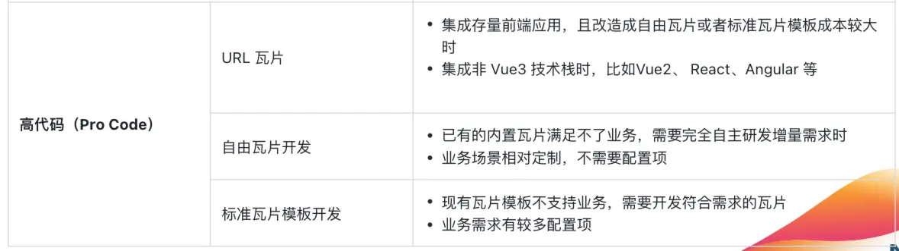
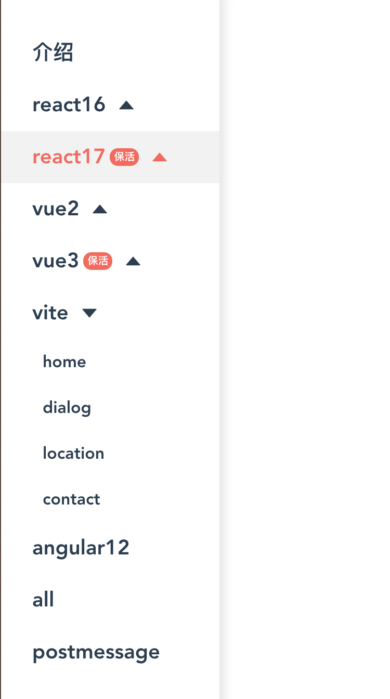

# 分享：基于低代码平台的三种开发模式

`#lowcode` 

> 源于个人某次培训分享

## 目录
<!-- toc -->
 ## 1. 底层：数据模型 

- 首先需要考虑数据源从哪里
	- **openAPI 3** 协议的 API
	- 各种数据库建模能力
		- 关系型
		- 非关系型
	- 查询协议
		- graphQL
		- JSON 查询语句
	- 直接导入的数据
		- 比如 Excel、CSV 等等

目前公司内有两种
- 智能体厂
	- 智能体厂：是在==高度集成了业务知识模型==的基础上
		- 将对象建模、对象继承以及在线开发部署统一整合的三位一体开发工具。
	- 业务模型 → 建模 → API 
- API 管理管理平台：
	- 基于 OPENAPI3 协议的 API 管理平台
	- 提供 API 等编排能力

## 2. 中台层：相关系统支持

- 管理后台：
	- 为企业提供身份认证和用户数据管理服务的工具
	- 另外也提供 SSO 等
- 工作流与流程引擎
- UI 中台：组件库等
- 存储服务：
	- 自建 `minio`
- 部分华为云提供的能力

> 基建有待提高啊，稳定性更是啊

## 3. 零代码（No Code）配置

>  `type = app →  menu  → page →  component`

这些 **积木**包括图标、组件、瓦片、页面等，如下图菜单

更详细的流程：

1. **新建应用：**
2. **编辑应用：**
3. **查询应用详情：**
4. **设计应用：**
5. **发布应用：**
6. **修订与删除：**
7. **另存为应用：**
8. **应用列表查看：**

### 3.1. 应用管理

- 增删改查

### 3.2. 菜单管理

- 菜单组
- 子菜单
- 拖拽
- 菜单关联页面
- 删除等

### 3.3. 页面管理

- 内置常用布局
	- 
- 设置区域
	- 初始化数据，选择 **编码 → 智能体模型** 
		- 即**源类** 
	- 选择对应的接口，通过 API 的方式
		- 主要应对的是存量 API
	- 所以是支持两种数据源类型
- 页面内部事件流可视化配置
	- 

### 3.4. 组件管理

- 通过后台管理-组件管理配置
- 各类容器组件
	- 组合组件
- 自由组件
	- 纯高代码开发的方式
- URL 组件：
	- 无界`微前端`嵌入进来的
	- 通过`高代码`的交互方式

### 3.5. 组件配置

- 每个组件都有自己的**渲染态和设计态**
- 每个组件都有标准的 API 调用方式，都有详细的 Typescript 定义
	- 入参 payload 
	- 对外暴露的方法
		- 
- 这样才能在设计态方便配置

### 3.6. 按钮配置&行为配置

- 事件类型
	- 打开瓦片：打开特定页面、特定组件，资源池中制定的任何组件
		- 打开方式：弹框、抽屉、全屏、二级页面等
	- 调用行为：
		- ==源类提供的能力==，比如 delete 数据等
	- 调用事件流
		- 所有组件抛出来的事件
		- 另外需要配置入参
	- 调用自定义事件
		- 直接写代码
			- 
- 打开特定菜单、特定页面等
	- 也可以打开其他应用的特定菜单

### 3.7. 图标管理

### 3.8. 系统设置

- 效果图
- 名称
- **低代码首页配置**
	- 拖动不同的组件配置首页
	- 首页看板卡片
- 主题管理
	- 所有的 CSS 变量管理
	- 内置**主题编辑器**

### 3.9. 完整配置流程

- 新建应用
- 设计
	- 菜单
	- 新建页面
	- 设计页面
	- 组件配置
- 保存&预览
- 发布应用
- ==管理后台配置权限==

## 4. 低代码（Low Code）开发

- 每个组件的各类生命周期钩子函数（JS Function String）
	- 和 **Vue3 的生命周期对应**
- 前面说的自定义事件流
	- 示例：通过编码的方式打开组件
		- 

### 4.1. 使用场景列举

- 使用低代码开发开发，主要还是为了配合零代码完成一些相对定制的需求，所以它主要起`联结或者胶水`的作用
- 适合`低代码开发`的场景是`大部分业务场景通过配置出来，仅按钮交互逻辑不能配置出来`，比如
	- 点击按钮需要根据当前组件或瓦片的状态（比如是否选中）做逻辑判断，然后才能`打开瓦片`或`调用行为`等
	- 点击按钮需要额外调用接口做业务逻辑判断，然后才能`打开瓦片`或`调用行为`等

## 5. 高代码（Pro Code）开发

### 5.1. 基础低代码组件

- 在 `@lowcode/renderer` 包中内置的基础的低代码组件，由低代码团队提供
- 其他团队需要可以联系添加权限

### 5.2. 低代码组件（标准 Low Code 组件）

- 使用场景
	- 官方不满足业务场景，且有大量的可配置场景
	- **开发完后可做回收**
- 技术实现：
	- 使用 Module Federation 的方式来加载远程代码，以`插件`的方式注册到低代码平台的组件池中
- 开发流程：
	- 下载脚手架 → 安装依赖配置 → 开启本地调试模式 
		- 配置： `组件编码:本地端口`
	- 低代码平台新建组件类型 → 拖动调试 
	- 开发完成，构建发布等
- 优点：
	- 收敛技术栈，前端完全可自主开发满足业务场景的瓦片，且瓦片配置项自主可控
	- 不需要前端镜像部署，降低开发部署复杂度
- 缺点
	- 不支持**非 Vue3 + vite 技术栈外**的前端技术栈
	- 有一定的学习门槛

### 5.3. 自由组件

- 使用场景
	- 适合不想开发配置项的客户
	- 不使用低代码拖拽布局，需整页或者整个模块替换，无配置选项
- 性能原因考虑
	- 因为使用了`模块联邦`的加载方式，性能肯定优于 **URL 组件**
- 优点：
	- 收敛技术栈，且前端完全可自主开发
	- ==不需要前端镜像部署，降低开发部署复杂度==
- 缺点
	- 暂不支持**非 Vue3 + vite 技术栈 & React + vite** 以外的前端技术栈
		- 因为模块联邦的原因
	- 不支持配置，
- 标准开发规范有约束，请参考具体文档，严格约束起来
- 代码协作问题
	- 尽量按团队项目组来拆解，一个团队一个仓库
		- **仓库本身也是多包模式，其实可以不用多包**

> 因为 Vite 在 dev开发模式下基于 esbuild 构建，所以我们单独提供了对 dev 模式的支持，可以在远程模块部署的情况下，利用 Vite 的高性能开发服务器。
> - 只有Host端支持dev模式，Remote端需要使用`vite build`生成RemoteEntry.js包。这是由于Vite Dev模式是**Bundleless**不打包的，您可以使用`vite build --watch`到达类似热更新的效果。

>  注意：`React` 项目中不建议 `Vite`和 `Webpack` 混合使用，实际没怎么有生产环境上使用 React 来开发，不保证可用性

### 5.4. URL 组件

- 使用场景
	- 适用于直接嵌入类似`iframe`形式的老旧项目，且存量项目不需要做大量维护时。
	- 或者客户要求兼容其他技术栈，比如 React 、Angular 项目
- 技术能力
	- 提供脚手架，内置标准开发规范，包括各类技术能力和==打包构建流程==等等
	- 使用无界微前端的方式进入
		- 通讯方式参考微前端
	- 提供不同类型组件的交互方式，可以根据需要觉得是否使用
		- 比如两个 URL 组件如何通讯？
		- URL 组件和自由组件如何通讯？
- 增量项目也提供标准脚手架
	- **因为需要集成了低代码通用的公共方法和参数**
	- 内置接入 SSO，路由拦截器、vuex、axios 拦截器、国际化，并且做了嵌入主应用的样式兼容工具方法合并等
		- vue 2 + 组件库 + ..
		- vue 3 + 组件库 + vite 
		- React + Antd + ...
		- 更多参考无界微前端
			- 
- 优点：
	- 跨前端技术栈，并且集成接入成本低
- 缺点：
	- 代码管控不强，性能有一定影响，可能会出现一些兼容性问题

## 6. 公共 API 参考

为了提供低代码的开放能力，需要对外提供所有的 API，包括

- lowcode 包公共方法
	- `@lowcode/shared` ：提供通用的 `utils` 方法，公共的 `hooks` 方法等
	- `@lowcode/constants` ：提供公用的常量
	- `@lowcode/core` ：提供通用的设计态和渲染态组件
	- `@lowcode/renderer`： 
		- 每个组件**详细的 Typescript 定义类型**

## 7. 开发体验相关

- 调试能力
- 如何定位问题
- 有不少开发调试入口，方便能够快速查看特定组件的渲染效果等

## 8. 更多参考

- [3. 调研：低代码渲染设计思路](/post/p33cAR0d.html)
- [10. Webpack 5 的 Module Federation](/post/8wPPOjJ7.html)
- [11. vite 中如何使用 Module Federation](/post/ncDOI8rh.html)