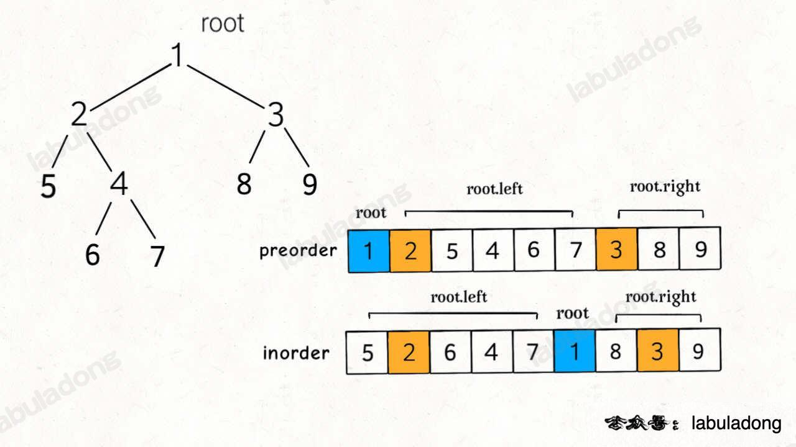

# 从前序与中序遍历序列构造二叉树

`#二叉树的构造`  

> [105. 从前序与中序遍历序列构造二叉树](https://leetcode.cn/problems/construct-binary-tree-from-preorder-and-inorder-traversal/)


## 目录
<!-- toc -->
 ## 1. 总结 

- 画图，务必画图

```javascript hl:16
var buildTree = function (preorder, inorder) {
    let n = preorder.length;
    let mapping = {};
    inorder.forEach((item, index) => {
        mapping[item] = index;
    });
    return build(0, n - 1, 0, n - 1);
    function build(preStart, preEnd, inStart, inEnd) {
        if (inStart > inEnd) return null;
        let rootVal = preorder[preStart];
        let rootIndex = mapping[rootVal];
        let leftSize = rootIndex - inStart;
        let root = new TreeNode(rootVal);
        root.left = build(
            preStart + 1, 
            preStart + leftSize,
            inStart,
            rootIndex - 1,
        );
        root.right = build(
            preStart + leftSize + 1,
            preEnd,
            rootIndex + 1,
            inEnd,
        );
        return root;
    }
};
```

## 2. 题目


## 3. 分析



> 关键是要画出这样的图片，脑子自己想大概率是写不出来的

### 3.1. 思路

1. 找出`根节点`
	- 前序遍历的第一个元素
2. 递归构建左右子树
	- 这里注意要找出**递归函数的参数**
	- 这些参数可以从两个数组里计算出来，如下图：


```javascript
var buildTree = function (preorder, inorder) {
    let n = preorder.length;
    let mapping = {};
    inorder.forEach((item, index) => {
        mapping[item] = index;
    });
    return build(0, n - 1, 0, n - 1);
    function build(preStart, preEnd, inStart, inEnd) {
        if (inStart > inEnd) return null;
        // if(preStart > preEnd) return null;
        let rootVal = preorder[preStart];
        let rootIndex = mapping[rootVal];
        let leftSize = rootIndex - inStart;
        let root = new TreeNode(rootVal);
        // 修改2：preStart + 1 作为左子树的起始位置
        root.left = build(
            preStart + 1, // 左子树前序起始
            preStart + leftSize, // 左子树前序结束
            inStart, // 左子树中序起始
            rootIndex - 1, // 左子树中序结束
        );
        // 修改3：preStart + leftSize + 1 作为右子树的起始位置
        root.right = build(
            preStart + leftSize + 1, // 右子树前序起始
            preEnd, // 右子树前序结束
            rootIndex + 1, // 右子树中序起始
            inEnd, // 右子树中序结束
        );
        return root;
    }
};

```


