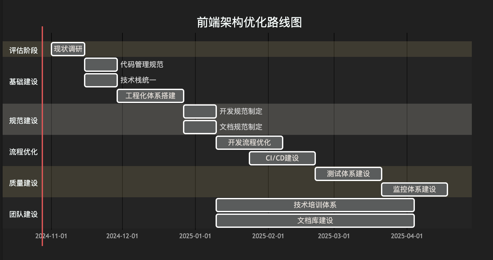

# 前端工程及架构（篇一）

`#前端面试`


## 目录
<!-- toc -->
 ## 1. 分层 

核心思想：关注点分离，每层只负责特定功能。

没有什么问题是分层解决不了，如果解决不了, 就再加一层

- 比如`网络协议`，越来高层面向`人类`，底层面向`机器`
- 又比如现在所谓的 `后台、中台、前台`
- 又比如，语言抽象的层次越高，一般运行效率可能会有所衰减，看`js/ts/c/汇编/机器码`等等等
- 又比如，mvc 分层

回到，前端：
- `V-dom`，就是之前DOM上的一个分层 ，开发方式由之前`jQuery方式` 变成了`view=f(state)` 方式

## 2. 管道和过滤器

核心思想：数据流处理，每个处理单元独立且可组合。

- 比如在`Angular`里就有`管道`概念
- gulp的 `pipe`
- 甚至`koa`里的洋葱模型也有`管道`的影子（中间件）
- `vue`的`filter` 如 `{{ message | capitalize }}`
- Node 中 `流` 的概念

## 3. 事件驱动/发布-订阅

核心思想：通过事件的发布和订阅实现**松耦合**。

## 4. 复制：fork 风格

Fork 风格是一种通过复制共享状态或资源来实现并行处理的架构模式。在前端中，主要用于：

- 状态管理
- 并行计算
- 数据隔离
- 多线程处理

## 5. Web Worker 中的 Fork

### 5.1. 比如`nodeJS`的`Cluster模块` 

- Node.js 中的集群模块，允许创建`多个工作进程`来处理并发请求
- 'Cluster' 这个词在计算机科学中通常指的是一组计算机或服务器，它们一起工作以提供更高的性能和可用性

```javascript hl:5,16
const cluster = require('cluster');
const http = require('http');
const numCPUs = require('os').cpus().length;

if (cluster.isMaster) {
  console.log(`Master ${process.pid} is running`);

  // Fork workers.
  for (let i = 0; i < numCPUs; i++) {
    cluster.fork();
  }

  cluster.on('exit', (worker, code, signal) => {
    console.log(`worker ${worker.process.pid} died`);
  });
} else {
  // Workers 可以共享任意的TCP连接 
  // 比如 共享HTTP服务器 
  http.createServer((req, res) => {
    res.writeHead(200);
    res.end('hello world\n');
  }).listen(8000);

  console.log(`Worker ${process.pid} started`);
}
```

## 6. 组件化架构（Component-Based Architecture）

核心思想：将UI和功能封装成独立、可重用的组件。

## 7. 模块化架构（Modular Architecture）

核心思想：将应用分解为独立的功能模块。

## 8. 微服务前端架构（Micro-Frontend Architecture）

核心思想：将前端应用分解为多个独立的微前端应用。

## 9. 单向数据流

## 10. 微内核架构，又称为”插件架构”

### 10.1. 基本概念

微内核架构主要包含两部分：
1. 核心系统（Microkernel）：提供最基本的功能
2. 插件模块（Plugins）：提供扩展功能

- 微内核结构的难点在于建立一套粒度合适的**插件协议**、以及对插件之间进行适当的`隔离和解耦`。从而才能保证良好的扩展性、灵活性和可迁移性。
- 前端领域比较典型的例子是`Webpack、Babel、PostCSS`以及`ESLint`, 这些应用需要应对复杂的定制需求，而且这些需求时刻在变，只有微内核架构才能保证灵活和可扩展性。
- 比如`jQuery`插件：简单说就是`jQuery.prototype.extend`用于扩展插件

```javascript
// jQuery 入口函数
var jQuery = function (selector, context) {
    return new jQuery.init(selector, context);
};

// jQuery 核心原型定义，也是 jQuery plugin 的扩展接口
jQuery.fn = jQuery.prototype = {
    hello: function hello() {
        console.log("hello world");
    },
    //... 其他定义
};

// 另一种扩展 plugin 的便捷方法，接收一个对象
jQuery.extend = jQuery.fn.extend = function(targetObj) {
    // 克隆 targetObj
}

// jQuery 真正的实例化构造函数
var init = function (selector, context) {
    // init dom elements
}
init.prototype = jQuery.fn;
jQuery.init = init;
$ = jQuery;
```

我来详细介绍前端微内核架构（Plugin Architecture）的设计思路和实现方式：

### 10.2. 基础微内核系统实现

```javascript
// 基础微内核系统实现
class Microkernel {
    constructor() {
        this.plugins = new Map();
        this.hooks = new Map();
    }

    // 注册插件
    registerPlugin(name, plugin) {
        this.plugins.set(name, plugin);
        // 初始化插件
        plugin.apply(this);
    }

    // 注册钩子
    addHook(name, callback) {
        if (!this.hooks.has(name)) {
            this.hooks.set(name, []);
        }
        this.hooks.get(name).push(callback);
    }

    // 触发钩子
    async applyHooks(name, ...args) {
        const hooks = this.hooks.get(name) || [];
        for (const hook of hooks) {
            await hook(...args);
        }
    }
}
```

### 10.3. 插件系统实现

```javascript
// 插件基类
class Plugin {
    constructor(options = {}) {
        this.options = options;
    }

    apply(kernel) {
        // 由具体插件实现
    }
}

// 生命周期管理
class LifecyclePlugin extends Plugin {
    apply(kernel) {
        kernel.addHook('beforeInit', () => {
            console.log('Before initialization');
        });

        kernel.addHook('afterInit', () => {
            console.log('After initialization');
        });
    }
}

// 路由插件示例
class RouterPlugin extends Plugin {
    apply(kernel) {
        kernel.addHook('route', (path) => {
            // 路由处理逻辑
            console.log(`Routing to ${path}`);
        });
    }
}
```

### 10.4. Webpack 风格的插件系统

```javascript
// Webpack风格的编译器实现
class Compiler {
    constructor() {
        this.hooks = {
            start: new SyncHook(),
            compile: new AsyncSeriesHook(['compilation']),
            done: new SyncHook(['stats'])
        };
        this.plugins = [];
    }

    // 应用插件
    use(plugin) {
        this.plugins.push(plugin);
        plugin.apply(this);
    }

    // 运行编译
    async run() {
        this.hooks.start.call();
        
        const compilation = {};
        await this.hooks.compile.promise(compilation);
        
        this.hooks.done.call({ success: true });
    }
}

// Webpack风格的插件示例
class MyPlugin {
    apply(compiler) {
        compiler.hooks.start.tap('MyPlugin', () => {
            console.log('开始编译');
        });

        compiler.hooks.compile.tapAsync('MyPlugin', async (compilation, callback) => {
            console.log('编译中...');
            await someAsyncTask();
            callback();
        });

        compiler.hooks.done.tap('MyPlugin', (stats) => {
            console.log('编译完成');
        });
    }
}
```

### 10.5. UmiJS 风格的插件系统

```javascript
// UmiJS风格的服务实现
class UmiService {
    constructor() {
        this.plugins = [];
        this.hooks = {};
    }

    // 注册插件
    registerPlugin(plugin) {
        this.plugins.push(plugin);
    }

    // 应用插件
    applyPlugins() {
        this.plugins.forEach(plugin => {
            plugin.apply({
                api: this.getAPI(),
                service: this
            });
        });
    }

    // 获取API接口
    getAPI() {
        return {
            // 修改配置
            modifyConfig: (fn) => {
                this.hooks.modifyConfig = fn;
            },
            // 添加路由
            addRoutes: (routes) => {
                this.hooks.addRoutes = routes;
            }
        };
    }
}

// UmiJS插件示例
class UmiPlugin {
    apply({ api }) {
        // 修改配置
        api.modifyConfig((config) => {
            return {
                ...config,
                // 添加配置
            };
        });

        // 添加路由
        api.addRoutes([
            {
                path: '/custom',
                component: './CustomPage'
            }
        ]);
    }
}
```

### 10.6. 事件驱动的插件系统

```javascript
// 事件驱动的插件系统
class EventDrivenCore {
    constructor() {
        this.events = new Map();
        this.plugins = new Set();
    }

    // 注册插件
    use(plugin) {
        this.plugins.add(plugin);
        plugin.setup(this);
    }

    // 注册事件监听
    on(event, handler) {
        if (!this.events.has(event)) {
            this.events.set(event, new Set());
        }
        this.events.get(event).add(handler);
    }

    // 触发事件
    emit(event, ...args) {
        const handlers = this.events.get(event);
        if (handlers) {
            handlers.forEach(handler => handler(...args));
        }
    }
}

// 事件驱动插件示例
class LoggerPlugin {
    setup(core) {
        core.on('request', (req) => {
            console.log(`${new Date()}: ${req.url}`);
        });
    }
}
```

### 10.7. 可配置的插件系统

```javascript
// 配置系统
class Config {
    constructor(initialConfig = {}) {
        this.config = initialConfig;
    }

    get(key) {
        return this.config[key];
    }

    set(key, value) {
        this.config[key] = value;
    }

    merge(newConfig) {
        this.config = {
            ...this.config,
            ...newConfig
        };
    }
}

// 可配置的插件核心
class ConfigurableCore {
    constructor() {
        this.config = new Config();
        this.plugins = new Map();
    }

    // 使用插件
    use(plugin, options = {}) {
        const instance = new plugin(options);
        this.plugins.set(plugin.name, instance);
        instance.apply(this);
    }

    // 获取配置
    getConfig() {
        return this.config;
    }
}

// 可配置插件示例
class ThemePlugin {
    constructor(options) {
        this.options = options;
    }

    apply(core) {
        core.getConfig().merge({
            theme: this.options.theme || 'light'
        });
    }
}
```

### 10.8. 插件通信机制

```javascript
// 插件间通信系统
class PluginMessenger {
    constructor() {
        this.channels = new Map();
    }

    // 创建通信通道
    createChannel(name) {
        if (!this.channels.has(name)) {
            this.channels.set(name, new Set());
        }
        return {
            send: (message) => this.broadcast(name, message),
            subscribe: (handler) => this.subscribe(name, handler)
        };
    }

    // 广播消息
    broadcast(channel, message) {
        const subscribers = this.channels.get(channel);
        if (subscribers) {
            subscribers.forEach(handler => handler(message));
        }
    }

    // 订阅消息
    subscribe(channel, handler) {
        if (!this.channels.has(channel)) {
            this.channels.set(channel, new Set());
        }
        this.channels.get(channel).add(handler);
    }
}

// 使用通信的插件示例
class DataPlugin {
    apply(core) {
        const channel = core.messenger.createChannel('data');
        
        // 发送数据
        channel.send({ type: 'update', data: {} });
    }
}

class UIPlugin {
    apply(core) {
        const channel = core.messenger.createChannel('data');
        
        // 接收数据
        channel.subscribe((message) => {
            if (message.type === 'update') {
                this.updateUI(message.data);
            }
        });
    }
}
```

微内核架构的优点：
1. 高度可扩展
2. 模块化程度高
3. 核心功能精简
4. 插件按需加载
5. 维护成本低

使用场景：
1. 构建工具（Webpack、Rollup）
2. 框架（UmiJS、VuePress）
3. 编辑器插件系统
4. 应用扩展系统

需要注意的问题：
1. 插件依赖管理
2. 插件加载顺序
3. 插件冲突处理
4. 性能开销控制
5. 版本兼容性

## 11. 实践建议

1. 不要过度设计
2. 保持架构的灵活性
3. 考虑未来的扩展性
4. 关注代码的可测试性
5. 注重开发效率和维护成本

## 12. 好的架构应该是

- 清晰易懂
- 易于维护
- 便于扩展
- 性能优良
- 适合团队

## 13. 聊聊前端框架

### 13.1. React、vue、Angular

React 是一个框架吗？ Vue 是一个框架吗？ 严格来说不是，它们只是一个 `视图解决方案` ，这里面算得上是框架的估计只有 `Angular`。

- 后端围绕 `数据存取`展开。
- 前端围绕 `“UI”展开`。

### 13.2. 为何企业级框架

面向企业生产，目的是提高企业的生产力、高效、成熟、约束与限制比较多、性能、稳定、可用、健壮、标准化、生产验证、用例保证、整个链路环节。

- umi : 可插拔的企业级 react 应用框架
- egg ，企业级框架
- ngular，也可以说
- 而其他 React、Koa、没有企业级？

### 13.3. 定义

- 前端框架体系的建立离不开`前端工程化成熟`和`最佳实践的沉淀`。
- 你可以认为框架就是一个整合的方案，提供一个前端`最佳的组合配置`。
- 开发者需要做的就是在这个框架约束下填充自己业务代码。

所以一个成熟的框架我认为有 Umi、Angular 、 Next.js、Vue-CLI、Create-React-App 等

## 14. 前端解决方案的演变

- 第一阶段：工程化、基础设施
	- 应用类型：ssr/csr/h5/pc/中后台/C端
	- 开发
	- 构建
	- 部署发布
	- QA
	- 研发体验
- 第二阶段：方案整合，方案沉淀。
	- 视图框架、项目组织、状态、路由、权限、视图层组件
- 第三阶段：组件资产体系沉淀
- 第四阶段：打通上下游
	- `上游，对于 UI。上面说的组件体系`，其实是建立在稳定的、一致的、统一的 UI 设计语言之上的。否则一切都是空谈。所以我们要求 UI 设计团队要有良好的设计规范、能和前端组件体系绑定并良性迭代。
	- `下游，对于 后端`。可以促进建立更标准的接口范式、封装通用的服务(有利于业务组件复用)、更深的有业务中台、BFF…

## 15. 小公司如何解决研发管理混乱，基础设施薄弱的问题

作为一个前端架构师，我会从以下几个方面系统性地解决这些问题：

### 15.1. **评估现状（1-2周）**

   - 调研现有项目代码质量和架构
   - 了解团队成员技术栈和能力水平
   - 梳理现有开发流程和痛点
   - 收集团队成员的反馈和建议

### 15.2. **建立基础设施（1-2个月）**

#### 15.2.1. A. 代码管理规范
   
   - 统一Git分支管理策略（如Git Flow）
   - 制定代码提交规范（约定式提交）
   - 建立Code Review机制

#### 15.2.2. B. 技术栈统一
   - 确定主要技术栈（如React/Vue）
   - 统一构建工具（如Vite）
   - 规范包管理器使用（如pnpm）

#### 15.2.3. C. 工程化体系

   - 搭建脚手架CLI工具
   - 引入Monorepo管理（如Turborepo）
   - 建立组件库
   - 配置ESLint + Prettier + StyleLint
   - 引入TypeScript

### 15.3. **规范制定（2-3周）**

#### 15.3.1. A. 开发规范

- JavaScript/TypeScript编码规范
- CSS/SCSS命名规范（如BEM）
- 组件开发规范
- 目录结构规范

#### 15.3.2. B. 文档规范

- 技术文档模板
- API文档规范
- 组件文档规范
- README模板

### 15.4. **流程优化（持续进行）**

#### 15.4.1. A. 开发流程

- 引入敏捷开发
- 建立任务管理系统（如Jira）
- 规范开发-测试-部署流程

#### 15.4.2. B. CI/CD

- 配置自动化测试
- 配置自动化部署
- 配置自动化版本发布

### 15.5. **质量保障（持续进行）**

- 单元测试覆盖率要求
- E2E测试
- 性能监控
- 错误监控（如Sentry）
- 代码质量检测（如SonarQube）
### 15.6. **团队建设（持续进行）**

- 定期技术分享
- 代码评审文化
- 建立技术文档库
- 新人培训体系

### 15.7. 实施建议

#### 15.7.1. **循序渐进**

   - 不要一次性推动所有变革
   - 按优先级分步实施
   - 给团队适应的时间

#### 15.7.2. **获取支持**

   - 争取管理层支持
   - 与团队充分沟通
   - 展示改进带来的价值

#### 15.7.3. **持续优化**

   - 定期收集反馈
   - 及时调整方案
   - 保持技术栈更新

#### 15.7.4. **注重实效**

   - 避免过度设计
   - 关注投入产出比
   - 优先解决主要矛盾

### 15.8. 具体实施路线图



这个计划预计需要3-4个月完成主要的基础建设，后续是持续优化的过程。在实施过程中要注意：

1. 每个阶段都要设定明确的目标和可衡量的指标
2. 保持与团队的沟通，适时调整计划
3. 做好文档化工作，便于后续维护和新人融入
4. 注重实际效果，避免过度理想化

通过以上措施，可以逐步改善研发管理混乱的状况，建立起稳固的前端基础设施，提高团队的开发效率和代码质量。这是一个循序渐进的过程，需要团队所有成员的配合和耐心。

### 15.9. 其他

- ‘文档’，重要性不言而喻。`有事先看文档，再问别人`
- 如果没有`约束机制`，规范永远只是规范。
- 避免黑盒，`解决单点故障` 的唯一办法是**让更多的成员交叉参与不同的项目**，代码`review`方式等多种图解熟悉项目代码，规范就体现的很重要

## 16. 探讨 Serverless（无服务器计算）

### 16.1. **Serverless 的本质**

- 无需关心服务器基础设施，由云服务商维护
- 按实际使用计费（Pay as you go）：只在需要时运行，按实际使用量计费
- 自动弹性伸缩：根据负载自动扩展或收缩资源
- 事件驱动架构，通常基于事件触发执行
- FaaS（Function as a Service）+ BaaS（Backend as a Service）的结合
	- **FaaS (Function as a Service)**
		- AWS Lambda
		- Azure Functions
		- Google Cloud Functions
		- 阿里云函数计算
	-  BaaS（Backend as a Service）
		- 数据库服务（如 DynamoDB）
		- 身份认证服务
		- 消息队列服务
		- 对象存储服务

### 16.2. 2024年 Serverless 发展趋势

1. **AI 集成增强**
    - Serverless 平台正在深度集成 AI 能力
    - 支持 AI 模型的部署和推理
    - 提供 AI 相关的预构建函数 
2. **流处理和实时数据**
    - Serverless 流处理架构日益普及
    - 支持实时数据分析和处理
    - 事件驱动架构的深度整合
3. **混合云部署**
    - 支持跨云平台部署
    - 统一的管理和监控能力
    - 更灵活的资源调度
### 16.3. **主要优势**

- 降低运维成本
	- 无需管理服务器
	- 自动扩缩容
	- 降低人力成本
- 成本优化
	- 按使用量付费
	- 无需为`闲置资源`付费
	- 更精确的资源利用
- 开发效率
	- 专注`业务逻辑`
	- 快速部署
	- 天然的`微服务架构`

### 16.4. **常见应用场景**

   - 事件触发处理
     - 文件上传处理
     - 消息队列处理
     - WebHook 处理
   - Web 应用
     - API 接口服务
     - SSR（服务端渲染）
     - 静态网站托管
     - 用户认证授权
   - 定时任务
     - 数据同步
     - 定时备份
     - 报表生成
   - 实时数据处理
     - 日志处理
     - IoT 数据处理
	     - 设备控制命令下发
     - 流数据分析

### 16.5. **技术架构**


1. 功能解耦，保持函数单一职责
    - 合理设计触发器
    - 注意冷启动优化
    - 使用合适的状态管理策略
2. **开发流程**
    - 采用基础设施即代码（IaC）
    - 完善的测试策略
    - 本地开发环境模拟
    - 监控和日志体系建设
3. **性能优化**
    - 合理设置内存和超时时间
    - 利用缓存减少冷启动
    - 代码包大小优化
    - 并发控制
### 16.6. **主流服务商对比**
   
| 服务商 | 产品名称 | 特点 |
|-------|---------|------|
| AWS | Lambda | 最成熟、生态最完善 |
| 阿里云 | 函数计算 | 国内完善、集成度高 |
| 腾讯云 | 云函数 | 性价比高、本土化服务 |
| Google | Cloud Functions | 全球化、AI集成好 |
| Azure | Functions | 企业级服务完善 |

### 16.7. **开发最佳实践**

   - 函数设计
     - 单一职责原则
     - 控制执行时间
     - 合理设计触发器
     - 合理使用内存
     - 注意`冷启动`优化
   - 状态管理
     - 使用**外部存储**保存状态
     - 缓存合理利用
     - 注意数据一致性
   - 监控告警
     - 完善的日志记录
     - 性能监控
     - 错误追踪
     - 成本监控

### 16.8. **常见挑战和解决方案**

   - 本地开发和调试困难
   - 冷启动问题
     - 预热机制
     - 代码优化
     - 合理设置内存
   - 本地开发调试
     - 使用模拟器
     - 本地测试框架
     - 完善的开发工具
   - 供应商锁定风险：vendor lock-in 
     - 抽象化设计
     - 标准化接口
     - 多云架构设计
 - **安全性**
    - 权限最小化原则
    - 安全策略配置
    - 数据加密传输
    - 审计日志完善

### 16.9. 前端开发者的 Serverless 实践

1. **前端集成**
    - API 网关集成
    - 静态资源部署
    - 身份认证
    - 前端`构建流程`
2. **开发工具**
    - Serverless Framework
    - AWS SAM
    - Vercel
    - Netlify
3. **最佳实践**
    - 合理的 API 设计
    - 错误处理机制
    - 性能监控
    - 安全防护
### 16.10. **前端视角的 Serverless**

   - SSR 应用
     ```typescript
     // Next.js Serverless 函数示例
     export async function getServerSideProps(context) {
       const data = await fetchData();
       return {
         props: { data }
       };
     }
     ```
   - API 路由
     ```typescript
     // Vercel Serverless 函数示例
     export default async function handler(req, res) {
       if (req.method === 'POST') {
         const data = await processData(req.body);
         res.status(200).json(data);
       }
     }
     ```

### 16.11. **未来趋势**

   - Edge Computing 集成
   - `WebAssembly` 支持
   - 更好的开发体验
   - 混合云架构
   - 更低的延迟
   - 更强的计算能力

### 16.12. **成本优化建议**

- 合理设置超时时间
- 优化函数执行效率
- 使用缓存减少调用
- 选择合适的内存配置
- 监控成本支出

### 16.13. **工具生态**


Serverless 是云计算发展的重要方向，它能够帮助团队更专注于业务开发，提高开发效率，优化资源使用。但在采用 Serverless 架构时，需要充分考虑其特点和限制，选择合适的场景，做好相应的优化和规划。随着技术的发展和生态的完善，Serverless 的应用场景会越来越广泛，值得团队持续关注和实践。

## 17. 说说上面说的`冷启动`

让我详细解释一下冷启动（Cold Start）的概念：

> 即`首次启动` 

### 17.1. 什么是冷启动？

冷启动是指 Serverless 函数在完全"冷"的状态下（即`首次运行或长时间未运行`）被调用时，需要经历的初始化过程。这个过程包括：

1. **环境准备**
   - 分配计算资源
   - 启动容器/运行时
   - 加载运行环境（如 Node.js、Python 等）
2. **代码加载**
   - 下载函数代码
   - 解压代码包
   - 加载依赖项
3. **运行时初始化**
   - 执行全局代码
   - 建立数据库连接
   - 初始化外部服务客户端

### 17.2. 冷启动 vs 热启动

1. **冷启动（Cold Start）**
   - 函数完全从零开始初始化
   - 耗时较长（可能几百毫秒到几秒）
   - 发生在首次调用或长时间未使用时
2. **热启动（Warm Start）**
   - 复用已有的运行环境
   - 响应速度快（通常在毫秒级）
   - 发生在短时间内的重复调用

例如：


### 17.3. 冷启动的影响因素

1. **运行时环境**
   - Node.js 通常启动较快
   - Java、.NET 等启动较慢
   - Python、Go 介于中间
2. **代码包大小**
   - 代码包越大，加载时间越长
   - 依赖项数量影响初始化时间
3. **初始化逻辑**
   - 数据库连接建立
   - 外部服务客户端初始化
   - 配置加载

### 17.4. 优化冷启动的策略

#### 17.4.1. **代码层面优化**

   ```javascript hl:10
   // 不推荐
   function handler(event) {
     // 每次调用都初始化
     const db = new Database();
     const client = new APIClient();
     // ...
   }

   // 推荐
   // 全局初始化，可以在热启动时复用
   const db = new Database();
   const client = new APIClient();
   
   function handler(event) {
     // 直接使用已初始化的连接
     // ...
   }
   ```

#### 17.4.2. **保持函数活跃**

   - 使用`定时器定期调用函数`
   - `预热关键路径`的函数
   - 使用`预留并`发（如 AWS Lambda 提供的功能）

#### 17.4.3. **优化依赖**

   - 精简依赖包
   - 使用轻量级库
   - 按需加载模块

#### 17.4.4. **架构优化**

   - 使用`连接池`
   - `缓存`频繁访问的数据
   - 合理设置`超时时间`

### 17.5. 实际影响

假设一个典型的 Web API 场景：

1. **正常情况（热启动）**
   - API 响应时间：~100ms
   - 用户体验良好
2. **冷启动情况**
   - Node.js：额外 300-500ms
   - Python：额外 500-800ms
   - Java：额外 1-3秒
   - 用户可能感知到明显延迟

### 17.6. 监控和分析

1. **关键指标**
   - 初始化时间
   - 执行时间
   - 冷启动频率
2. **监控工具**
   - 云平台自带的监控
   - 自定义日志分析
   - APM 工具

### 17.7. 使用建议

1. **评估业务需求**
   - 对响应时间敏感的接口需要特别关注
   - 考虑是否需要预留并发
   - 权衡成本和性能
2. **测试策略**
   - 模拟冷启动场景
   - 压力测试
   - 性能基准测试
3. **应对方案**
   - 关键接口使用预留并发
   - 非关键接口接受适度冷启动
   - 实施监控和告警机制

冷启动是 Serverless 架构中的一个重要考虑因素，通过合理的设计和优化，可以将其影响降到最低。对于大多数应用来说，冷启动的影响是可以接受的，特别是考虑到 Serverless 带来的其他优势（如成本效益、自动扩展等）。

## 18. Vendor Lock-in（供应商锁定）

Vendor Lock-in（供应商锁定）是云计算领域一个重要的概念，让我详细解释一下：

### 18.1. 什么是 Vendor Lock-in？

Vendor Lock-in 指的是用户（通常是企业）过度依赖特定供应商的产品或服务，导致无法轻易切换到其他供应商的情况。在 Serverless 环境中，这种情况尤为明显。

### 18.2. Serverless 中的 Vendor Lock-in 表现

#### 18.2.1. **专有服务依赖**

```javascript
// AWS 专有服务示例
const AWS = require('aws-sdk');
const dynamodb = new AWS.DynamoDB();
const s3 = new AWS.S3();

// 深度绑定 AWS 服务
async function handleUser(userId) {
    await dynamodb.putItem({
        TableName: 'Users',
        Item: { /* ... */ }
    }).promise();
    
    await s3.putObject({
        Bucket: 'user-files',
        Key: `${userId}/profile`,
        Body: data
    }).promise();
}
```

#### 18.2.2. **专有 API 格式**

```javascript
// AWS Lambda 特定的处理器格式
exports.handler = async (event, context) => {
    // AWS 特定的事件格式
    const records = event.Records;
    // ...
}

// Azure Functions 的格式则完全不同
module.exports = async function (context, myTimer) {
    // Azure 特定的上下文和触发器
    // ...
};
```

### 18.3. Vendor Lock-in 的影响

1. **迁移困难**
   - 代码重写
   - 架构调整
   - 数据迁移
   - 运维流程变更
2. **成本影响**
   - 难以议价
   - 被动接受价格调整
   - 迁移成本高
3. **技术限制**
   - 受限于供应商的技术栈
   - 创新受限
   - 性能优化受限

### 18.4. 如何降低 Vendor Lock-in 风险

#### 18.4.1. **抽象层设计**

````JavaScript

  // 定义通用接口
  interface StorageService {
    save(key: string, data: any): Promise<void>;
    get(key: string): Promise<any>;
    delete(key: string): Promise<void>;
  }

  // AWS S3 实现
  class S3StorageService implements StorageService {
    private s3: AWS.S3;

    constructor() {
      this.s3 = new AWS.S3();
    }

    async save(key: string, data: any): Promise<void> {
      await this.s3.putObject({
        Bucket: 'my-bucket',
        Key: key,
        Body: data
      }).promise();
    }
    // ... 其他方法实现
  }

  // Azure Blob 实现
  class AzureStorageService implements StorageService {
    private blobService: azure.BlobService;

    constructor() {
      this.blobService = azure.createBlobService();
    }

    async save(key: string, data: any): Promise<void> {
      await this.blobService.createBlockBlobFromText(
        'my-container',
        key,
        data
      );
    }
    // ... 其他方法实现
  }

  // 业务代码使用接口，不直接依赖具体实现
  class UserService {
    constructor(private storage: StorageService) {}

    async saveUserProfile(userId: string, data: any) {
      await this.storage.save(`users/${userId}`, data);
    }
  }
````

#### 18.4.2. **使用标准化技术**

- 使用开源技术栈
- 采用容器化部署
- 遵循云原生标准

#### 18.4.3. **多云策略**

   ```yaml
   # 使用 Serverless Framework 支持多云部署
   service: my-service

   provider:
     name: ${opt:provider, 'aws'} # 可切换云供应商
     runtime: nodejs14.x

   functions:
     hello:
       handler: handler.hello
       events:
         - http:
             path: hello
             method: get
   ```

#### 18.4.4. **数据管理策略**

- 使用标准数据格式
- 定期数据备份
- 保持数据可移植性

### 18.5. 实际案例分析

#### 18.5.1. **高耦合场景**

```javascript
// 强依赖 AWS 服务的代码
const AWS = require('aws-sdk');
const lambda = new AWS.Lambda();
const dynamodb = new AWS.DynamoDB();
const sns = new AWS.SNS();

async function processOrder(order) {
    // 直接使用 AWS 服务
    await dynamodb.putItem({ /* ... */ });
    await lambda.invoke({ /* ... */ });
    await sns.publish({ /* ... */ });
}
```

#### 18.5.2. **低耦合方案**

```javascript
// 使用适配器模式
class MessageQueue {
    constructor(provider) {
        this.provider = provider;
    }

    async publish(message) {
        return this.provider.sendMessage(message);
    }
}

class AWSProvider {
    async sendMessage(message) {
        const sns = new AWS.SNS();
        return sns.publish({
            TopicArn: process.env.TOPIC_ARN,
            Message: message
        }).promise();
    }
}

class GCPProvider {
    async sendMessage(message) {
        const pubsub = new PubSub();
        const topic = pubsub.topic(process.env.TOPIC_NAME);
        return topic.publish(Buffer.from(message));
    }
}
```

### 18.6. 预防措施清单

1. **架构设计**
   - 模块化设计
   - 使用依赖注入
   - 接口抽象
   - 配置外部化
2. **技术选择**
   - 优先使用标准协议
   - 选择开源解决方案
   - 避免使用专有API
3. **开发实践**
   - 编写可移植代码
   - 使用配置管理
   - 保持文档完善
4. **运维策略**
   - 自动化部署脚本
   - 统一的监控方案
   - 备份和恢复计划

### 18.7. 评估和决策

在选择云服务时，需要考虑：

1. **业务需求**
   - 功能需求
   - 性能要求
   - 成本预算
2. **风险评估**
   - 供应商稳定性
   - 迁移难度
   - 长期成本
3. **平衡取舍**
   - 开发效率
   - 维护成本
   - 技术灵活性

Vendor Lock-in 是一个需要在项目早期就开始考虑的问题。通过合理的架构设计和技术选择，可以在享受云服务便利性的同时，降低对特定供应商的依赖程度。关键是要在实际业务需求和技术自由度之间找到合适的平衡点。