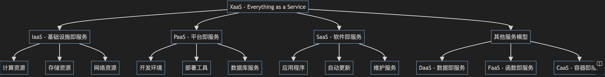
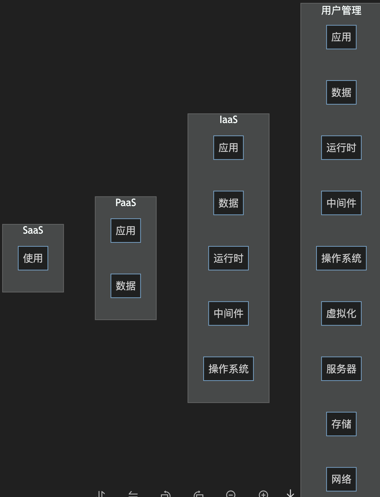

# 各类 Xaas 介绍

`#saas` `#xaas`


## 目录
<!-- toc -->
 ## 1. 总结 

- SaaS (软件即服务)
	- 直接提供应用程序
	- 基于订阅的定价模型
- FaaS (函数即服务)
	- 比如 SeverLess 
		- 按实际使用付费
		- 事件驱动的计算服务
- PaaS (Platform as a Service) 
	-  ==专注于应用开发==，需要快速部署
	- 标准化的开发环境
		- ==提供开发和部署环境==
		- 包含==运行时、中间件、数据库==
	- 按使用量收费
- aPaaS (Application Platform as a Service)
	- 专注于==应用程序开发和部署==
	- 会提供 可视化开发工具，即==底码==
	- 技术要求：业务人员也可上手
- `UIPaaS`是 UI 平台即服务
	- 产品界面设计与研发一站式解决方案

## 2. Xaas



- PaaS 是（Platform as a Service）的缩写
- SaaS
- FaaS
- 基础设施即服务(IaaS) 
	- `IaaS`是指基础设施服务，Infrastructure-as-a-service
- `BaaS`是指后端即服务，Backend as a Service
- `DaaS`是指数据即服务，Data as a Service。
- `NaaS`是指网络即服务，**Network** as a Service
- **XPaaS** 是指各种类型的 PaaS，它和 XaaS 一样，类的术语，这里是 PaaS 类的统称
	- PaaS
		- 更**广泛的平台服务**概念
		- 提供完整的应用开发和部署环境
		- 包含基础设施管理、开发工具、数据库等
	- aPaaS: a 是应用的意思
		- PaaS 的一个子集
		- 专注于**应用程序开发和部署**
		- 更强调==快速应用开发能力==
- `UIPaaS`是 UI 平台即服务
	- User Interface PaaS
		- 产品界面设计与研发一站式解决方案

### 2.1. **IaaS (基础设施即服务)**

特点：
- 提供虚拟化的计算资源
- 包含服务器、存储、网络
- 最大的灵活性和控制权
- 用户负责操作系统以上层级

典型产品：
- Amazon EC2
- Microsoft Azure Virtual Machines
- Google Compute Engine
- Alibaba Cloud ECS

### 2.2. **PaaS (平台即服务)**

特点：
- ==提供开发和部署环境==
- 包含==运行时、中间件、数据库==
- 简化应用开发流程
- 专注于应用程序开发
典型产品：
- Heroku
- Google App Engine
- Microsoft Azure App Service
- SAP Cloud Platform

### 2.3. **SaaS (软件即服务)**

特点：
- 直接提供应用程序
- **基于订阅的定价模型**
- 自动更新和维护
- 最少的技术要求

典型产品：
- Salesforce
- `Microsoft 365`
- Google Workspace
- Dropbox

> 国内 SaaS 环境不怎么样

### 2.4. **FaaS (函数即服务)**

>  SeverLess 

特点：
- 事件驱动的计算服务
- 按实际使用付费
- 自动扩展
- 无服务器架构

典型产品：
- `AWS Lambda`
- Azure Functions
- Google Cloud Functions
- Alibaba Function Compute

### 2.5. **DaaS (数据即服务)**

特点：
- 提供数据访问和管理
- 数据集成和转换
- 数据分析能力
- 数据安全和隐私保护

典型产品：
- Snowflake
- `MongoDB` Atlas
- **Oracle Data Cloud**
- IBM Data as a Service

### 2.6. **CaaS (容器即服务)**

特点：
- 容器编排和管理
- 自动化部署
- 可扩展性
- 微服务支持

典型产品：
- Amazon ECS
- **Google Kubernetes Engine**
- Azure Container Instances
- Docker Enterprise

### 2.7. **STaaS (存储即服务)**

> storage ：存储服务

特点：
- **云存储解决方案**
- 可扩展存储容量
- 数据备份和恢复
- 多种存储类型

典型产品：
- Amazon S3
- Google Cloud Storage
- Azure Blob Storage
- Dropbox Business

### 2.8. **SECaaS (安全即服务)**

特点：
- 云安全服务
- 身份认证
- 威胁检测
- 合规管理

典型产品：
- `Cloudflare`
- Okta
- Zscaler
- Symantec Cloud Security

### 2.9. **各服务模型对比**



### 2.10. **选择建议**

IaaS：
- 需要最大控制权
- 有专业 IT 团队
- 特殊的硬件需求

PaaS：
- ==专注于应用开发==
- **需要快速部署**
- **标准化的开发环境**

SaaS：
- 标准化的业务需求
- 快速启动
- 预算有限

### 2.11. **价格模型比较**

IaaS：
- 按资源使用量计费
- 灵活的定价选项
- 预留实例折扣
PaaS：
- 按**服务使用量**计费
- 开发者许可证
- 资源消耗
SaaS：
- 用户订阅制
- 按功能分级
- 企业套餐

### 2.12. **安全考虑**

共同点：
- 数据加密
- 访问控制
- 合规性
不同点：
- IaaS：需要自行管理**大部分安全**措施
- PaaS：平台提供**基本安全**功能
- SaaS：供应商管理**大部分安全**特性

### 2.13. **未来趋势**

- 混合云部署增加
- 边缘计算集成
- AI/ML 服务普及
- 多云战略
- 安全性强化
- 自动化程度提高

### 2.14. **集成注意事项**

- API 兼容性
- 数据同步
- 身份认证
- 性能监控
- 灾难恢复
- 供应商锁定

## 3. PaaS (Platform as a Service) 和 aPaaS (Application Platform as a Service) 的区别

### 3.1. **定义与范围**

PaaS:
- 更广泛的平台服务概念
- 提供完整的应用开发和部署环境
- 包含基础设施管理、开发工具、数据库等
aPaaS:
- PaaS 的一个子集
- 专注于==应用程序开发和部署==
- 更强调快速应用开发(RAD)能力

### 3.2. **主要特点对比**

PaaS:
- 提供**完整的开发环境**
- 包含**操作系统、数据库、中间件**等
- 需要**更多的技术专业知识**
- 适合**传统开发模式**
aPaaS:
- 提供**可视化开发工具**
- 低代码/无代码开发能力
- 更注重业务用户需求
- 快速应用构建和部署

### 3.3. **使用场景**

PaaS:

```
- 传统应用开发
- 定制化系统开发
- 需要完全控制的项目
- 复杂系统集成
```

aPaaS:

```
- 快速原型开发
- 部门级应用
- 简单的业务应用
- 流程自动化
```

### 3.4. **核心功能对比**

PaaS:
```
- 完整的开发环境
- 数据库管理
- 服务器管理
- 网络管理
- 安全管理
```

aPaaS:

```
- 可视化开发工具
- 预建组件库
- 模板系统
- 工作流引擎
- 集成能力
```

### 3.5. **技术要求**

PaaS:

```
- 需要专业开发人员
- 需要深入的技术知识
- 编程语言精通
- DevOps 技能
```

aPaaS:

```
- 适合业务分析师
- 较低的技术门槛
- 图形化界面操作
- 简化的部署流程
```

### 3.6. **优势比较**

PaaS 优势:

```
- 更高的灵活性
- 完全的控制权
- 广泛的技术选择
- 适合复杂应用
```

aPaaS 优势:

```
- 更快的开发速度
- 更低的开发成本
- 更容易维护
- 业务用户参与度高
```

### 3.7. **典型产品示例**

PaaS 产品:

```
- Heroku
- Google App Engine
- Microsoft Azure
- AWS Elastic Beanstalk
```

aPaaS 产品:

```
- OutSystems
- Mendix
- Salesforce Lightning Platform
- Microsoft Power Apps
```

### 3.8. **开发模式对比**

PaaS:

````mermaid
  graph LR
    A[需求分析] --> B[系统设计]
    B --> C[代码开发]
    C --> D[测试]
    D --> E[部署]
    E --> F[维护]
````

aPaaS:

```mermaid
  graph LR
    A[需求分析] --> B[可视化配置]
    B --> C[组件拖放]
    C --> D[业务规则配置]
    D --> E[测试]
    E --> F[一键部署]
````

### 3.9. **集成能力**

PaaS:
- 需要手动编写集成代码
- 支持多种集成协议
- 更灵活的集成选项
- 可深度定制

aPaaS:
- 预建集成连接器
- 可视化集成配置
- **API 管理工具**
- 简化的数据映射

### 3.10. **成本结构**

PaaS:

```
- 基础设施成本
- 开发人员成本
- 维护成本
- 培训成本
```

aPaaS:

```
- 平台许可成本
- 较低的人力成本
- 较低的维护成本
- 较低的培训成本
```

### 3.11. **选择建议**

选择 PaaS 当：

```
- 需要高度定制化
- 有专业开发团队
- 需要完全控制
- 复杂的技术要求
```

选择 aPaaS 当：

```
- 需要快速交付
- 预算有限
- 技术资源有限
- 简单到中等复杂度的应用
```

### 3.12. **发展趋势**

当前趋势：
- aPaaS 市场快速增长
- 低代码/无代码平台普及
- AI 辅助开发集成
- 混合开发模式兴起

## 4. 国内情况

| 服务类型      | 阿里云      | 腾讯云          | 华为云           | 百度智能云      | 金山云   |
| --------- | -------- | ------------ | ------------- | ---------- | ----- |
| **IaaS**  |          |              |               |            |       |
| 计算服务      | ECS      | CVM          | ECS           | BCC        | KEC   |
| 对象存储      | OSS      | COS          | OBS           | BOS        | KS3   |
| CDN       | CDN      | CDN          | CDN           | CDN        | KCD   |
| **PaaS**  |          |              |               |            |       |
| 容器服务      | ACK      | TKE          | CCE           | CCE        | KCE   |
| 数据库       | RDS      | TencentDB    | GaussDB       | RDS        | KMR   |
| 消息队列      | RocketMQ | CMQ          | DMS           | BMQ        | KMQ   |
| **SaaS**  |          |              |               |            |       |
| 协同办公      | 钉钉       | 企业微信         | WeLink        | 智能云办公      | 金山办公  |
| 视频服务      | 视频点播     | 云点播          | 视频点播          | 智能视频服务     | 金山云视频 |
| **FaaS**  |          |              |               |            |       |
| 函数计算      | FC       | SCF          | FunctionGraph | CFC        | KFF   |
| **AI/ML** |          |              |               |            |       |
| 机器学习      | PAI      | TI           | ModelArts     | BML        | -     |
| 智能语音      | NLS      | ASR          | Speech        | SPEECH     | -     |
| **安全服务**  |          |              |               |            |       |
| DDoS防护    | DDoS高防   | DDoS防护       | Anti-DDoS     | DDoS高防     | KSD   |
| WAF       | WAF      | WAF          | WAF           | WAF        | KWAF  |
| **特色服务**  |          |              |               |            |       |
| 物联网       | IoT平台    | IoT Explorer | IoT平台         | IoT Core   | -     |
| 区块链       | 区块链服务    | TBaaS        | 区块链服务         | XuperChain | -     |
| 边缘计算      | ENS      | ECM          | IEF           | BCE        | -     |

主要特点：
- 阿里云：产品最全面，生态最完善
- 腾讯云：游戏、视频、社交领域优势明显
- 华为云：**硬件结合优势**，企业服务经验丰富
- 百度智能云：AI能力突出
- 金山云：办公协同和视频服务见长

市场定位：
- 阿里云：全场景覆盖，尤其电商领域
- 腾讯云：游戏、视频、社交场景
- 华为云：政企市场、工业互联网
- 百度智能云：AI 应用、智能化转型
- 金山云：视频服务、办公协同