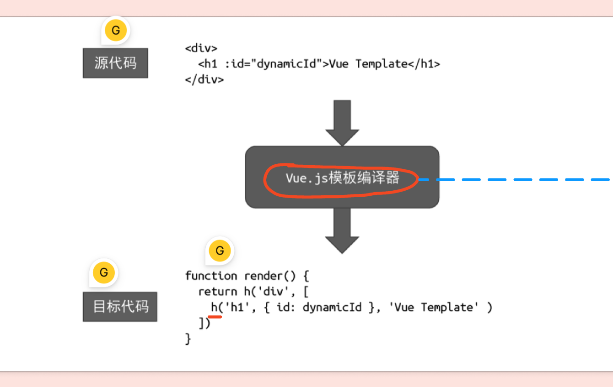
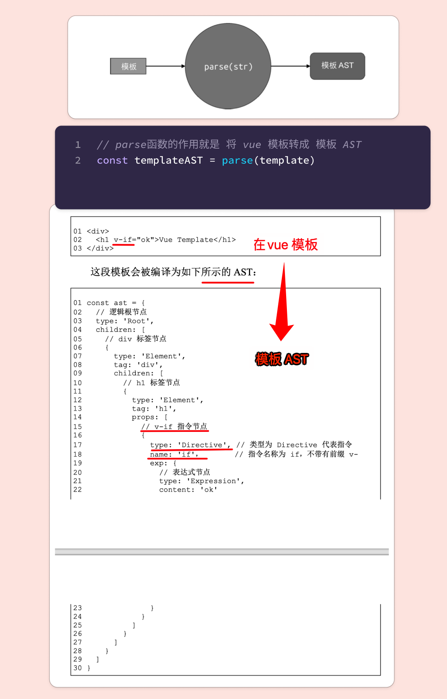
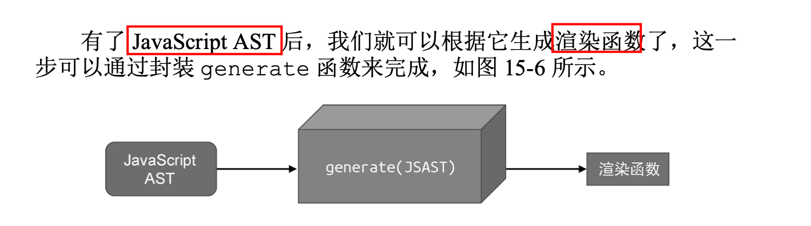
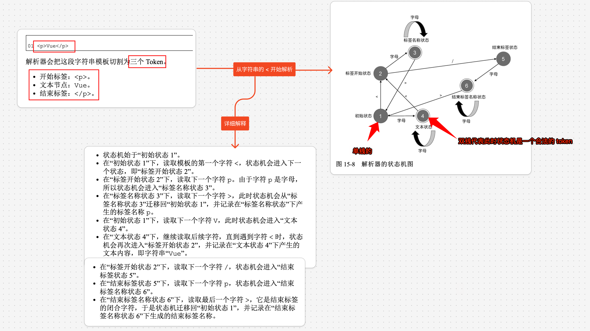
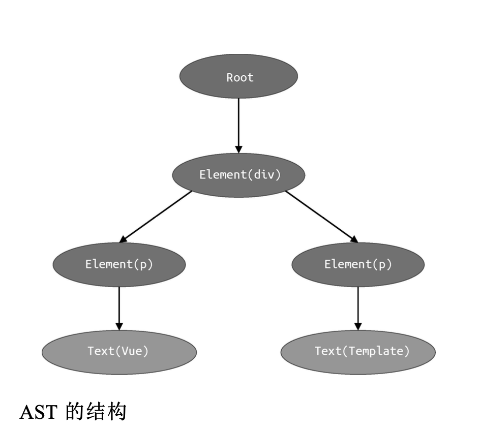
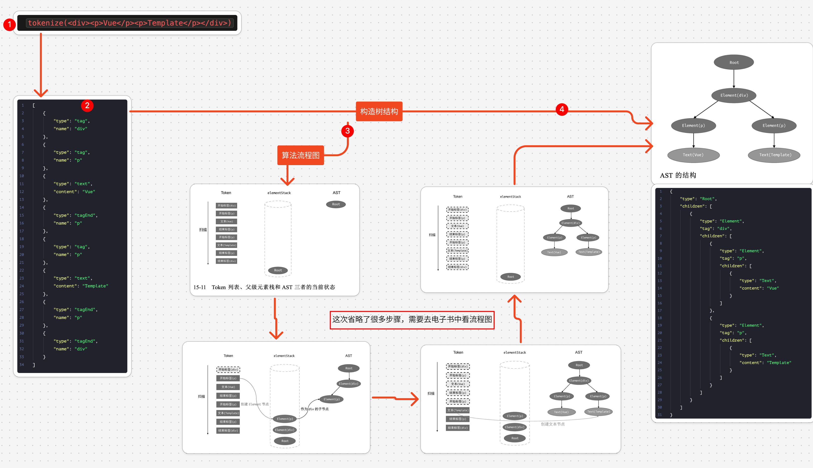
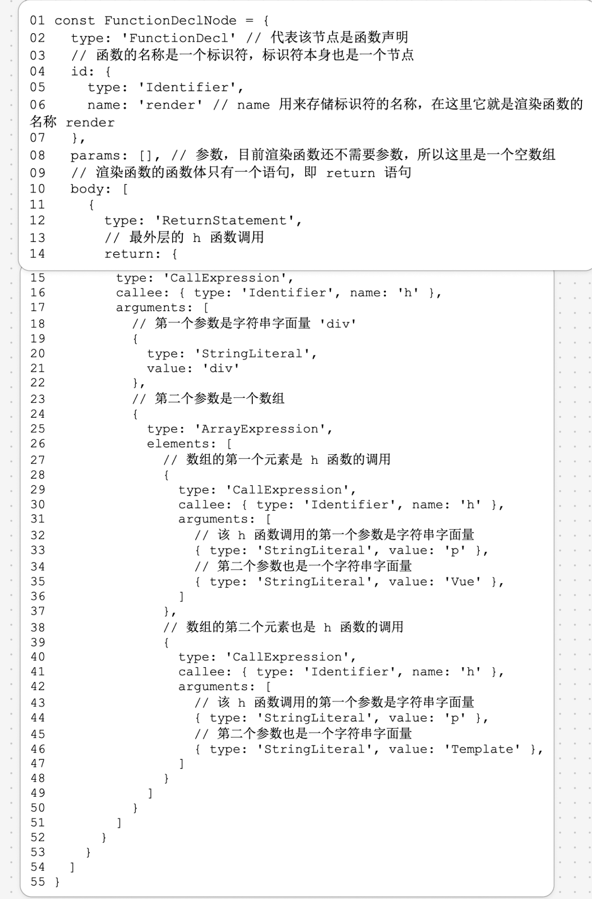

# Vue3 的编译器原理（篇一：基本实现）

`#vue` 


## 目录
<!-- toc -->
 ## 总结 

- `tokenize(HTML字符串)` →  `list` →  模板 AST ==树形结构== →   
	- → 遍历多叉树（插件化架构），主要两个时机，进入和离开，两个时机分别再 `return` 一个函数
		- 然后就可以生成 `JS AST` 
			- 然后再根据 `JS AST` 生成 ==渲染函数==

## 1. 教科书式的编译模型

**编译器其实只是一段程序**，它用来将“一种语言 A” `翻译成` “另外一种语言 B”。

完整的编译流程如下：


## 2. Vue.js 模板编译器

教科书式的编译模型如上，但 `Vue 模板`有所不同，

`Vue.js 的模板`和 `JSX` 都属于 `领域特定语言(DSL)` ，`Vue.js 模板编译器`的作用如下图



- 源码是：`.vue 模板`
- 目标代码：`可执行的渲染函数`

### 2.1. Vue.js 模板编译为渲染函数的完整流程


> 其中，`str` 即为 `.vue文件`的内容

分开说，分为一下几部分：
 - 用来将模板字符串解析为`模板 AST` 的解析器(parser);
 - 用来将`模板 AST` 转换为 JavaScript AST 的转换器 (transformer);
 - 用来根据 `JavaScript AST` 生成渲染函数代码的生成器 (generator)

### 2.2. 模板 生成 模板AST



### 2.3. 模板AST 生成 `JS AST 转换器`

因为 Vue.js 模板编译器的`最终目标`是生成渲染函数，而渲染函数`本质`上是 JavaScript 代码，所以我们需要将`模板 AST` 转换成`用于描述渲染函数的 JavaScript AST`

所以`JS AST 转换器` 是 `用于描述渲染函数的 JavaScript AST`

### 2.4. jsAST 生成最终可执行的 **渲染函数**



## 3. Vue3 的模板编译器实现原理

### 3.1. 如何用`有限状态自动机`构造一个`词法分析器`



按照`有限状态自动机的状态迁移过程`，我们可以很容易地编写对应的代码实现。

因此，**有限状态自动机**可以帮助我们完成**对模板的 (tokenized)**，最终我们将得到一系列 Token 列表，具体代码如下：

```javascript
const template = `<p>Vue</p>`;

// 定义状态机的状态
const State = {
  initial: 1,
  tagOpen: 2,
  tagName: 3,
  text: 4,
  tagEnd: 5,
  tagEndName: 6,
};

// 判断是否是字母
function isAlpha(char) {
  return (char >= "a" && char <= "z") || (char >= "A" && char <= "Z");
}

function tokenize(str) {
  // 初始化状态
  let currentState = State.initial;
  // 用于存放字符
  const chars = [];
  // 用于存放token
  const tokens = [];
  while (str) {
    const char = str[0];
    switch (currentState) {
      case State.initial:
        if (char === "<") {
          currentState = State.tagOpen;
          str = str.slice(1);
        } else if (isAlpha(char)) {
          currentState = State.text;
          chars.push(char);
          str = str.slice(1);
        }
        break;
      case State.tagOpen:
        if (isAlpha(char)) {
          currentState = State.tagName;
          chars.push(char);
          str = str.slice(1);
        } else if (char === "/") {
          currentState = State.tagEnd;
          str = str.slice(1);
        }
        break;
      case State.tagName:
        if (isAlpha(char)) {
          chars.push(char);
          str = str.slice(1);
        } else if (char === ">") {
          currentState = State.initial;
          tokens.push({
            type: "tag",
            name: chars.join(""),
          });
          chars.length = 0;
          str = str.slice(1);
        }
        break;
      case State.text:
        if (isAlpha(char)) {
          chars.push(char);
          str = str.slice(1);
        } else if (char === "<") {
          currentState = State.tagOpen;
          tokens.push({
            type: "text",
            content: chars.join(""),
          });
          chars.length = 0;
          str = str.slice(1);
        }
        break;
      case State.tagEnd:
        if (isAlpha(char)) {
          currentState = State.tagEndName;
          chars.push(char);
          str = str.slice(1);
        }
        break;
      case State.tagEndName:
        if (isAlpha(char)) {
          chars.push(char);
          str = str.slice(1);
        } else if (char === ">") {
          currentState = State.initial;
          tokens.push({
            type: "tagEnd",
            name: chars.join(""),
          });
          chars.length = 0;
          str = str.slice(1);
        }
        break;
    }
  }

  // 返回token
  return tokens;
}

console.log(tokenize(template));

[
    {
        "type": "tag",
        "name": "p"
    },
    {
        "type": "text",
        "content": "Vue"
    },
    {
        "type": "tagEnd",
        "name": "p"
    }
]
```

> [!tip]
> 也可以使用正则表达式，因为`编写正则表达式`本质就是`编写有限自动机`；但通过这种方式来实现更能说明什么是有限状态自动机

词法分析的过程就是状态机在不同状态之间迁移的过程。在此过程中，状态机会产生一个个 Token，形成一个 **Token 列表**

#### 3.1.1. 示例

 `tokenize(<div><p>Vue</p><p>Template</p></div>)` , 可得到如下结果：

```json
[
    {
        "type": "tag",
        "name": "div"
    },
    {
        "type": "tag",
        "name": "p"
    },
    {
        "type": "text",
        "content": "Vue"
    },
    {
        "type": "tagEnd",
        "name": "p"
    },
    {
        "type": "tag",
        "name": "p"
    },
    {
        "type": "text",
        "content": "Template"
    },
    {
        "type": "tagEnd",
        "name": "p"
    },
    {
        "type": "tagEnd",
        "name": "div"
    }
]
```

>  词法分析的过程就是，状态机在不同状态之间的迁移过程

### 3.2. 将上面构造出的 token 列表构造成`树形模板AST`

实现一个 `parse` 函数，即将 `上面的token 列表`输出为如下`树结构`，如下结构就是 `AST` 或者说是 `Vnode`



```json
{
    "type": "Root",
    "children": [
        {
            "type": "Element",
            "tag": "div",
            "children": [
                {
                    "type": "Element",
                    "tag": "p",
                    "children": [
                        {
                            "type": "Text",
                            "content": "Vue"
                        }
                    ]
                },
                {
                    "type": "Element",
                    "tag": "p",
                    "children": [
                        {
                            "type": "Text",
                            "content": "Template"
                        }
                    ]
                }
            ]
        }
    ]
}
```

扫描 Token 列表并维护一个开始标签`栈`。
- 每当扫描到一个`开始标签`节点，就将其压入栈顶。
- 栈顶的节点始终作为下一个扫描的节点的父节点。
- 这样，当所有 Token 扫描完毕后，即可构建出一棵树型 AST

具体代码如下：

```javascript
const template = `<div><p>Vue</p><p>Template</p></div>`;
function parse(str) {
  const tokens = tokenize(str);
  // 自定义一个根节点
  const root = {
    type: "Root",
    children: [],
  };
  // 标签栈
  const elementStack = [root];

  while (tokens.length) {
    const parent = elementStack[elementStack.length - 1];
    const t = tokens[0];
    switch (t.type) {
      case "tag":
        // 元素节点定义
        const elementNode = {
          type: "Element",
          tag: t.name,
          children: [],
        };
        parent.children.push(elementNode);
        elementStack.push(elementNode);
        break;
      // 文本节点定义
      case "text":
        const textNode = {
          type: "Text",
          content: t.content,
        };
        parent.children.push(textNode);
        break;
      // 记得 pop   
      case "tagEnd":
        elementStack.pop();
        break;
    }
    tokens.shift();
  }

  return root;
}


```

> 这只是简单实现，没有考虑闭合的场景，可执行的代码见 `codes` 目录

### 3.3. 完成流程示意图



>  这就是**一个特定的打平一维数组结构构造成树形结构的算法问题**

### 3.4. 如何有效的遍历 AST 树？（插件化架构）

 
深度遍历如下 `AST 树`时

```json
{
    "type": "Root",
    "children": [
        {
            "type": "Element",
            "tag": "div",
            "children": [
                {
                    "type": "Element",
                    "tag": "p",
                    "children": [
                        {
                            "type": "Text",
                            "content": "Vue"
                        }
                    ]
                },
                {
                    "type": "Element",
                    "tag": "p",
                    "children": [
                        {
                            "type": "Text",
                            "content": "Template"
                        }
                    ]
                }
            ]
        }
    ]
}

```
 
 为了解耦节点的访问和操作，我们设计了`插件化架构`， 将节点的操作封装到`独立的转换函数`中。
 - 这些转换函数可以通过 `context.nodeTransforms` 来注册。
 - 这里的 `context` 称为转换`上下文`，上下文对象中通常会维护程序的当前状态，例如
	 - 当前访问的节点
	 - 当前访问的节点的父节点
	 - 当前访问的节点的位置索引等信息。 
	 - 有了上下文对象及其包含的重要信息后，
	 - 这样我们即可轻松地实现节点的替换、删除等能力。
 - 遍历的`进入`和`离开`阶段
	 - 有时，当前访问节点的转换工作依赖于其子节点的转换结果
		 - 所以为了`优先`完成子节点的转换，我们将整个转换过程分为“`进入`阶段”与“`退出`阶段”
	 - 每个转换函数都分两个阶段执行，这样就可以实现`更加细粒度`的转换控制

#### 3.4.1. 具体代码，很好理解，就是一个`多叉树的遍历`而已

关键点：
- 前序位置，传入节点转换函数
	- 因为转换函数有个 `return` 值，所以这里也会收集相应的 return 的函数
- 后续位置
	- 需要执行上面收集到的 `return` 函数

```javascript hl:22

// 转换函数 1 ：用于转换元素节点
function transformElement(node) {
  console.log(`进入：${JSON.stringify(node)}`);
  return () => {
    console.log(`退出：${JSON.stringify(node)}`);
  };
}
// 转换函数 2 ：用于转换文本节点
function transformText(node, context) {
  console.log(`进入：${JSON.stringify(node)}`);

  return () => {
    console.log(`退出：${JSON.stringify(node)}`);
  };
}

// 遍历节点，深度优先遍历，传入节点和上下文对象
function traverseNode(ast, context) {
  context.currentNode = ast;

  // 遍历节点转换函数的 return 值, 用于退出时执行
  const exitFns = [];
  const transforms = context.nodeTransforms;
  // ***************************** 前序位置  ***************************** 
  // 遍历节点转换函数, 传入当前节点和上下文对象,然后执行
  for (let i = 0; i < transforms.length; i++) {
    // 执行节点转换函数，返回一个函数，用于退出时执行
    const onExit = transforms[i](context.currentNode, context);
    if (onExit) {
      exitFns.push(onExit);
    }
    if (!context.currentNode) return;
  }

  // 遍历子节点,递归遍历
  const children = context.currentNode.children;
  if (children) {
    for (let i = 0; i < children.length; i++) {
      // 记得更新上下文信息
      context.parent = context.currentNode;
      context.childIndex = i;
      traverseNode(children[i], context);
    }
  }

  // ***************************** 后续位置  ***************************** 
  // 退出时执行,走到这儿说明当前节点已经遍历完了
  // 后序位置，这是离开节点时执行的函数
  let i = exitFns.length;
  while (i--) {
    exitFns[i]();
  }
}

function transform(ast) {
  // 遍历的上下文对象，包括
  // 当前节点父节点
  // 当前节点在父节点中的索引
  // 替换节点
  // 删除节点
  // 节点转换函数
  const context = {
    currentNode: null,
    parent: null,
    replaceNode(node) {
      context.currentNode = node;
      context.parent.children[context.childIndex] = node;
    },
    removeNode() {
      if (context.parent) {
        context.parent.children.splice(context.childIndex, 1);
        context.currentNode = null;
      }
    },
    // 插件的方式扩展功能
    // 节点转换函数, 用于对节点进行转换
    // 传入节点和上下文对象，
    //  返回一个函数，用于在退出节点时执行
    nodeTransforms: [transformElement, transformText],
  };
  // 调用 traverseNode 完成转换，传入 AST 和上下文对象
  // 这是一个DFS递归遍历的过程
  traverseNode(ast, context);
  // 打印 AST 信息
  console.log(dump(ast));
}

const ast = parse(`<div><p>Vue</p><p>Template</p></div>`);
transform(ast);
```

#### 3.4.2. 附： Context(上下文) 的其他应用

- 在编写 React 应用时
	- 我们可以使用 `React.createContext` 函数创建一个上下文对象，该上下文对象允许我们将数据通过组件 树一层层地传递下去。无论组件树的层级有多深，只要组件在这 棵组件树的层级内，那么它就能够访问上下文对象中的数据。
- 在编写 Vue.js 应用时
	- 我们也可以通过 `provide/inject` 等能力，向一整棵组件树提供数据。这些数据可以称为上下文。 
- 在编写 Koa 应用时
	- 中间件函数接收的 context 参数也是一种上 下文对象，所有中间件都可以通过 context 来访问相同的数据

### 3.5. 将模板 AST 转换为用于描述渲染函数的 JavaScript AST

#### 3.5.1. JavaScript AST 介绍

JavaScript AST 用于描述 `JavaScript` 代码。只有把**模板 AST 转换为 JavaScript AST 后**，我们才能据此生成最终的渲染函数代码。

```javascript
function render() {
  return h("div", [h("p", "Vue"), h("p", "Template")]);
}
```

 上面代码对应的 `js AST` 是什么呢？如下



下面是具体结构

```javascript
// 最终生成的 jsAST
const jsAST = {
  // 代表该节点是一个函数声明
  type: "FunctionDecl",
  // 标识符，本身也是一个节点，所以有自己的type和name属性
  id: {
    type: "Identifier",
    name: "render", // 函数名
  },
  params: [], // 参数列表
  body: [
    // 函数体
    {
      type: "ReturnStatement", // 代表该节点是一个返回语句
      return: {
        type: "CallExpression",
        callee: {
          type: "Identifier",
          name: "h",
        },
        arguments: [
          {
            type: "StringLiteral",
            value: "div",
          },
          {
            type: "ArrayExpression",
            elements: [
              {
                type: "CallExpression",
                callee: {
                  type: "Identifier",
                  name: "h",
                },
                arguments: [
                  {
                    type: "StringLiteral",
                    value: "p",
                  },
                  {
                    type: "StringLiteral",
                    value: "Vue",
                  },
                ],
              },
              {
                type: "CallExpression",
                callee: {
                  type: "Identifier",
                  name: "h",
                },
                arguments: [
                  {
                    type: "StringLiteral",
                    value: "p",
                  },
                  {
                    type: "StringLiteral",
                    value: "Template",
                  },
                ],
              },
            ],
          },
        ],
      },
    },
  ],
};
```

#### 3.5.2. 将模板 AST 转换 JS AST

先写几个生成 JS AST 的辅助函数

```javascript
// 创建 AST 节点: StringLiteral 节点
function createStringLiteral(value) {
  return {
    type: "StringLiteral",
    value,
  };
}
// 创建 AST 节点: Identifier  节点
function createIdentifier(name) {
  return {
    type: "Identifier",
    name,
  };
}
// 创建 AST 节点: ArrayExpression  节点
function createArrayExpression(elements) {
  return {
    type: "ArrayExpression",
    elements,
  };
}
// 创建 AST 节点: CallExpression 节点
function createCallExpression(callee, arguments) {
  return {
    type: "CallExpression",
    callee: createIdentifier(callee),
    arguments,
  };
}
```

完整代码：

```javascript
function traverseNode(ast, context) {
  context.currentNode = ast;

  const exitFns = [];
  const transforms = context.nodeTransforms;
  for (let i = 0; i < transforms.length; i++) {
    const onExit = transforms[i](context.currentNode, context);
    if (onExit) {
      exitFns.push(onExit);
    }
    if (!context.currentNode) return;
  }

  const children = context.currentNode.children;
  if (children) {
    for (let i = 0; i < children.length; i++) {
      context.parent = context.currentNode;
      context.childIndex = i;
      traverseNode(children[i], context);
    }
  }

  let i = exitFns.length;
  while (i--) {
    exitFns[i]();
  }
}

function transform(ast) {
  const context = {
    currentNode: null,
    parent: null,
    replaceNode(node) {
      context.currentNode = node;
      context.parent.children[context.childIndex] = node;
    },
    removeNode() {
      if (context.parent) {
        context.parent.children.splice(context.childIndex, 1);
        context.currentNode = null;
      }
    },
    nodeTransforms: [transformRoot, transformElement, transformText],
  };
  // 调用 traverseNode 完成转换
  traverseNode(ast, context);
}

// =============================== AST 工具函数 ===============================

// 创建 AST 节点: StringLiteral 节点
function createStringLiteral(value) {
  return {
    type: "StringLiteral",
    value,
  };
}
// 创建 AST 节点: Identifier  节点
function createIdentifier(name) {
  return {
    type: "Identifier",
    name,
  };
}
// 创建 AST 节点: ArrayExpression  节点
function createArrayExpression(elements) {
  return {
    type: "ArrayExpression",
    elements,
  };
}
// 创建 AST 节点: CallExpression 节点
function createCallExpression(callee, arguments) {
  return {
    type: "CallExpression",
    callee: createIdentifier(callee),
    arguments,
  };
}

// =============================== AST 工具函数 ===============================

// 模板 AST 文本 转换 JS  StringLiteral 节点
function transformText(node) {
  if (node.type !== "Text") {
    return;
  }

  node.jsNode = createStringLiteral(node.content);
}

// 模板 AST 元素 转换 JS  CallExpression 节点,因为要调用 h 函数
function transformElement(node) {
  return () => {
    if (node.type !== "Element") {
      return;
    }

    const callExp = createCallExpression("h", [createStringLiteral(node.tag)]);
    node.children.length === 1
      ? callExp.arguments.push(node.children[0].jsNode)
      : callExp.arguments.push(
          createArrayExpression(node.children.map((c) => c.jsNode)),
        );

    node.jsNode = callExp;
  };
}

// 模板 AST 根节点 转换 JS  FunctionDecl 节点
// 根节点只有一个子节点，所以直接返回子节点的 jsNode
function transformRoot(node) {
  return () => {
    if (node.type !== "Root") {
      return;
    }

    const vnodeJSAST = node.children[0].jsNode;

    node.jsNode = {
      type: "FunctionDecl",
      id: { type: "Identifier", name: "render" },
      params: [],
      body: [
        {
          type: "ReturnStatement",
          return: vnodeJSAST,
        },
      ],
    };
  };
}

const ast = parse(`<div><p>Vue</p><p>Template</p></div>`);
transform(ast);

console.log(ast);
```

### 3.6. 渲染函数代码的生成

代码生成的过程就是字符串拼接的过程。我们需要为不同的 AST 节点编写对应的代码生成函数。
- 为了让生成的代码具有更强的可读性，我们可对生成的代码进行缩进和换行。
	- 我们将用于缩进和换行的代码封装为工具函数，并且定义到代码生成过程中的`上下文对象`中

#### 3.6.1. 先看调用 generate 的效果

```javascript
// 最终生成的 jsAST
const jsAST = {
  type: "FunctionDecl",
  id: {
    type: "Identifier",
    name: "render",
  },
  params: [],
  body: [
    {
      type: "ReturnStatement",
      return: {
        type: "CallExpression",
        callee: {
          type: "Identifier",
          name: "h",
        },
        arguments: [
          {
            type: "StringLiteral",
            value: "div",
          },
          {
            type: "ArrayExpression",
            elements: [
              {
                type: "CallExpression",
                callee: {
                  type: "Identifier",
                  name: "h",
                },
                arguments: [
                  {
                    type: "StringLiteral",
                    value: "p",
                  },
                  {
                    type: "StringLiteral",
                    value: "Vue",
                  },
                ],
              },
              {
                type: "CallExpression",
                callee: {
                  type: "Identifier",
                  name: "h",
                },
                arguments: [
                  {
                    type: "StringLiteral",
                    value: "p",
                  },
                  {
                    type: "StringLiteral",
                    value: "Template",
                  },
                ],
              },
            ],
          },
        ],
      },
    },
  ],
};

console.log(generate(jsAST));

// function render () {
//   return h('div', [h('p', 'Vue'), h('p', 'Template')])
// }

```

#### 3.6.2. generate 的实现

> 就是字符串的拼接工作，没有什么特别的

```javascript
function generate(node) {
  const context = {
    code: "",
    push(code) {
      context.code += code;
    },
    currentIndent: 0,
    newline() {
      context.code += "\n" + `  `.repeat(context.currentIndent);
    },
    indent() {
      context.currentIndent++;
      context.newline();
    },
    deIndent() {
      context.currentIndent--;
      context.newline();
    },
  };

  genNode(node, context);

  return context.code;
}

function genNode(node, context) {
  switch (node.type) {
    case "FunctionDecl":
      genFunctionDecl(node, context);
      break;
    case "ReturnStatement":
      genReturnStatement(node, context);
      break;
    case "CallExpression":
      genCallExpression(node, context);
      break;
    case "StringLiteral":
      genStringLiteral(node, context);
      break;
    case "ArrayExpression":
      genArrayExpression(node, context);
      break;
  }
}

function genFunctionDecl(node, context) {
  const { push, indent, deIndent } = context;

  push(`function ${node.id.name} `);
  push(`(`);
  genNodeList(node.params, context);
  push(`) `);
  push(`{`);
  indent();

  node.body.forEach((n) => genNode(n, context));

  deIndent();
  push(`}`);
}

function genNodeList(nodes, context) {
  const { push } = context;
  for (let i = 0; i < nodes.length; i++) {
    const node = nodes[i];
    genNode(node, context);
    if (i < nodes.length - 1) {
      push(", ");
    }
  }
}

function genReturnStatement(node, context) {
  const { push } = context;

  push(`return `);
  genNode(node.return, context);
}

function genCallExpression(node, context) {
  const { push } = context;
  const { callee, arguments: args } = node;
  push(`${callee.name}(`);
  genNodeList(args, context);
  push(`)`);
}

function genStringLiteral(node, context) {
  const { push } = context;

  push(`'${node.value}'`);
}

function genArrayExpression(node, context) {
  const { push } = context;
  push("[");
  genNodeList(node.elements, context);
  push("]");
}

```

### 3.7. 最后

至此完成了基本的模板编译成渲染函数的工作

