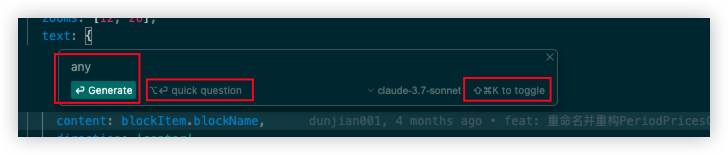

# Cursor 使用技巧总结

`#cursor` `#AI工具` `#doing` 

## 目录
<!-- toc -->
 ## Cursor 的理念 

基于你的光标位置，思考你想做什么？

## 基础交互

   - `Ctrl+K` (Windows) 或 `Cmd+K` (Mac)：
	   - 在编辑器中对某一段代码进行对话或重写
	   - 当你需要`执行特定编辑器功能`或 `AI 命令时`使用
	   -  **本质**：这是访问 Composer 各种功能的"`命令入口`"
   - `Ctrl+L` (Windows) 或 `Cmd+L` (Mac)：
	   - **本质是** Composer 的"对话模式"，适合更复杂的交流和问题解决
	   - 唤出 Chat 窗口，与 Cursor 对话
	   - 可以询问**更复杂**的问题，获取更详细的解释
	   - 需要**多轮对话**
   - `Ctrl+I` (Windows) 或 `Cmd+I` (Mac)：
	   - **内联** AI 编辑/补全
		   - 在**当前光标位置**触发 AI 补全
	   - 唤出 `Composer`，进行更复杂的如从0构建项目，或多文件修改对话
	   - 快速的代码补全和小功能实现
	   - 结果直接插入到代码中
	   - 是 **Composer 的"内联模式"**，专注于小范围代码生成

## Composer 的本质

**Composer** 是 Cursor 编辑器中的 AI 代码生成和编辑引擎，
- 它是支撑 Cursor AI 能力的核心技术组件
- Composer 利用大型语言模型来理解代码上下文，并提供智能建议、生成代码和解决问题。

所以：
- 当需要在代码中直接生成内容时，使用 `Cmd+I`
- 当需要进行更深入的讨论时，使用 `Cmd+L`
- 当需要执行特定命令或操作时，使用 `Cmd+K`

## 基础使用技巧

### 提示词优化

   - 使用清晰、具体的指令
   - 包含上下文信息和期望结果
   - 示例：不要只说"修复这个bug"，而是"修复这个导致表单提交失败的验证bug"

1. **版本控制**：频繁提交代码，使用 Git 等工具保护重要内容。

### 2. 上下文管理

1. 每隔几次对话，重申核心任务要求，确保 AI 不偏离目标。
2. **模型选择**：密切关注 AI 使用的模型，防止自动切换到更昂贵的选项（如 GPT-4）。
3. **最新信息获取**：使用 `@web` 指令让 AI 检索最新文档，特别是涉及第三方 API 时。
4. **任务分解**：将复杂任务拆分为小任务，逐步完成，便于管理和调试。

- **谨慎使用 “Apply” 和 “Accept” 功能**：仔细审查 AI 建议的每一处修改。
- **保护重要的 prompt 和正常运行的代码**：AI 可能会过度简化或删除关键代码。
- **定期重申任务要求**：AI 可能在多次对话后偏离原始目标。

### @web 功能

1. 有些外部较新的文档，模型大概是没有学会的，这时@web或一个链接给它就很有帮助了。相信它读文档比你快还准确，唉，一边开心一边忧伤吧。

### 重启上下文

其上下文有所限制，有时太长你会发现它好像忘记之前的一些内容了，建议适时`Cmd+N`起一个新的聊天窗口

## 高级功能

1. 代码生成与重构
   - 选中代码块后使用 AI 重构
   - 使用指令如："将这段代码重构为更高效的版本"或"将这个函数拆分为更小的函数"

1. 代码解释
   - 选择复杂代码，请求 AI 解释其功能
   - 使用指令如："解释这段代码的工作原理"或"这个正则表达式是做什么的？"

1. 自动补全与建议
   - 编写注释后让 AI 实现功能
   - 例如：`// 创建一个函数来验证电子邮件格式`，然后使用 AI 生成

1. 调试帮助
   - 粘贴错误信息，让 AI 分析原因和解决方案
   - 使用指令如："解释这个错误并提供修复方法"

1. 文档生成
   - 为函数或类生成文档注释
   - 使用指令如："为这个函数生成JSDoc文档"

## 项目特定技巧

1. 项目上下文理解
   - 让 AI 先了解项目结构
   - 使用指令如："这是一个React项目，使用TypeScript和Redux，请根据这个上下文帮我..."

1. 代码库导航
   - 询问特定功能在哪里实现
   - 使用指令如："在这个代码库中，用户认证功能是如何实现的？"

1. 测试用例生成
   - 为函数或组件生成单元测试
   - 使用指令如："为这个React组件生成Jest测试"

## 提高效率的小技巧

1. 保存常用提示词模板
   - 为重复任务创建标准提示词
   - 例如代码审查、性能优化、文档生成等

1. 结合版本控制
   - 使用 AI 解释 git 差异
   - 生成有意义的提交信息

1. 自定义设置
   - 调整 AI 建议的频率和风格
   - 设置特定于项目或语言的偏好

1. 逐步改进
   - 不要期望一次得到完美结果
   - 通过多轮对话迭代改进代码

Cursor 是一款强大的 AI 编程助手，能在编程过程中提高效率，以下是一些实用的使用技巧分享：

- **特定文件索引**：在使用 Cursor 的聊天功能时，可以通过 @ 符号指定希望关注的文件，例如 @src/index.js，这样可以提高 AI 的响应质量和准确性【17】。

- **上下文管理**：在多次对话中，定期重申核心任务要求，这样可以确保 AI 不偏离目标，更有效地获取所需信息【18】。

- **自定义指令**：使用 Cursor 规则（.cursorrules 文件），可以为 AI 设置自定义指令，指导其在解释代码、生成建议和回答查询时的行为，这样可以更精准地符合你的需求【20】【25】。

- **利用文件检索功能**：利用 @Codebase 功能精准检索代码库，尤其在开发过程中遇到问题时，可以加快找到相关功能和代码的速度【22】。

- **版本控制**：经常使用 Git 等工具进行代码提交，保护重要内容。合理的版本控制习惯可以帮助你回滚到稳定的状态，避免不必要的错误【18】。

- **主动交流**：创建全面的文档文件，详细描述代码概述和设计系统，这将有助于 Cursor 理解项目的整体架构，在处理复杂任务时提供更好的支持【27】。

- **灵活使用模式**：尝试不同的工作模式，例如 YOLO 模式以及测试驱动开发，来适应不同的编程需求，使得开发过程更加灵活【26】。

通过应用这些技巧，您可以显著提升在使用 Cursor 时的代码编写速度和效率，成为更加高效的 AI 辅助开发者【19】【23】。

## 随记

使用 @ 符号为 AI 提供上下文。输入 @ 即可查看文件夹中所有文件和代码符号的列表。
使用 @Codebase 或 ⌘ Enter 来提问你的代码库。Cursor 会搜索你的代码库并找到与你的查询相关的代码。
使用 @Web 获取来自互联网的最新信息。Cursor 将搜索网络并使用最新数据来回答你的问题。
使用 @LibraryName 来引用常见库，或通过 @Docs → Add new doc 来添加自定义文档

在终端中使用 ⌘ K，以自然语言编写终端命令。Cursor 会将其转换为你所需的命令。

如果你对某段代码有简单疑问，先选中它，然后点击“quick question”即可立刻获得解答

## 参考

- https://gameapp.club/post/2025-01-26-programming-with-cursor/