# Cursor 使用技巧总结


`#cursor` `#AI工具` 


## 目录
<!-- toc -->
 ## 开始 

- ① 第一步
	- IDE 迁移到 Cursor，先用起来
		- IDE 如何迁移见 https://docs.cursor.com/guides/migration/vscode
	- 编程语言支持
		- JavaScript ： https://docs.cursor.com/guides/languages/javascript
		- Java： https://docs.cursor.com/guides/languages/java
		- Python ： https://docs.cursor.com/guides/languages/python
- ② 第二步
	- 用完一段时间后，**一定要完整读一遍官方文档**： https://docs.cursor.com/get-started/welcome

其他注意点：
- 个人经验：
	- 如果之前使用的 Jetbrain 系列 IDE，快捷键是一个很大的挑战，那就先多用鼠标吧（GUI 界面），虽然可安装相应插件，但快捷键冲突时，忍不住去配置解决，挺浪费时间，快捷键更多见 https://docs.cursor.com/guides/migration/jetbrains
-  Cursor Pro 试用：
	- 如果您是第一次使用 Cursor，注册后您将获得 14 天的 Cursor Pro 免费试用，多注册几个账号多试用试用（**个人没试过，据说可行**）
- 编程语言支持情况
	- Python 和 JavaScript/TypeScript 上表现得最好，同样支持 Swift、C 和 Rust 、Go 等

## 理念

基于你的光标位置，Cursor 会思考你想做什么？

> 每次击键或光标移动，Cursor 将根据您的最近更改尝试提供建议。不过，Cursor 不会总是显示建议；有时模型预测没有需要更改的内容

## 基础

### Tab

- 按 `Tab` 接受建议，按 `Esc` 拒绝建议
- 逐字部分接受建议，请按 `Ctrl/⌘ →`
- 自动导入
	- Tab中的自动导入功能可以在 `TypeScript` 和 `Python` 项目中自动添加模块导入

> 也可以自定义快捷键

### ⌘ K 

- 提示框中，您可以正常输入或使用 `@ 符号`引用其他上下文
- 还能出现多个提示框
	- 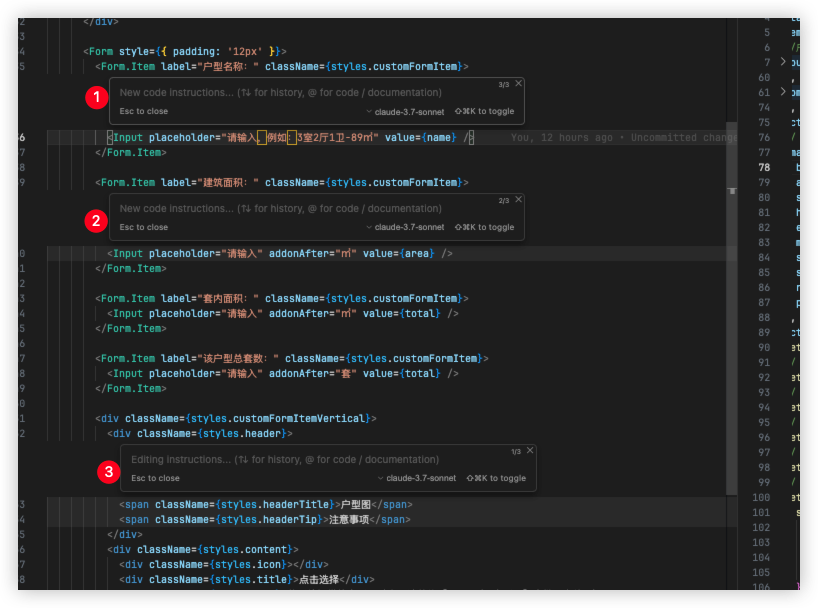
- 如果您在提示栏中按下`Option/Alt Enter`
	- 光标将回应您对选择的任何问题，以及您附加的上下文
	- 可以进行多轮对话
- 在`内置的 Cursor 终端中`使用 `⌘ K`，以自然语言编写终端命令。Cursor 会将其转换为你所需的命令
	- 按下 `esc` 接受该命令，或通过 `Ctrl/⌘ + Enter` 立即运行该命令
- 如果你对某段代码有简单疑问，先选中它，然后点击“`quick question`”即可立刻获得解答
	- 
- `⌘ K` 让你使用 AI 来编辑和编写代码。
	- 要编辑时，可先选中部分代码，点击“Edit”，并描述需要如何更改。
	- 若想生成全新代码，只需在未选中任何内容的情况下输入 `⌘ K`。

### cmd + k 与 cmd + I 、cmd + L  对比

   - `Ctrl+K` (Windows) 或 `Cmd+K` (Mac)：
	   - 在编辑器中对某一段代码进行对话或重写
	   - 当你需要`执行特定编辑器功能`或 `AI 命令时`使用
	   -  本质：这是访问 Composer 各种功能的"`命令入口`"
   - `Ctrl+L` (Windows) 或 `Cmd+L` (Mac)：
	   - 本质是 Composer 的"对话模式"，适合更复杂的交流和问题解决
	   - 唤出 Chat 窗口，与 Cursor 对话
	   - 可以询问**更复杂**的问题，获取更详细的解释
	   - 需要**多轮对话**
   - `Ctrl+I` (Windows) 或 `Cmd+I` (Mac)：
	   - **内联** AI 编辑/补全
		   - 在**当前光标位置**触发 AI 补全
	   - 唤出 `Composer`，进行更复杂的如从0构建项目，或多文件修改对话
	   - 快速的代码补全和小功能实现
	   - 结果直接插入到代码中
	   - 是 **Composer 的"内联模式"**，专注于小范围代码生成

所以：
- 当需要在代码中直接生成内容时，使用 `Cmd+I`
- 当需要进行更深入的讨论时，使用 `Cmd+L`
- 当需要执行特定命令或操作时，使用 `Cmd+K`

### Composer 的本质

Composer 是 Cursor 编辑器中的 AI 代码生成和编辑引擎
- 它是支撑 Cursor AI 能力的核心技术组件
- Composer 利用大型语言模型来理解代码上下文，并提供智能建议、生成代码和解决问题。

### Chat

#### 检查点

每次迭代都会创建一个检查点（Checkpoints），类似于 Git 的 commit，你可以 checkout 

#### 聊天记录

你可以重新访问、重命名或删除

#### Agent 模式

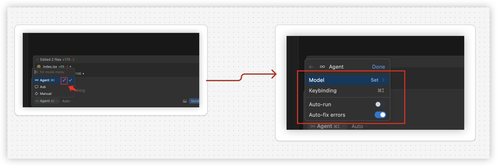


- 定义：Cursor 的 Agent 模式是一种强大的工具，能够通过规则驱动和上下文感知处理复杂任务。
- 场景：它适用于代码重构、自动化编辑和问题解决等场景，帮助开发者高效完成工作
- 技巧：
	- 用户可以对生成的更改提供反馈（点赞或点踩），根据反馈，Agent 模式会进一步优化生成的代码


可自定义规则管理：通过 `Settings → Features → Agent Rules` 添加规则，如下

```json
{
  "pattern": "**/api/*.ts",
  "action": "auto-format",
  "description": "自动格式化API接口文件"
}

```

#### Ask 模式

- Ask 是一个`只读` 模式，用于聊天，旨在提问、探索并了解代码库
	- 它具有读取文件和其他上下文的全部能力，但无法自行进行任何更改
- 使用 Cursor内置的搜索工具提问、探索并查找您代码库中的信息
- 在 Ask 模式下，您可以通过点击 diff视图右下角的按钮应用更改（验证过，Ask 模式下也可以）


> Search Codebase - 允许光标搜索它自己的上下文，而不必`@file` 等

### 快捷键

| 快捷键     | 描述                      |
| ------- | ----------------------- |
| Tab     | Accept suggestion 接受建议  |
| Cmd + → | Accept next word 接受下一个词 |


> 更多参考 https://docs.cursor.com/kbd 
> 个人经验参考：还是建议尽量不要自定义快捷键（包括插件），挺浪费时间的，习惯一阵子就好了，虽然我之前主要使用 jetBrain Webstorm ，使用最不适应的就是是快捷键

### 终端

个人没怎么用，更多可见 https://docs.cursor.com/cmdk/terminal-cmdk

> 个人使用 Warp ，AI 功能也不错，也建议使用 

### Git 

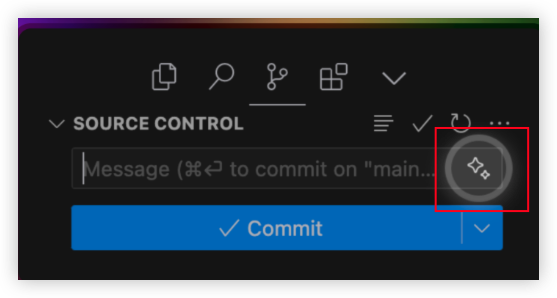
>  光标会从您的提交历史中学习，目前还没有方法来定制或提供如何生成提交信息的具体说明。Cursor 将自动适应您现有的提交信息风格

可自定义快捷键： `cmd + m`
- 前往键盘快捷方式 `⌘R ⌘S` 或 `⌘⇧P` 并搜索“打开键盘快捷方式（JSON）
- 执行该快捷键，不能主动打开 Git 面板

## 上下文管理

### 代码库索引

当项目被打开时，每个 Cursor 实例将为该工作区初始化索引。在初始索引设置完成后，Cursor 将自动索引添加到您工作区的任何新文件，以保持您的代码库上下文是最新的

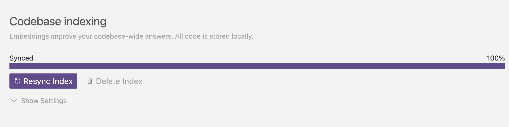

默认情况下，Cursor 将索引您代码库中的所有文件，除了 `.cursorignore` 和 `gitignore` 中的

>  所以，如果某个大型文件内容不需要 AI读取，请忽略它

如何重建索引？
- 删除 cursor 账户，重新打开项目并重新登录即可

### 视觉上下文

直接可以粘贴图片提供 **视觉上下文**

### 使用 @ 符号管理聊天上下文

- 使用 `@ 符号`为 AI 提供上下文。
- 输入 @ 即可查看文件夹中`所有文件`和`代码大纲`
	- 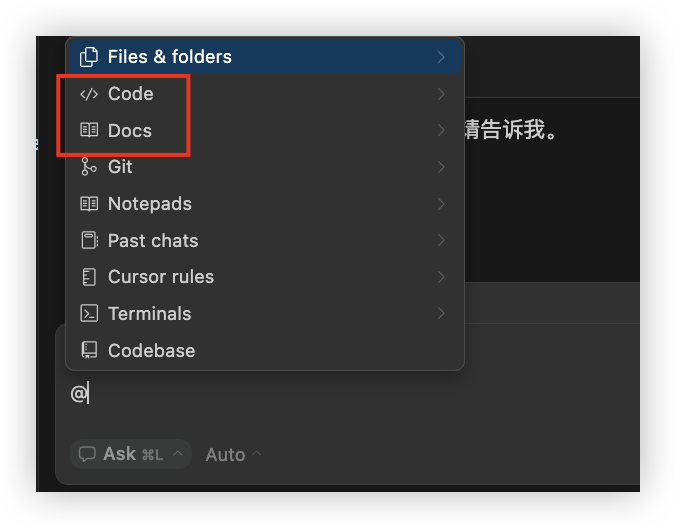
		- 比如 `@Docs` → `@Antd` 文档对话
			- 使用 `@LibraryName` 来引用常见库，或通过 `@Docs → Add new doc` 来添加自定义文档
- 使用 `@Codebase` 或 `⌘ Enter` 来提问你的代码库
	- Cursor 会搜索你的代码库并找到与你的查询相关的代码
- 使用 `@Web` 获取来自互联网的最新信息。Cursor 将搜索网络并使用最新数据来回答你的问题。

### @Files  

- 使用场景：
	- 引用项目中的特定文件，快速跳转或关联上下文
	- 快速定位或引用项目中的关键文件（如配置文件、核心模块）
- 支持拖动：
	- 可以将文件从主侧边栏拖放到 Composer、Chat 或 Cmd K 中，以将其作为上下文添加
- 示例：`@Files/src/app.ts`

### @Folders  

- 引用整个文件夹，用于获取更广泛的代码库上下文。
	- 添加后 Agent 可以自行搜索内容。这使 Agent 能够根据任务的需要独立探索和分析文件夹的内容
- **场景**：批量分析文件夹内的代码结构（如组件库或工具函数目录）
	- 示例：`@Folders/components/`
	- 示例：`@Folders/src/utils/ # 关联所有工具函数`

### @Code  

- 引用代码库中的特定代码片段或符号（如函数、变量）
- 另外可以选中代码片段，然后使用快捷键 `cmd + l`添加到聊天
	-  **场景**：直接关联代码片段进行调试或重构（如函数逻辑优化）。
	- 示例：`@Code getUserProfile`  

### @Web

- 使用`@Web`时 ，Cursor会根据您提供的查询和上下文构建搜索查询，并在网络上搜索以寻找相关信息作为额外的上下文
- 在使用Agent 模式时，Cursor会自动搜索网络，以获取最新的信息或额外的上下文
- Cursor 可在几秒钟内让Cursor从多个网站抓取信息，以找到最佳答案，而无需用户手动搜索任何地方
- 插入外部技术文档链接（如 React 官方 API）
	-  `@Web https://react.dev/reference/react`

### @Git  

- 定义：关联 Git 历史记录和变更，查看提交记录或差异对比。
- 使用场景：
	- 结合 `@Git` 和 `@Recent Changes` 快速定位问题提交，审查特定提交引入的代码变更
	-  AI 扫描差异并寻找可能由差异引起的错误或问题。
- 比如：
	- `@Git 3a8b2c1  # 查看该 commit 的改动`
	- `@Git 3a8b2c1 # 查看该 commit 的改动`

### @Docs

- Cursor 附带一套第三方文档，这些文档已经被抓取、索引，并准备作为上下文使用。您可以通过使用`@Docs`符号访问它们
- 你也可以自己添加 Docs 文档，比如下图的 `Echarts` 文档
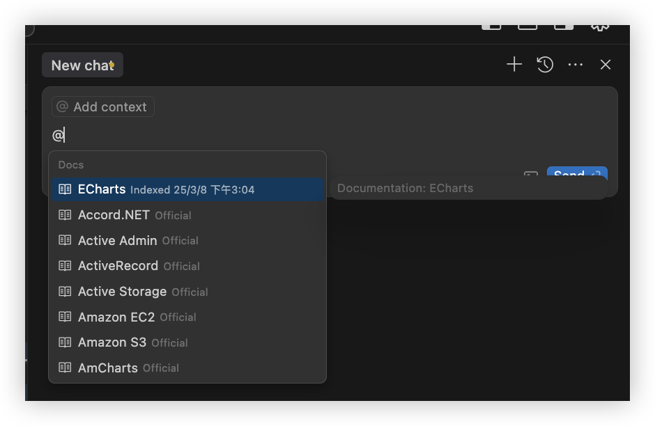

### @Notepads  

- 访问或引用本地记事本内容（Beta 功能），用于临时记录信息。

### @Recent Changes  

- 查看项目中的最近修改文件，便于追踪代码变动。
	- Cursor 会自动跟踪您代码库的最近更改，将这些修改作为上下文传递
	- 示例：`@Recent Changes 24h # 查看过去24小时内的改动文件`
	- 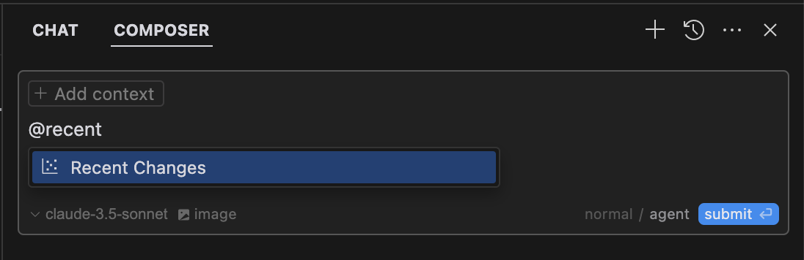

### @Lint Errors  

- `@Lint Errors` 符号自动捕获并提供关于**您当前活动文件中**任何 lint 错误和警告的上下文。
- 协助调试代码规范问题

### @Definitions  

- 查找符号定义（仅限 `Cmd K`），将所有附近的定义添加到 Cmd K 作为上下文
- 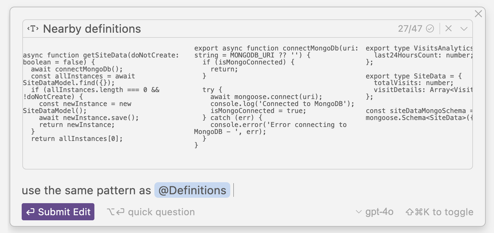

### 其他，@任何东西，调用起搜索建议

- 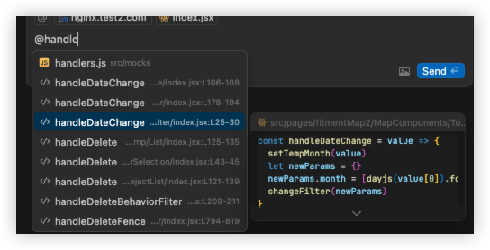

### 聊天窗口中精确控制每个函数或某个文件 

明确修改范围
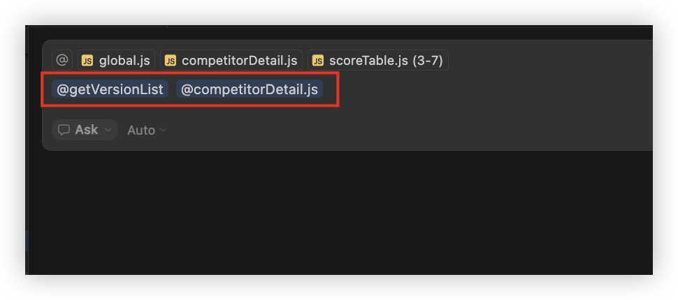

### `#File` 

- 将文件添加到上下文但不直接引用`（静默关联）
- 一般用于背景信息补充，与`@`符号结合以实现精确的上下文控制
	- 期望修改文件内容请使用 `@File`

### `/Commands`  

- 添加当前打开或活动的文件到上下文。

>  快速唤起弹窗时（ `CMD + K` ），上面也同样适用

### 忽略指定文件

- Cursor 提供文件访问与索引控制功能，支持通过 `.cursorignore` 和 `.cursorindexingignore` 文件来管理文件的处理方式。
	- 这些文件允许用户排除敏感文件、配置文件或专有代码，优化索引性能，并控制代码库的搜索范围。
- 语法与 `.gitignore` 相同

## 一些技巧

### 技巧：重要

- 多使用，然后研究一遍 `Cursor Setting` 的每一项功能吗？
	- 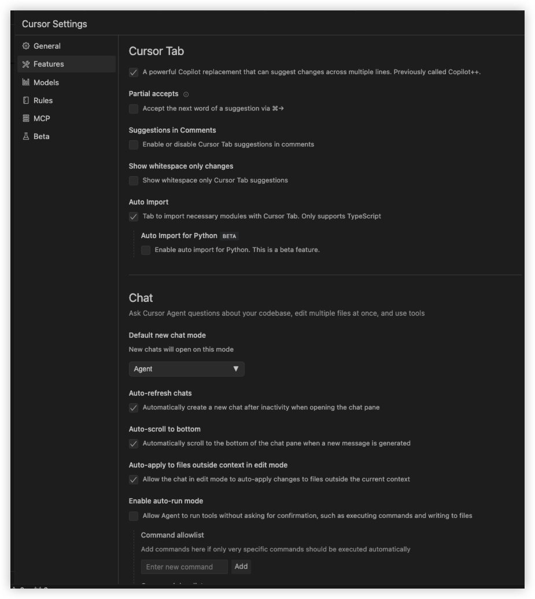
- 多看官方文档
	- 用一段时间后，再看文档，能解决你使用过程中的很多困惑

### 提示词优化

   - 使用清晰、具体的指令
   - 包含上下文信息和期望结果
   - 示例：
	   - 不要只说"修复这个bug"，而是"修复这个导致表单提交失败的验证bug"
	   - 又如："这是一个React项目，使用TypeScript和Redux，请根据这个上下文帮我..."
	   - 再如代理人模式下，输入 `这是一个刚初始化前端项目，技术技术栈是 xxxx，构建工具使用 xxxx，现在给这个项目添加必要的 taiwindcss 配置`

### 重要：明确修改范围的方式

- 先选中需要修改的代码区域，添加到聊天框中
	- 比如：请修改 src/App.tsx 文件的第 45-60 行，优化渲染性能
- 在代码中添加特殊注释，然后引用这些注释：
	- 比如：代码中标记 `// TODO: Fix authentication logic 的部分`，然后告诉 Cursor 完善这部分代码
- 提请定义好目录结构，明确在这这个目录下，或者某几个文件中填充逻辑

### 多提交代码

1. 频繁提交代码，使用 Git 等工具保护重要内容。

### 上下文管理

1. 每隔几次对话，重申核心任务要求，确保 AI 不偏离目标。
2. 模型选择：密切关注 AI 使用的模型，防止自动切换到更昂贵的选项（如 GPT-4）。
3. 最新信息获取：使用 `@web` 指令让 AI 检索最新文档，特别是涉及第三方 API 时。
4. 任务分解：将复杂任务拆分为小任务，逐步完成，便于管理和调试。

### 谨慎使用 “Apply” 和 “Accept” 功能

- 谨慎使用 “Apply” 和 “Accept” 功能：仔细审查 AI 建议的每一处修改
- 保护重要的 prompt 和正常运行的代码：AI 可能会过度简化或**删除关键代码**

### @web 功能

1. 有些外部较新的文档，模型大概是没有学会的，这时@web或一个链接给它就很有帮助了。相信它读文档比你快还准确，唉，一边开心一边忧伤吧。

### 重启上下文

其上下文有所限制，有时太长你会发现它好像忘记之前的一些内容了，建议适时`Cmd+N`起一个新的聊天窗口

### 重构目录结构

重构目录结构时，基本不用做什么，每次移动文件或修改文件夹时，Cursor 自动帮你完成

### 多个项目共享上下文

工程放到一个目录下，让 cursor 打开即可

### 调试帮助

   - 粘贴错误信息，让 AI 分析原因和解决方案
   - 使用指令如："解释这个错误并提供修复方法"

### 文档生成

   - 为函数或类生成文档注释
   - 使用指令如：
	   - "为这个函数生成JSDoc文档"
   - 场景：后端同学基于代码，快速为前端同学快速生成接口文档，方便联调

### 期望不要太高

   - 不要期望一次得到完美结果
   - 通过多轮对话迭代改进代码

### 提高效率的小技巧

   - 生成有意义的提交信息

## 高级

### 使用 MCP 协议 扩展 Cursor 模型上下文

- Cursor 支持通过模型上下文协议（MCP）连接外部系统和数据源，从而扩展其功能
	- MCP 服务器充当将外部上下文引入 Cursor 的 **桥梁**
- MCP 是一个非常新的协议，仍在积极开发中

### Custom modes 自定义模式

> 是的，如下图所示，Agent 的关键点是 `Tools Use` 的应用，默认 Agent 模式不就是内置了很多工具集合吗？MCP 协议要解决的问题之一也不是这个吗？

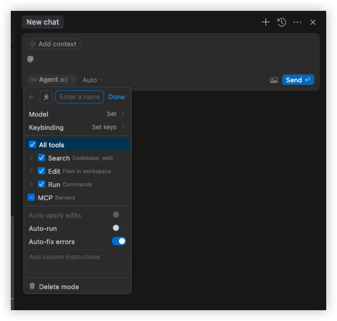

- Yolo 模式解释：You Only Live Once，积极运用**所有可用工具**，主动进行大胆的更改，用户确认最少。
- 自己也没实践过，有需要可参考 https://docs.cursor.com/chat/custom-modes

>  需要更新最新版本

### Tools 

Cursor 提供以下工具，适用于代码编辑、搜索、运行和自动化操作等场景。

1. **Search Tools**  
	- **Codebase Search**: 在索引的代码库中执行语义搜索。  
	- **Web Search**: 生成搜索查询并进行网页搜索。  
	- **Grep**: 在文件中搜索确切的关键字或模式。  
	- **List Directory**: 列出目录中的文件而不读取其内容。  
	- **Search Files**: 使用模糊匹配快速查找文件名。  
2. **File Operations Tools**  
	- **Read File**: 读取文件内容（最大 750 行）。  
	- **Edit & Reapply**: 对文件进行编辑并重新应用更改。  
	- **Delete File**: 自动删除文件（可在设置中禁用）。  
3. **Run Tools**  
	- **Terminal**: 通过 VS Code 的终端配置文件执行命令，支持选择默认终端配置文件。  
4. **Advanced Options**  
	- **Auto-apply Edits**: 无需手动确认即可自动应用编辑。  
	- **Auto-run**: 自动执行终端命令并接受编辑，适用于运行测试套件和验证更改。  
	- **Guardrails**: 定义允许/拒绝列表以控制工具自动执行。  
	- **Auto-fix Errors**: 自动解决 linter 错误和警告。  
5. **MCP Tools**  
	- **MCP Toggle**: 切换所有可用的 MCP 服务器，并支持自动运行选项。  
6. **Other Tools**  
	- **AI Commit Message**: 生成 AI 驱动的提交信息。  
	- **Notepads (Beta)**: 提供记事本功能，用于记录和整理信息。  
	- **Keyboard Shortcuts**: 支持多种快捷键以提升工作效率。  
	- **Context Tools**: 根据不同上下文（如文件、代码、文档等）执行相关操作。  

## 一些观点

- 适合快速验证 MVP、短频快的原型开发或 POC 项目
- 个人使用检验，Cursor 实际带来的提效约为 30% 

### 提效分析：前端视觉

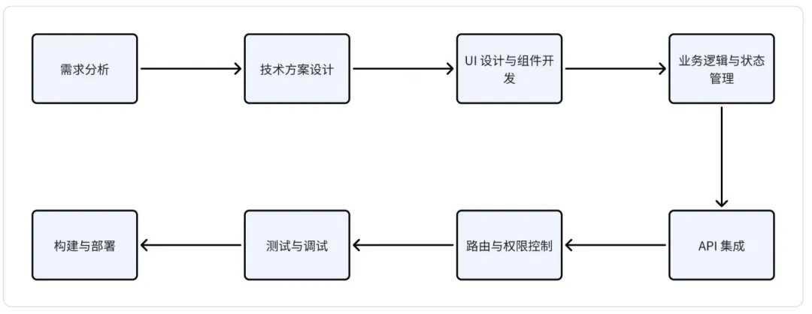

| 开发环节       | 时间占比 | 是否提效        | 备注                                                    |
| ---------- | ---- | ----------- | ----------------------------------------------------- |
| 需求分析       | 10%  | cursor 很难介入 | 因为涉及业务背景、上下⽂理解、利益取舍，需要⼤量主观判断，且需求变更频繁；另许多需求难以⽤⾃然语⾔准确描述 |
| 技术方案设计     | 5%   | 提效有限        |                                                       |
| UI 设计与组件开发 | 20%  | 提效有限        | Cursor ⽣成 UI 代码时，可能会遗漏复杂交互的细节，导致实际使⽤时需要⼤量修改；          |
| 业务逻辑与状态管理  | 20%  | **提效明显**    | 把功能模块拆解清楚，提供⾜够的上下⽂，清晰表达要做什么事情，Cursor 确实能够⼤幅提升开发效率     |
| API 集成     | 15%  | 提效有限        | AI对于后端项⽬⽆感知，⽆法协同；但补全代码能够提效                            |
| 路由与权限控制    | 5%   | 提效有限        |                                                       |
| 测试与调试      | 15%  | 提效有限        |                                                       |
| 构建与部署      | 5%   | 提效有限        |                                                       |
| 其他         | 5%   | 提效有限        |                                                       |

## FAQ

1、当对话开始接触上下文窗口限制时，我们将显示一个建议（如下图），将开始一个新的聊天，并参照当前的聊天
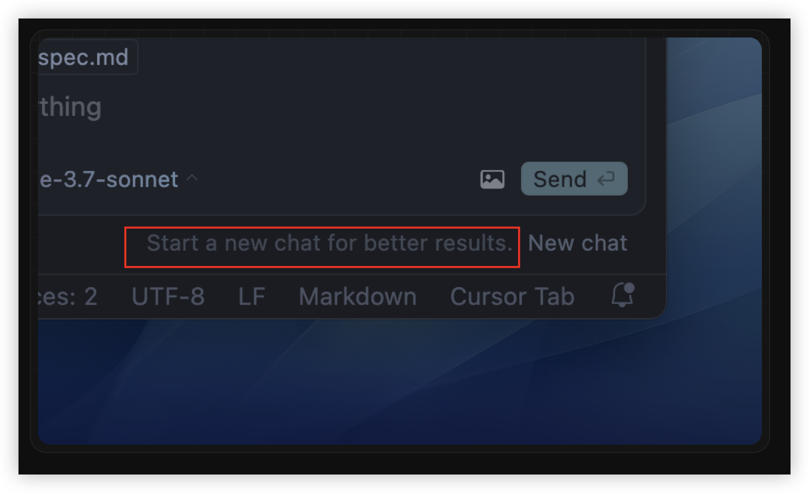

2、对话历史存储在您的计算机上，不会跨设备同步

3、鼓励详细解释和频繁的澄清问题，而不自动应用编辑或运行工具

## 参考

- https://gameapp.club/post/2025-01-26-programming-with-cursor/
