# 美团前端工程架构的演变

>  源于 GMTC 大会分享 

## 目录
<!-- toc -->
 ## 1. 美团前端==工程框架==演变：Rome 

### 1.1. 背景

不同组经常需要==机动==支持紧急项目，各个组的项目都在一个项目里使劲添加东西

- 统一的启动脚本
- 统一的 CI、CD 工具
- 目录
	- ==在哪儿改的成本比 vue 语法和 React 语法成本更高==
- 非标准的
- 收敛依赖选型和版本，统一起来
- 统一的基础开发规范
- 对齐跨技术栈和开关
- vue 和 React 目录一一致
- 开发调试一致，比如 `npm run dev` 还是 `npm run serve`
- **公司基建集成**
	- cdn 容灾
	- 告警监控
	- 日志链路
	- 水印接入
	- 业务埋点等等
- cd/ci 的缓存？
	- **docker 镜像包的缓存**，如果都命中了，直接复用缓存就好了，舍去了重新安装依赖
- 构建提速
- 依赖提速
	- 框架`预构建`
	- 切换 `pnpm`
	- 迁移磨平工具，**迁移工具**，一键迁移
		- babel 静态解析
		- webpack 分析依赖然后迁移
		- 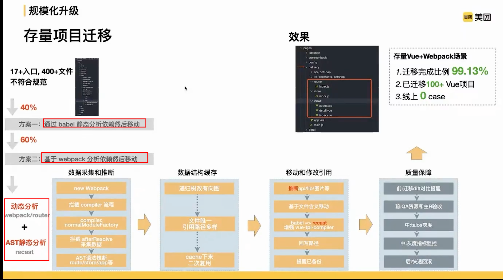
	- rome 定制 `docker` 变化
		- 没用更新 `npm` ， 直接拉取 `docker` 镜像就好
		- 每次都会尝试复用

### 1.2. 工具化

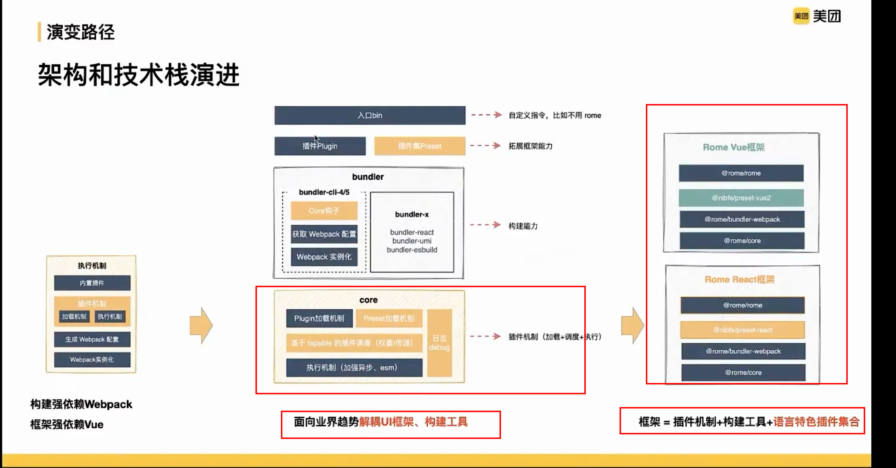

框架开发辅助 ？
- vue ui
- umi ui 
- `iceWorks`
- `appWorks`
- RomeWorks

- 收集历史问题，版本黁吗版本

- 比如社区故障，紧急版本检测等
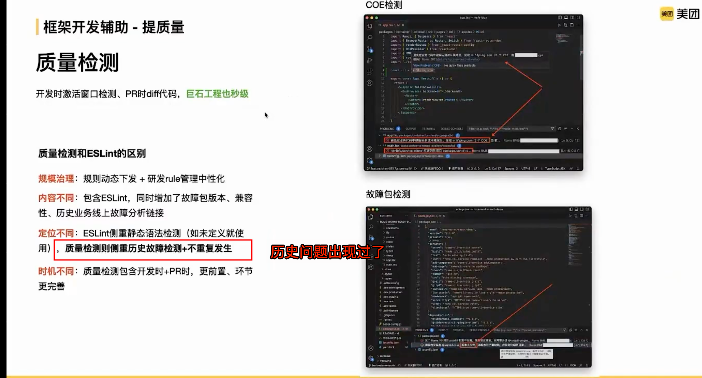

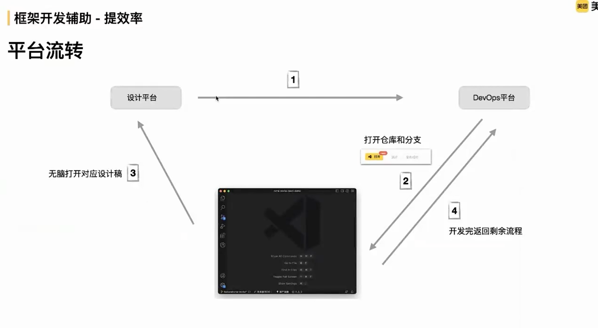

> 太割裂的，可能都会某个时刻都不知道下一步应该干啥！

### 1.3. 框架度量

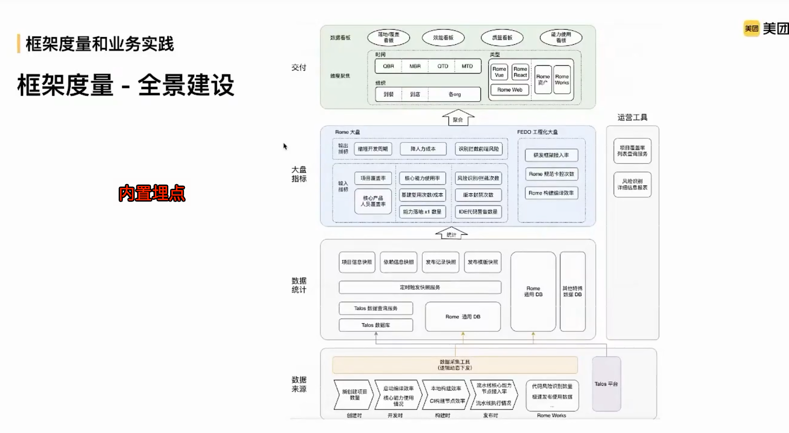

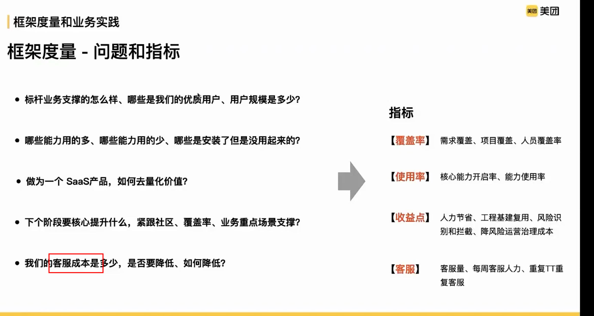

- 客户成本
- 覆盖率
- 使用率
- 收益点

### 1.4. 基于工程框架的思考

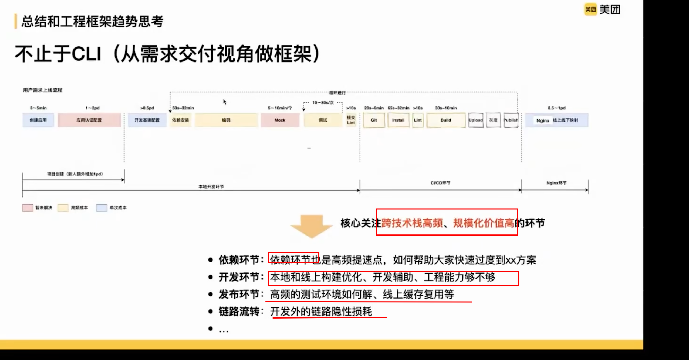

### 1.5. 未来

- ==开发链路深度整合==：`vercel` 产品

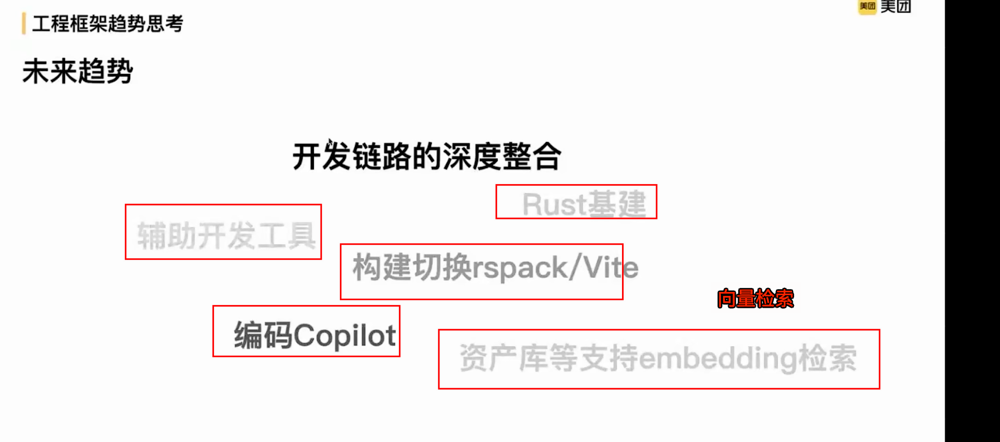

>  值得搞的，能不能结合我们那不大模型的能力，把我们的资产，比如物料、遍历流程等等==向量化==，方便提效

## 2. 前端架构演进：Rome 

### 2.1. 背景

- 多个组件库
- 多个前端框架，甚至包括 `jQuery`
- 不同的研发框架，元框架
- 不同的流程规范

### 2.2. 期望

- 统一物料
- 多个前端框架：
	- 收敛到 vue + react 
- 研发框架：Rome
- 一套流程规范

### 2.3. 阶段一：规范化

- 建立跨团队统一认知
- 为规模化建设**工程化能力**打基础
- 降低**沟通协作成本学习成本**
- 减少因规范不一致造成的**质量问题**

通过流程规范&基础设施统一
建立起良好的标准化落地抓手 
具有了规模化建设工程能力的基础

#### 2.3.1. 制定与落地

提案 → 评审 → 公示 → 发布提案 → 工具建设 → 运营 

#### 2.3.2. 关键抓手：运营大盘，通过发布系统来抓

> 项目管理 → 需求管理平台 → 设计平台 → 各类平台等等需要打通！

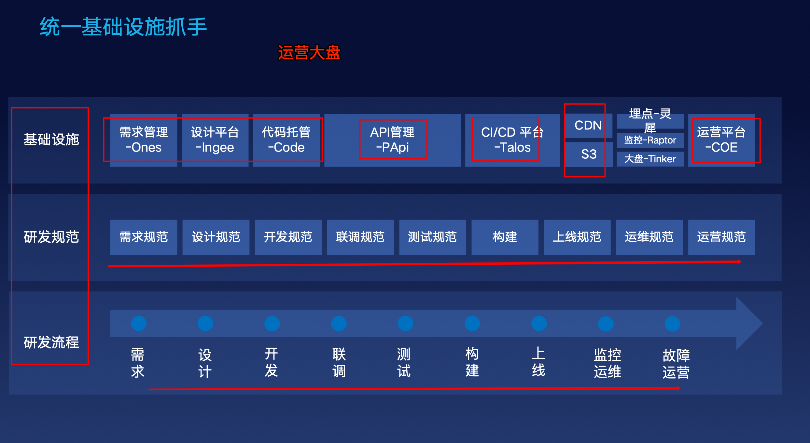

构建产物备份，回滚机制

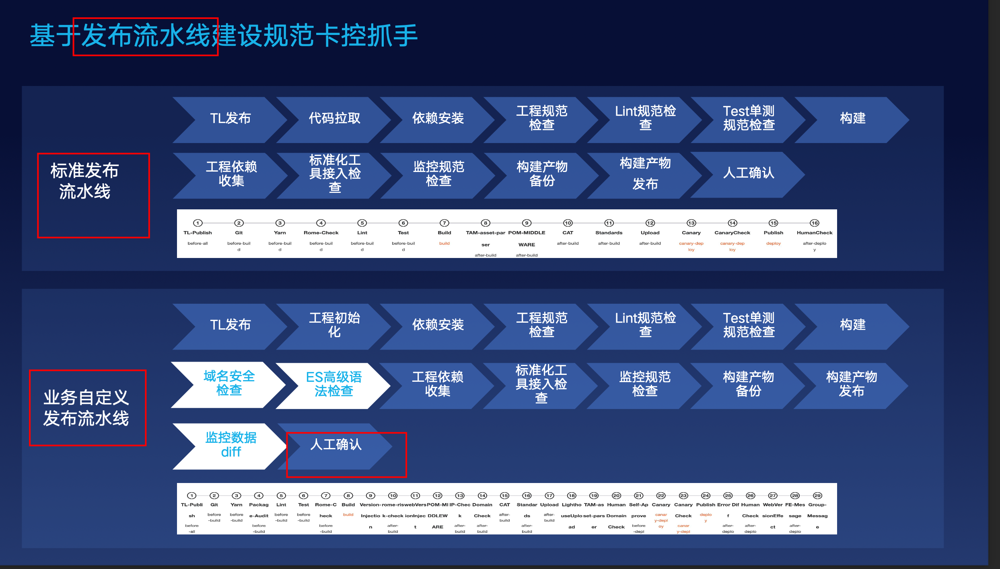

### 2.4. 阶段二：工程化

#### 2.4.1. nodejs 架构 → 纯静态架构

- 首屏和 SEO
	- 但是国内 SEO 可以不考虑
		- 并且 SEO，也可以单独做
	- 海外时长需要考虑

#### 2.4.2. 纯静态架构

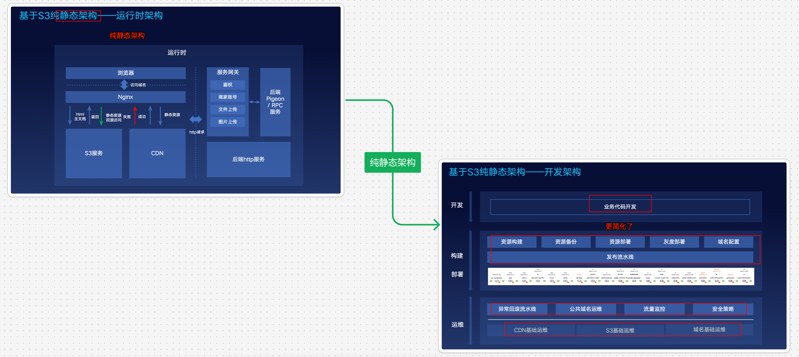

#### 2.4.3. 结果

- 基础架构统一大大释放了我们的服务运维成本
- 同时提升服务性能

### 2.5. 统一研发框架

**研发框架**统一主要解决了==研发过程中的效率和成本问题，让业务只关注业务逻辑的开发==

- 内置公司基建能力
	- 埋点
	- 监控
	- ==鉴权==等等
- 一键 CDN 容灾 ？
- 内部服务打通，内置，比如
	- git
	- 埋点服务
	- 水印服务
	- api 管理平台
	- 发布平台
	- 灰度平台
	- CDN 容灾
	- 指标监控大盘
- 组件一致性：
	- 否则 UI 一致性难保障，沉淀效率低

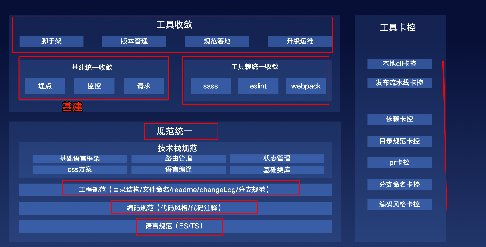

#### 2.5.1. 组件一致性

- 可视化资产
- 资产运营起来
- 设计资产

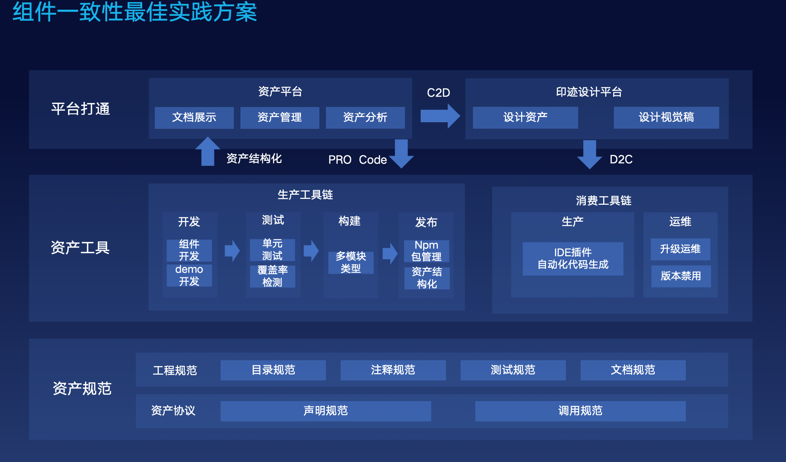
