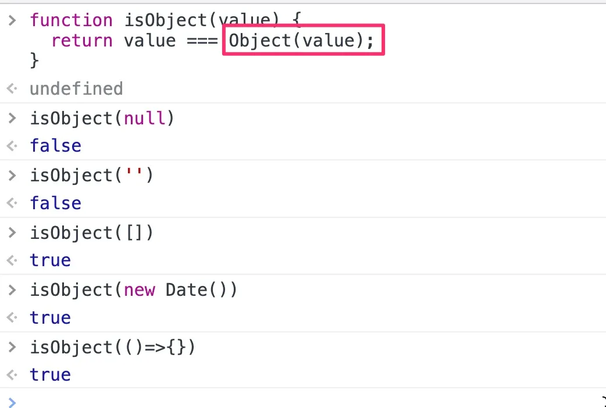
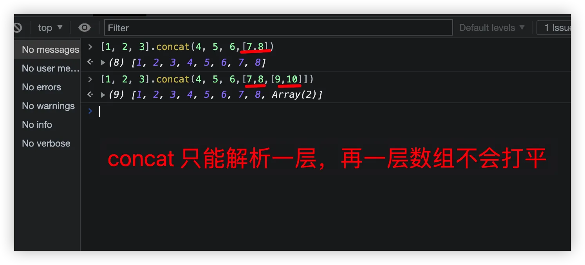
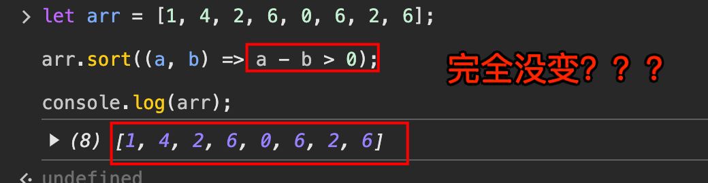

# JavaScript 对象的一些注意点


## 目录
<!-- toc -->
 ## 1. Map、WeakMap的区别 

- 键值不同
	- `Map` 对象的键**可以是任何类型** ，是**强引用**
	- 但 `WeakMap` 对象中的键**只能是对象引用**，是`弱引用`
- 垃圾回收：weakMap 可以自动回收

- `WeakMap`只接受`对象`作为键名（`null`除外），不接受其他类型的值作为键名。
- 其次，`WeakMap`的键名所指向的对象，不计入垃圾回收机制，所以
	- `WeakMap`的专用场合就是，它的键所对应的对象，可能会在将来消失。WeakMap 结构有助于**防止内存泄漏**
- set 方法返回的是当前的 Map对象，因此可以采用**链式写法** 
	- `0` 和 `-0` 就是**同一个键**
	- 虽然`NaN`不严格相等于自身，但 Map 将其视为**同一个键**

```javascript hl:1,8
// WeakMap 弱引用的只是键名，而不是键值。键值依然是正常引用。

const wm = new WeakMap();
let key = {};
let obj = {foo: 1};

wm.set(key, obj);
obj = null;
wm.get(key)
// Object {foo: 1}
// 上面代码中，键值obj是正常引用。所以，即使在 WeakMap 外部消除了obj的引用，WeakMap 内部的引用依然存在。
```

> chrome 中 Memory 面板，有一个垃圾桶的按钮，可以**强制垃圾回收（garbage collect）**。这个按钮也能用来观察 WeakMap 里面的引用是否消失

## 2. FinalizationRegistry 与 WeakRef

```javascript hl:2,5
// ES2021 引入了清理器注册表功能 FinalizationRegistry，用来指定目标对象被垃圾回收机制清除以后，所要执行的回调函数。
const registry = new FinalizationRegistry(heldValue => {
  // ....
});
// ES2021支持 WeakRef 对象，用于直接创建对象的弱引用。
let target = {};
let wr = new WeakRef(target);
```

## 3. Set 与 WeakSet

- 在 Set 内部，两个 `NaN` 是相等的
- WeakSet 
	- 成员**只能是对象**，而不能是其他类型的值
	- WeakSet 中的对象都是**弱引用**，即垃圾回收机制不考虑 WeakSet 对该对象的引用
	- **只有三个方法**  add、delete、has 
	- WeakSet 的一个用处，是**储存 DOM 节点**，而不用担心这些节点从文档移除时，会引发内存泄漏

## 4. 自己实现一个 isObject

> 使用 `Object` 包装下



## 5. 使用 `Object.prototype.toString.call` 来判断类型 ，如下

```javascript hl:19,7,4
/*数值：返回[object Number]。
字符串：返回[object String]。
布尔值：返回[object Boolean]。
undefined：返回[object Undefined]。
null：返回[object Null]。
数组：返回[object Array]。
arguments 对象：返回[object Arguments]。
函数：返回[object Function]。
Error 对象：返回[object Error]。
Date 对象：返回[object Date]。
RegExp 对象：返回[object RegExp]。
其他对象：返回[object Object]。*/

Object.prototype.toString.call(2) // "[object Number]"
Object.prototype.toString.call('') // "[object String]"
Object.prototype.toString.call(true) // "[object Boolean]"
Object.prototype.toString.call(undefined) // "[object Undefined]"
Object.prototype.toString.call(null) // "[object Null]"
Object.prototype.toString.call(Math) // "[object Math]"
Object.prototype.toString.call({}) // "[object Object]"
Object.prototype.toString.call([]) // "[object Array]"

'[object Function]'
```

## 6. 属性描述对象

```javascript
// 6个，如下
{
  value: 123,
  writable: false,
  enumerable: true,
  configurable: false,
  get: undefined,
  set: undefined
}
```

常用方法：
- Object.getOwnPropertyDescriptor
-  Object.defineProperties
-  Object.definePropertie

## 7. 存取器

```javascript hl:1,15,25,3,17,27
// 写法一，属性p的configurable和enumerable都为false，从而导致属性p是不可遍历的
var obj = Object.defineProperty({}, "p", {
  get: function () {
    return "getter";
  },
  set: function (value) {
    console.log("setter: " + value);
  },
});

obj.p; // "getter"
obj.p = 123; // "setter: 123"
obj.p; // 还是 "getter"

// 写法二，属性p的configurable和enumerable都为true，因此属性p是可遍历的
var obj = {
  get p() {
    return "getter";
  },
  set p(value) {
    console.log("setter: " + value);
  },
};

// 应用，存取器往往用于，属性的值依赖对象内部数据的场合。
var obj = {
  $n: 5,
  get next() {
    return this.$n++;
  },
  set next(n) {
    if (n >= this.$n) this.$n = n;
    else throw new Error("新的值必须大于当前值");
  },
};

obj.next; // 5

obj.next = 10;
obj.next; // 10

obj.next = 5;
// Uncaught Error: 新的值必须大于当前值

```

## 8. 有哪些控制对象状态的方法

```javascript
// Object.preventExtensions 方法可以使得一个对象无法再添加新的属性。
// Object.isExtensible 方法用于检查一个对象是否使用了Object.preventExtensions方法
// Object.seal  方法使得一个对象既无法添加新属性，也无法删除旧属性。可以允许修改
// Object.isSealed  方法用于检查一个对象是否使用了Object.seal方法。
// Object.freeze  方法可以使得一个对象无法添加新属性、无法删除旧属性、也无法改变属性的值，使得这个对象实际上变成了常量。
// Object.isFrozen  方法用于检查一个对象是否使用了Object.freeze方法。
```

## 9. 使用 `Object.assign` 来实现继承

```javascript hl:9
Object.assign(SomeClass.prototype, {
  someMethod(arg1, arg2) {
    // ···
  },
  anotherMethod() {
    // ···
  },
});
// 等同于下面的写法
SomeClass.prototype.someMethod = function (arg1, arg2) {
  // ···
};
SomeClass.prototype.anotherMethod = function () {
  // ···
};

```

## 10. `Object.fromEntries()`方法是`Object.entries()`的逆操作

```javascript
// Object.fromEntries()方法是Object.entries()的逆操作
Object.fromEntries([
  ['foo', 'bar'],
  ['baz', 42]
])
// { foo: "bar", baz: 42 }
```

## 11. concat 只能解析一层，再一层就不会打平了



## 12. array 的 reverse 方法是原地的

## 13. slice() 方法的一个重要应用，是将**类似数组的对象**转为**真正的数组**

```javascript
// slice()方法的一个重要应用，是将类似数组的对象转为真正的数组。

Array.prototype.slice.call({ 0: 'a', 1: 'b', length: 2 })
// ['a', 'b']

Array.prototype.slice.call(document.querySelectorAll("div"));
Array.prototype.slice.call(arguments);
```

## 14. sort 方法是原地的

```javascript hl:3,14,23,26
// sort方法对数组成员进行排序
// 默认是按照字典顺序排序。
// 排序后，原数组将被改变。
['d', 'c', 'b', 'a'].sort(); // ['a', 'b', 'c', 'd']

[4, 3, 2, 1].sort()  // [1, 2, 3, 4]

[11, 101].sort()  // [101, 11]

[10111, 1101, 111].sort()  // [10111, 1101, 111]

// sort的参数函数本身接受两个参数，表示进行比较的两个数组成员。
// 如果该函数的返回值大于0，表示第一个成员排在第二个成员后面；
// 其他情况下 <=0 ，都是第一个元素排在第二个元素前面。

 
[10111, 1101, 111].sort(function (a, b) {
  return a - b;
}) // [111, 1101, 10111]

// 自定义的排序函数应该返回数值，否则不同的浏览器可能有不同的实现，不能保证结果都一致。
// bad 
// 甚至有可能完全出错，不知道什么玩意
[1, 4, 2, 6, 0, 6, 2, 6].sort((a, b) => a > b)

// good
[1, 4, 2, 6, 0, 6, 2, 6].sort((a, b) => a - b)

```



## 15. sort((a, b) => a - b > 0) 和 sort((a, b) => a - b) 的区别  ？

这两种写法有**很大的区**别：
1. `sort((a, b) => a - b)`：
    - 返回值是具体的差值（数字）
    - 返回负数：表示 a 应该在 b 前面
    - 返回 0：表示 a 和 b 相等
    - 返回正数：表示 a 应该在 b 后面
    - 结果：==升序排列==
    - 例如：当 a=3, b=1 时，返回 2（数字）
2. `sort((a, b) => a - b > 0)`：
    - 返回值是布尔值转换后的数字（==0 或 1==）
    - 返回 false (0)：当 a-b ≤ 0 时
    - 返回 true (1)：当 a-b > 0 时
    - 结果：==降序排列==
        - **也不一定，自己的理解的那种，比如**
            - 
            - 例如：当 a=3, b=1 时，返回 true（转为数字就是 1）

### 15.1. 返回值类型不同

   ```javascript
// a=3, b=1 时
(a - b)     // 返回 2 (数字)
(a - b > 0) // 返回 true (布尔值，转为数字 1)
   ```

### 15.2. 排序结果不同

   ```javascript hl:3
[3,1,2].sort((a,b) => a-b)      // [1,2,3] (升序)

// 并不是降序的，下面的是错误的,而是完全没变
[3,1,2].sort((a,b) => a-b > 0)  
   ```

### 15.3. 性能影响

   ```javascript
// a-b 直接返回差值
sort((a,b) => a-b)     // 一次运算

// a-b > 0 需要先计算差值再比较
sort((a,b) => a-b > 0) // 两次运算
   ```

### 15.4. 最佳实践建议

#### 15.4.1. 对于数字排序，推荐使用 `sort((a, b) => a - b)`

   ```javascript
// ✅ 好的写法
numbers.sort((a, b) => a - b)     // 升序
numbers.sort((a, b) => b - a)     // 降序
   ```

#### 15.4.2. 避免使用 `sort((a, b) => a - b > 0)`

   ```javascript
// ❌ 不推荐的写法
numbers.sort((a, b) => a - b > 0)  // 不够直观，且性能略差，结果还不一定
   ```

#### 15.4.3. 如果确实需要布尔值比较，直接使用比较运算符

   ```javascript hl:8
// 如果一定要用布尔值比较
numbers.sort((a, b) => a > b ? 1 : -1)


// 比如
let arr = [1, 4, 2, 6, 0, 6, 2, 6];

arr.sort((a, b) => (a > b ? 1 : -1));

console.log(arr);

   ```

### 15.5. 总结

- `a - b` 写法更清晰、更准确、性能更好
- `a - b > 0` 有问题，很大的问题
- 在实际开发中
	- 使用 `a - b` 的写法
	- 不要使用 `a>b`

## 16. map()方法还可以接受第二个参数

```javascript hl:3
// map()方法还可以接受第二个参数
var arr = ['a', 'b', 'c'];
// map()方法的第二个参数，将回调函数内部的this对象，指向arr数组。
[1, 2].map(function (e) {
  return this[e];
}, arr)
// ['b', 'c']
```

## 17. forEach也接受两个参数

```javascript hl:4,7
var out = [];

[1, 2, 3].forEach(function(elem) {
  this.push(elem * elem);
}, out);

out // [1, 4, 9]
```

## 18. 扩展运算法

```javascript hl:17,31,38,57
console.log(...[1, 2, 3])
// 1 2 3

console.log(1, ...[2, 3, 4], 5)
// 1 2 3 4 5

function add(x, y) {
  return x + y;
}

const numbers = [4, 38];
add(...numbers) // 42

[...[], 1]
// [1]

注意，只有函数调用时，扩展运算符才可以放在圆括号中，否则会报错。

(...[1, 2])
// Uncaught SyntaxError: Unexpected number

console.log((...[1, 2]))
// Uncaught SyntaxError: Unexpected number

console.log(...[1, 2])
// 1 2

// ES5 的写法
Math.max.apply(null, [14, 3, 77])
// ES6 的写法
Math.max(...[14, 3, 77])
// 等同于
Math.max(14, 3, 77);

console.log([...5]) // [0, 1, 2, 3, 4]

// 扩展运算符还可以将字符串转为真正的数组。
[...'hello']
// [ "h", "e", "l", "l", "o" ]

let map = new Map([
  [1, 'one'],
  [2, 'two'],
  [3, 'three'],
]);

let arr = [...map.keys()]; // [1, 2, 3]

const go = function*(){
  yield 1;
  yield 2;
  yield 3;
};

[...go()] // [1, 2, 3]

// 如果对没有 Iterator 接口的对象，使用扩展运算符，将会报错。

const obj = {a: 1, b: 2};
let arr = [...obj]; // TypeError: Cannot spread non-iterable object

```

> [!danger]
> 扩展运算符还可以将字符串转为真正的数组，`[...'hello']`  或者 `Array.from('hello')`，所以也可以不使用 `split`

## 19. `Array.from()`方法用于将两类对象转为真正的数组

- 类似数组的对象（array-like object）
	- NodeList 对象：document.querySelectorAll('p')
	- arguments 对象
- 可遍历（iterable）的对象
	- Map

## 20. `Array.of()` 方法用于`将一组值`，转换为数组

```javascript hl:5
Array.of(3, 11, 8); // [3,11,8]
Array.of(3); // [3]
Array.of(); // []

// 垫片
function ArrayOf(){
  return [].slice.call(arguments);
}
```

## 21. indexOf 与 includes

```javascript
[NaN].indexOf(NaN)
// -1

// includes使用的是不一样的判断算法，就没有这个问题。
[NaN].includes(NaN)
// true
```

## 22. 打平一个数组

```javascript hl:7
[1, 2, [3, 4]].flat()
// [1, 2, 3, 4]

[1, 2, [3, [4, 5]]].flat()
// [1, 2, 3, [4, 5]]

// flat()的参数为2，表示要“拉平”两层的嵌套数
[1, 2, [3, [4, 5]]].flat(2)
// [1, 2, 3, 4, 5]
```

## 23. Array.fill

```javascript hl:5,10
['a', 'b', 'c'].fill(7)  // [7, 7, 7]

new Array(3).fill(7)   // [7, 7, 7]

fill方法还可以接受第二个和第三个参数，用于指定填充的起始位置和结束位置。

['a', 'b', 'c'].fill(7, 1, 2)
// ['a', 7, 'c']

如果填充的类型为对象，那么被赋值的是同一个内存地址的对象，而不是深拷贝对象。

let arr = new Array(3).fill({name: "Mike"});
arr[0].name = "Ben";
arr
// [{name: "Ben"}, {name: "Ben"}, {name: "Ben"}]

```

## 24. JSON.stringify 和 JSON.parse 可接受额外参数

## 25. String对象

- `'a'.concat('b', 'c') // "abc"`
- `split方法`还可以接受第二个参数，限定返回数组的最大成员数
- `indexOf方法`还可以接受第二个参数，表示从该位置开始向后匹配
- `at()`方法接受一个整数作为参数，返回参数指定位置的字符，支持负索引（即倒数的位置）

## 26. Math 对象

```javascript hl:4,5,7
Math.max(2, -1, 5) // 5
Math.min(2, -1, 5) // -1

Math.min() // Infinity
Math.max() // -Infinity

反过来了，为什么呢？？？？
```

## 27. 返回 `[min,max]` 之间的随机整数

```javascript
Math.floor(Math.random() * (max - min + 1)) + min;
```

## 28. 返回一个随机字符

```javascript
// 字符
var str = "ABCDEFGHIJKLMNOPQRSTUVWXYZ" + "abcdefghijklmnopqrstuvwxyz" + "0123456789-_";

// 随机数
let random = Math.random(Math.floor() * str.length);

// 随机字符串
let randomStr = str[random];
```

## 29. 正则

### 29.1. 定义

```javascript
var regex = /xyz/;
var regex = new RegExp("xyz");

var regex = new RegExp("xyz", "i");
// 等价于
var regex = /xyz/i;


var r = /abc/gim;

r.ignoreCase; // true
r.global; // true
r.multiline; // true
r.flags; // 'gim'
```

### 29.2. replace 的使用

```javascript hl:12
var prices = {
  p1: "$1.99",
  p2: "$9.99",
  p3: "$5.00",
};

var template =
  '<span id="p1"></span>' + '<span id="p2"></span>' + '<span id="p3"></span>';

template.replace(
  /(<span id=")(.*?)(">)(<\/span>)/g,
  // 参数分别为：匹配到的字符串、第一个括号匹配到的内容、第二个括号匹配到的内容、第三个括号匹配到的内容、第四个括号匹配到的内容
  function (match, $1, $2, $3, $4) {
    return $1 + $2 + $3 + prices[$2] + $4;
  },
);
// <span id="p1">$1.99</span>
// <span id="p2">$9.99</span>
// <span id="p3">$5.00</span>

```

### 29.3. 自己不熟的

```javascript hl:5,11
/cat|dog/.test('cat') // true

// 字符串bbc news包含a、b、c以外的其他字符，所以返回true
/[^abc]/.test('bbc news') // true
// 字符串bbc不包含a、b、c以外的其他字符，所以返回false
/[^abc]/.test('bbc') // false

[0-9.,]
[0-9a-fA-F]
[a-zA-Z0-9-]
[1-31] // 不代表1到31，只代表1到3

重复类
/lo{2}k/.test('look') // true
/lo{2,5}k/.test('looook') // true

贪婪模式
// t 出现0次或1次
/t?est/.test('test') // true
/t?est/.test('est') // true

// t 出现1次或多次
/t+est/.test('test') // true
/t+est/.test('tttttttttttttest') // true
/t+est/.test('est') // false

// t 出现0次或多次
/t*est/.test('test') // true
/t*est/.test('ttttttttest') // true
/t*est/.test('tttest') // true
/t*est/.test('tttttttttttttttttest') // true

+?：表示某个模式出现1次或多次，匹配时采用非贪婪模式。
*?：表示某个模式出现0次或多次，匹配时采用非贪婪模式。
??：表格某个模式出现0次或1次，匹配时采用非贪婪模式。

(?:x)称为 非捕获组

x(?=y) 称为先行断言，x 只有在y 前面才匹配，y 不会被计入返回结果
x(?!y) 称为先行否定断言，x只有不在y前面才匹配，y 不会被计入返回结果
```

