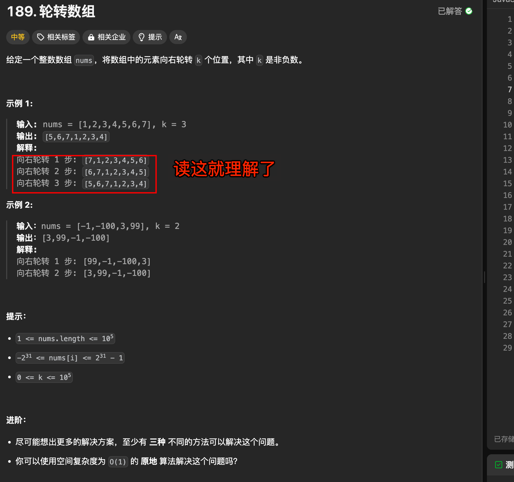

# 轮转数组


`#leetcode`   `#2024/08/25`  `#算法`  


## 目录
<!-- toc -->
 ## 1. 题目及理解 

https://leetcode.cn/problems/rotate-array/



要求：
-  使用空间复杂度为 `O(1)` 的 **原地** 算法解决

## 2. 思路一：使用额外的数组遍历或者使用Array 的方法

- 使用额外的数组遍历解决
- 直接 Array.splice 或 Array.slice 解决

但以上空间复杂度不符合要求，都是 `O(n)`

## 3. 思路二：三次翻转即可

> [!danger]
>  三次翻转的效果，用笔画画就知道了

```javascript
/**  
 * @param {number[]} nums  
 * @param {number} k  
 * @return {void} Do not return anything, modify nums in-place instead.  
 */
 var rotate = function(nums, k) {  
    // ①  1. 翻转整个数组  
    // ①  2. 翻转前 k 个元素  
    // ①  3. 翻转后 n-k 个元素  
    // ①  1. 翻转整个数组  
    reverse(nums, 0, nums.length - 1);  
    // ①  2. 翻转前 k 个元素  
    reverse(nums, 0, k % nums.length - 1);  
    // ①  3. 翻转后 n-k 个元素  
    reverse(nums, k % nums.length, nums.length - 1);  
  
};  
  
function reverse(nums, start, end) {  
    while (start < end) {  
        let temp = nums[start];  
        nums[start] = nums[end];  
        nums[end] = temp;  
        start++;  
        end--;  
    }  
}
```

## 4. 复杂度分析

- 时间复杂度分析：
	1. 整个数组的翻转：O(n)，其中 n 是数组的长度。
	2. 前 k 个元素的翻转：O(k)
	3. 后 n-k 个元素的翻转：O(n-k)
	4. 总的时间复杂度是 O(n) + O(k) + O(n-k) = O(2n) = O(n)
- 空间复杂度分析： 
	- 这个解决方案只使用了常数级的额外空间（temp 变量），所以空间复杂度是 O(1)。

这个解决方案的优点：

1. 原地操作：不需要额外的数组空间，符合题目要求
2. 时间效率高：只需要遍历整个数组一次，时间复杂度为 O(n)
3. 代码简洁：实现逻辑清晰，易于理解和维护 

