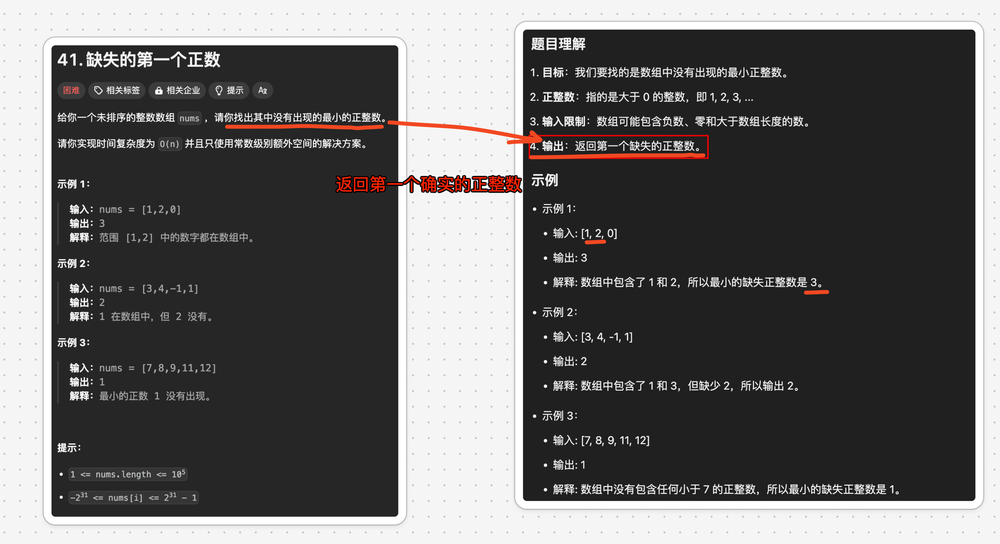

# 缺失的第一个正数


`#leetcode`   `#2024/08/25`  `#算法` 


## 目录
<!-- toc -->
 ## 题目及理解 

https://leetcode.cn/problems/first-missing-positive/



## 思路一

1. **范围分析**：
	- 最小的缺失正整数一定在 `[1, n+1]` 之间，其中 `n` 是数组的长度。
	- 如果数组包含了从 1 到 n 的所有数，那么缺失的正整数就是 `n+1`。
2. **原地修改数组**：把每个**已经存在的数**变成它的负数
3. **查找缺失的数**：
	- 在重新排列数组后，遍历数组
	- 找到第一个位置 `i` 使得 `nums[i] != i + 1`，则 `i + 1` 就是缺失的最小正整数。

### 举个例子

- 初始数组：`[3, 4, -1, 1]` 数组长度 `n = 4`
- 预处理（将不在 `[1, n]` 范围内的数替换为 `n+1`：
    - `-1` 被替换为 `5` (n+1) 结果：`[3, 4, 5, 1]`
- 原地修改数组：把每个**已经存在的数**变成它的负数
	- 已经存在的数：即 `<= n = 4` 的数
	- 其他的数不变
- 找到大于 0 的数，返回它的`索引+1`

## 代码实现

```javascript
/**  
 * @param {number[]} nums  
 * @return {number}  
 */  
var firstMissingPositive = function (nums) {  
    const n = nums.length;  
    // Step 1: 将所有小于等于0或大于n的数替换为n+1  
    for (let i = 0; i < n; i++) {  
        if (nums[i] <= 0 || nums[i] > n) {  
            nums[i] = n + 1;  
        }  
    }  
    // Step 2: 使用原地哈希，将每个数放到对应的位置  
    // ::::放他的负数，表示这个数出现过，如果大于 0 说明没出现过 ::::    
    for (let i = 0; i < n; i++) {  
        let num = Math.abs(nums[i]);  
        // 如果 num <= n，将 nums[num-1] 变为负数  
        // 说明 num 出现过  
        if (num <= n) {  
            nums[num - 1] = -Math.abs(nums[num - 1]);  
        }  
        // 还是正数，说明 num 没出现过  
    }  
    // Step 3: 找到第一个正数，其索引 +1 就是缺失的最小正数  
    for (let i = 0; i < n; i++) {  
        if (nums[i] > 0) {  
            return i + 1;  
        }  
    }  
    // 如果没有找到，则返回n+1  
    return n + 1;  
};
```

## 复杂度分析

时间复杂度分析：
1. 第一个循环：O(n)
    - 遍历整个数组一次，将不在 [1, n] 范围内的数替换为 n+1。
2. 第二个循环：O(n)
    - 再次遍历整个数组，进行原地哈希标记。
3. 第三个循环：O(n)
    - 最后一次遍历数组，寻找第一个正数。
总时间复杂度：O(n) + O(n) + O(n) = `O(n)`

空间复杂度分析：
- 这个算法使用了原地修改的技巧，没有使用任何额外的数据结构。
- 只使用了几个额外的变量（如 n, i, num），这些变量的空间是常数级的。
总空间复杂度：`O(1)`

复杂度分析总结：
- 时间复杂度：O(n)
- 空间复杂度：O(1)

这个算法的优点在于：

1. 时间效率高：只需线性时间就能解决问题。
2. 空间效率高：通过原地修改数组，避免了使用额外空间。

