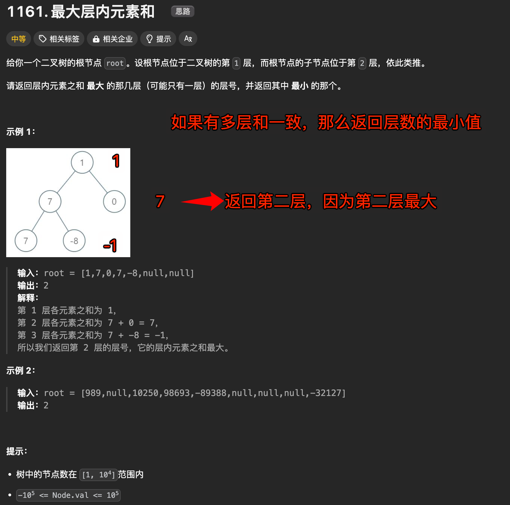

# 最大层内元素和


`#leetcode`   `#2024/09/08`  `#算法`  `#算法/二叉树`  `#BFS` 


## 目录
<!-- toc -->
 ## 题目及理解 

> https://leetcode.cn/problems/maximum-level-sum-of-a-binary-tree/description/



## 思路一：BFS

### 代码实现

```javascript
/**
 * Definition for a binary tree node.
 * function TreeNode(val, left, right) {
 *     this.val = (val===undefined ? 0 : val)
 *     this.left = (left===undefined ? null : left)
 *     this.right = (right===undefined ? null : right)
 * }
 */
/**
 * @param {TreeNode} root
 * @return {number}
 */
var maxLevelSum = function (root) {
  // 表示返回的结果
  let res = 0;
  // 表示最大的层和,初始化为最小安全整数
  let maxSum = Number.MIN_SAFE_INTEGER;
  // 广度优先搜索
  let queue = [];
  queue.push(root);
  let level = 0;
  while (queue.length) {
    let size = queue.length;
    let sum = 0;
    // 遍历当前层的节点，即 level 层的节点
    for (let i = 0; i < size; i++) {
      let node = queue.shift();
      sum += node.val;
      if (node.left) {
        queue.push(node.left);
      }
      if (node.right) {
        queue.push(node.right);
      }
    }
    // 比较当前层的和与最大层和
    // 如果当前层的和大于最大层和，则更新最大层和和结果
    if (sum > maxSum) {
      maxSum = sum;
      res = level;
    }
    // 层数加一
    level++;
  }
  // 返回结果
  return res + 1;
};

```

### 复杂度分析

这段代码实现了一个广度优先搜索（BFS）来遍历二叉树，并找出具有最大和的层级。让我们来分析一下它的时间和空间复杂度：

时间复杂度：`O(n)`
- 其中 `n` 是二叉树中的节点数。
- 代码遍历了树中的每个节点一次，对每个节点执行常数时间的操作（加入队列、出队列、计算和）。

空间复杂度：`O(w)`
- 其中 `w` 是树的最大宽度（即任意层中的最大节点数）。
- 在最坏的情况下（例如，完全二叉树的最底层），队列可能需要存储树的最宽层的所有节点。
- 对于一个平衡二叉树，最大宽度通常在 `O(n/2)` 级别，但在最坏情况下可能接近 `n`。

需要注意的是：
1. 虽然使用了一个 while 循环和一个嵌套的 for 循环，但每个节点只被处理一次，因此总的时间复杂度仍然是 O(n)。
2. 空间复杂度主要由队列占用的空间决定。在任何时刻，队列中存储的节点数不会超过树的最大宽度。
3. 除了队列之外，使用的其他变量（如 res、maxSum、level 等）只占用常数空间，不影响整体空间复杂度。

总的来说，这是一个时间效率较高的解决方案，其时间复杂度是线性的，与树的节点数成正比。空间复杂度在最坏情况下可能接近线性，但通常情况下会小于 O(n)。
