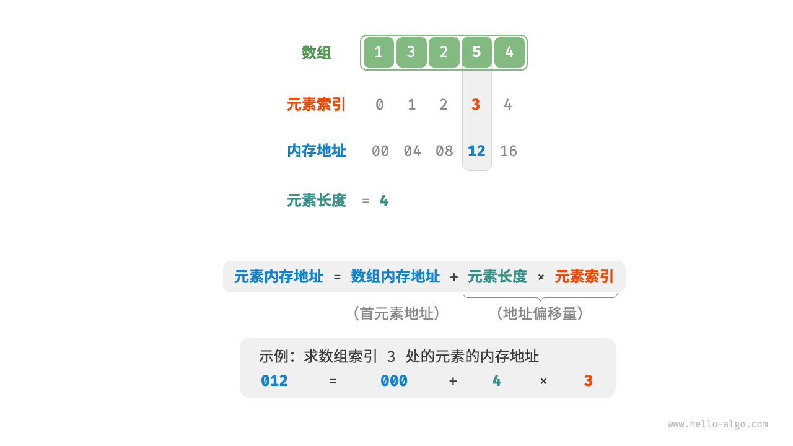
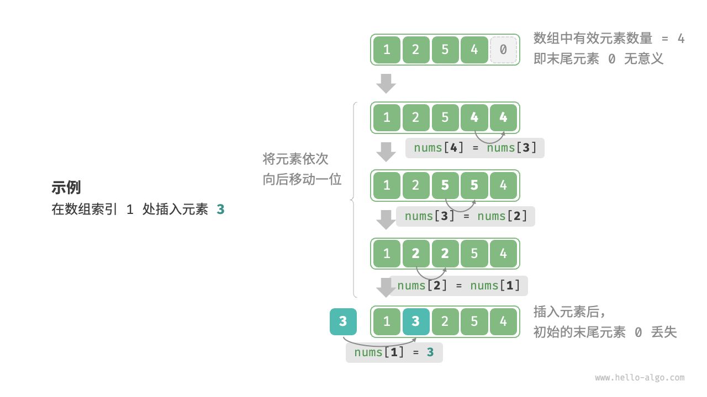
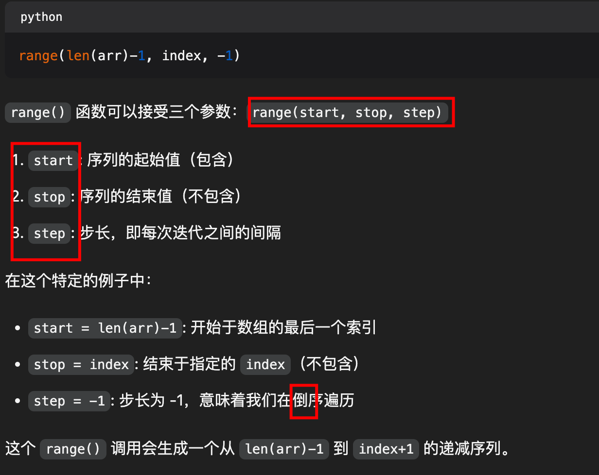
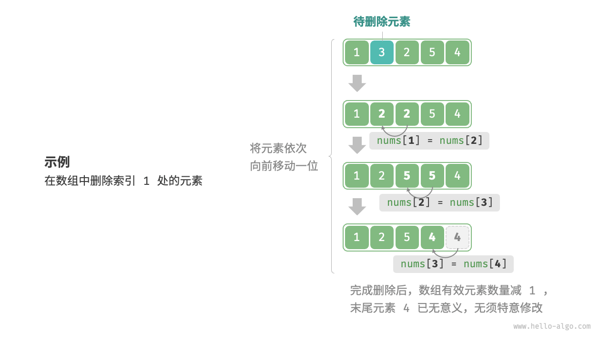

# 数组：Python 描述

`#数据结构/数组` 


## 目录
<!-- toc -->
 ## 1. 初始化数组 

```python
##########################################################
### 初始化数组
##########################################################
# [0] * 5 代表生成一个长度为 5 的数组，每个元素都是 0
# list[int] 代表数组的元素类型是 int
arr: list[int] = [0] * 5  # [ 0, 0, 0, 0, 0 ]

# 初始化数组
nums: list[int] = [1, 3, 2, 5, 4]
```

## 2. 静态数组和动态数组

- 静态数组：
	- 在创建的时候就要确定数组的元素类型和元素数量
	- 只有在 C++、Java、Golang 这类语言中才提供了创建静态数组的方式，
- 动态数组：
	- 动态数组底层还是静态数组，只是**自动帮我们进行数组空间的扩缩容**，并把增删查改操作进行了封装，让我们使用起来更方便而已
		- 为什么要自动**缩容**
			- 为了避免资源浪费，我们其实可以适当缩小存储空间，这就是缩容
		- **扩缩容的策略**：
			- 当数组元素个数达到底层静态数组的容量上限时，扩容为原来的 2 倍；
			- 当数组元素个数缩减到底层静态数组的容量的 1/4 时，缩容为原来的 1/2。
	- 类似 Python、JavaScript 这类语言并没有提供静态数组的定义方式


## 3. 静态数组的增删改查

数据结构的职责就是**增删查改**，下面分别展开说
### 3.1. 访问元素

**索引本质上是内存地址的偏移量**，如下图：



#### 3.1.1. 可以以 O(1) 时间复杂度访问数组元素

```python
import random

##########################################################
### 以 O(1) 时间复杂度访问数组元素
##########################################################
# 以 O(1) 时间复杂度访问数组元素

def random_access(nums: list[int]) -> int:
    random_index: int = random.randint(0, len(nums) - 1)
    return nums[random_index]

# 测试
nums = [1, 2, 3, 4, 5]
print(random_access(nums))  # 随机输出 nums 中的一个元素

```


### 3.2. 插入元素

需要将该元素之后的所有元素都向后移动一位，之后再把元素赋值给该索引，如下图：



#### 3.2.1. 以 `O(n)` 时间复杂度插入元素

```python
##########################################################
### 以 O(n) 时间复杂度插入元素
##########################################################

# 以 O(n) 时间复杂度插入元素
def insert(arr:list[int], num:int, index:int):
    """将 num 插入到 arr 的 index 位置"""
    # 每个元素向后移动一位
    for i in range(len(arr)-1, index, -1):
        arr[i] = arr[i-1]
    # 将 num 插入到 index 位置
    arr[index] = num
```
#### 3.2.2. range 函数详解




### 3.3. 删除元素

想删除索引 `i` 处的元素，则需要把索引 `i` 之后的元素都向前移动一位，如下图




#### 3.3.1. 以 O(n) 时间复杂度删除元素

```python
##########################################################
### 以 O(n) 时间复杂度删除元素
##########################################################

def remove(nums:list[int],index:int):
    # 把索引 index 之后的元素向前移动一个位置
    for i in range(index,len(nums)-1):
        nums[i] = nums[i+1]

```
### 3.4. 数组的插入与删除操作的缺点

总的来看，数组的插入与删除操作有以下缺点。
- **时间复杂度高**：数组的插入和删除的平均时间复杂度均为 O(n) ，其中 n 为数组长度。
- **丢失元素**：由于**数组的长度不可变**，因此在插入元素后，超出数组长度范围的元素会丢失。
- **内存浪费**：我们可以初始化一个比较长的数组，只用前面一部分，这样在插入数据时，丢失的末尾元素都是“无意义”的，但这样做会造成部分内存空间浪费。

### 3.5. 遍历数组的三种方式

```python
##########################################################
### 遍历数组的三种方式
##########################################################

def traverse(arr):
    # ① 直接遍历数组
    for i in arr:
        print(i)
    # ② 使用 range 通过所以遍历数组
    for i in range(len(arr)):
        print(arr[i])
    # ③ 使用 enumerate 遍历数组
    for i, v in enumerate(arr):
        print(i, v)

```

### 3.6. 查找元素

```python
##########################################################
### 查找元素，复杂度O(n)  
##########################################################

def find(nums:list[int],target:int)->int:
    for i in range(len(nums)):
        if nums[i]==target:
            return i
    return -1

```

### 3.7. 总结

综上，静态数组的增删查改操作的时间复杂度是：
- 增：
    - 在末尾追加元素：`O(1)`。
    - 在中间（非末尾）插入元素：`O(N)`。
- 删：
    - 删除末尾元素：`O(1)`。
    - 删除中间（非末尾）元素：`O(N)`。
- 查：给定指定索引，查询索引对应的元素的值，时间复杂度 `O(1)`。
- 改：给定指定索引，修改索引对应的元素的值，时间复杂度 `O(1)`。

## 4. 扩容数组，复杂度O(n) 

```python
##########################################################
### 扩容数组，复杂度O(n)                                ###
##########################################################

# 如果数组长度小于size，就在数组后面补0
def expandArray(arr, size):
    if len(arr) < size:
        # 这个写法牛逼啊
        arr += [0] * (size - len(arr))
    return arr

# 扩容数组，enlarge为扩容的个数
def expand(nums:list[int],enlarge:int) -> list[int]:
    # 初始化一个新的数组，长度为原数组长度加上enlarge
    res = [0] * (len(nums) + enlarge)
    # 将原数组的元素复制到新数组中
    for i in range(len(nums)):
        res[i] = nums[i]
    # 返回新数组
    return res
```

为什么要扩容：在大多数编程语言中，**数组的长度是不可变的**


## 5. 数组的优点与局限性


- **空间效率高**：数组为数据分配了连续的内存块，无须额外的结构开销。
- **支持随机访问**：数组允许在 `O(1)` 时间内访问任何元素。
- **缓存局部性**：当访问数组元素时，计算机不仅会加载它，还会缓存其周围的其他数据，从而借助高速缓存来提升后续操作的执行速度。

连续空间存储是一把双刃剑，其存在以下局限性。

- **插入与删除效率低**：当数组中元素较多时，插入与删除操作需要移动大量的元素。
- **长度不可变**：数组在初始化后长度就固定了，扩容数组需要将所有数据复制到新数组，开销很大。
- **空间浪费**：如果数组分配的大小超过实际所需，那么多余的空间就被浪费了。

## 6. 数组的重要性

- 数据结构底层就两个，数组就是其中一个，他会用来实现各类上层数据结构
-  **机器学习**：神经网络中大量使用了向量、矩阵、张量之间的线性代数运算，这些数据都是以数组的形式构建的。数组是神经网络编程中最常使用的数据结构。


