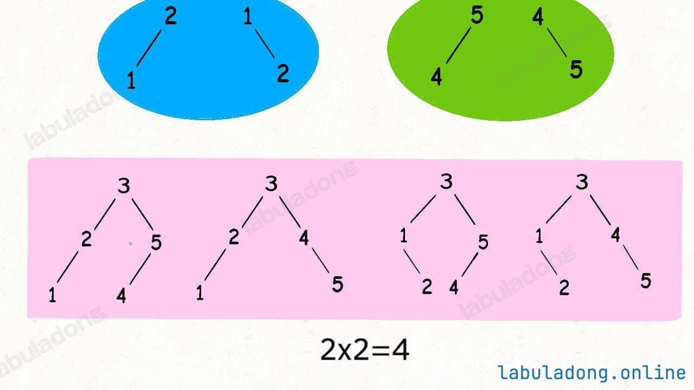

# 不同的二叉搜索树


>  [96. 不同的二叉搜索树](https://leetcode.cn/problems/unique-binary-search-trees/)


## 目录
<!-- toc -->
 ## 分析 

假设给算法输入 `n = 5`，也就是说用 `{1,2,3,4,5}` 这些数字去`构造 BST`。
- 如果固定 `3` 作为根节点
	- 左子树节点就是 `{1,2}` 的组合
	- 右子树就是 `{4,5}` 的组合
- 所以：
	- **左子树的组合数和右子树的组合数乘积**就是 `3` 作为根节点时的 BST 个数



## 代码

```javascript
var numTrees = function (n) {
    // 返回 闭区间 [start, end] 组成的 BST 个数
    function count(start, end) {
        if (start > end) return 1; // 即 null
        let res = 0;
        for (let i = start; i <= end; i++) {
            // 根节点：i
            let left = count(start, i - 1);
            let right = count(i + 1, end);
            // 左右子树的组合数乘积是 BST 的总数
            res += left * right;
        }
        return res;
    }
    // 计算闭区间 [1, n] 组成的 BST 个数
    return count(1, n);
};
```

## 加备忘录：否则超时

```javascript
var numTrees = function (n) {
    let memo = {};
    // 返回 闭区间 [start, end] 组成的 BST 个数
    function count(start, end) {
        let key = `${start},${end}`;
        if (memo[key]) return memo[key];
        if (start > end) return 1; // 即 null
        let res = 0;
        for (let i = start; i <= end; i++) {
            // 根节点：i
            let left = count(start, i - 1);
            let right = count(i + 1, end);
            // 左右子树的组合数乘积是 BST 的总数
            res += left * right;
        }
        memo[key] = res;
        return res;
    }

    // 计算闭区间 [1, n] 组成的 BST 个数
    return count(1, n);
};
```