# 常见面试题：篇二


## 目录
<!-- toc -->
 ## 1. `??`  与 `||` 的区别？ 

- `||` 运算符在左侧为任何 `false` 值时都会返回右侧的值。
- `??` 运算符只在左侧为 `null 或 undefined` 时才会返回右侧的值。

```javascript hl:2,5,8
console.log(0 || 42);     // 输出: 42
console.log(0 ?? 42);     // 输出: 0

console.log('' || 'default');  // 输出: "default"
console.log('' ?? 'default');  // 输出: ""

console.log(false || true);    // 输出: true
console.log(false ?? true);    // 输出: false

```

## 2. this 指向问题

```javascript
const obj = {
  fn1: () => {
    // this 指向定义时所在的对象，即 window
    // 如果 new 调用，则报错
    console.log(this);
  },
  fn2: function () {
    console.log(this);
  },
};

obj.fn1(); // Window {...}
obj.fn2(); // { fn1: [Function: fn1], fn2: [Function: fn2] }

const x = new obj.fn1(); //  Uncaught TypeError: obj.fn1 is not a constructor
const y = new obj.fn2(); // fn2 {}

```

## 3. cookie 的有效期设置为 0 会怎么样？

### 3.1. 会话 Cookie（Session Cookie）

当你将 cookie 的有效期设置为 0 时，实际上是创建了一个会话 cookie（session cookie）。这种 cookie 没有明确的过期时间。

### 3.2. 浏览器关闭时删除

会话 cookie 会在用户关闭浏览器时自动删除。这意味着当用户结束当前的浏览会话（关闭所有浏览器窗口）时，这个 cookie 就会被清除。

### 3.3. 生命周期

- 在浏览器打开期间，这个 cookie 会一直存在并可用。
- 只要浏览器保持打开状态，**即使用户关闭了特定的标签页或窗口，cookie 仍然有效**。

### 3.4. 用途

会话 cookie 通常用于**存储临时信息**，比如：
- 用户的登录状态
- 购物车内容
- 用户在网站上的临时设置或偏好

### 3.5. 设置方法

在 JavaScript 中，你可以这样设置一个会话 cookie：

```javascript
document.cookie = "username=John Doe; path=/";
```

注意这里没有设置 `expires` 或 `max-age` 属性。

### 3.6. 与持久 Cookie 的区别

- 持久 cookie 有明确的过期时间，会被保存在用户的**硬盘上**。
- 会话 cookie 只存在于**内存**中，浏览器关闭后就会消失。

### 3.7. 安全考虑

- 会话 cookie 相对更安全，因为它们不会长期存储在用户的设备上。
- 但它们仍然可能被中间人攻击或跨站脚本（XSS）攻击利用。

### 3.8. 浏览器行为差异

不同的浏览器可能对会话 cookie 有略微不同的处理方式。例如，某些浏览器的"恢复会话"功能可能会在浏览器重新打开时恢复会话 cookie。

### 3.9. 无法保证精确的生命周期

由于会话 cookie 的生命周期依赖于用户何时关闭浏览器，因此无法精确控制它的有效期。

### 3.10. 不影响已存在的同名持久 Cookie

如果已经存在一个同名的持久 cookie，设置有效期为 0 的新 cookie 不会覆盖或删除原有的持久 cookie。

### 3.11. 总结

将 cookie 的有效期设置为 0 实际上是创建了一个会话 cookie，它在浏览器会话期间有效，并在用户关闭浏览器时自动删除。这种 cookie 适用于需要临时存储信息但不希望长期保留在用户设备上的场景。

## 4. 下面代码的输出是？

```javascript
console.log(typeof typeof typeof null);

console.log(typeof console.log(1));

```

### 4.1. 分析

```javascript
// 分析
// 1. typeof null 返回的是 "object"
// 2. typeof typeof null：即 typeof "object" 返回的是 "string"
// 3. typeof typeof typeof null：即 typeof "string" 返回的 "string"
console.log(typeof typeof typeof null);

// 分析：
// 1. console.log(1) 返回的是 undefined
// 2. typeof undefined 返回的是 "undefined"
console.log(typeof console.log(1));

// 所以 output:
// string
// 1  因为 console.log(1) 会执行的，输出 1，然后返回 undefined
// undefined

```

## 5. 下面代码的执行顺序

```javascript hl:12
var a = 3;
function c() {
  alert(a);
}

(function () {
  // 立即执行函数的变量只在函数内部有效
  // 这里的 a 是局部变量
  // 但是 c 函数中的 a 是全局变量
  // 所以 c 函数中的 a 从全局变量中取值
  var a = 4;
  c(); // 3
})();
```

## 6. 浏览器缓存的优先级

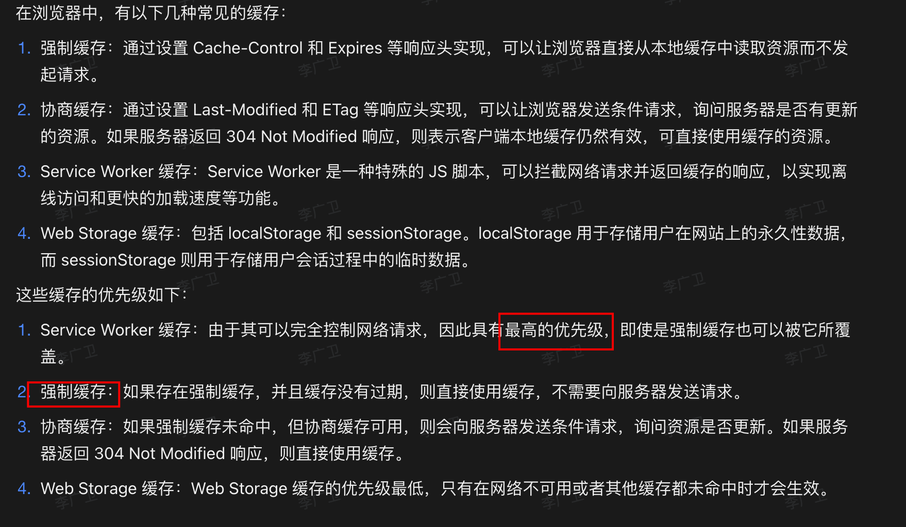

## 7. promise.finnly 实现

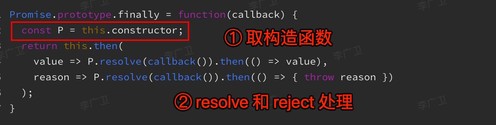

## 8. promise then 的第二个参数和 catch 的区别是什么？

### 8.1. 错误捕获范围

1. `.then(onFulfilled, onRejected)` 的第二个参数 (onRejected):
	- 只能捕获在当前 Promise 对象中发生的错误。
	- 不能捕获 onFulfilled 函数（第一个参数）中抛出的错误。
2. `.catch(onRejected)`:
	- 可以捕获在链式调用中**前面所有 Promise 产生的错误**。
	- 也可以捕获前面 `.then()` 中 onFulfilled 函数里抛出的错误。

### 8.2. 代码示例

```javascript hl:6,20
// 使用 .then() 的第二个参数
promise
  .then(
    result => {
      console.log(result);
      throw new Error('Error in onFulfilled'); // 这个错误不会被捕获
    },
    error => {
      console.error('Error caught by second argument of then:', error);
    }
  );

// 使用 .catch()
promise
  .then(result => {
    console.log(result);
    throw new Error('Error in onFulfilled');
  })
  .catch(error => {
    console.error('Error caught by catch:', error); // 这里可以捕获上面抛出的错误
  });
```

### 8.3. 链式调用中的行为

1. `.then()` 的第二个参数：
	- 在链式调用中，每个 `.then()` 都可以有自己的错误处理函数。
	- 如果一个 `.then()` 的第二个参数处理了错误，错误不会继续传播。
1. `.catch()`:
	- 通常放在 Promise 链的末尾，可以捕获整个链中的任何错误。
	- 更符合"先执行所有操作，最后统一处理错误"的模式。

### 8.4. 代码可读性

- `.catch()` 通常提供更好的代码可读性，特别是在处理多个 Promise 的链式调用时。
- 使用 `.catch()` 可以将错误处理逻辑集中在一处，而不是分散在每个 `.then()` 中。

### 8.5. 示例对比

```javascript
// 使用 .then() 的第二个参数
somePromise
  .then(result => processResult(result), error => handleError(error))
  .then(newResult => furtherProcess(newResult), error => handleAnotherError(error));

// 使用 .catch()
somePromise
  .then(result => processResult(result))
  .then(newResult => furtherProcess(newResult))
  .catch(error => handleAllErrors(error));
```

### 8.6. 最佳实践

- 通常推荐使用 `.catch()` 而不是 `.then()` 的第二个参数，除非你有特定原因需要在某个特定的 Promise 中单独处理错误。
- 在复杂的 Promise 链中，可以在关键点使用 `.catch()`，然后继续链式调用，这样可以进行更细粒度的错误控制。

### 8.7. 注意事项

- `.catch()` 本身返回一个新的 Promise，如果 `.catch()` 中没有抛出错误，后续的 `.then()` 仍会被调用。
- 如果在 `.catch()` 中抛出新的错误，可以被后续的 `.catch()` 捕获。

### 8.8. 总结

- `.then()` 的第二个参数适用于需要对特定 Promise 的错误进行精确处理的情况。
- `.catch()` 更适合全局错误处理，提供了更好的链式调用错误处理能力和代码可读性。
- 在实际开发中，`.catch()` 使用更为普遍，因为它更灵活且能处理更广泛的错误情况。


## 9. this 的问题

```javascript hl:5,8,14
var name = 123;
var obj = {
  name: 456,
  print: function () {
    // 这里的 this 指向 obj，作为对象的方法被调用
    console.log(this.name);
    function a() {
      console.log(this.name);
    }
    a();
  },
};

// 普通函数的 this 指向取决于在何处被调用，这里 a 函数是在全局作用域被调用的，所以 this 指向全局对象
obj.print(); // 123

```

## 10. generator 函数是如何做到中断和恢复执行的？

### 10.1. 基本原理

Generator 函数的核心机制包括：

1. **函数状态保存**：Generator 函数可以保存其内部状态。
2. **yield 关键字**：用于暂停函数执行并可能返回一个值。
3. **迭代器对象**：Generator 函数返回一个迭代器对象，用于控制函数的执行。

### 10.2. 详细实现机制

#### 10.2.1. 函数对象和执行上下文

当定义一个 Generator 函数时，JavaScript 引擎会创建一个特殊的函数对象。这个对象包含：

- 函数体代码
- 闭包变量
- 一个内部指针，指向当前的执行位置

#### 10.2.2. yield 语句的作用

`yield` 语句在 Generator 函数中起到关键作用：

- 它标记了函数的暂停点
- 可以返回一个值给调用者
- 保存当前的执行状态，包括局部变量和表达式的值

#### 10.2.3. 迭代器对象

当调用 Generator 函数时，它不会立即执行函数体，而是返回一个迭代器对象。这个对象有一个 `next()` 方法，用于控制 Generator 的执行：

```javascript
function* exampleGenerator() {
    yield 1;
    yield 2;
    return 3;
}

const gen = exampleGenerator();
console.log(gen.next()); // { value: 1, done: false }
console.log(gen.next()); // { value: 2, done: false }
console.log(gen.next()); // { value: 3, done: true }
```

#### 10.2.4. 执行过程

1. **初始化**：调用 Generator 函数创建迭代器对象，但不执行函数体。
2. **执行**：每次调用 `next()` 方法，函数从当前位置执行到下一个 `yield` 语句。
3. **暂停**：遇到 `yield` 时，函数执行暂停，保存当前状态，并返回 `yield` 后的表达式值。
4. **恢复**：下一次调用 `next()` 时，从上次暂停的位置继续执行。

### 10.3. 内部实现细节

虽然具体实现可能因 JavaScript 引擎而异，但基本原理如下：

#### 10.3.1. 状态机

Generator 函数内部实际上是一个状态机，每个 `yield` 语句对应一个状态：

```javascript
function* generatorFunction() {
    yield 1;
    yield 2;
    yield 3;
}

// 可以被概念化为：
function generatorFunction() {
    let state = 0;
    return {
        next() {
            switch (state) {
                case 0:
                    state = 1;
                    return { value: 1, done: false };
                case 1:
                    state = 2;
                    return { value: 2, done: false };
                case 2:
                    state = 3;
                    return { value: 3, done: false };
                case 3:
                    return { value: undefined, done: true };
            }
        }
    };
}
```

#### 10.3.2. 闭包和上下文保存

Generator 使用闭包来保存函数的执行上下文，包括局部变量和执行位置：

```javascript
function* counter() {
    let count = 0;
    while (true) {
        yield ++count;
    }
}

// 可以被概念化为：
function counter() {
    let count = 0;
    return {
        next() {
            count++;
            return { value: count, done: false };
        }
    };
}
```

#### 10.3.3. 异步操作处理

Generator 特别适合处理异步操作，通过与 Promise 结合使用：

```javascript
function* fetchData() {
    try {
        const response = yield fetch('https://api.example.com/data');
        const data = yield response.json();
        console.log(data);
    } catch (error) {
        console.error('Error:', error);
    }
}

function runGenerator(genFn) {
    const gen = genFn();
    function step(result) {
        if (result.done) return result.value;
        return Promise.resolve(result.value).then(
            value => step(gen.next(value)),
            error => step(gen.throw(error))
        );
    }
    return step(gen.next());
}

runGenerator(fetchData);
```

### 10.4. 性能考虑

- Generator 函数的中断和恢复操作比普通函数调用要慢一些。
- 但在处理大量数据或复杂异步流程时，Generator 可以提供更好的内存效率和代码组织。

### 10.5. 总结

Generator 函数通过巧妙的状态管理和闭包机制，实现了函数执行的中断和恢复。这种机制为处理复杂的同步和异步流程提供了强大而灵活的工具，尽管在某些情况下可能会带来轻微的性能开销。理解 Generator 的工作原理有助于更好地利用这一强大特性，特别是在处理异步操作和复杂数据流时。

## 11. 列举浏览器的几个宏任务和微任务

- dom 事件
- script 标签的加载与执行

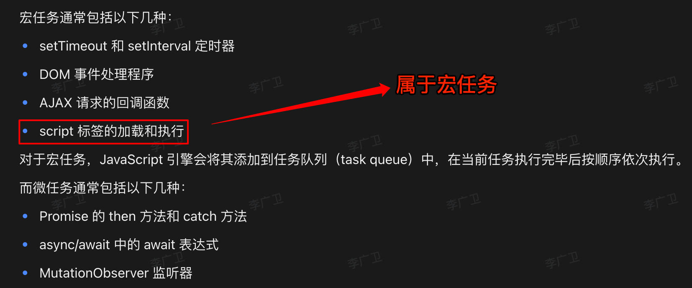

## 12. 说说 toPrimitive 的理解

`toPrimitive` 是 JavaScript 中一个重要的内部操作，用于将对象转换为原始值

### 12.1. 基本概念

`Symbol.toPrimitive` 是一个内置的 Symbol 值，它指定了一个方法，该方法将对象转换为原始值。当需要将对象转换为原始值时，JavaScript 引擎会自动调用这个方法。

### 12.2. 转换规则

对象转换为原始值时有三种模式（`hint`）：

1. **"number"** - 期望得到一个数字
2. **"string"** - 期望得到一个字符串
3. **"default"** - 没有明确期望，由对象自行决定

### 12.3. 实现示例

```javascript
// 自定义对象的 toPrimitive 行为
const obj = {
    [Symbol.toPrimitive](hint) {
        switch (hint) {
            case 'number':
                return 42;
            case 'string':
                return 'hello';
            case 'default':
                return 'default';
            default:
                throw new Error('Invalid hint');
        }
    }
};

// 测试不同转换场景
console.log(+obj);          // 42 (number hint)
console.log(`${obj}`);      // "hello" (string hint)
console.log(obj + '');      // "default" (default hint)
```

### 12.4. 默认转换过程

如果没有实现 `Symbol.toPrimitive`，JavaScript 会按照以下顺序尝试转换：

#### 12.4.1. 对于 hint "string"

1. 先调用 `toString()`
2. 如果返回的不是原始值，则调用 `valueOf()`
3. 如果还不是原始值，则抛出 TypeError

```javascript
const obj = {
    toString() {
        return "Custom String";
    },
    valueOf() {
        return 100;
    }
};

console.log(String(obj)); // "Custom String"
```

#### 12.4.2. 对于 hint "number" 或 "default"

1. 先调用 `valueOf()`
2. 如果返回的不是原始值，则调用 `toString()`
3. 如果还不是原始值，则抛出 TypeError

```javascript
const obj = {
    toString() {
        return "Custom String";
    },
    valueOf() {
        return 100;
    }
};

console.log(Number(obj)); // 100
```

### 12.5. 常见使用场景

#### 12.5.1. 数学运算

```javascript
const obj = {
    value: 42,
    [Symbol.toPrimitive](hint) {
        if (hint === 'number') {
            return this.value;
        }
        return null;
    }
};

console.log(obj * 2); // 84
```

#### 12.5.2. 字符串拼接

```javascript
const obj = {
    firstName: 'John',
    lastName: 'Doe',
    [Symbol.toPrimitive](hint) {
        if (hint === 'string') {
            return `${this.firstName} ${this.lastName}`;
        }
        return null;
    }
};

console.log(`Name: ${obj}`); // "Name: John Doe"
```

### 12.6. 日期对象示例

Date 对象是一个很好的内置 toPrimitive 实现示例：

```javascript
const date = new Date();

// string hint
console.log(String(date)); // 当前日期的字符串表示

// number hint
console.log(+date); // 时间戳

// default hint
console.log(date + ''); // 当前日期的字符串表示
```

### 12.7. 总结

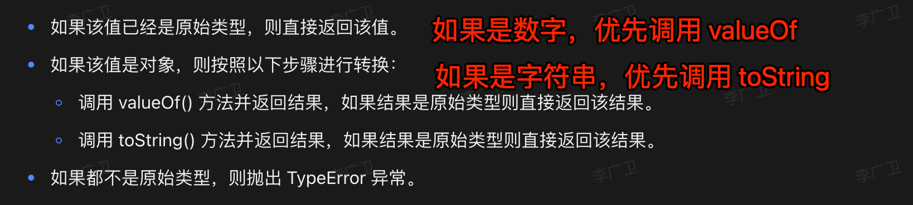

## 13. 下面函数的执行情况

```javascript hl:3
var b = 10;
(function b() {
  // 在具名函数表达式中，函数名标识符在函数内部是只读的（read-only）
  // 严格模式下会报错 // TypeError: Assignment to constant variable
  // 所以这里修改 b 的值是无效的
  b = 20;
  console.log(b);
});

console.log(b); // 10
```

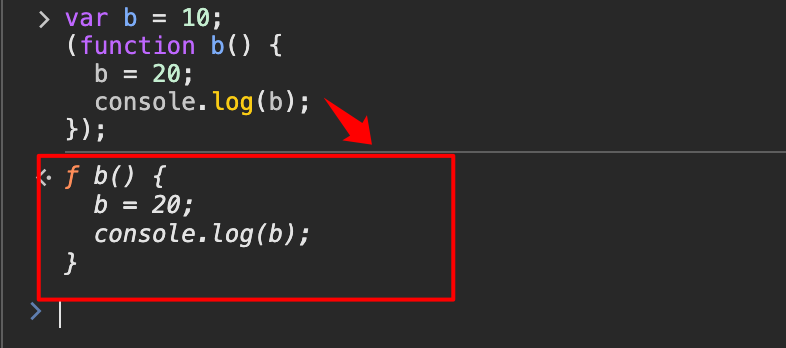

### 13.1. 严格模式下的行为

在严格模式下，尝试修改只读标识符会抛出错误：

```javascript
var b = 10;
(function b() {
    'use strict';
    b = 20;  // TypeError: Assignment to constant variable
    console.log(b);
})();
```

### 13.2. 使用不同的变量名

```javascript
var b = 10;
(function c() {
    b = 20;
    console.log(b);  // 输出 20
})();
console.log(b);  // 输出 20
```

### 13.3. 在函数内部声明同名变量

```javascript hl:3
var b = 10;
(function b() {
    var b = 20;  // 创建新的局部变量
    console.log(b);  // 输出 20
})();
console.log(b);  // 输出 10
```

## 14. 请简述 Reflect 作用

Reflect 是 ES6 (ECMAScript 2015) 引入的一个新的全局对象，它提供了一组方法来操作对象。Reflect 的主要作用可以概括如下：

### 14.1. 统一操作对象的 API

Reflect 提供了一套统一的方法来执行 JavaScript 对象的常见操作，如属性的读取、设置、删除等。这些方法与对应的 Object 方法相似，但更加规范化和功能统一。

### 14.2. 简化代理（Proxy）的创建

Reflect 的方法与 Proxy 的处理程序（handler）方法一一对应，使得在实现代理时更加方便和直观。

### 14.3. 提供函数式编程风格的对象操作
Reflect 的方法都是函数，可以作为参数传递，有利于函数式编程。

### 14.4. 替代一些 Object 的方法

某些 Object 上的方法在 Reflect 中有对应的、更合理的实现。

### 14.5. 返回更合理的结果

某些操作（如 defineProperty）在 Reflect 中会返回布尔值表示成功与否，而不是抛出异常。

让我们通过一些例子来具体说明 Reflect 的作用：

```javascript
// 1. 获取属性
const obj = { x: 1, y: 2 };
console.log(Reflect.get(obj, 'x')); // 1

// 2. 设置属性
Reflect.set(obj, 'z', 3);
console.log(obj); // { x: 1, y: 2, z: 3 }

// 3. 删除属性
Reflect.deleteProperty(obj, 'y');
console.log(obj); // { x: 1, z: 3 }

// 4. 检查对象是否有某个属性
console.log(Reflect.has(obj, 'x')); // true

// 5. 获取对象的所有属性
console.log(Reflect.ownKeys(obj)); // ['x', 'z']

// 6. 创建新对象
const newObj = Reflect.construct(function(a, b) {
  this.sum = a + b;
}, [1, 2]);
console.log(newObj.sum); // 3

// 7. 调用函数并指定 this
function greet() {
  return `Hello, ${this.name}!`;
}
console.log(Reflect.apply(greet, { name: 'Alice' }, [])); // "Hello, Alice!"

// 8. 定义新属性
Reflect.defineProperty(obj, 'w', {
  value: 4,
  writable: true,
  enumerable: true,
  configurable: true
});
console.log(obj.w); // 4
```

### 14.6. 其他

1. Reflect 主要用于操作普通对象，不直接支持 Map、Set 等集合类型
2. Map 等集合类型有自己的实例方法进行操作
3. 如果需要使用 Reflect 操作 Map，可以：
    - 通过 Reflect.apply 调用 `Map 的原型方法`
    - 使用 `Proxy` 代理 Map 的操作

## 15. 代码执行

```javascript hl:11
Promise.reject(1)
  .then(
    (res) => {
      console.log(2, res);
    },
    (err) => {
      console.log(3, err);
    },
  )
  .catch((err) => {
    // 这里不会执行，因为前面已经有了错误处理
    console.log(4, err);
  });

```

## 16. 如何把一个对象变成可迭代对象

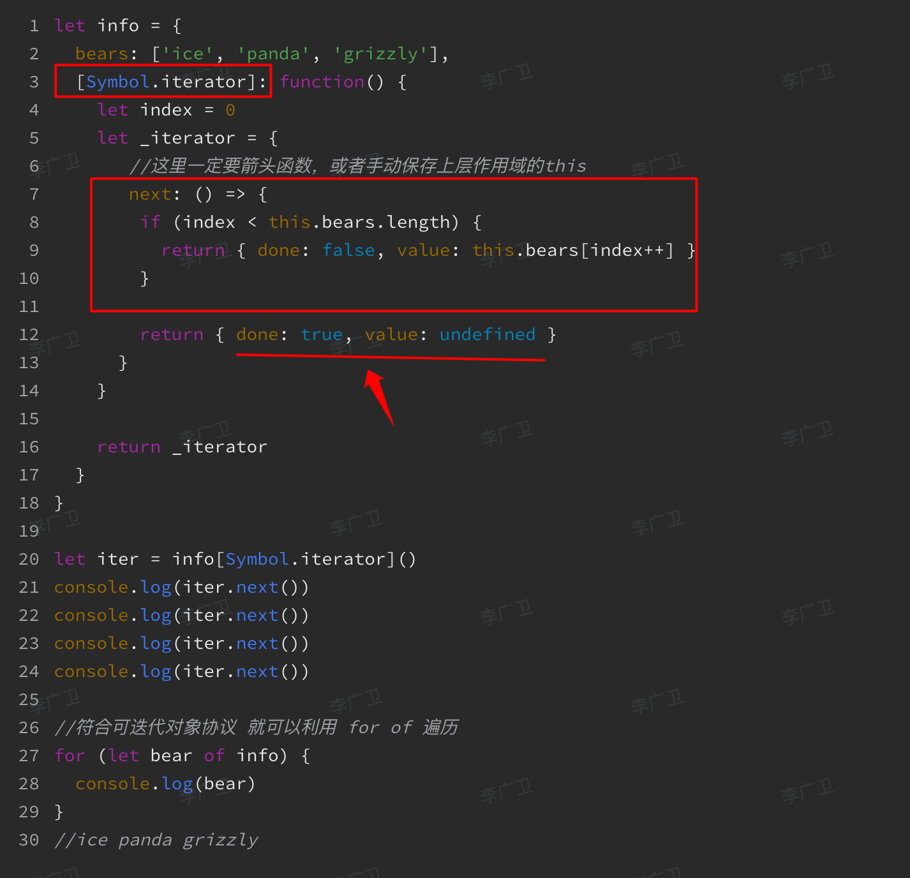

## 17. 在 JavaScript 中获取字符串的字节长度，尤其是要支持表情符号（emoji）

### 17.1. 使用 Blob 对象（最简单推荐的方式）

```javascript hl:3,2
function getByteLength(str) {
    // 创建一个 Blob 对象，并指定编码为 UTF-8
    const blob = new Blob([str], { type: 'text/plain' });
    return blob.size;
}

// 测试
console.log(getByteLength('hello')); // 5
console.log(getByteLength('你好')); // 6
console.log(getByteLength('👨‍👩‍👧‍👦')); // 25
console.log(getByteLength('🌞')); // 4
```

### 17.2. 使用 TextEncoder（现代浏览器推荐）

```javascript
function getByteLength(str) {
    return new TextEncoder().encode(str).length;
}

// 测试
console.log(getByteLength('hello')); // 5
console.log(getByteLength('你好')); // 6
console.log(getByteLength('👨‍👩‍👧‍👦')); // 25
console.log(getByteLength('🌞')); // 4
```

### 17.3. 手动计算（兼容性最好，但不推荐）

```javascript
function getByteLength(str) {
    let length = 0;
    for (let i = 0; i < str.length; i++) {
        const code = str.charCodeAt(i);
        if (code <= 0x7f) {
            length += 1;
        } else if (code <= 0x7ff) {
            length += 2;
        } else if (code <= 0xffff) {
            length += 3;
        } else {
            length += 4;
        }
    }
    return length;
}

// 注意：这种方法对于某些特殊的emoji可能不够准确
```

### 17.4. 完整的测试示例
```javascript
function compareByteLength() {
    const testStrings = [
        'hello',                    // 普通英文
        '你好',                     // 中文
        '👨‍👩‍👧‍👦',                      // 复杂emoji（家庭）
        '🌞',                       // 简单emoji
        '你好👋world',              // 混合字符串
        '❤️',                       // 特殊emoji
        '🏳️‍🌈'                     // 彩虹旗emoji
    ];

    const methods = {
        'Blob方法': str => new Blob([str]).size,
        'TextEncoder方法': str => new TextEncoder().encode(str).length
    };

    console.log('字符串\t\t字符长度\tBlob字节\tEncoder字节');
    console.log('----------------------------------------');

    testStrings.forEach(str => {
        console.log(
            `${str}\t\t` +
            `${str.length}\t\t` +
            `${methods['Blob方法'](str)}\t\t` +
            `${methods['TextEncoder方法'](str)}`
        );
    });
}

compareByteLength();
```

### 17.5. 重要说明

#### 17.5.1. **编码说明**

   - 以上方法都是基于 UTF-8 编码计算字节长度
   - UTF-8 是一种变长编码：
     - ASCII 字符占 1 字节
     - 中文字符通常占 3 字节
     - emoji 可能占 4 字节或更多

#### 17.5.2. **方法选择建议**

   - 优先使用 `TextEncoder`，它是专门用于处理文本编码的标准 API
   - 如果需要考虑兼容性，可以使用 `Blob` 方法
   - 避免使用手动计算的方法，因为它可能在处理某些特殊字符时不够准确

#### 17.5.3. **注意事项**

   - 某些复杂的 emoji（如家庭 emoji）实际上是多个 emoji 组合而成的
   - 某些 emoji 可能包含变体选择符（VS16）等特殊字符
   - 在实际应用中，建议根据具体需求选择合适的方法并进行充分测试

#### 17.5.4. **浏览器兼容性**

   - `TextEncoder`: 现代浏览器都支持
   - `Blob`: IE10+ 都支持
   - 手动计算方法: 所有浏览器都支持，但准确性可能有限

## 18. Map、WeakMap、Object 的区别

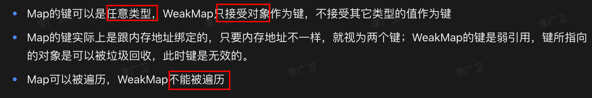

## 19. 如何判断是 PC 还是移动端

- ua
- touch 事件是否在 document中
- 横竖屏幕
- 特定属性，比如通过 js 判断媒体查询是否生效
- 最好还是使用三方工具包
- 等等

## 20. js 如何动态生成海报

- dom - canvas - image
- dom - svg - canvas  - image
- nodejs 调用 pupper 无头浏览器

## 21. 如何顺序执行 10 个任务

- 方法一：for/for-of  - await
- 方法二：reduce
	- prev task
	- current task

## 22. 合并连续的数字

遍历 +  临时变量

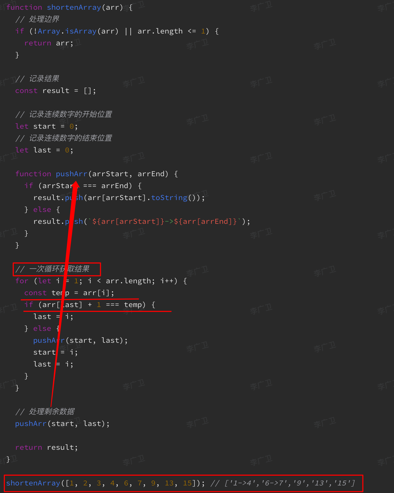

## 23. 如何解决 promise.all 有一个任务报错了，其他任务结果都抛弃了？

- 方案一：promise.allSetteled
- 方案二：容错下，别让 promise 报错
- 方案三：
	- 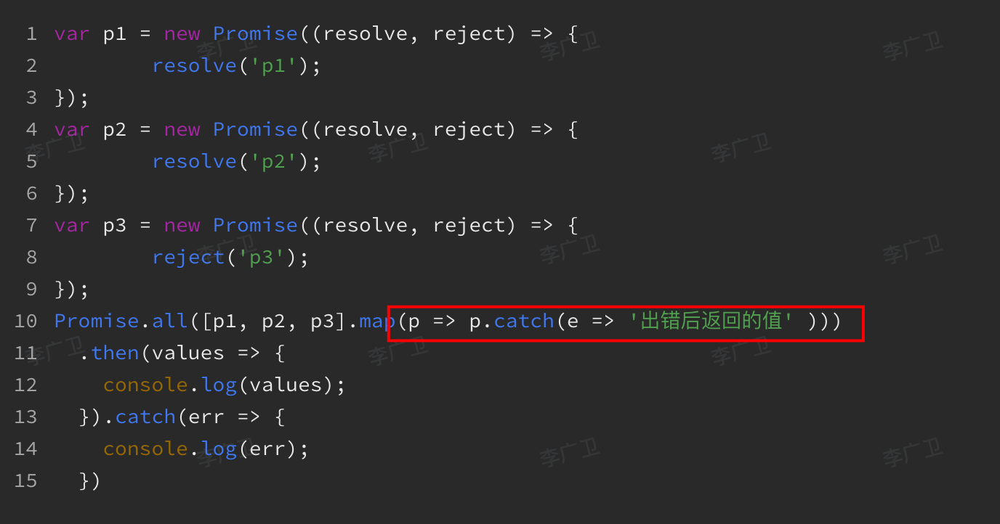

## 24. `["1", "2", "3"].map(parseInt)`

### 24.1. 分析

```javascript hl:8,14,15
["1", "2", "3"].map(parseInt);

// ==> 1, NaN, NaN
// parseInt() 函数接受两个参数，第一个是要被解析的字符串，第二个是进制数。
// map() 方法会给回调函数传递三个参数：当前元素、当前索引、整个数组。

// parseInt("1", 0, ["1", "2", "3"]); // 1 ， 0进制，自动判断
// // 第二个参数传 0 的规则：
// 1. 如果字符串以 "0x" 或 "0X" 开头，按 16 进制解析
// 2. 在现代 JavaScript（ES5+）中，其他情况一律按 10 进制解析
// 3. 在老版本 JavaScript 中，如果字符串以 "0" 开头，会按 8 进制解析
// 4. 如果第二个参数不是一个数值，会按 10 进制解析，和不传第二个参数一样

// parseInt("2", 1, ["1", "2", "3"]); // NaN, 没有1进制，必须取值范围在2-36之间
// parseInt("3", 2, ["1", "2", "3"]); // NaN ，3不是2进制数

```

### 24.2. 关于 parseInt 的第二个参数

```javascript hl:1,13
// 进制必须在 2-36 之间
console.log(parseInt("123", 1));    // NaN
console.log(parseInt("123", 37));   // NaN

// 不同进制的解析
console.log(parseInt("100", 2)); // 4 (二进制)
console.log(parseInt("100", 8)); // 64 (八进制)
console.log(parseInt("100", 10)); // 100 (十进制)
console.log(parseInt("100", 16)); // 256 (十六进制)

// 不同进制下的相同字符串可能得到不同结果
console.log(parseInt("19", 10)); // 19 (十进制)
console.log(parseInt("19", 8)); // 1 (八进制，9不是有效的八进制数字)
```

## 25. 函数使用 `bind`连续绑定多次，后面绑定的都无效

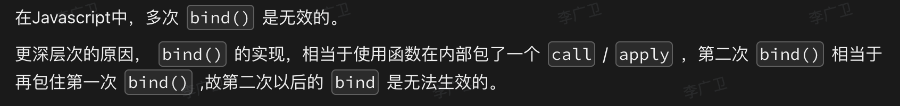

## 26. new fn 与 new fn() 的区别

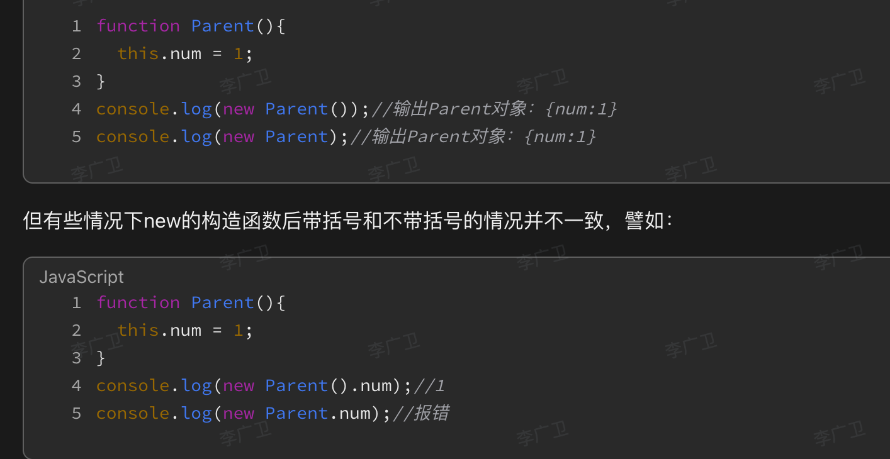

## 27. ajax  fetch axios

- ajax
	- 基于  XHR 对象
- fetch 
	- 没有基于 XHR，不是对 XHR的进一步封装
	- 使用的原生的 js 
	- 基于 Promise
-  axios
	- 浏览器：基于 XHR
	- nodejs：基于 http 模块
	- 其他的包装比如 promise
	- 安全机制

## 28. 给一个 DOM 元素绑定多次 click，一个捕获，一个冒泡，如何执行？

- 绑定多少次就执行多少次
- 先捕获，后冒泡

## 29. 如何获取一个对象的原型对象

- `构造函数.prototype`
- `实例对象.__proto__`
- `Object.getProtoTypeof(对象实例)`

## 30. 移动端适配原理

比如 flexible.js  不展开了，和 rem 一个道理

需要注意的事，如何判断是否 `0.5`
- 很简单 `dpr >= 2` 即可

## 31. 如何实现 repeat 实现字符串拼接

```javascript hl:2,5,10
// 最简单直接的方法
const str1 = "abc".repeat(3); // "abcabcabc"

const str2 = Array(4).join("abc"); // "abcabcabc"
// 解释：创建长度为4的数组，join会执行3次，所以重复3次
// Array(4) 创建 [empty × 4]
// join("abc") 会在数组元素之间插入"abc"

const str3 = Array(3).fill("abc").join(""); // "abcabcabc"
// 或者
const str3_2 = new Array(3).fill("abc").join("");

```

## 32. 实现 mergePromise 函数，把传进去的数组按顺序先后执行，并且把返回的数据先后放到数组 data 中

```javascript hl:10,17,25
// mergePromise 函数，把传进去的数组按顺序先后执行，并且把返回的数据先后放到数组 data 中
mergePromise([ajax1, ajax2, ajax3]).then((data) => {
  console.log("done");
  console.log(data); // data 为 [1, 2, 3]
});

function mergePromise(arr) {
  // 在这里写代码
  const data = [];
  let promise = Promise.resolve();
  // 依次执行传入的函数
  // 这里的 promise.then 是为了保证顺序执行
  arr.forEach((fn) => {
    // 每次遍历时，promise 都是上一个 promise.then 返回的 promise
    // 但是，这里 promise 不会被覆盖吗？
    // 不会，因为 promise.then 返回的是一个新的 promise
    promise = promise.then(fn).then((res) => {
      data.push(res);
      // 返回 res 保证下一个 then 中的 res 是上一个的结果
      return data;
    });
  });
}

// 区别于 Promise.all，Promise.all 是并行执行，而这里需要串行执行

```

## 33. Promise 相关问题

### 33.1. finnaly：无论失败或者成功都会执行，且接受不到结果

### 33.2. 注意顺序

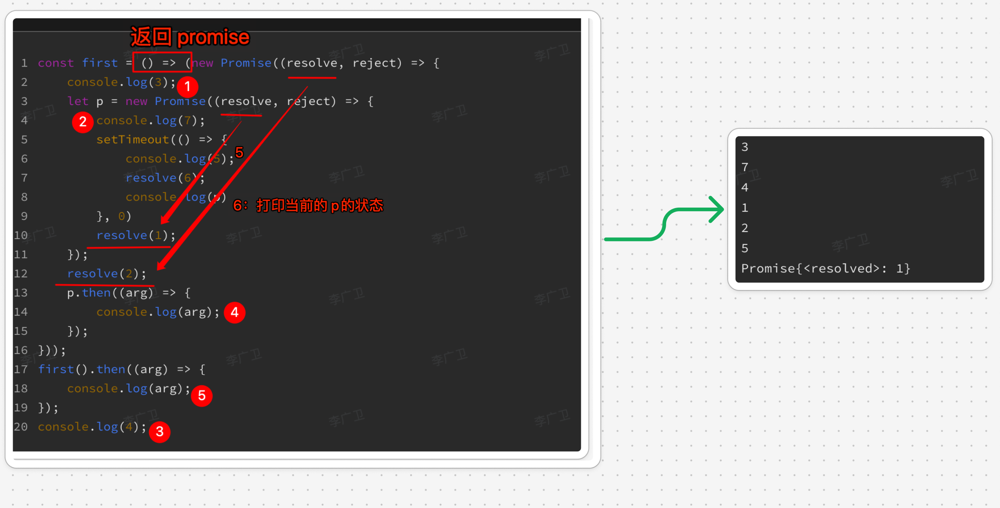

### 33.3. reject 包在 try 里面也会被捕获到

```javascript hl:3,5
async function asyncl() {
  try {
    await Promise.reject("error!!!");
  } catch (e) {
    console.log(e); // 会执行到
  }
}

asyncl();
```

#### 33.3.1. 没有捕获会报错

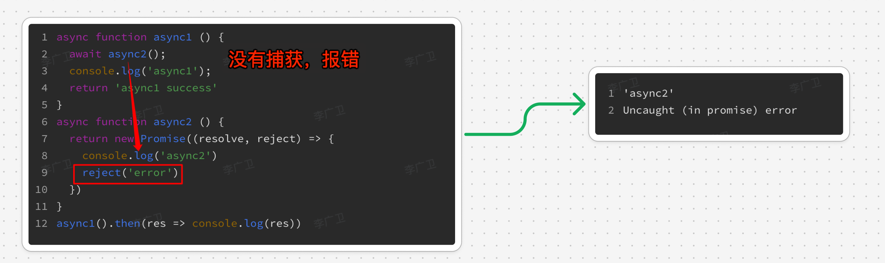

### 33.4. then 和 .catch 返回的值不能使 promise 对象本身，否则会死循环

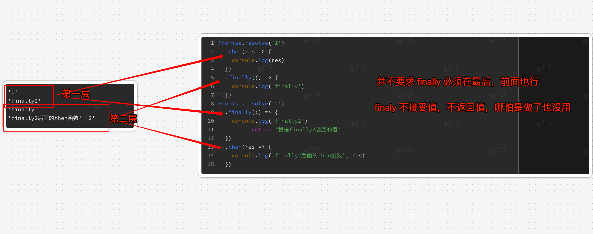

## 34. await 没报错就会往下走，别和 promise 搞混了

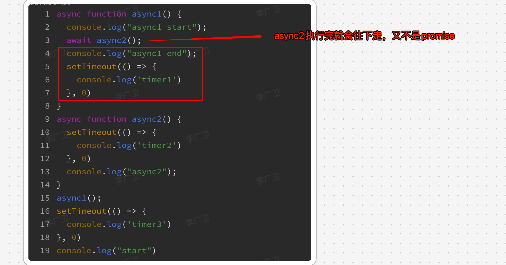

因为 如果 async 函数没有显式的返回值，它仍然会返回一个 Promise，具体行为如下：

```javascript
// 没有 return 语句
async function noReturn() {
    console.log("Hello");
}
// 等价于返回 Promise<undefined>
console.log(noReturn()); // Promise {<fulfilled>: undefined}

// 空 return 语句
async function emptyReturn() {
    console.log("Hello");
    return;
}
// 同样返回 Promise<undefined>
console.log(emptyReturn()); // Promise {<fulfilled>: undefined}

// 即使函数体为空
async function empty() {}
console.log(empty()); // Promise {<fulfilled>: undefined}
```

### 34.1. 下面的代码就一直会 pengding 住了


## 35. PC端通过二维码扫描登录

- pc 展示展示二维码后，会一直**轮询**，请求二维码扫描的状态

## 36. `toFixed()` 和 `toPrecision()` 的区别

### 36.1. toFixed()

`toFixed()` 方法用于指定小数点后的位数。

特点：
- 返回一个字符串
- 参数指定小数点后的位数
- 会进行四舍五入
- 如果必要，会用0填充小数部分

示例：
```javascript
let num = 12.3456;

console.log(num.toFixed(2));  // "12.35"
console.log(num.toFixed(0));  // "12"
console.log(num.toFixed(6));  // "12.345600"

let bigNum = 1234.5;
console.log(bigNum.toFixed(2));  // "1234.50"
```

### 36.2. toPrecision()

`toPrecision()` 方法用于指定数字的总位数（包括整数部分和小数部分）。

特点：
- 返回一个字符串
- 参数指定数字的总位数（精度）
- 会进行四舍五入
- 可能会使用科学记数法表示结果

示例：
```javascript
let num = 12.3456;

console.log(num.toPrecision(2));  // "12"
console.log(num.toPrecision(3));  // "12.3"
console.log(num.toPrecision(6));  // "12.3456"

let bigNum = 1234.5;
console.log(bigNum.toPrecision(2));  // "1.2e+3"
console.log(bigNum.toPrecision(4));  // "1235"
```

### 36.3. 主要区别

1. 精度范围：
   - `toFixed()` 只处理小数部分
   - `toPrecision()` 考虑整个数字的位数

2. 结果格式：
   - `toFixed()` 始终返回固定小数点格式
   - `toPrecision()` 可能返回科学记数法格式

3. 参数含义：
   - `toFixed(n)` 中的 n 表示小数点后的位数
   - `toPrecision(n)` 中的 n 表示总的有效数字位数

4. 对整数的处理：
   - `toFixed()` 会在整数后添加小数点和指定数量的零
   - `toPrecision()` 可能会将整数转换为科学记数法

5. 大数处理：
   - `toFixed()` 对于非常大的数字可能会返回指数形式
   - `toPrecision()` 更容易对大数使用科学记数法

示例比较：
```javascript
let num = 123.456;

console.log(num.toFixed(2));       // "123.46"
console.log(num.toPrecision(2));   // "1.2e+2"

console.log(num.toFixed(5));       // "123.45600"
console.log(num.toPrecision(5));   // "123.46"

let smallNum = 0.000123;
console.log(smallNum.toFixed(5));       // "0.00012"
console.log(smallNum.toPrecision(5));   // "0.00012300"

let bigNum = 1234567.89;
console.log(bigNum.toFixed(2));       // "1234567.89"
console.log(bigNum.toPrecision(2));   // "1.2e+6"
```

使用建议：
- 当你需要控制小数点后的位数时，使用 `toFixed()`
- 当你需要控制数字的总体精度时，使用 `toPrecision()`
- 对于货币计算，通常使用 `toFixed()`
- 对于科学计算或需要控制有效数字的场景，使用 `toPrecision()`

注意事项：
1. 两种方法都可能因为四舍五入导致精度损失。
2. 返回的都是字符串，如果需要进行数学运算，要先转换回数字。
3. 在处理金融数据时，要特别注意 JavaScript 的浮点数精度问题，可能需要使用专门的库来处理高精度计算。

## 37. JS 如何组阻止事件冒泡

- `return false`
	- 代表同时调用了 `e.stopPropagation` 和 `e.preventDefault`

## 38. `123['toString'].length + 123` 的输出值为多少？

- `123['toString'] ` 是个 toString 函数
-  fn.length 代表`第一个具有默认值之前`的参数个数
	- 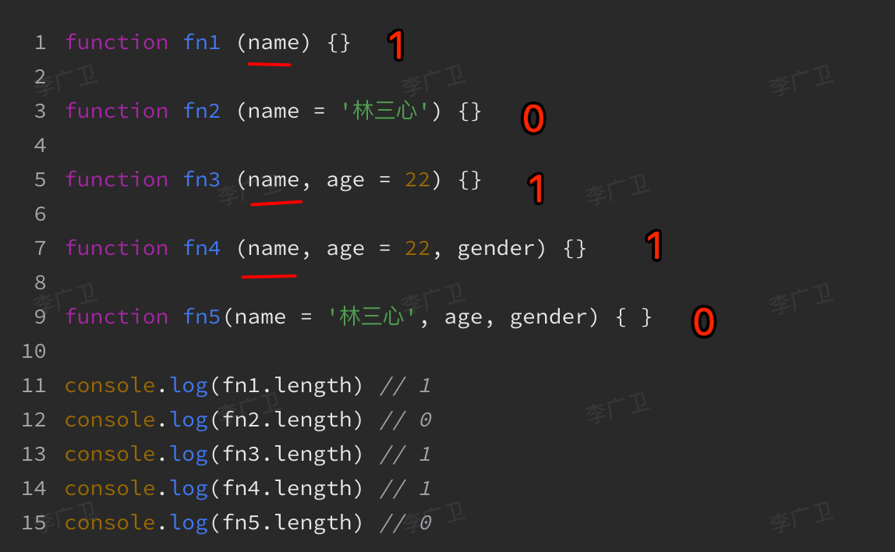
	- 

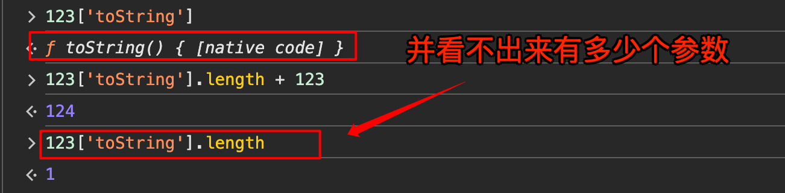

说明 `toString` 方法的形参个数为 1 

## 39. 如何延迟脚本执行

- defer：js 下载和文档解析同步，文档解析好了后再执行脚本
- async：异步下载脚本，不阻塞文档解析，但脚本下载好了后，暂停解析文档，执行脚本
- 动态 DOM 插入脚本
- setTimeout
- 脚本放最后

## 40. 构造函数属性

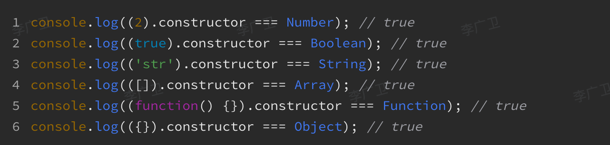

## 41. 再说说 Reflect 

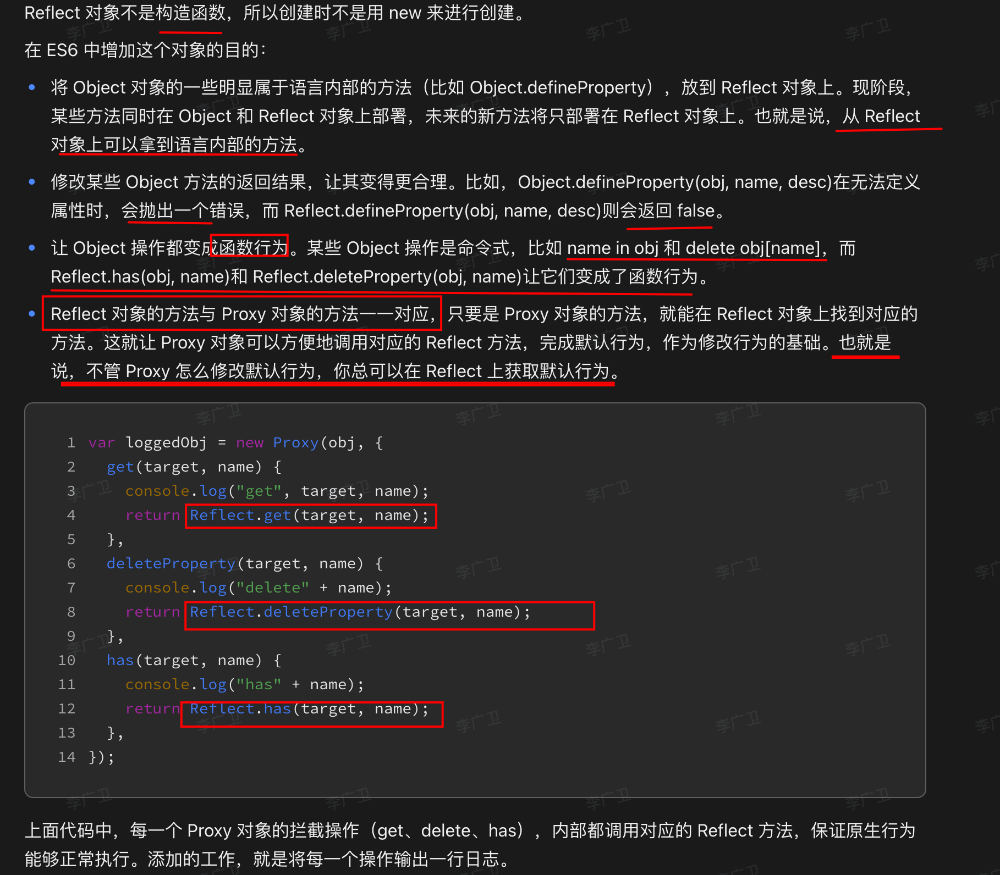

## 42. 尾递归优化

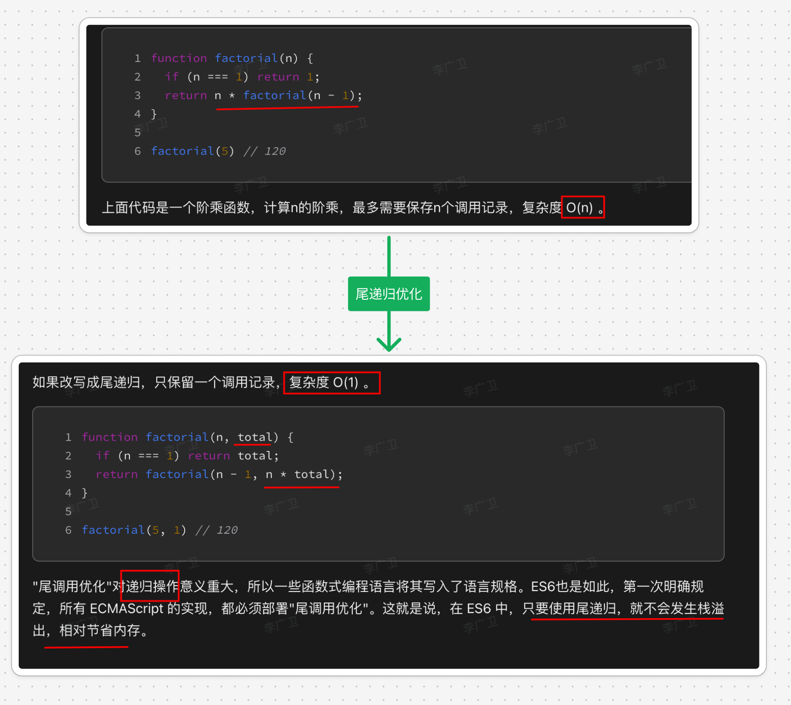

## 43. 简述 Iterator


要点：
- next()
	- {done,value}
- for-of

## 44. 如何中断 promise

promise一旦创建，是无法终止，但以下几种方式可以中断
- then中抛错
- then 返回一个新的 Promise，且已知是 pending 状态，也算是中断了
- 总之：在合适的时候，把 pending的状态给 reject 也就中断了

## 45. 箭头函数

- 不能用作 generator 函数，不用使用 yield 关键字
- 没有原型
- 没有 arguments 对象，如果有，指向当前外层函数
- 不能使用构造函数使用
- 不会创建自己的 `this`

## 46. 如何判断一个对象是空对象

- `keys`
- JSON

## 47. Object.is 与 == 、=== 的区别

## 48. + 0.2 !== 0.3 

在计算机中，数字都是以二进制形式存储的。某些十进制小数在转换成二进制时会产生无限循环小数。

由于存储位数有限，这些无限循环的二进制数必须在某个位置截断，这就导致了**精度损失**。

```javascript
0.1 + 0.2 = 0.30000000000000004
```

### 48.1. 解决方案

#### 48.1.1. 使用 toFixed() 进行显示
```javascript
(0.1 + 0.2).toFixed(1) === '0.3' // true
```

#### 48.1.2. 使用一个极小的误差范围（epsilon）来比较

```javascript
const epsilon = 0.00000000001;
Math.abs((0.1 + 0.2) - 0.3) < epsilon // true
```

#### 48.1.3. 使用专门的库

- decimal.js
- big.js
- bignumber.js

## 49. mouseenter 与 mouseover 的区别

### 49.1. 事件冒泡行为

   - mouseover：会冒泡
   - mouseenter：不会冒泡。它只在鼠标指针进入绑定事件的元素时触发，不会在进入其子元素时重复触发。

### 49.2. 触发频率

   - mouseover：当鼠标移动到元素或其子元素上时都会触发。
	   - 这意味着，如果一个元素有子元素，移动到子元素上也会触发父元素的 mouseover 事件。
   - mouseenter：
	   - 只有当鼠标从元素外部首次进入元素时才会触发。
	   - 移动到其子元素上不会重复触发该事件。

### 49.3. 相应的离开事件

   - mouseover 对应的离开事件是 `mouseout`
   - mouseenter 对应的离开事件是 `mouseleave`

### 49.4. 性能影响

   - mouseover：由于其冒泡特性和频繁触发的性质，在复杂的 DOM 结构中可能会导致性能问题。
   - mouseenter：通常具有更好的性能，因为它不会在子元素间移动时重复触发。

### 49.5. 使用场景

   - mouseover：
	   - 适用于**需要精确跟踪鼠标在元素内部移动的情况**，
	   - 或者当你需要利用事件冒泡来处理大量元素的情况。
   - mouseenter：适用于只需要知道鼠标是否进入了整个元素区域的情况，而不关心内部的移动。

## 50. 如何使得`var [a,b] = {a:1,b:2}` 解构成功

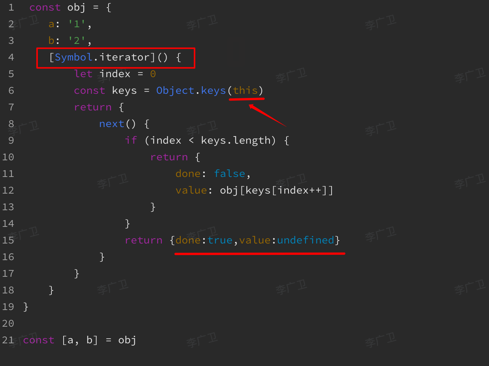

## 51. 实现一个压缩算法，比如 aabcccccaaa会变为a2b1c5a3

### 51.1. 方法一：分割成数组遍历

### 51.2. 方法二：直接遍历字符串

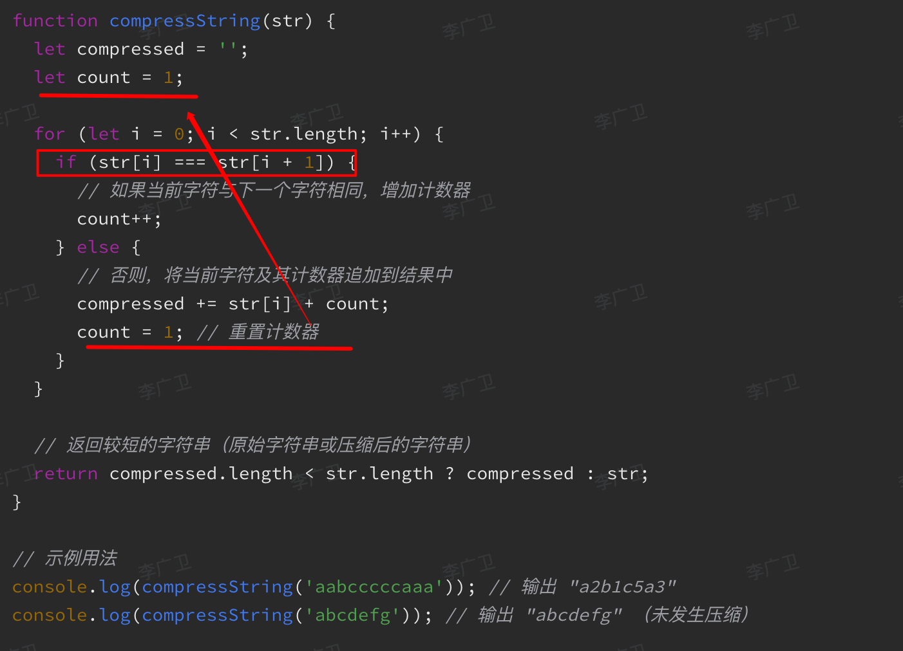

## 52. new 操作具体干了什么

如下图：发生了 4 件事情

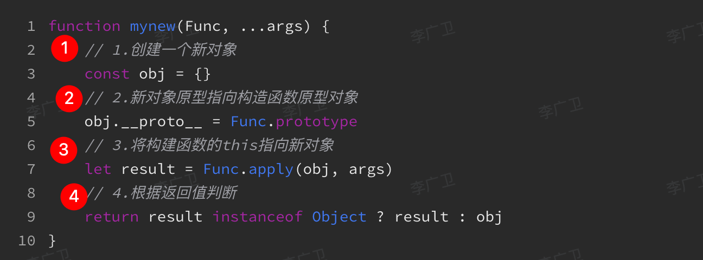

## 53. try-catch不能捕获异步错误

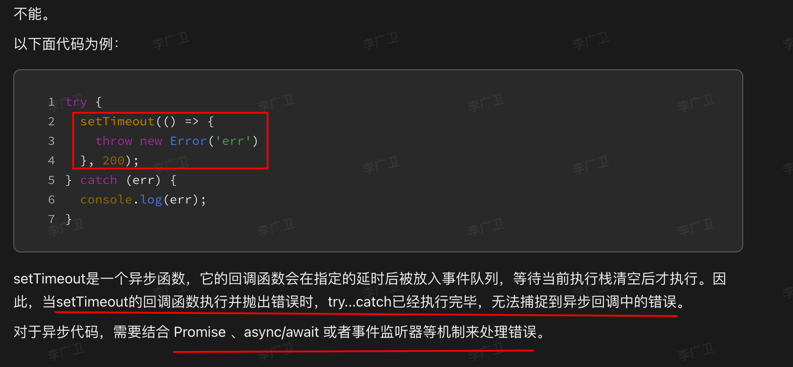

## 54. 如何实现 Tab 之间通讯，不能 websocket


## 55. e.target 和 e.currentTarget 的区别？

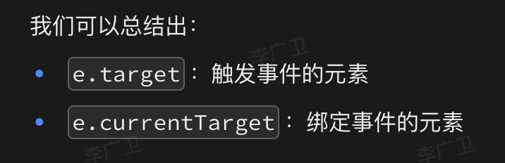

## 56. 如何确保你的构造函数只能被 `new` 调用


