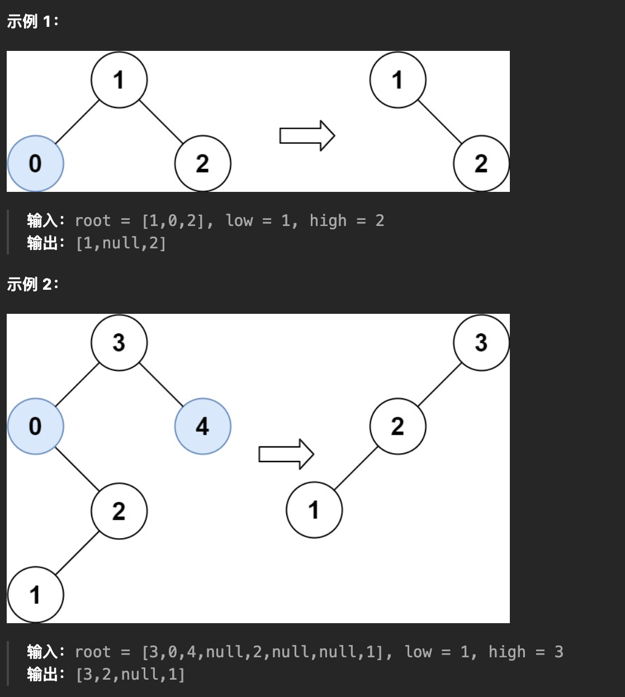

# 修剪二叉搜索树：通过修剪二叉搜索树，使得所有节点的值在 low~ high 之间


> [669. 修剪二叉搜索树](https://leetcode.cn/problems/trim-a-binary-search-tree/)




- 使用分解问题的思维
	- 明确了递归函数的定义之后进行思考，如果一个节点的值没有落在 `[lo, hi]` 中，有两种情况：
		- `root.val < lo`
			- 这种情况下 `root` 节点本身和 `root` 的左子树全都是小于 `lo` 的，都需要被剪掉。
		- `root.val > hi`
			- 这种情况下 `root` 节点本身和 `root` 的右子树全都是大于 `hi` 的，都需要被剪掉


> 分解问题：就是都得有返回值，至于为什么有效 →  递归的魔法

```javascript
var trimBST = function (root, low, high) {
    if (!root) return null;
    // ① 剪掉 root 的左边：即直接返回 root.rigth
    if (root.val < low) {
        return trimBST(root.right, low, high);
    }
    // ②  剪掉 root 的右边：即直接返回 root.left
    if (root.val > high) {
        return trimBST(root.left, low, high);
    }
    root.left = trimBST(root.left, low, high);
    root.right = trimBST(root.right, low, high);
    return root;
};
```

