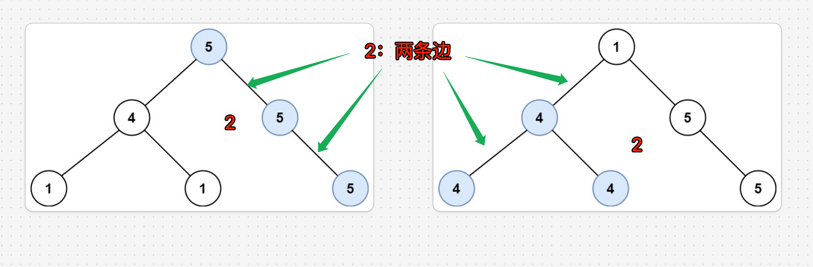

# 最长同值路径：返回边的个数


[687. 最长同值路径](https://leetcode.cn/problems/longest-univalue-path/)




关键点：
- 路径长度是边的数量，不是节点的数量
- 路径可以经过根节点，但不能有分叉
- DFS 返回的是**单向路径长度**，但更新全局最大值时要考虑左右路径之和
返回值定义
- 返回以`当前节点结尾`的最长同值路径长度
- 这个路径必须是向下的单向路径
	- 要么往左
	- 要么往右

```javascript hl:10,11
var longestUnivaluePath = function (root) {
    let res = 0;
    // 返回：以 root 结尾的最长路径长度
    function getLen(root) {
        if (!root) return 0;

        let left = getLen(root.left);
        let right = getLen(root.right);

        let leftPath = 0; // 当前节点往左延伸的路径长度
        let rightPath = 0; // 当前节点往右延伸的路径长度
        // 检查左子节点
        if (root.left && root.left.val === root.val) {
            leftPath = left + 1;
        }
        // 检查右子节点
        if (root.right && root.right.val === root.val) {
            rightPath = right + 1;
        }
        // 更新全局最大长度（左路径+右路径就是经过当前节点的最长路径）
        res = Math.max(res, leftPath + rightPath);
        // 返回从当前节点出发的最长路径（只能选择左或右其中一条）
        return Math.max(leftPath, rightPath);
    }
    getLen(root);
    return res;
};
```