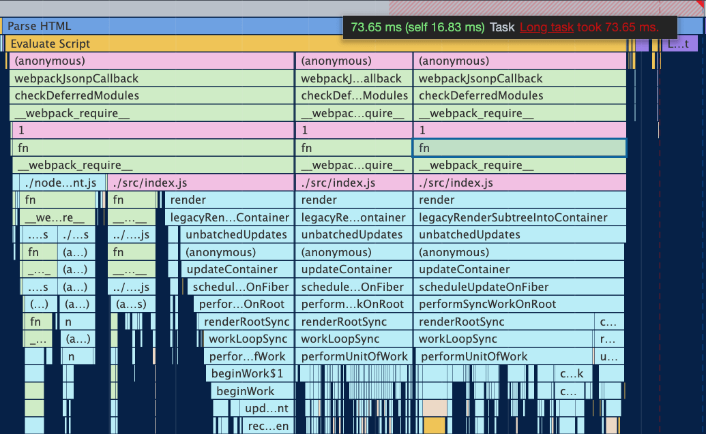
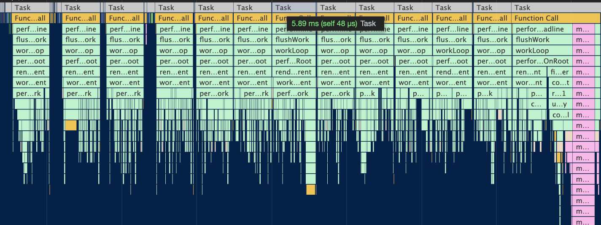
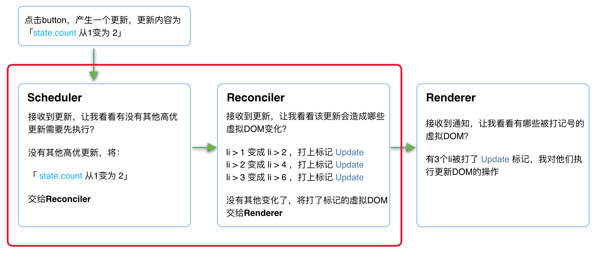
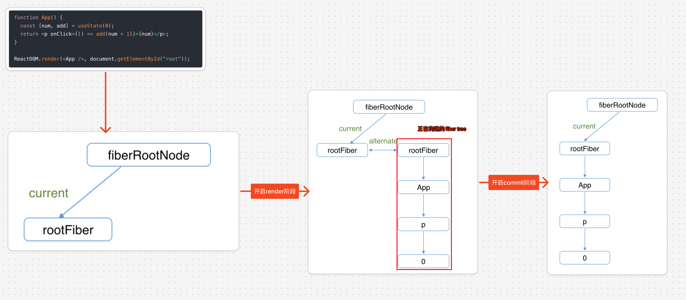
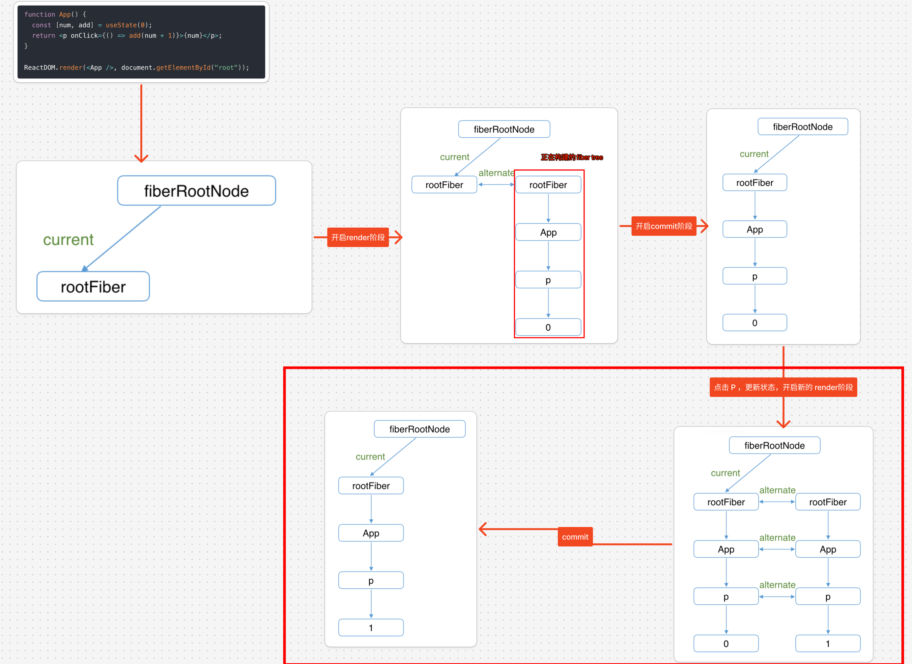

# React 理念

`#react` 


## 目录
<!-- toc -->
 ## 1. 前端框架性能问题都可以归因以下两个 

### 1.1. CPU 瓶颈

- JavaScript 是单线程执行的
- 在主线程上进行大量计算会阻塞渲染
- 长任务（>50ms）会导致页面响应迟钝
	- 比如同时渲染 30000 个 DOM
	- vdom 相关的处理
		- 所以，要求 React 具有将长任务拆解的能力，即 时间切片 `time slice`

未使用时间切片的效果如下：



使用时间切片的效果如下：


### 1.2. I/O 瓶颈

- 主要的 `I/O 瓶颈`是网络
- 又比如 输入打字
- 解决方案
	- 结合人机交互，用户对不同的操作的感知敏感度不一样，比如
		- 键盘输入到显示，稍微延迟，用户也能感觉到
		- 鼠标悬停，稍微延迟，用户也能感觉到
		- 点击按钮，到数据显示，有点延迟用户也能接受
	- 所以，对不同操作，要求 React 具有
		- 有优先级调度的能力，这就要求
			- 调用算法
			- 可中断 VDOM，毕竟不中断，CPU 一直占着

## 2. React 演变

### 2.1. React 15 ：Stack Reconciler 架构

#### 2.1.1. Reconciler 协调器：同步的，VDOM 的实现

```javascript hl:3
// React15 中的递归处理示意
function reconcileChildrenArray(returnFiber, currentFirstChild, newChildren) {
  // 同步递归处理，无法中断
  for (let i = 0; i < newChildren.length; i++) {
    reconcileChildrenArray(/*...*/)
  }
}
```

#### 2.1.2. Renderer 渲染器：负责将 UI变化渲染到宿主环境

### 2.2. React 16 ：支持时间切片的 Fiber Reconciler

- 新引入：`Scheduler 调度器`，调度任务的优先级，高优的优先进入 Reconciler
- `Reconciler 协调器`：VDOM 的实现，计算出 UI 的变化
- Renderer 渲染器：负责将 UI变化渲染到宿主环境

#### 2.2.1. 演示更新效果



### 2.3. Legacy（遗产） 模式（React 16/17 默认模式）

这是 React 最古老的渲染模式，通过 `ReactDOM.render()` 创建应用。

```javascript
// Legacy 模式
import ReactDOM from 'react-dom';

ReactDOM.render(
  <App />,
  document.getElementById('root')
);
```

特点：
1. 同步渲染
2. 不支持新的并发特性
3. 更新是同步的且不可中断

### 2.4. Blocking 模式（React 16.x 实验性）

这是向并发模式过渡的中间模式。

```javascript hl:4
// Blocking 模式
import ReactDOM from 'react-dom';

ReactDOM.createBlockingRoot(
  document.getElementById('root')
).render(<App />);
```

特点：
1. 部分并发模式特性
2. 比 Legacy 模式更接近并发
3. 作为过渡阶段的模式

### 2.5. Concurrent 模式（React 18+）

最新的渲染模式，支持所有新特性。

```javascript hl:5
// Concurrent 模式
import ReactDOM from 'react-dom/client';

// 创建根节点
const root = ReactDOM.createRoot(
  document.getElementById('root')
);

// 渲染应用
root.render(<App />);
```

特点：
1. 完整的并发特性支持
2. 可中断渲染
3. 自动批处理
4. 优先级调度

```javascript hl:12,9
// Concurrent 模式特性示例
function ConcurrentComponent() {
  const [isPending, startTransition] = useTransition();
  const [list, setList] = useState([]);
  const [query, setQuery] = useState('');

  // 搜索处理
  const handleSearch = (e) => {
    // 立即更新输入值（高优先级）
    setQuery(e.target.value);

    // 将搜索结果更新标记为转换（低优先级）
    startTransition(() => {
      const searchResults = performExpensiveSearch(e.target.value);
      setList(searchResults);
    });
  };

  return (
    <div>
      <input
        value={query}
        onChange={handleSearch}
        placeholder="Search..."
      />
      
      {isPending ? (
        <div>Loading...</div>
      ) : (
        <ul>
          {list.map(item => (
            <li key={item.id}>{item.name}</li>
          ))}
        </ul>
      )}
    </div>
  );
}
```

## 3. React Fiber 架构

### 3.1. React  元素、React 组件与FiberNode

#### 3.1.1. React 元素 (React Elements)

React 元素是描述 UI 的普通 JavaScript 对象，是最基本的构建块。

```javascript
// React 元素的结构
const element = {
  type: 'div',
  props: {
    className: 'container',
    children: [
      {
        type: 'h1',
        props: {
          children: 'Hello'
        }
      }
    ]
  }
}

// JSX 创建 React 元素
const jsxElement = (
  <div className="container">
    <h1>Hello</h1>
  </div>
);

// React.createElement 创建元素
const createElement = React.createElement(
  'div',
  { className: 'container' },
  React.createElement('h1', null, 'Hello')
);
```

特点：
1. 不可变对象（Immutable）
2. 描述界面的快照
3. 轻量级普通对象
4. **每次更新都会创建新的元素树**

#### 3.1.2. React 组件 (React Components)

React 组件是可复用的代码片段，可以是函数组件或类组件。

```javascript
// 函数组件
function Welcome(props) {
  return <h1>Hello, {props.name}</h1>;
}

// 类组件
class Greeting extends React.Component {
  render() {
    return <h1>Hello, {this.props.name}</h1>;
  }
}

// 组件的使用
function App() {
  return (
    <div>
      <Welcome name="Alice" />
      <Greeting name="Bob" />
    </div>
  );
}
```

特点：
1. 接受 `props` 作为输入
2. 返回 React 元素
3. 可以包含`状态`和`生命周期`
4. 可以被`多次`复用

#### 3.1.3. FiberNode

Fiber 节点是 React 内部实现的核心数据结构，用于跟踪组件树的状态和变化。

```javascript
// Fiber 节点的简化结构
interface FiberNode {
  // 静态数据结构
  type: any;
  key: null | string;
  elementType: any;
  stateNode: any;

  // Fiber 树结构
  return: Fiber | null;    // 父节点
  child: Fiber | null;     // 第一个子节点
  sibling: Fiber | null;   // 下一个兄弟节点

  // 工作单元
  pendingProps: any;
  memoizedProps: any;
  memoizedState: any;
  updateQueue: UpdateQueue<any> | null;

  // 副作用
  flags: Flags;
  subtreeFlags: Flags;
  deletions: Array<Fiber> | null;

  // 调度优先级
  lanes: Lanes;
  childLanes: Lanes;
}

// Fiber 节点示例
const fiber = {
  type: 'div',
  key: null,
  stateNode: domElement,
  
  // 链接到其他 Fiber 节点
  return: parentFiber,
  child: childFiber,
  sibling: null,

  // 状态相关
  memoizedState: null,
  memoizedProps: { className: 'container' },
  
  // 副作用标记
  flags: Update,
};
```

特点：
1. 构成了可中断的工作单元（动态工作单元）
2. 包含了完整的组件信息，每个 FiberNode 对应一个 React 元素，包括这个 React 对应的所有`静态数据结构`
3. 形成了链表结构
4. 支持优先级调度

#### 3.1.4. 三者的关系与区别

##### 3.1.4.1. 数据结构对比

```javascript
// React 元素 - 普通对象
const element = {
  type: 'div',
  props: { className: 'example' }
};

// React 组件 - 函数或类
function Component(props) {
  return <div className="example" />;
}

// FiberNode - 复杂数据结构
const fiber = {
  type: Component,
  memoizedState: null,
  memoizedProps: {},
  // ... 更多 Fiber 相关属性
};
```

##### 3.1.4.2. 生命周期和更新机制

```javascript
// React 元素 - 不可变
const element1 = <div>Hello</div>;
const element2 = <div>Hello</div>; // 完全新的对象

// React 组件 - 可维护状态
class StatefulComponent extends React.Component {
  state = { count: 0 };
  
  componentDidMount() {
    // 生命周期方法
  }
  
  render() {
    return <div>{this.state.count}</div>;
  }
}

// FiberNode - 跟踪更新
function processUpdateQueue(fiber) {
  const queue = fiber.updateQueue;
  // 处理更新队列
  // 设置新的状态
  fiber.memoizedState = newState;
}
```

##### 3.1.4.3. 用途对比

```jsx
// 1. React 元素 - UI 描述
const buttonElement = (
  <button className="btn">
    Click me
  </button>
);

// 2. React 组件 - 逻辑封装
function Button({ onClick, children }) {
  const [isPressed, setIsPressed] = useState(false);
  
  return (
    <button
      className={`btn ${isPressed ? 'pressed' : ''}`}
      onClick={onClick}
    >
      {children}
    </button>
  );
}

// 3. FiberNode - 内部调度
class FiberScheduler {
  workLoop(deadline) {
    let shouldYield = false;
    while (nextUnitOfWork && !shouldYield) {
      nextUnitOfWork = performUnitOfWork(nextUnitOfWork);
      shouldYield = deadline.timeRemaining() < 1;
    }
    requestIdleCallback(workLoop);
  }
}
```

#### 3.1.5. 主要区别

1. **职责不同**
   - React 元素：描述 UI 的纯数据结构
   - React 组件：封装可重用的 UI 逻辑
   - FiberNode：管理组件更新和调度
2. **可变性**
   - React 元素：不可变
   - React 组件：状态可变
   - FiberNode：完全可变
3. **生命周期**
   - React 元素：无生命周期
   - React 组件：有完整生命周期
   - FiberNode：负责管理组件的生命周期
4. **使用场景**
   - React 元素：作为组件的渲染结果
   - React 组件：构建应用界面
   - FiberNode：React 内部实现机制

### 3.2. 完整的 FiberNode 节点

```javascript hl:7,14,22,37,41
function FiberNode(
  tag: WorkTag,
  pendingProps: mixed,
  key: null | string,
  mode: TypeOfMode,
) {
  // 作为静态数据结构的属性
  this.tag = tag;
  this.key = key;
  this.elementType = null;
  this.type = null;
  this.stateNode = null;

  // 用于连接其他Fiber节点形成Fiber树
  this.return = null;
  this.child = null;
  this.sibling = null;
  this.index = 0;

  this.ref = null;

  // 作为动态的工作单元的属性
  this.pendingProps = pendingProps;
  this.memoizedProps = null;
  this.updateQueue = null;
  this.memoizedState = null;
  this.dependencies = null;

  this.mode = mode;

  this.effectTag = NoEffect;
  this.nextEffect = null;

  this.firstEffect = null;
  this.lastEffect = null;

  // 调度优先级相关
  this.lanes = NoLanes;
  this.childLanes = NoLanes;

  // 指向该fiber在另一次更新时对应的fiber
  this.alternate = null;
}

```
### 3.3. 两棵Fiber 树：双缓存机制

- 真实 UI 对应的 Fiber Tree：前缓冲区、即`浏览器上显示的 UI`
	- workInProgress Fiber 树
- 正在内存中构建 Fiber Tree：后缓冲区
	- workInProgress Fiber 树

#### 3.3.1. 举个示例：mount 一个组件时



#### 3.3.2. 举个示例：点击 p 节点，update 一个组件时



