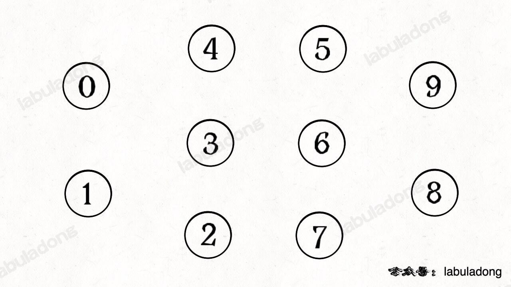
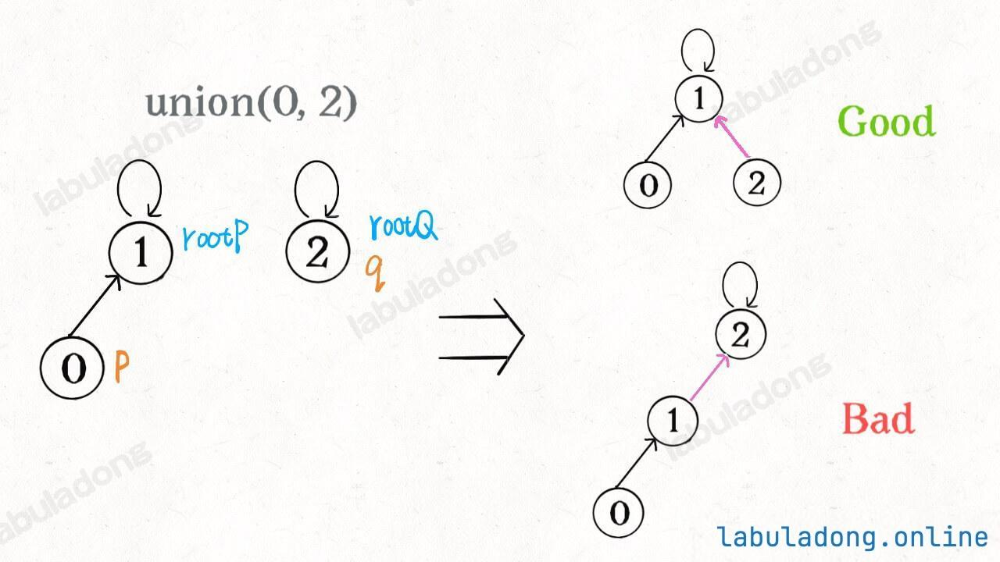
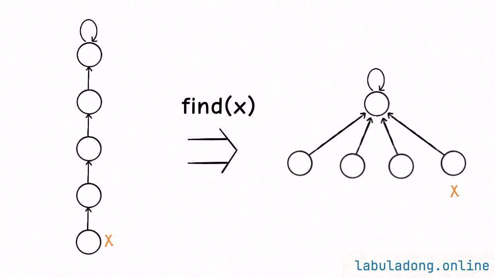

# 并查集（Union Find）


- [ ] 继续整理


## 目录
<!-- toc -->
 ## 1. 名词解释 

### 1.1. 个`连通分量`

下图中每个节点自成一派，没有和其他节点相连



### 1.2. 个`连通分量`

- 图结构中


### 1.3. 两个节点`是否连通` → 多个节点`是否连通`

上图中的节点 `0,1,2` 之间就有了连接关系，它们三个节点共同构成了一个`连通分量`，我们可以说这三个节点是`连通`的

## 2. 并查集（Union Find）结构

- 并查集本质上还是**树结构的延伸**
- 并查集底层其实是一片==森林==，这片==森林==由很多==多叉树==组成，==每棵树代表一个连通分量==
	- `connected(p, q)`：**是否联通**
		- 只需要判断 `p` 和 `q` 所在的多叉树的根节点
		- 若相同，则 `p` 和 `q` ==在同一棵树==中，即连通，否则不连通
	- `count()`：连通分量的个数
		- 只需要统计一下==总共有多少棵树==，即可得到**连通分量的数量**。
	- `union(p, q)`：连接两个点
		-  `p` 所在树的==根节点== →    `q` 所在树的**根节点**

```typescript
interface UF {
    /**
     * 连接节点 p 和节点 q
     * @param p 节点 p
     * @param q 节点 q
     * @time O(1)
     */
    union(p: number, q: number): void;

    /**
     * 判断节点 p 和节点 q 是否连通
     * @param p 节点 p
     * @param q 节点 q
     * @returns 如果节点 p 和节点 q 在同一个连通分量中返回 true，否则返回 false
     * @time O(1)
     */
    connected(p: number, q: number): boolean;

    /**
     * 返回图中的连通分量数量
     * @returns 连通分量的数量
     * @time O(1)
     */
    count(): number;
}

```

## 3. 并查集的原理

### 节点结构

并查集中每个节点其实不在乎自己的子节点是谁，**只在乎自己的根节点是谁**，所以==节点类型==为

```ts
interface UFNode {
    // 节点 id 编号
    id: number;
    // 指向父节点的指针
    parent: UFNode;
}
```

### 平衡优化




==如果能保持树高为常数==，那么上述方法的复杂度就都是 `O(1)` 了
- 查找（`find`）：平均 O(1)
- 合并（`union`）：平均 O(1)
- 连通性判断（`connected`）：平均 O(1)

### 路径压缩


