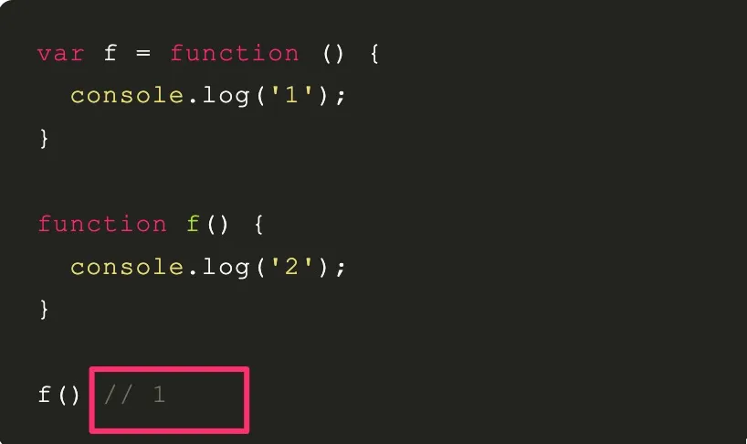

# 常见面试题四

`#前端面试` 


## 目录
<!-- toc -->
 ## 1. 伪类与伪元素 

- **伪类**使用单冒号 `:`
- **伪元素**使用双冒号 `::`（CSS3 规范）
    - 注：为了兼容旧浏览器，一些伪元素也可以使用单冒号，比如 `:after` 和 `::after` 都行

### 1.1. 常见伪类

```less
/* 未访问的链接 */
a:link {
    color: blue;
}

/* 已访问的链接 */
a:visited {
    color: purple;
}

/* 鼠标悬停 */
button:hover {
    background-color: yellow;
}

/* 激活状态 */
button:active {
    background-color: red;
}

/* 获得焦点 */
input:focus {
    border-color: blue;
}

/* 第一个子元素 */
li:first-child {
    font-weight: bold;
}

/* 最后一个子元素 */
li:last-child {
    margin-bottom: 0;
}

/* 奇数项 */
tr:nth-child(odd) {
    background-color: `#f2f2f2;`
}

```

### 1.2. 常见伪元素

```less
/* 在元素内容之前插入 */
.element::before {
    content: "★";
    color: red;
}

/* 在元素内容之后插入 */
.element::after {
    content: "→";
    margin-left: 5px;
}

/* 选择第一行 */
p::first-line {
    font-weight: bold;
    color: blue;
}

/* 选择第一个字母 */
p::first-letter {
    font-size: 2em;
    float: left;
}

/* 选择文本 */
p::selection {
    background-color: yellow;
    color: black;
}

```


## 2. `行内元素`的 padding 和 margin 是否有效

- 水平有效
- 垂直无效

## 3. `link` 和 `@import` 有什么区别

- `@import` 只能引入样式，并且页面加载完成才会加载
- `link` 可引入样式、rss、`rel`，网站图标等；
	- 比如 `<link rel="preload" href="critical.css" as="style"> `
	- rel 还可以为 icon  modulepreload  manifest next/prev   preconnect   dns-prefetch   prefetch 等等
	- CSS 文件会**并行下载**，不会阻塞其他 CSS 文件的下载
	- 但会阻塞页面渲染（render-blocking）


## 4. min-width > max-width > width 

即使设置了 important


## 5. CSS 中哪些属性可以继承


## 6. 常见的浏览器内核

- safari：webkit
- chrome： blink ，webkit 的一个分支
- edge 也使用  webkit 了
- firfox: Gecko 内核

## 7. 如何判断浏览器是否支持 webp 格式

`image.src = 'xxx.wep'` ，如果能获取到宽高，则支持


## 8. src、href区别

- `src` ，资源引用，如script、image、video、audio等
- `href`，超文本引用，可`并行下载请求`，`link/a` 等标签

## 9. label 的作用

点击 label 时，对应的表单获得焦点

## 10. title与h1的区别、b与strong的区别、i与em的区别

- 强调：`strong、em`，seo 侧重些
- 只是样式斜体或者加粗：`b、i`
- `title`就是网页标题
- `H1`有层次的标题

## 11. img的`srcset`属性的作⽤

适配视网膜屏，比如`2x、3x`等等

## 12. svg 与 canvas

- svg 本质还是 dom
- canvas 适合编程

## 13. 说说`defer`/`async`的区别

- 两者都没有
	- 立即加载并执行，不等待后续的文档是否加载好
- defer : 延迟
	- 文档解析和脚本加载是异步的
	- 等 DOM 解析完后才开始执行脚本
	- 类似于 script 标签放到 body 之后
- async 
	- 文档解析和脚本加载是异步的
	- 但下载后脚本后会停止 HTML 解析，开始执行脚本，脚本执行完后继续解析 HTML
- 同时有，async 优先级更高

## 14. `标签`通常与 `break语句` 和 `continue语句` 配合使用，跳出特定的循环


## 15. 判断数据类型

- typeof 
	- undefined ----> object 
	- lfunction symbol
- instanceof
- Object.prototype.toString.call 方法

## 16. 基本类型：8 种

`Undefined、Null、Boolean、Number、 String 和 Symbol、Object、bigIng`


## 17. 错误处理

```javascript hl:6
// 可以返回 false 来阻止浏览器默 认报告错误的行为, 
// 这个函数实际上就变成了整个文档的 try/catch 语句,
// 最好别这么搞
window.onerror = (message, url, line) => { 
  console.log(message);
  return false;
};
```


## 18. try/catch/finally

- **try 里面还可以**`try`
- `finally`**无论正常错误都会执行**

## 19. 左结合 与 右结合

```javascript

// 左结合
x + y + z
===》 (x + y) + z

// 少数运算符是“右结合”，其中最主要的是赋值运算符（=）和三元条件运算符（?:） 和 ** 

// 赋值运算符（=）
w = x = y = z;
===》  w = (x = (y = z));

// 三元条件运算符（?:） 
q = a ? b : c ? d : e ? f : g;
===》
q = a ? b : (c ? d : (e ? f : g));

// 指数运算符（**）也是右结合
2 ** 3 ** 2
// 相当于 2 ** (3 ** 2)
// 512
```


## 20. 采用`function`命令和`var`赋值语句声明同一个函数，由于存在函数提升，最终以 var 定义的为准




## 21. 问：怎么用好Chrome Devtools工具

- 使用`console.table` 可以更直观的打印出数组或者对象
- 使用 `console.dir` 递归打印出所有对象，比如打印出一个DOM元素，以前都不能直接看里面的元素
- 使用`coverage`检查没用的css/js占比，没用的红色标识，用到的使用绿色标识，如下图
- 使用`console.trace` 追踪向 Web控制台 输出一个堆栈跟踪

## 22. 说说尾调用优化

**尾调用**： 是指一个函数的最后一个动作是调用另一个函数

```javascript
// 对 `g(x)` 的调用就是一个尾调用
function f(x) {
  return g(x);
}
```

**尾调用优化**：是指编译器或解释器能够优化尾调用，使其不在调用栈上创建新的栈帧。相反，**它会清除当前栈帧并重用它**。这样可以防止栈溢出，并且可以使某些递归算法在常量空间内运行

### 22.1. 正常的 fib

```javascript
function fib(n) {
  if (n <= 1) {
    return 1;
  }
  return fib(n - 1) + fib(n - 2);
}

fib(0); // 1
fib(1); // 1
fib(2); // 2
fib(3); // 3
fib(4); // 5
fib(5); // 8
fib(6); // 13
fib(7); // 21
fib(8); // 34
fib(9); // 55
fib(10); // 89
fib(100); // 超时
fib(500); // 超时
```

### 22.2. 尾调用优化

```javascript
// 尾调用优化
function fibTail(n, prev = 1, curr = 1) {
  // n 为 0 时，返回 prev
  if (n === 0) return prev;
  // 递归调用
  return fibTail(n - 1, curr, prev + curr); // 尾调用
}
```

### 22.3. 尾调用优化：bigInt

```javascript
function fibBigInt(n, prev = 1n, curr = 1n) {
  if (n === 0) return prev;
  return fibBigInt(n - 1, curr, prev + curr);
}
```

>  使用 `1n` 


## 23. 介绍一下 JavaScript 中的 BigInt 类型

### 23.1. BigInt 基础

> [!danger]
> 数字后面 + `n`

BigInt 是 JavaScript 中的一种基本数据类型，用于表示任意精度的整数。它是 ES2020 (ES11) 新增的特性。

```javascript
// 创建 BigInt 的两种方式
const a = 123n;                    // 字面量语法，数字后加 'n'
const b = BigInt(123);            // 构造函数
const c = BigInt("123456789");    // 从字符串创建

console.log(typeof a);  // 'bigint'
```

### 23.2. 为什么需要 BigInt？

JavaScript 的 Number 类型使用 64 位双精度浮点数（IEEE 754），这导致：
- 最大安全整数：`Number.MAX_SAFE_INTEGER` (2^53 - 1)
- 最小安全整数：`Number.MIN_SAFE_INTEGER` (-(2^53 - 1))

```javascript
// Number 类型的限制
console.log(Number.MAX_SAFE_INTEGER);  // 9007199254740991
console.log(9007199254740991 + 1);     // 9007199254740992
console.log(9007199254740991 + 2);     // 9007199254740992 (错误!)

// BigInt 没有这个限制
console.log(9007199254740991n + 1n);   // 9007199254740992n
console.log(9007199254740991n + 2n);   // 9007199254740993n
```

## 24. 函数作用域

一句话，函数执行时所在的作用域，是**定义时**的作用域，而**不是调用时**所在的作用域

```javascript hl:3
var a = 1;
var x = function () {
  // 定义时没有 var，所以是全局变量 a
  console.log(a);
};

function f() {
  var a = 2;
  x();
}

f(); // 1

```


```javascript
// 函数x是在函数y体外声明的，作用域绑定外层，因此找不到函数y的内部变量a，导致报错
var x = function () {
  console.log(a);
};

function y(f) {
  var a = 2;
  f();
}

y(x);
// ReferenceError: a is not defined
```

## 25. 说说闭包

闭包的最大用处有两个

- 一个是可以读取**外层函数内部的变量**，
- 另一个就是**让这些变量始终保持在内存**中，即闭包可以使得它诞生环境一直存在

## 26. JavaScript 函数内部的变量提升（Hoisting）机制

### 26.1. var 变量提升
```javascript
function example() {
    console.log(a); // 输出：undefined
    var a = 1;
    console.log(a); // 输出：1
}
// 等价于
function example() {
    var a;           // 变量声明被提升到函数顶部
    console.log(a);  // undefined
    a = 1;          // 赋值操作保持在原位置
    console.log(a);  // 1
}
```

### 26.2. 函数声明的提升

```javascript
function example() {
    sayHello(); // 输出："Hello!"
    
    function sayHello() {
        console.log("Hello!");
    }
}

```

### 26.3. let 与 const 

let 和 const 声明的变量也会提升，但是存在"暂时性死区"（Temporal Dead Zone，TDZ），在声明之前访问会抛出错误。

```javascript
function example() {
    console.log(a); // 报错：ReferenceError
    let a = 1;
}
```

> `暂时性死区`的本质就是，只要一进入当前作用域，所要使用的变量就已经存在了，但是不可获取，**只有等到声明变量的那一行代码出现**，才可以获取和使用该变量

### 26.4. 注意事项

- 函数声明会被提升到变量声明之前，比如 foo 同时是一个函数和变量
- 函数表达式不会被提升
- 使用 let 和 const 代替 var
- 在作用域顶部声明变量
- 先声明后使用
- 避免依赖变量提升机制

> [!tip]
> 虽然 JavaScript 引擎会帮我们处理提升，但是**显式地声明和初始化变量可以让代码更清晰、更易于理解**

## 27. `new.target` 标识函数只能作为构造函数

```javascript hl:2
function King() {
      if (!new.target) {
        throw 'King must be instantiated using "new"'
      }
      console.log('King instantiated using "new"');
}

new King(); // King instantiated using "new"
King();     // Error: King must be instantiated using "new"
```

## 28. 函数的 caller 属性

```javascript hl:5,6,9
function outer() {
  inner();
}
function inner() {
  // 这里的caller是outer函数，因为inner函数是由outer函数调用的
  // 但是在严格模式下，caller属性会抛出错误
  console.log(inner.caller);

  // 同上	
  // console.log(arguments.callee.caller);
}
outer();

```


## 29. es6中的变量申明有哪些？

- `var`命令
- `function`命令
- `let`
- `const`
- `import`命令
- `class`命令


## 30. 垃圾回收机制：一般就两种

- `标记清理`
	- **离开作用域的值** 会被自动标记为可回收，然后在**垃圾回收期间**被删除
- `引用计数`是另一种垃圾回收策略，需要记录值被引用了多少次
	- 循环引用场景会出问题

## 31. 介绍几个常见的 JavaScript 内存泄漏场景及其解决方案

### 31.1. 闭包导致的内存泄漏

```javascript
function createClosure() {
  const largeData = new Array(1000000);  // 一个大数组
  
  return function() {
    // 这个内部函数引用了外部的 largeData
    console.log(largeData.length);
  }
}

// 创建闭包
const closure = createClosure();  // largeData 会一直保留在内存中
```

解决方案：
```javascript
function createClosure() {
  const largeData = new Array(1000000);
  
  const result = function() {
    console.log(largeData.length);
  }
  
  // 使用完后手动解除引用
  result.cleanup = function() {
    largeData = null;
  }
  
  return result;
}

const closure = createClosure();
// 使用完后调用清理方法
closure.cleanup();
```

### 31.2. 事件监听器未移除

```javascript
function addHandler() {
  const element = document.getElementById('button');
  
  element.addEventListener('click', () => {
    // 处理点击事件
    doSomething();
  });
}

// 每次调用都会添加新的事件监听器，而不会移除旧的
addHandler();
addHandler();
```

解决方案：
```javascript
function addHandler() {
  const element = document.getElementById('button');
  const handler = () => {
    doSomething();
  };
  
  element.addEventListener('click', handler);
  
  // 在适当的时机移除事件监听器
  return () => {
    element.removeEventListener('click', handler);
  };
}

const removeHandler = addHandler();
// 不需要时移除监听器
removeHandler();
```

### 31.3. 定时器未清除

```javascript
function startTimer() {
  const data = { /* 一些数据 */ };
  
  setInterval(() => {
    // 使用 data 进行操作
    console.log(data);
  }, 1000);
}

// 定时器会一直运行，data 对象无法被垃圾回收
startTimer();
```

解决方案：
```javascript
function startTimer() {
  const data = { /* 一些数据 */ };
  
  const timerId = setInterval(() => {
    console.log(data);
  }, 1000);
  
  // 返回清理函数
  return () => {
    clearInterval(timerId);
  };
}

const stopTimer = startTimer();
// 在适当的时候停止定时器
stopTimer();
```

### 31.4. DOM 引用

```javascript
const elements = {
  button: document.getElementById('button'),
  image: document.getElementById('image'),
  text: document.getElementById('text')
};

// 即使元素从 DOM 中移除，仍然保留在内存中
function removeButton() {
  document.body.removeChild(document.getElementById('button'));
  // elements.button 仍然引用着已删除的 DOM 元素
}
```

解决方案：
```javascript
const elements = {
  button: document.getElementById('button'),
  image: document.getElementById('image'),
  text: document.getElementById('text')
};

function removeButton() {
  document.body.removeChild(document.getElementById('button'));
  // 移除引用
  elements.button = null;
}
```

### 31.5. 全局变量

```javascript
function createGlobalVar() {
  // 意外创建全局变量
  leakedVariable = 'I am leaked';  // 没有使用 var/let/const
}

// 或者
window.globalVar = { /* 大量数据 */ };
```

解决方案：
```javascript
function createGlobalVar() {
  // 使用严格模式
  'use strict';
  
  // 现在这会抛出错误而不是创建全局变量
  leakedVariable = 'I am leaked';  // ReferenceError
  
  // 正确的声明方式
  const localVar = 'I am local';
}

// 如果确实需要全局变量，在使用完后记得清理
window.globalVar = { /* 大量数据 */ };
// 使用完后
window.globalVar = null;
```

### 31.6. 缓存未清理

```javascript
const cache = new Map();

function addToCache(key, value) {
  cache.set(key, value);
}

// 缓存不断增长，没有清理机制
```

解决方案：
```javascript
class Cache {
  constructor(maxSize = 100) {
    this.cache = new Map();
    this.maxSize = maxSize;
  }
  
  set(key, value) {
    if (this.cache.size >= this.maxSize) {
      // 删除最早的项目
      const firstKey = this.cache.keys().next().value;
      this.cache.delete(firstKey);
    }
    this.cache.set(key, value);
  }
  
  clear() {
    this.cache.clear();
  }
}

const cache = new Cache(100);
```

### 31.7. WeakMap/WeakSet 的使用场景

当需要在对象上存储额外数据时，使用 WeakMap 可以防止内存泄漏：

```javascript
// 不好的做法
const cache = new Map();

function process(obj) {
  cache.set(obj, { /* some data */ });  // obj 的引用会被保留
}

// 好的做法
const cache = new WeakMap();

function process(obj) {
  cache.set(obj, { /* some data */ });  // 当 obj 不再被使用时，缓存数据会被自动清理
}
```

### 31.8. 防止内存泄漏的最佳实践：

1. **使用严格模式**：避免意外创建全局变量
2. **及时清理**：
   - 清除定时器
   - 移除事件监听器
   - 解除 DOM 引用
3. **使用 WeakMap/WeakSet**：存储对象引用
4. **实现清理机制**：为长期运行的程序实现缓存清理
5. **开发工具**：
   - 使用 Chrome DevTools 的 Memory 面板
   - 使用内存分析工具定期检查
6. **代码审查**：关注可能造成内存泄漏的代码模式

通过注意这些场景并采取相应的预防措施，可以有效避免 JavaScript 应用中的内存泄漏问题。