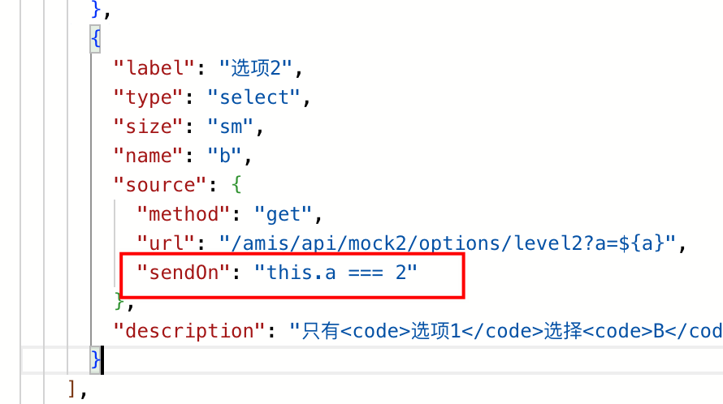
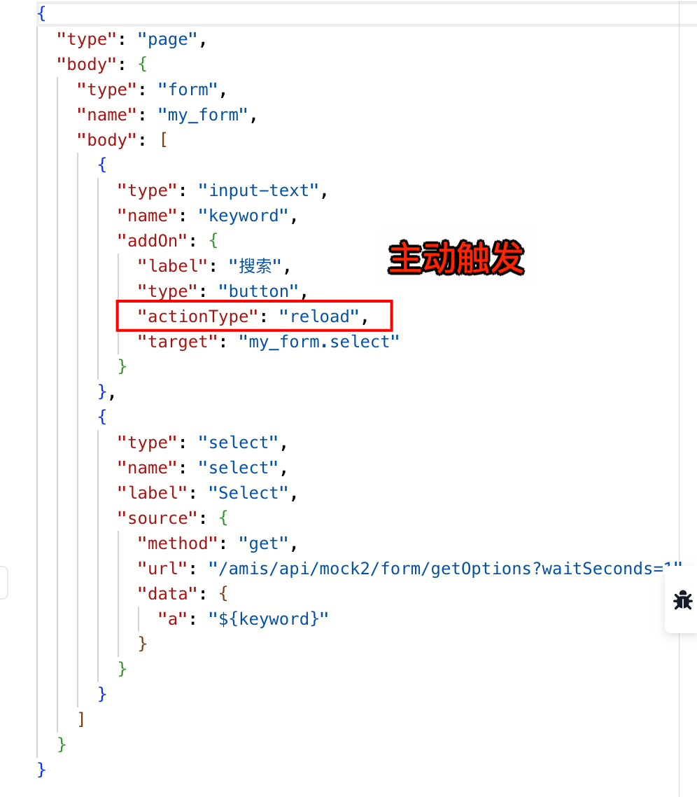
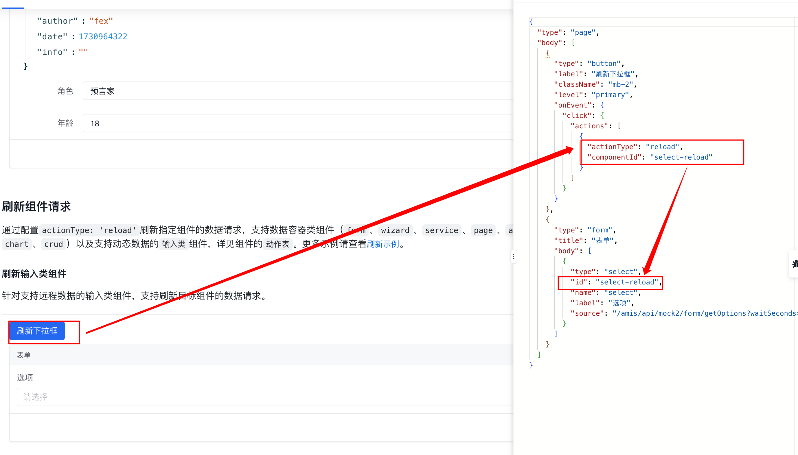
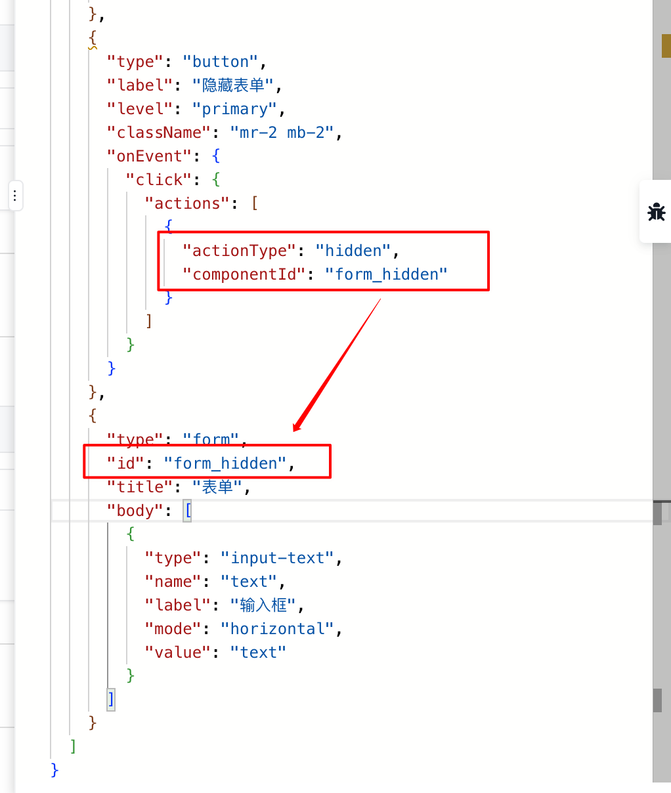
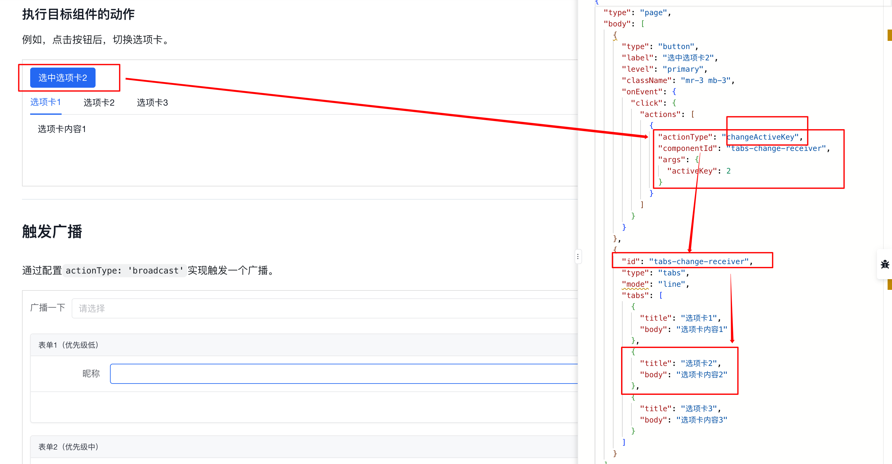
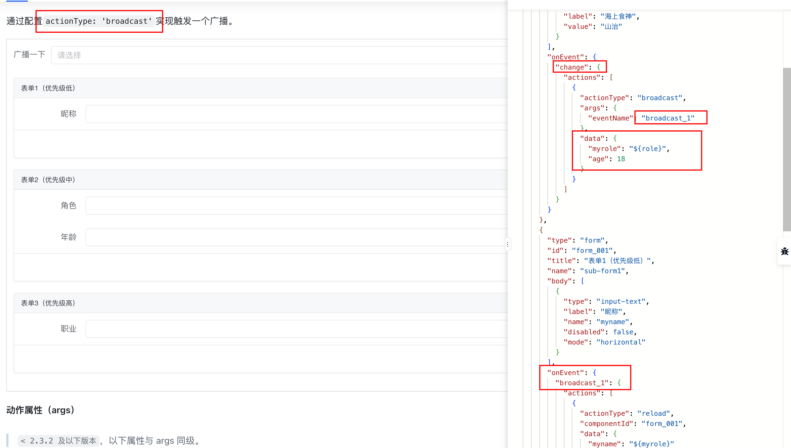
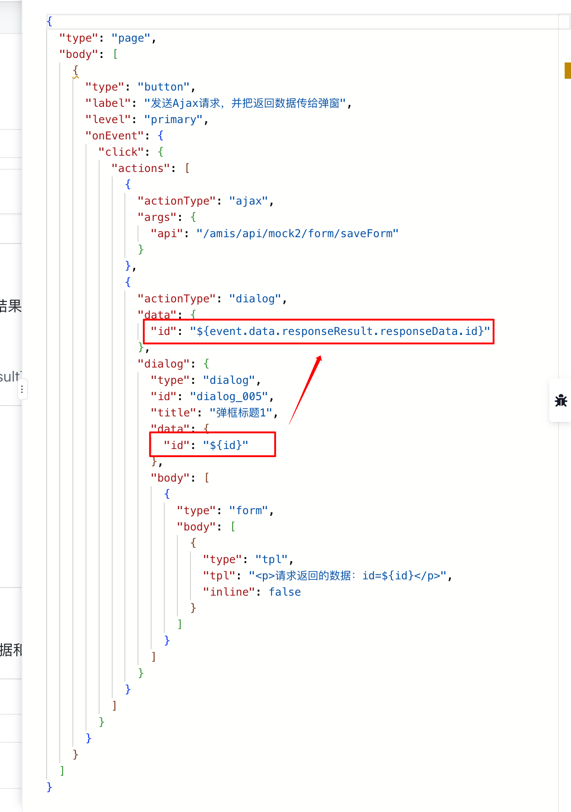
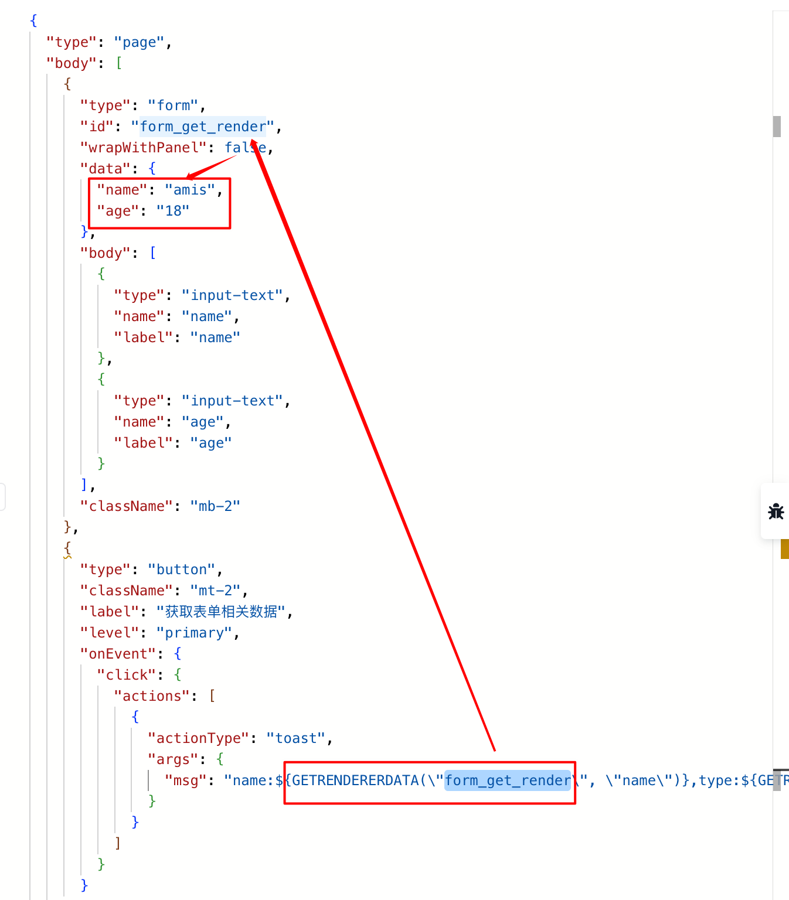

# 调研：JSON 协议设计（amis、schema 设计、事件流、Vdom 等）


`#lowcode` 


## 目录
<!-- toc -->
 ## 1. Schema 结构设计对比 

### 1.1. 先看看 vue dom 的结构

```js
type VNodeTypes =
  | string
  | VNode
  | Component
  | typeof Text
  | typeof Static
  | typeof Comment
  | typeof Fragment
  | typeof Teleport
  | typeof Suspense;

const vdom = {
  type: "div",
  props: {
    id: "foo",
  },
  children: [
    {
      type: "p",
      children: "p tag",
    },
    {
      type: "h1",
      children: "H1 tag",
    },
    {
      type: "div",
      children: [
        {
          type: "span",
          children: "div > span > tag",
        },
      ],
    },
  ],
};

```

> 很重要的一个类型： `type=action`

### 1.2. 再看看一段 React Vdom 示例

#### 1.2.1. JSX 

```jsx
import React from 'react';

function Welcome({ name }) {
  return <h1>Hello, {name}</h1>;
}

function App() {
  return (
    <div className="app">
      <Welcome name="Alice" />
      <p>This is a paragraph.</p>
      <ul>
        <li>Item 1</li>
        <li>Item 2</li>
      </ul>
      <button onClick={() => alert('Clicked!')}>Click me</button>
    </div>
  );
}
```

#### 1.2.2. 对应 JSON 树结构

```json
{
  "type": "div",
  "props": {
    "className": "app"
  },
  "children": [
    {
      "type": "Welcome",
      "props": {
        "name": "Alice"
      }
    },
    {
      "type": "p",
      "props": {},
      "children": [
        "This is a paragraph."
      ]
    },
    {
      "type": "ul",
      "props": {},
      "children": [
        {
          "type": "li",
          "props": {},
          "children": [
            "Item 1"
          ]
        },
        {
          "type": "li",
          "props": {},
          "children": [
            "Item 2"
          ]
        }
      ]
    },
    {
      "type": "button",
      "props": {
        "onClick": {
          "__function": "() => alert('Clicked!')"
        }
      },
      "children": [
        "Click me"
      ]
    }
  ]
}
```

### 1.3. Amis JSON Schema 结构设计

#### 1.3.1. 示例

```json hl:2,8
{
  "type": "page",
  "body": {
    "type": "form",
    "api": "/amis/api/mock2/form/saveForm",
    "body": [
      {
        "type": "input-text",
        "name": "name",
        "label": "姓名："
      }
    ]
  }
}

```

> 是 `body` 不是上面 vdom 的 `children`  

#### 1.3.2. schema.ts 结构设计

```typescript hl:4,6
import {PageSchema} from './renderers/Page';  
import {FlexSchema} from './renderers/Flex';  
import {TplSchema} from './renderers/Tpl';  
// 省略 ....，有多少个amis组件，这里就应该多少个 import schema  

// 每加个类型，这补充一下。  
export type SchemaType =  
  | 'form'  
  | 'alert'  
  | 'app';  
  
  
export type SchemaObject =  
  | PageSchema  
  | FlexSchema  
  | TplSchema  
// 省略 ....，有多少个amis组件，这里就应该多少个 SchemaObject  ;  
  
export type SchemaCollection =  
  | SchemaObject  
  | SchemaTpl  
  | Array<SchemaObject | SchemaTpl>;  
  
export interface SchemaApiObject {  
  method?: 'get' | 'post' | 'put' | 'delete' | 'patch' | 'jsonp' | 'js';  
  url: SchemaUrlPath;  
  data?: {  
    [propName: string]: any;  
  };  
  convertKeyToPath?: boolean;  
  responseData?: {  
    [propName: string]: any;  
  };  
  attachDataToQuery?: boolean;  
  dataType?: 'json' | 'form-data' | 'form';  
  responseType?: 'blob';  
  headers?: {  
    [propName: string]: string | number;  
  };  
  /**  
   * 设置发送条件  
   */  
  sendOn?: SchemaExpression;  
  replaceData?: boolean;  
  autoRefresh?: boolean;  
  trackExpression?: string;  
  cache?: number;  
  forceAppendDataToQuery?: boolean;  
  qsOptions?: {  
    arrayFormat?: 'indices' | 'brackets' | 'repeat' | 'comma';  
    indices?: boolean;  
    allowDots?: boolean;  
  };  
  silent?: boolean;  
  downloadFileName?: string;  
}  
  
export type SchemaApi = string | SchemaApiObject;
```

- 每个类型（`type`） 的组件都有一个 `详细 Schema 结构`来描述
	- 详细的 `Schema` 来描述，因为这个后面会直接影响到**编辑态**的展示

#### 1.3.3. 比如 `type = action` 时

```typescript
export interface Action extends Button {  
  actionType?:  
    | 'submit'  
    | 'copy'  
    | 'reload'  
    | 'ajax'  
    | 'saveAs'  
    | 'dialog'  
    | 'drawer'  
    | 'jump'  
    | 'link'  
    | 'url'  
    | 'email'  
    | 'close'  
    | 'confirm'  
    | 'add'  
    | 'remove'  
    | 'delete'  
    | 'edit'  
    | 'cancel'  
    | 'next'  
    | 'prev'  
    | 'reset'  
    | 'validate'  
    | 'reset-and-submit'  
    | 'clear'  
    | 'clear-and-submit'  
    | 'toast'  
    | 'goto-step'  
    | 'goto-image'  
    | 'expand'  
    | 'collapse'  
    | 'step-submit'  
    | 'selectAll'  
    | 'changeTabKey'  
    | 'click'  
    | 'stopAutoRefresh'  
    | 'preview'  
    | 'zoom';  
  api?: SchemaApi;  
  asyncApi?: SchemaApi;  
  payload?: any;  
  dialog?: SchemaNode;  
  to?: string;  
  target?: string;  
  link?: string;  
  url?: string;  
  cc?: string;  
  bcc?: string;  
  subject?: string;  
  body?: string;  
  mergeData?: boolean;  
  reload?: string;  
  messages?: {  
    success?: string;  
    failed?: string;  
  };  
  feedback?: any;  
  required?: Array<string>;  
  [propName: string]: any;  
}
```

#### 1.3.4. 通用字段

- type
- data 表示数据，另外有数据链的概念
- classname
- style
- hidden / hiddenOn：表达式
- visible / visibleOn：表达式
- SchemaArray：即`body: [schem1,schema2]` ，
- classname

```json
"className": {
	"text-muted": "${status == 1}",
	"text-success": "${status == 2}",
	"text-${status}": true
}
```

- api

```json hl:3,7
{
  "type": "crud",
  "api": {
    "url": "/amis/api/mock2/sample",
    "method": "post",
    "graphql": "{ pages(page: $page, perPage: $perPage) { id, engine } }",
    "data": {
      "page": "${page}",
      "perPage": "${perPage}"
    }
  },
  "columns": [
    {
      "name": "id",
      "label": "ID"
    },
    {
      "name": "engine",
      "label": "Rendering engine"
    }
  ]
}
```

`Definitions`建立当前页面公共的配置项，在其他组件中可以通过`$ref`来引用当前配置项中的内容
- 下面 `aa` 可以服用
- 下面 `option` 枚举项可以复用

```json hl:19,3,4
{
  "definitions": {
   "options":[],  
    "aa": {
      "type": "input-text",
      "name": "jack",
      "value": "ref value",
      "labelRemark": "通过<code>\\$ref</code>引入的组件"
    }
  },
  "type": "page",
  "title": "引用",
  "body": [
    {
      "type": "form",
      "api": "api/xxx",
      "actions": [],
      "body": [
        {
          "$ref": "aa"
        }
      ]
    }
  ]
}

```

## 2. AMIS JSON、Vue3 VNode、React JSX VDom 详细对比

### 2.1. 基础结构对比

| 特性       | AMIS JSON     | Vue3 VNode    | React JSX VDom |
| -------- | ------------- | ------------- | -------------- |
| **基本格式** | 纯 JSON 对象     | JavaScript 对象 | JavaScript 对象  |
| **节点类型** | type 字段指定     | type 属性       | type 属性        |
| **属性定义** | props 对象      | props 对象      | props 对象       |
| **子节点**  | body/items 数组 | children 数组   | children 属性    |

### 2.2. 属性处理

| 特性        | AMIS JSON          | Vue3 VNode     | React JSX VDom     |
| --------- | ------------------ | -------------- | ------------------ |
| **样式处理**  | className/style 对象 | class/style 对象 | className/style 对象 |
| **事件绑定**  | onEvent            | on + 大写事件名     | on + 大写事件名         |
| **自定义属性** | 直接在对象中定义           | attrs 对象       | data-* 属性          |

### 2.3. 组件特性

| 特性 | AMIS JSON | Vue3 VNode | React JSX VDom |
|------|-----------|------------|----------------|
| **组件复用** | "$ref" 引用 | 组件实例 | React.memo/PureComponent |
| **状态管理** | data 字段 | reactive/ref | useState/useReducer |
| **生命周期** | 通过 api 配置 | setup/生命周期钩子 | useEffect 等 hooks |

### 2.4. 渲染流程

| 阶段     | AMIS JSON | Vue3 VNode | React JSX VDom |     |
| ------ | --------- | ---------- | -------------- | --- |
| **解析** | JSON 解析器  | 模板编译       | JSX 转换         |     |
| **更新** | 数据驱动      | 响应式系统      | 虚拟 DOM diff    |     |
| **渲染** | 渲染引擎      | render 函数  | render 方法      |     |

### 2.5. 数据绑定示例

```javascript
{
  "type": "text",
  "value": "${username}",
  "visibleOn": "this.show"
}
```


```javascript
{
  type: 'div',
  props: {
    innerHTML: state.username,
    'v-show': show
  }
}
```


```javascript
{
  type: 'div',
  props: {
    children: username,
    style: { 
      display: show ? 'block' : 'none' 
    }
  }
}
```

### 2.6. 条件渲染

| AMIS JSON          | Vue3 VNode  | React JSX VDom |
| ------------------ | ----------- | -------------- |
| visibleOn/hiddenOn | v-if/v-show | 条件表达式          |
```javascript
{
  "type": "div",
  "visibleOn": "this.show"
}
```


```javascript
{
  type: 'div',
  props: {
    'v-if': show
  }
}
```


```javascript
show && {
  type: 'div',
  props: {}
}
```

### 2.7. 列表渲染

```javascript
{
  "type": "repeat",
  "items": {
    "type": "tpl",
    "tpl": "${item}"
  },
  "source": "${items}"
}
```

```javascript
{
  type: 'Fragment',
  children: items.map(item => ({
    type: 'div',
    key: item.id,
    props: {
      innerHTML: item.text
    }
  }))
}
```

```javascript
{
  type: 'Fragment',
  props: {
    children: items.map(item => ({
      type: 'div',
      key: item.id,
      props: {
        children: item.text
      }
    }))
  }
}
```

## 3. Amis 基本概念&名词解释

- 完全通过 `JSON 树` 配置出页面、应用
	- 有一个组件就叫做 `APP`，有个字段 `pages` 来承载所有页面
- 数据与数据域
	- 首先会先尝试在当前组件的数据域中寻找变量，当成功找到变量时，通过数据映射完成渲染，停止寻找过程；
	- 当在当前数据域中没有找到变量时，则向上寻找，在父组件的数据域中，重复步骤`1`和`2`；
	- 一直寻找，直到顶级节点，也就是`page`节点，寻找过程结束。
	- 但是如果 url 中有参数，还会继续向上查找这层，所以很多时候配置中可以直接 `${id}` 取地址栏参数。
- 数据域数据更新
	- 通常顶层数据域数据更新，孩子中具备数据域的组件都会更新，但更新代价大，性能差
	- 可配置 `trackExpression`
		1. `trackExpression` 配置成 `"none"` 也就是说不追踪任何数据。
		2. `trackExpression` 配置成 `"${xxxVariable}"` 这样 `xxxVariable 变化`了更新当前组件的数据链。
- 模板，内部采用 [lodash template](https://lodash.com/docs/4.17.15#template) 实现
```json hl:5
{
  "data": {
    "text": "World!"
  },
  "type": "page",
  "body": "<h1>Hello</h1> <span>${text}</span>"
}
```

- 数据映射
	- 链式取值
	- 支持 `&`
	- 目前有以下三种 `namespace`
		- `window` 即全局变量
		- `ls` 即 localStorage， 如果值是 json 对象，可以直接当对象用比如：`${ls:xxxxxlocalStrorageKey.xxxx}`
		- `ss` 即 sessionStorage，同上。
		- `cookie` 即 cookies，同上
	- 过滤器&管道
		- 定义管道： `amisLib.registerFilter`
	- 表达式，记得使用 `loadsh` 和 `moment`

```json hl:4
{
  "type": "tpl",
  "tpl": "当前作用域中变量 show 是 1 的时候才可以看得到我哦~",
  "visibleOn": "${show === 1}"
}
```

- 联动
	- `visibleOn`
	- `disabledOn`
	- 接口联动一般只适用于初始化接口，例如：
		- `form`组件中的`initApi`；
		- `select`组件中的`source`选项源接口`url`, `data`只能用于主动联动；
			- `"source": "/amis/api/mock2/options/level2?a=${a}",` a 变化就会发请求
			- 
		- `service`组件中的`api`和`schemaApi`；
		- `crud`组件中的`api`；
			- crud 默认是跟地址栏联动，如果要做请关闭同步地址栏 syncLocation: false 
		- 等等...

### 3.1. 主动触发



### 3.2. 发送指定数据

`target`属性支持通过配置参数来发送指定数据，例如：`"target" :"xxx?a=${a}&b=${b}"`，这样就会把当前数据域中的`a`变量和`b`变量发送给目标`组件 xxx`

### 3.3. 刷新目标组件

```json
{
  "type": "action",
  "actionType": "reload",
  "label": "刷新目标组件",
  "target": "target1,target2"
}
```

### 3.4. 发送动态目标

- 刷新目标支持表达式，比如目标的 `name` 可以配置成 `form-${ xxx ? '1' : '2'}`

## 4. Amis 的事件&动作设计&事件流设计

- 解决复杂的 UI 交互场景，支持渲染器事件监听和响应设计，无需关心组件层级关系

### 4.1. 属性表

| 属性名             | 类型                                                                                                                                                                                | 默认值     | 说明                                                                        |
| --------------- | --------------------------------------------------------------------------------------------------------------------------------------------------------------------------------- | ------- | ------------------------------------------------------------------------- |
| actionType      | `string`                                                                                                                                                                          | -       | 动作名称                                                                      |
| args            | `object`                                                                                                                                                                          | -       | 动作属性`{key:value}`，支持数据映射                                                  |
| data            | `object`                                                                                                                                                                          | -       | 追加数据`{key:value}`，支持数据映射，如果是触发其他组件的动作，则该数据会传递给目标组件，`> 2.3.2 及以上版本`        |
| dataMergeMode   | `string`                                                                                                                                                                          | 'merge' | 当配置了 data 的时候，可以控制数据追加方式，支持合并(`merge`)和覆盖(`override`)两种模式，`> 2.3.2 及以上版本` |
| preventDefault  | `boolean`\|[表达式](https://aisuda.bce.baidu.com/amis/zh-CN/docs/concepts/expression)\|[ConditionBuilder](https://aisuda.bce.baidu.com/amis/zh-CN/components/form/condition-builder) | false   | 阻止事件默认行为，`> 1.10.0 及以上版本支持表达式，> 2.9.0 及以上版本支持ConditionBuilder`            |
| stopPropagation | `boolean`\|[表达式](https://aisuda.bce.baidu.com/amis/zh-CN/docs/concepts/expression)\|[ConditionBuilder](https://aisuda.bce.baidu.com/amis/zh-CN/components/form/condition-builder) | false   | 停止后续动作执行，`> 1.10.0 及以上版本支持表达式，> 2.9.0 及以上版本支持ConditionBuilder`            |
| expression      | `boolean`\|[表达式](https://aisuda.bce.baidu.com/amis/zh-CN/docs/concepts/expression)\|[ConditionBuilder](https://aisuda.bce.baidu.com/amis/zh-CN/components/form/condition-builder) | -       | 执行条件，不设置表示默认执行，`> 1.10.0 及以上版本支持表达式，> 2.9.0 及以上版本支持ConditionBuilder`      |
| outputVar       | `string`                                                                                                                                                                          | -       | 输出数据变量名                                                                   |
| ignoreError     | `boolean`                                                                                                                                                                         | false   | 当动作执行出错后，是否忽略错误继续执行。`3.3.1 及以上版本支持`                                       |

### 4.2. onEvent 

`onEvent-click-actions:[]`

```json hl:5,6,7,17,28
{
  "type": "button",
  "label": "尝试点击、鼠标移入/移出",
  "level": "primary",
  "onEvent": {
    "click": { // 监听点击事件
      "actions": [ // 执行的动作列表
        {
          "actionType": "toast", // 执行toast提示动作
          "args": { // 动作参数
            "msgType": "info",
            "msg": "派发点击事件"
          }
        }
      ]
    },
    "mouseenter": {{ // 监听鼠标移入事件
      "actions": [
        {
          "actionType": "toast",
          "args": {
            "msgType": "info",
            "msg": "派发鼠标移入事件"
          }
        }
      ]
    },
    "mouseleave": {{ // 监听鼠标移出事件
      "actions": [
        {
          "actionType": "toast",
          "args": {
            "msgType": "info",
            "msg": "派发鼠标移出事件"
          }
        }
      ]
    }
  }
}
```

### 4.3. 获取上下文

执行动作时，可以通过`${event.data}`获取事件对象的数据、通过`${__rendererData}`获取组件当前数据域

```json hl:11
{
  "type": "input-text",
  "name": "age",
  "label": "年龄：",
  "onEvent": {
    "change": {
      "actions": [
        {
          "actionType": "toast",
          "args": {
            "msg": "${__rendererData|json}"
          }
        }
      ]
    }
  }
}
```

### 4.4. 事件类型

事件包含`渲染器事件`和`广播事件`。
- 渲染器事件，由具体的渲染器组件提供，**每个渲染器组件**暴露的事件可以查看具体的[组件文档的事件表](https://aisuda.bce.baidu.com/amis/zh-CN/components/page#%E4%BA%8B%E4%BB%B6%E8%A1%A8)；
- 广播事件，即`自定义事件`，可以自定义派发的事件名称`eventName`，其他渲染器可以监听该自定义事件并配置`响应动作`。
	- 动作包含`通用动作`、`组件动作`、`广播动作`、`自定义动作`，可以通过配置`actionType`来指定具体执行什么动作。

### 4.5. 请求 ajax

- ` "expression": "${event.data.responseResult.responseStatus === 0}"` 仅在这个条件才显示 toast 
- 当配置`silent: true`时，请求完成后不会弹出提示信息。
- 点击按钮，校验表单：
	- 通过` "${event.data.validateResult.payload.name}"` 来校验

```json hl:14,15,17,35,28
{
  "type": "page",
  "data": {
    "name": "lll"
  },
  "body": [
    {
      "type": "button",
      "id": "b_001",
      "label": "发送 Ajax 请求",
      "level": "primary",
      "confirmText": "确认要发出这个请求？",
      "onEvent": {
        "click": {
          "actions": [
            {
              "actionType": "ajax",
              "api": {
                "url": "/amis/api/mock2/form/saveForm?name=${name}",
                "method": "post",
                "responseData": {
                  "resId": "${id}"
                },
                "messages": {
                  "success": "成功了！欧耶",
                  "failed": "失败了呢。。"
                },
                // `silent: true` 
              },
              "data": {
                "age": 18
              }
            },
            {
              "actionType": "toast",
              "expression": "${event.data.responseResult.responseStatus === 0}",
              "args": {
                "msg": "${event.data.responseResult|json}"
              }
            }
          ]
        }
      }
    }
  ]
}
```

**动作属性**

| 属性名      | 类型                                                      | 默认值 | 说明            |
| -------- | ------------------------------------------------------- | --- | ------------- |
| api      | [API](https://aisuda.bce.baidu.com/amis/docs/types/api) | -   | 接口配置          |
| options  | `object`                                                | -   | 其他配置          |
| messages | `{success: string, failed: string}`                     | -   | 请求成功/失败后的提示信息 |
|          |                                                         |     |               |

**其他属性**

|属性名|类型|默认值|说明|
|---|---|---|---|
|outputVar|`string`|-|请求响应结果缓存在`${event.data.responseResult}`或`${event.data.{outputVar}}`|

### 4.6. 弹窗

- 通过配置`actionType: 'dialog'`实现 Dialog 弹窗
- 通过配置`actionType: 'closeDialog'`实现关闭当前弹窗；附加配置`componentId`可以实现关闭指定弹窗。

`button->onEnvent->click->actions->actionType`

```json hl:13,14
{
  "type": "page",
  "body": [
    {
      "type": "button",
      "className": "ml-2",
      "label": "打开弹窗（模态）",
      "level": "primary",
      "onEvent": {
        "click": {
          "actions": [
            {
              "actionType": "dialog",
              "dialog": {
                "type": "dialog",
                "title": "模态弹窗",
                "id": "dialog_001",
                "data": {
                  "myage": "22"
                },
                "body": [
                  {
                    "type": "tpl",
                    "tpl": "<p>对，你打开了模态弹窗</p>",
                    "inline": false
                  }
                ]
              }
            }
          ]
        }
      }
    }
  ]
}

```

| 属性名           | 类型                      | 默认值 | 说明                                                                              |
| ------------- | ----------------------- | --- | ------------------------------------------------------------------------------- |
| dialog        | `string`/`DialogObject` | -   | 指定弹框内容，格式可参考[Dialog](https://aisuda.bce.baidu.com/amis/zh-CN/components/dialog) |
| waitForAction | `boolean`               | -   | 是否等待弹窗响应，开启后将等待弹窗操作                                                             |
| outputVar     | `string`                | -   | 输出数据变量名, 输出数据格式为 `{confirmed: boolean; value: any[]}`，当 `waitForAction` 开启时才有用  |

### 4.7. 抽屉

类似于弹窗

### 4.8. 动作属性（args）

| 属性名         | 类型        | 默认值                           | 说明                                                                                         |
| ----------- | --------- | ----------------------------- | ------------------------------------------------------------------------------------------ |
| msgType     | `string`  | `"info"`                      | 消息类型 `info\|success\|error\|warning`                                                       |
| msg         | `string`  | -                             | 消息内容                                                                                       |
| position    | `string`  | `top-center（移动端为center）`      | 提示显示位置 `top-right\|top-center\|top-left\|bottom-center\|bottom-left\|bottom-right\|center` |
| closeButton | `boolean` | `false`                       | 是否展示关闭按钮                                                                                   |
| showIcon    | `boolean` | `true`                        | 是否展示图标                                                                                     |
| timeout     | `number`  | `5000（error类型为6000，移动端为3000）` | 持续时间                                                                                       |
|             |           |                               |                                                                                            |

### 4.9. 链接跳转

通过配置`actionType: 'url'`或`actionType: 'link'`实现链接跳转

|属性名|类型|默认值|说明|
|---|---|---|---|
|url|`string`|-|按钮点击后，会打开指定页面。可用 `${xxx}` 取值|
|blank|`boolean`|`false`|如果为 `true` 将在新 tab 页面打开|
|params|`object`|-|页面参数`{key:value}`，支持数据映射，`> 1.10.0 及以上版本`|

### 4.10. 浏览器

- 通过配置`actionType: 'goBack'`实现页面回退。
- 通过配置`actionType: 'goPage'`实现浏览器页面的前进/后退。只有当历史记录中存在目标页面时才会生效。
- 通过配置`actionType: 'refresh'`实现浏览器刷新。

### 4.11. 打印

`"actionType": "print",`

### 4.12. 一个异步串行场景

> vue中的做法是，`setEventData` 可以 通过它来设置 `setGlocal` `setPageDate` 等等来修改 vue pinia的数据

```json hl:6,12,19
{
  "onEvent": {
    "click": {
      "actions": [
        {
          "actionType": "wait",
          "args": {
            "time": 3000
          }
        },
        {
          "actionType": "setEventData",
          "args": {
            "key": "title",
            "value": "页面标题：${window:document[title]}"
          }
        },
        {
          "actionType": "toast",
          "args": {
            "msg": "${title}"
          }
        }
      ]
    }
  }
}

```

### 4.13. 自定义 JS

- 通过配置`actionType: 'custom'`实现自定义 JS。
	- JS 中可以访问以下对象和方法：
- context，渲染器上下文
- doAction() 动作执行方法，用于调用任何 `actionType` 指定的动作
- event，事件对象，可以调用 setData()、stopPropagation()、preventDefault()分别实现事件上下文设置、动作干预、事件干预，可以通过 event.data 获取事件上下文

自定义函数签名： `script:(context,doAction,event)=>{}`

```json hl:13
{
  "type": "page",
  "body": [
    {
      "type": "button",
      "label": "发送一个 http 请求",
      "level": "primary",
      "onEvent": {
        "click": {
          "actions": [
            {
              "actionType": "custom",
              "script": "doAction({actionType: 'ajax', args: {api: '/amis/api/mock2/form/saveForm'}});\n //event.stopPropagation();"
            }
          ]
        }
      }
    }
  ]
}

```

看看源码部分

```javascript hl:3
// 外部可以直接调用doAction来完成动作调用  
// 可以通过上下文直接编排动作调用，通过event来进行动作干预  
let result = await (scriptFunc as any)?.call(  
  proxy,  
  renderer,  
  (action: ListenerAction) => runActions(action, renderer, event),  
  event,  
  action  
);
```

调用的方式

```json hl:8,10
{
  "actions": [
    {
      "componentId": "u:52cd013e120f",
      "actionType": "disabled"
    },
    {
      // promise的方式
      "script": "return new Promise((resolve, reject) => {setTimeout(() => {event.setData({...event.data, pId: '01027359'});resolve();}, 3000)})",
      // callback的方式 thunk function
      "script": "return (callback) => { setTimeout(() => {event.setData({...event.data, pId: '01027359' });callback();}, 3000) };",
      "actionType": "custom"
    },
    {
      "componentId": "u:e47e2c8e6be8",
      "args": {
        "value": "${pId}"
      },
      "actionType": "setValue"
    },
    {
      "componentId": "u:52cd013e120f",
      "actionType": "enabled"
    }
  ]
}

```

#### 4.13.1. 事件流数据覆盖

有时在执行自定义 JS 的时候，希望该过程中产生的数据可以分享给后面的动作使用，此时可以通过`event.setData()`来实现事件上下文的设置，这样后面动作都可以通过事件上下文来获取共享的数据。

注意：直接调用`event.setData()`将修改事件的原有上下文，如果不希望覆盖可以通过`event.setData({...event.data, ...{xxx: xxx}})`来进行数据的合并。

### 4.14. 触发指定组件动作

通过配置`componentId`或`componentName`来触发指定组件的动作（不配置将调用当前组件自己的动作），组件动作配置通过`args`传入`(> 1.9.0 及以上版本)`，动作参数请查看对应的组件的[动作表](https://aisuda.bce.baidu.com/amis/zh-CN/components/form/index#%E5%8A%A8%E4%BD%9C%E8%A1%A8)，更多示例请查看[组件事件动作示例](https://aisuda.bce.baidu.com/amis/examples/event/form)。

#### 4.14.1. 示例



#### 4.14.2. 修改 组件状态

通过配置`actionType: 'show'`或`'hidden'`或`'enabled'`或`'disabled'`或`'static'`或`'nonstatic'`实现对指定组件的显示、隐藏、启用、禁用，仅支持实现了对应状态控制功能的数据`输入类`组件。



#### 4.14.3. 刷新 CRUD 列表

```json  hl:4,5
{
  "actions": [
    {
      "componentId": "crud_id-1",
      "actionType": "reload",
      "data": { // 还可以穿参数，取决于 crud 的实现
        "author": "${author}"
      }
    }
  ]
}

```

#### 4.14.4. 切换到具体 Tab



### 4.15. 注册自定义动作：`RendererAction` 中注册

除了以上内置动作，你还可以注册自己的动作。通过对`RendererAction`的`run`方法的实现可以定制自己的动作逻辑，最后通过`registerAction`注册到 amis 事件动作中。

```javascript
import {
  ListenerAction,
  ListenerContext,
  registerAction,
  RendererAction
} from 'amis-core';
import {RendererEvent} from 'amis-core';

// 动作定义
interface IMyAction extends ListenerAction {
  actionType: 'my-action';
  args: {
    param1: string, // 动作参数1
    param2: string // 动作参数2
  };
}

/**
 * 我的动作实现
 */
export class MyAction implements RendererAction {
  run(action: IMyAction, renderer: ListenerContext, event: RendererEvent<any>) {
    const props = renderer.props;
    const {param1, param2} = action.args;

    // 你的动作逻辑
    // ...
  }
}

// 注册自定义动作
registerAction('my-action', new MyAction());
```

### 4.16. 触发广播



### 4.17. 编排事件&动作

>  events 和 actions 需要作区分

#### 4.17.1. 条件与循环

- 通过配置`expression: 表达式或ConditionBuilder组合条件`来实现条件逻辑。
- 通过配置`actionType: 'loop'`实现循环逻辑。

```json
{
  "actions": [
    {
      "componentId": "crud_reload",
      "actionType": "reload",
      "data": {
        "author": "${author}"
      }
    },
    // 仅在 expression 表达式为真时，才会触发 toast
    {
      "actionType": "toast",
      "args": {
        "msgType": "success",
        "msg": "expression表达式 ok~"
      },
      "expression": "expression === \"okk\""
    },
    // 循环发送两次请求，且每次携带了循环的数据
    {
      "actionType": "loop",
      "args": {
        "loopName": "${loopName}"
      },
      "children": [
        {
          "actionType": "ajax",
          "args": {
            "api": "/amis/api/mock2/form/saveForm?name=${name}&age=${age}"
          }
        }
      ]
    }
  ]
}

```

- 嵌套循环，
	- 注意配置 `children`
- 通过配置`actionType: 'loop'`和`actionType: 'break'`实现循环跳出。
- 通过配置`actionType: 'loop'`和`actionType: 'continue'`实现循环跳过。
- 通过配置`actionType: 'switch'`实现排他逻辑。
- 通过配置`actionType: 'parallel'`实现并行执逻辑。
	- children `子动作`
	- 比如 同时发送两个ajax请求，并显示请求返回

> 所以本质是一棵树，里面有 `children` 等属性，但要注意的是，action 上下文数据是有连贯性的

### 4.18. 动作间的事件传递

1、事件触发开始，整个数据流包含事件本身产生的事件数据和动作产生的动作数据，事件源头产生的数据在 AMIS 事件动作机制底层已经自动加入**渲染器数据域**，可以通过`xxx`直接获取

比如



>  events → click → `actions:[] （可编排）` 

2、部分动作产生的数据如何流动需要**交互设计者进行介入**，对于数据流动可以通过数据映射，将上一个动作产生的数据作为动作参数写入下一个动作。

3、可以通过表达式函数`GETRENDERERDATA(id, path)`和`GETRENDERERPROP(id, path)`分别获取指定组件的数据和属性。

|参数名|说明|
|---|---|
|id|组件 ID，即组件的 id 属性的值|
|path|数据路径，即数据变量的路径|



> 同样的，vue 是可以直接拿到全局数据的，从这种模板里面

### 4.19. 干预动作执行

事件动作干预是指执行完当前动作后，干预所监听事件默认处理逻辑和后续其他动作的执行。通过`preventDefault`、`stopPropagation`分别阻止监听事件默认行为和停止下一个动作执行。

#### 4.19.1. 阻止默认行为

```json hl:8
{
  "actions": [
    {
      "actionType": "toast",
      "args": {
        "msg": "不关闭"
      },
      "preventDefault": "command === \"Do not close\""
    }
  ]
}

```

通过表达式

```json hl:6
{
  "confirm": {
    "actions": [
      {
        "actionType": "preventDefault",
        "expression": "${command === 'Do not close'}"
      }
    ]
  }
}

```

#### 4.19.2. 停止后续动作执行

通过`onEvent`可以对监听的事件配置一组动作，这些动作是顺序执行的，有时间设计者希望执行某个/些动作后就停止继续执行后面的动作，这时候可以通过`stopPropagation`来停止执行后面配置的所有动作。

编辑代码
```json
{
  "actions": [
    {
      "actionType": "toast",
      "args": {
        "msgType": "info",
        "msg": "动作1"
      }
    },
    {
      "actionType": "toast",
      "args": {
        "msgType": "info",
        "msg": "动作2"
      },
      "stopPropagation": true
    },
    {
      "actionType": "toast",
      "args": {
        "msgType": "info",
        "msg": "动作3",
        "position": "top-right"
      }
    }
  ]
}

```

或者通过表达式

```json
{
  "actionType": "stopPropagation",
  "expression": "${command === 'Do not close'}"
}
```

#### 4.19.3. 忽略动作报错继续执行

>  可以通过`ignoreError: true`来忽略动作报错继续执行后面的动作

## 5. Amis 行为

页面的交互操作，例如：**提交表单、显示一个弹框、跳转页面、复制一段文字到粘贴板**等等操作，都可以视作页面的一种**行为**。

在 amis 中，大部分 **行为** 是跟 **行为按钮组件** 进行绑定的，也就是说，当你想要配置一个行为，大部分情况下你应该遵循下面的步骤：
1. 添加一个 **行为按钮组件**；
2. 配置当前 **行为类型（actionType）**；
3. 根据当前行为类型，配置你想要的 **属性**。

更多见 **Action 按钮组件**

## 6. Amis：class、主题、css变量

- amis 中有大量的`功能类 class` 可以使用
- 即主题，css 变量等

## 7. 结论

- amis 使用 vue 实现的可能性分析 ？ 
	- 可以参考啊
	- 理论上没什么问题的
- 本质是：
	- 再基于 Vue 包一层 DSL 而已，JSON Schema 的协议可以参考 Amis 的结构
- 但 Amis 的功能点较多，先实现最小 MVP
	- **事件流的设计很符合业务要求**


