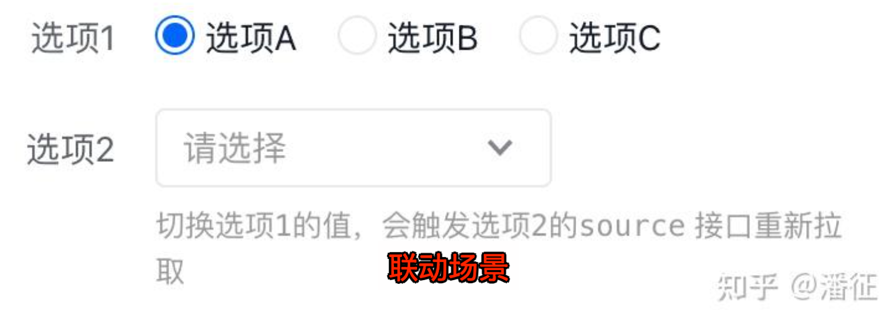

# 低代码篇：低代码平台架构设计


`#低代码` 

> 来自精读: [低代码平台架构深度剖析 - 知乎](https://zhuanlan.zhihu.com/p/522822327)


## 目录
<!-- toc -->
 ## 1. 导读 

本文将以以下面的脉络展开，为各位读者揭示一个在生产环境成熟运转的低代码平台的全貌。
- 平台概览 - amis 框架介绍和细节展开 
- 爱速搭可视化编辑器概述 - 后端服务通览 

## 2. 爱速搭低代码平台结构一览

首先我们通过一张图来了解**百度爱速搭平台**的全貌。
- 前端：如图所示，前端用户感知最多的 “页面拖拽编辑” 部分，主要由 `amis` 和 `amis-editor` 来承担；
- 而“后端业务” 则包括一个低代码平台必不可少的 **API Proxy、权限、数据模型、流程引擎**等；
- “爱速搭平台功能” 指的是页面管理列表、数据模型列表等平台常规能力。

接下来我们将挑选一些重要的模块，为大家逐一剖析这些构成低代码平台的关键元素。


## 3. AMIS 的诞生 —— 从前端 UI 库到低代码前端框架

本质：将 json 配置转换成对应的 React 组件并在页面上渲染出来

## 4. 为什么要做 AMIS ？

### 4.1. 示例



会根据当前技术栈、团队情况等等情况选择实现一遍，其实都在变化，但**协议不变** ，如下：

上面的 UI 及交互逻辑可以使用下面的 JSON 来描述

```json hl:33
{
  "type": "page",
  "body": {
    "title": "",
    "type": "form",
    "mode": "horizontal",
    "body": [
      {
        "label": "选项1",
        "type": "radios",
        "name": "a",
        "inline": true,
        "options": [
          {
            "label": "选项A",
            "value": 1
          },
          {
            "label": "选项B",
            "value": 2
          },
          {
            "label": "选项C",
            "value": 3
          }
        ]
      },
      {
        "label": "选项2",
        "type": "select",
        "size": "sm",
        "name": "b",
        "source": "/amis/api/mock2/options/level2?a=${a}",
        "description": "切换<code>选项1</code>的值，会触发<code>选项2</code>的<code>source</code> 接口重新拉取"
      }
    ],
    "actions": []
  }
}
```

“低代码框架” 的组件体系，**本质上**都是在通常的 “**UI 组件**” 之上增加了 “**通用业务逻辑**” 的实现，将一些常用的业务逻辑提取并固化到组件层面，然后提供相应的配置项，让用户得以通过配置的方式来复用这些 “固化” 的业务逻辑。

故而低代码组件体系，及其配套的低代码可视化编辑器 - 低代码平台，其价值都在于能够提供不断累积的业务逻辑

从长远来看，不同领域都会孵化出贴合自身需要的 “低代码” 组件和框架体系，

## 5. 基础核心能力 —— 从 json 配置到 React 组件

**原理：简单来说就是先通过 `json` 的 `type` 找到对应的 `Component`，然后把其他属性作为 `props` 传递过去完成渲染。**

### 5.1. 示例一

将 json 配置转换成对应的 React 组件并在页面上渲染出来：

```json
{
  "type": "page",
  "body": {
    "type": "tpl",
    "tpl": "Hello World!"
  }
}
```

其渲染结果如下


### 5.2. 示例二

```jsx
<Page title="页面标题" subTitle="副标题">
  <Form title="用户登录">
    <InputText name="username" label="用户名" />
  </Form>
</Page>
```

对应的 JSON

```json
{
  "type": "page",
  "title": "页面标题",
  "subTitle": "副标题",
  "body": {
    "type": "form",
    "title": "用户登录",
    "body": [
      {
        "type": "input-text",
        "name": "username",
        "label": "用户名"
      }
    ]
  }
}
```
### 5.3. amis 框架的 render 方法

这里的 render 方法是 amis 核心功能的 “入口”，那么它具体做了什么事情呢？

1. 在已注册的组件池中找到组件并将其依次渲染到页面上
2. 数据 store 的创建


这里的 `SchemaRenderer` 在 amis 代码中是一个 React 组件，其部分代码如下，其中 `resolveRenderer` 这行代码是根据 schema 查找组件的关键操作。


### 5.4. 数据域和数据链

数据是前端页面构成的核心部分。在 amis 中，页面数据使用 “数据域” 和 “数据链” 来进行管理（[https://aisuda.bce.baidu.com/amis/zh-CN/docs/concepts/datascope-and-datachain](https://link.zhihu.com/?target=https%3A//aisuda.bce.baidu.com/amis/zh-CN/docs/concepts/datascope-and-datachain)）这是使得 amis 能够支持复杂动态页面的一个重要设计。

### 5.5. “数据” 的来源和在页面中的读取方式

在一个 amis / 爱速搭的页面中，“数据” 来源主要包括：

#### 5.5.1. 页面常量

如当前用户信息等，仅限爱速搭平台，由后端服务在返回页面配置时进行统一替换


#### 5.5.2. 地址栏参数

运行态：


编辑态：


#### 5.5.3. 在组件配置 “data” 域中配置的初始静态数据


#### 5.5.4. 接口返回的数据

最常用的方式，包括表单提交后接口返回的数据（如保存结果等）。在本节开始的例子中已有展示说明，存在同名字段的情况下，“后来” 的数据会覆盖 “先来” 的数据。

**这些不同来源的数据被统一归并到数据域中以树状的结构进行管理。**

### 5.6. 数据链的继承和覆盖

上面我们说到，数据域是以树状结构进行管理的，其继承和覆盖规则的设计如下：

1. 首先会先尝试在当前组件的数据域中寻找变量，当成功找到变量时，通过数据映射完成渲染，停止寻找过程；
2. 当在当前数据域中没有找到变量时，则向上寻找，在父组件的数据域中，重复步骤`1`和`2`；
3. 一直寻找，直到顶级节点，也就是`page`节点，寻找过程结束。
4. 但是如果 `url` 中有参数，还会继续向上查找这层，所以很多时候配置中可以直接 `${id}` 取地址栏参数。

### 5.7. amis 对 API 请求的前置 / 后置处理

而在旧业务过渡到低代码平台的过程中，许多用 amis / 爱速搭新建的页面都需要和一些老接口进行通信，而**这些老接口通常来说不太可能为了对接低代码平台而进行出参 / 入参格式的二次改造**。这也是在企业内部落地低代码方案时必然会遇到，也必须解决的问题。

面对这类场景，低代码平台 / 框架需要前后端数据 “对齐” 的能力。为此，amis 在前端层面设计了数据映射和 apiAdaptor 等机制（后端也有类似的机制，具体见后文API Proxy）。

### 5.8. 数据映射

数据映射的实现原理非常简单，主要是在请求提交前先拦截一下然后将数据处理成指定的格式，其语法为 "`目标字段名": ${原字段名}`


### 5.9. API Adaptor（请求适配器和接收适配器）

```js hl:6
const schema = {
  type: 'form',
  api: {
    method: 'post',
    url: '/amis/api/mock2/form/saveForm',
    requestAdaptor: function (api) {
      return {
        ...api,
        data: {
          ...api.data, // 获取暴露的 api 中的 data 变量
          foo: 'bar' // 新添加数据
        }
      };
    }
  },
  body: [
    {
      type: 'input-text',
      name: 'name',
      label: '姓名：'
    },
    {
      name: 'text',
      type: 'input-email',
      label: '邮箱：'
    }
  ]
};
```

### 5.10. 自定义组件接入机制

虽然 amis 提供了丰富的默认组件，但是默认的组件必然无法覆盖各种未知的使用场景。

在低代码平台 / 框架的选型和建设过程中，通常平台 / 框架的维护者需要不断地抽取通用业务逻辑并将其作为默认组件固化下来，而自定义组件是需求收集和能力延展的有效补充机制。

amis / 爱速搭同样支持多种形式的自定义组件接入方法，包括 SDK，React 方式等

## 6. 爱速搭平台的页面可视化编辑器

amis 作为一个相对成熟的低代码前端框架，提供了通过 json 配置生成复杂页面的全套能力。

然而 amis 毕竟是一个前端框架，单靠其本身必然无法实现 “**让不懂前端，不会 JavaScript 的人也能制作页面**” 这个目的。故而在 amis 之上，我们还开发了一个可视化编辑器。

对整个平台而言，组件的具体行为和页面渲染引擎由 amis 提供，而可视化编辑器主要做的事情是

- 提供拖拽组件到页面并生成相应 schema 的能力
- 调用 amis 框架基于页面当前编辑中的 schema 来渲染预览视图

从直观的产品形态而言，爱速搭平台的页面可视化编辑器，对应的是平台中最常用的 “编辑” 界面，如下图。


此类可视化编辑器的实现原理在现今已经不是一个时髦的话题，在低代码框架已经 ready 的情况下，可视化编辑器本质上就是一个 “比较友好地修改组件配置的界面”。一般来说在低代码平台的研发过程中需要**投入大量人力去处理可视化编辑器的各种细节问题**（如配置项的对齐，界面交互友好程度等），但经过业界多年的探索和沉淀，研发层面的基本思路已经相对固化，此处也就不再赘述。

>  有兴趣的读者可自行前往研究（[https://github.com/aisuda/amis-editor-demo](https://link.zhihu.com/?target=https%3A//github.com/aisuda/amis-editor-demo)）

## 7. 后端服务相关

爱速搭平台的前端主要部分由 amis 及其配套的可视化编辑器组成，而作为一个能够提供完整服务的低代码平台，除前端页面搭建能力外，后端的一系列服务也是必不可少。

爱速搭平台的后端服务目前没有对外开源，但对于低代码平台而言，配套的后端服务是整个平台能力中不可或缺并且重要度逐步提升的一部分。

由于篇幅有限，在此对爱速搭平台的后端服务体系只做一个业务问题-解决方案的概要式列举，以供各位读者一窥低代码平台的“全貌”。

### 7.1. API Proxy

为解决前后端通信中最常见的跨域问题，以及提供 header/body/query 信息的拼装转化能力，爱速搭平台提供了 API Proxy 机制。在 amis 中，许多组件都支持以 API 的形式配置数据源 / 提交接口，如下图的 form 保存接口，在配置时填写了原接口


在运行态时实际访问的接口是经过平台统一 proxy 的类似 api/proxy/:apiId 这样的路径


在爱速搭平台中发起一个 API 请求的处理流程如下图，关于前端的数据映射和 adaptor，见上一章《对 API 请求的前置 / 后置处理》（详见 2021 年 GMTC 深圳站分享 PPT）


### 7.2. API 编排


然后在前端页面中就可以通过选择的方式调用编辑好的 API 编排


其执行原理如下图（详见 2021 年深圳站 GMTC 分享 PPT）


### 7.3. 实体模型

实体模型主要提供数据库统一访问和建模的能力，在基于 API / API 编排 的数据连接方式中，一个完整的应用仍需以来于后端提供的 API，但随着业务的发展，会产生大量类似 “对数据库中的数据进行增删改查” “往数据库中新增一个字段” 的重复性高，难度低，但又需要耗费大量沟通成本的后端需求。

低代码平台中的实体模型通常是以可视化的方式提供数据增删查改能力以及更高权的 DDL 操作。将这些重复劳动可视化是为了让不熟悉 CRUD 编程的人也能定制自己的数据库操作，也让宝贵的后端研发人力不必过多浪费在编写 CRUD 代码上。

以下是爱速搭平台中的 “实体管理” 建模功能的截图示例。


实体模型整体架构比较复杂

### 7.4. 流程引擎

流程引擎主要用于审批流和业务流的编排，如请假审批，预算审批等。在低代码平台中，流程引擎通常由流程可视化编辑器 + 集成待办中心两个主要部分组成。

以下是百度爱速搭平台中流程可视化编辑器的截图示例，图中展示了一个 “审批” 节点的配置细节。


而下图展示了待办中心审批页，该审批页的内容是由上图编辑器在设计阶段指定的


流程引擎也是一个比较复杂的独立体系，本文仅列举，有兴趣的读者也可在本人的 GMTC 深圳站分享中找到相关内容。

后续也会有独立文章进行详细说明。

