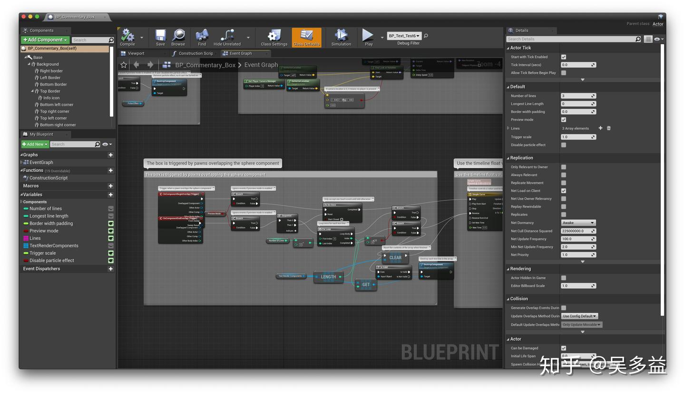
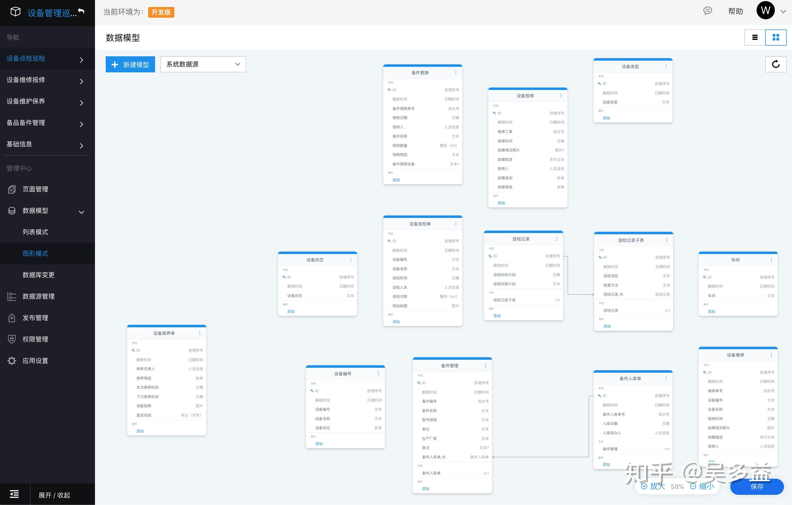
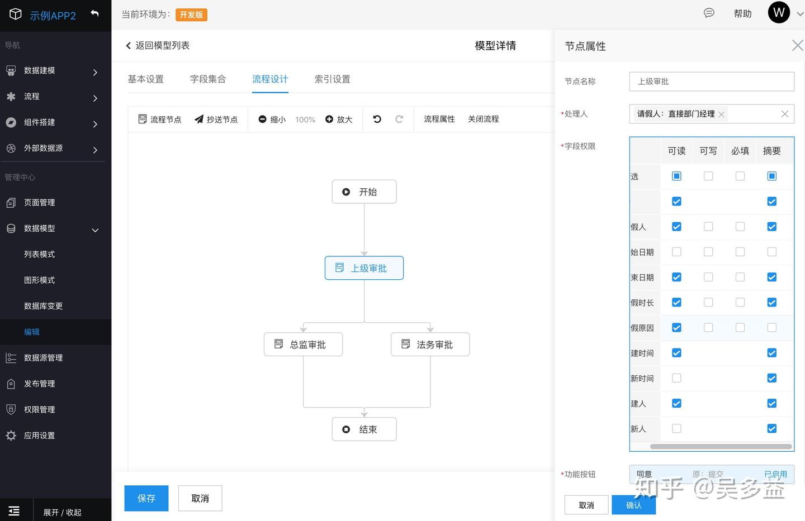

# 低代码篇：常见问题

`#低代码`

> 本文源于精读 https://zhuanlan.zhihu.com/p/225987562

## 目录
<!-- toc -->
 ## 1. 总结 

### 1.1. 总结

这篇文章深入探讨了低代码平台的概念、历史、应用场景、优势和挑战。作者分析了低代码平台如何提高开发效率，同时指出了平台锁定、灵活性和易用性之间的矛盾等问题。文章还讨论了低代码平台在前端和后端的实现方式及其适用场景。

### 1.2. 关键点

- 低代码的定义是通过可视化方式创建应用的平台，代码量较少，能显著提升开发效率。
- 低代码平台有多种形式，包括在线IDE、一站式开发平台、无代码平台等。
- 低代码平台的实现方式受团队定位影响，不同团队有不同的选择。
- 低代码平台可以解决次要任务，但无法解决根本任务。
- 图形化编程在特定领域有优势，但在通用编程中存在局限性。
- 低代码平台适合企业内部应用，不适合面向客户的应用。
- 低代码平台会带来平台锁定等新问题，影响扩展性和协作。
- 低代码平台的难点在于同时满足易用性和灵活性。
- 前端低代码主要通过配置化方式提升开发效率，适合企业应用。
- 后端低代码解决常见问题如数据管理和流程管理。
- 低代码不会大量取代研发，但会提升企业内部应用开发效率。
- 未来低代码在企业内部应用中将发挥重要作用。

## 2. 低代码是什么？

### 2.1. 定义

指那些用可视化方式创建应用的平台，特点是代码量比传统开发少得多，甚至无代码，所以能显著提升开发效率

### 2.2. 低代码的形式

1. 在线 IDE 和编辑器，界面方面虽然有可视化设计，但需要二次开发才能用。
2. 提供一站式开发平台，提供了持续集成、部署和运维等功能，包含开发全流程。
3. 简化前端开发，界面方面可以做到不用写 JavaScript。
4. 简化后端开发，可以在线设计数据结构，并实现增删改查功能。
5. 彻底简化前后端开发，甚至变成无代码平台，什么都可视化编辑，易用性好，但牺牲了灵活性，这里面有很多子分类，比如 BPM、OA 系统、APP 开发等。
6. 围绕某个成熟产品扩展功能，比如 CRM、ERP 之类的产品，为了满足定制需求，提供定制开发功能。

但 设计系统的架构受制于产生这些设计的**组织的沟通结构**

所以

- 如果是**前端团队**，会选择 第 ① 种，很少考虑第 3 种，因为团队成员都会 JavaScript，没必要弄个不用写 JavaScript 的产品，更不会考虑第 4 种，因为不负责后端开发。
- **后端团队**，就会选择第 4 种，因为只负责后端开发
- 大公司内的工程团队，会选择第 2 种，但这种形式一般有很多定制功能，并且依赖公司内部`基础设施`，导致只能在内`部使用`。
- 如果是**创业公司**，往往会选择第 5 种形式，面向外部当然是前后端都封装起来更简单，但可能过于追求「无代码」，导致虽然用起来简单，却失去了灵活性，只适合简单应用。
- 如果公司本身有**成熟产品**了，自然是选择第 6 种方式，围绕这个产品来扩展更有优势。

**因此下次在了解一款低代码产品前，先了解它背后是什么团队，擅长做什么，团队背景将在很大程度上决定这款产品的侧重点。**

---

## 3. 之前是否有低代码平台？它们是怎么做的？

很多了
-  Microsoft Access
- SaaS 软件 Salesforce 

## 4. 低代码究竟能解决什么问题？

《人月神话》定义所有软件活动包括：  
- 根本任务--打造构成抽象软件实体的复杂概念结构。  
- 次要任务--使用编程语言表达这些抽象实体，在空间和时间限制内将它们映射成机器语言。

比如，做一个计算所得税的软件
- **根本任务**是实现这个所得税的算法
- **次要任务** 用什么语言实现这个算法

低代码平台主要解决的是「**次要任务**」，用更简化的方式来实现同样的功能，

### 4.1. 低代码的几种做法

1. 提供一种简化的 DSL，类似 Excel 里的公式。
2. 提供图形化代码编辑器，类似 Unreal Engine 里的「蓝图」，或者类似 [Blockly](https://link.zhihu.com/?target=https%3A//developers.google.com/blockly)/[Scratch](https://link.zhihu.com/?target=https%3A//scratch.mit.edu/) 那种拼图的方式。
3. 支持写代码或外部 api 来扩展。
4. 平台内置实现，比如前面提到的个人所得税，平台可以内置一个专门算这个的函数。

### 4.2. 第 1 种：DSL 的方式

其中 DSL 的方式只适合简单场景，因为 DSL 一般不具备复杂的逻辑控制、定义函数等功能，DSL 中要加入这些功能还不如直接用成熟的语言，比如 JavaScript/Lua。

### 4.3. 图形化编程为什么不可行？（第 2 种做法为什么不可行）

以 UE4 里的蓝图为例，这是我见过最复杂的可视化代码编辑器，可以用它来编写着色器和控制游戏流程：

图形化编程在三维设计领域取得了不少成绩，比如 Blender、Grasshopper、Houdini、NUKE、Substance Designer 等，通过节点编程的方式极大提升了灵活度，但这些**都是针对特定领域优化，并不是通用编程方式**。

> 人月神话：流程图是一种非常差劲的软件结构表达方式。实际上，它最好被视为是 Burks, von Neumann 和 Gold stine 试图为他们说设计的计算机提供一种当时迫切需要的高级控制语言。如今的流程图已经变得复杂了，一张图有若干页，有很多连接点，这种表现形式实在令人同情。流程图已经被证明是完全不必要的设计工具--程序员是在开发之后，而不是之前绘制描述程序的流程图。  更加基本的是，如我们上面所讨论的，软件非常难以可视化。即使用图形表达出了流程图、变量范围嵌套情况、变量交叉引用、数据量和层次化数据结构等等，也只是表达了某个方面，就像盲人摸象一样。

流程图最早是给汇编语言用的，因为汇编代码里都是跳来跳去的，看着容易晕，有这样的图可以看起来更清晰：

但在高级语言下就不需要这个了，因为高级语言下的代码可读性和这张图是一样的

> 《人月神话》20 周年纪念版：流程图是被吹捧得最过分的一种程序文档。详细逐一记录的流程图是一件令人生厌的事情，而且高级语言的出现使它显得陈旧过时。

### 4.4. 第 3 种，直接通过代码扩展功能

目前排名靠前的低代码平台都支持代码扩展，比如 Salesforce 和 ServiceNow，尤其是 ServiceNow 在前后端都使用 JavaScript，后端用到了 Rhino 引擎。

### 4.5. 第 4 种方法

有些低代码平台针对某个垂直领域做了优化，集成了许多这个行业常见的功能，在同一个行业中，一家公司要解决的「根本任务」，在另一家公司大概率也会遇到，因此使用这种低代码平台可以明显降低成本。

比如淘宝可以算是电商行业的「低代码」平台，它把各种电商相关的功能都集成进去了，同时还提供了店铺装修功能实现个性化设计。

## 5. 低代码平台适合用在什么地方？

什么样的应用适合使用低代码平台？
- 目前看来最适合的场景是**面向企业内部员工**（**B2E**）的应用，也就是**企业内部的各种系统及平台**。

对外应用的低代码平台：一般都是公司主营业务，需要很高的自主可控性，而且定制需求多，对展现的要求也很高，没法复用低代码平台中的组件，只能通过自定义代码扩展，但如果大量使用代码扩展就还不如完全自己开发了。

## 6. 低代码平台会带来什么新问题？

- 扩展性、难以支持复杂场景、性能等问题，但最根本的是**平台锁定**，许多问题都是这点带来的：
	- 平台使用自己**内部独立的框架**，需要额外的学习成本。
	- 平台是个**黑盒**，不清楚内部如何实现，遇到 bug、性能等问题只能求助官方。
	- 如果有的需求不能满足，需要等平台的**排期升级**。
	- **信息分布在各处**，不像本地代码那样方便全局搜索，对于不熟悉的新人往往得在各个界面里找半天，而且是功能越强大的平台越难找。
	- **不方便多人协作**，有的平台只提供少量环境，难以做复杂的分支管理。
	- **平台后续发展是个未知数**，哪天倒闭了怎么办？Google 4 年前发布了一款低代码创建 APP 的产品 [Google App Maker](https://link.zhihu.com/?target=https%3A//developers.google.com/appmaker)，既能可视化创建界面，又能写 JavaScript 扩展功能，但它在今年 2 月份的时候[宣布关闭](https://link.zhihu.com/?target=https%3A//gsuiteupdates.googleblog.com/2020/01/app-maker-update.html)，无法导出，用户只能自己重写一个，连 Google 的低代码平台都会关闭，其它小公司就更别说了。

低代码平台为什么做不到开放？在我看来主要是两个原因：
1. 技术上的矛盾，为了实现低代码就得隐藏很多不必要的细节，而这些细节有的依赖平台底层框架，有的依赖平台编辑器，这些都是低代码平台**最核心的技术**，没法开源。
2. 商业上的矛盾，如果能方便导出，让使用者可以二次修改并部署到任意地方，低代码平台就变成离线开发工具了，只要一个帐号就能开发无数应用，不利于商业化，因此甚至有的低代码平台只提供 SaaS 版本，只能在线使用。

> 1. 平台锁定这个问题在国内更严重，有种说法是古代中国属于大陆农业文明，农业文明的特点是强调自给自足，能不求人就不求人，这个长期影响很难改变，所以**国内公司一变大就希望什么都自己掌握，信不过别人**。
> 2. 目前国内只有一个封闭的开发平台取得了巨大成功，这个平台是微信小程序，相比原生 APP 开发，微信小程序的开发成本更低，而且还跨平台，所以**其实也能算是低代码**

## 7. 低代码平台的难点在哪？

低代码平台的难点是如何**同时满足易用性和灵活性**

以低代码平台中必备的可视化页面编辑器为例，要怎么实现页面布局？主要有三种做法：
1. 基于 flexbox/float 方式来布局，这种方式`灵活性强`，但`牺牲了易用`性，需要使用者至少懂点 css，不然用不明白。
2. 基于绝对定位来布局，这种方式`易用性强`，想拖哪就拖哪，但又失去了`灵活性`，要支持多分辨率就得手机和 PC 单独编辑，而且不好实现根据内容自动撑开高度。
3. 提供水平/垂直分栏的容器，通过它们`组合来实现各种布局`，这种方式处于上面两者之间，`灵活性和易用性都不突出`，只适合用在移动端或后台类的页面。

>  所以复杂灵活的可视化编辑器有可能吃力不讨好，那偏向易用性呢？有些低代码平台追求「**零代码**」，让普通人都能用起来，但这样会面临另一个意想不到的强大竞品：「**Excel**」，对于普通人来说 Excel 就是一个好用的数据库，可以添加数据、修改数据、查找数据、排序过滤等，还能做图表，无需开发应用就能管理数据。

## 8. 前端如何低代码？

### 8.1. 是否可以给 UI 组件库加个可视化编辑器？

之前也有很多人尝试过，但行不通，**因为 UI 组件库一般只作为页面中的一部分,UI 库必须用代码来连接各个功能**，比如数据的加载和绑定、事件的处理等，这些功能难以使用可视化编辑器来实现。

## 9. 后端如何低代码？

在后端方面，低代码平台主要能解决这几类问题：

- 系统开发通用性问题，比如
	- 登录、帐号/角色、权限管理
	- 页面路由和导航
	- 外部系统对接，有的还提供一种通用协议来连各种数据源
- 数据管理，增删改查
- 流程管理
- 开发及运行环境

其中最常用的是增删改查，要如何实现？目前见到有这 3 种方式：
1. 基于表单，优点是用起来简单，只需要设计好表单就可以用了，但缺点是灵活性要弱，难以支持复杂的关系。
2. 基于数据模型，需要先定义数据模型，优点是灵活性强，但易用性又差了，非开发人员使用会有成本。
3. 提供 **BaaS 服务**，比如开源的 [Parse](https://link.zhihu.com/?target=https%3A//parseplatform.org/)，通过提供友好的 API 来实现用户管理、数据存取等功能，这种方式需要写后端代码，但灵活性高。

以我们自己为例，「[爱速搭](https://link.zhihu.com/?target=https%3A//suda.baidu.com/)」**使用了数据模型方式**，
- 数据模型其实是在数据库表的基础上的封装，所有修改操作会转成表结构的变更，所以用户最好能有点数据库基础知识，牺牲了易用性，为什么要这样做？我们的主要考虑是 ：
	- 在灵活性方面和传统数据库开发是一样的，性能也一样，我们希望能支持各种类型的应用开发，而不只是简单的办公场景。
	- 开发者更熟悉关系数据库，有些低代码平台基于 MongoDB 来方便扩展字段，但主流项目开发中还是使用关系数据库。
	- 可以使用 SQL 对数据进行修改和查询，不仅了解的人多，还能很方便对接外部 BI 平台做数据分析。
	- 方便接入现有数据库，爱速搭支持直连已有数据库，基于已有数据开发应用，无需先将数据导入到平台中。
	- 减少平台锁定风险，使用传统数据库更容易将现有数据迁移出来，改成转成传统的开发方式，加上前端使用开源 amis 渲染，降低了平台锁定的风险。

### 9.1. 图例：数据模型

### 9.2. 图例：流程设计

## 10. 低代码平台是否会大量取代研发？

1. 前面提到过低代码不适合开发面向客户（**toC**）的应用，在许多公司这部分才是最占人力的。
2. 对于企业内部应用，低代码可以显著提升效率，但**效率提升带来的不是人员减少，而是需求增多，很多之前中低优的项目终于排上了**，前面提到百度内部的 amis 创建了 3.3w 个页面，这里面肯定不少是效率提升后多出来的，因为百度没那么多做后台页面的前端人力。
3. 低代码平台解决不了「**根本任务**」，图形化编程只适合特定场景，用它来做控制流还不如写代码，因此依然需要研发。

## 11. 未来会怎样？

- 图形化编程只能在特定领域成功，目前看来主要是和**音乐及图形相关的软件**。
- 面向普通用户的**无代码平台**发展会受限，很多时候还不如用「**Excel**」。
- 对于成熟的垂直领域，**购买软件是成本最低且效果最好的选择**，比如数据可视化，我们的 [Sugar](https://link.zhihu.com/?target=https%3A//cloud.baidu.com/product/sugar.html) 开发了好多年，而购买只需几万就能立刻用上。
- 低代码在国内和国外会有明显区别，国内更喜欢私有部署而不是 SaaS 版本，技术锁定将会是在国内推广时的最大障碍。
- 低代码平台不适合用来开发面向客户的应用，以后也一样。
- 对于企业内部应用，低代码平台将会发挥重要作用，它已经被实践证明可以极大提升效率，很值得尝试。