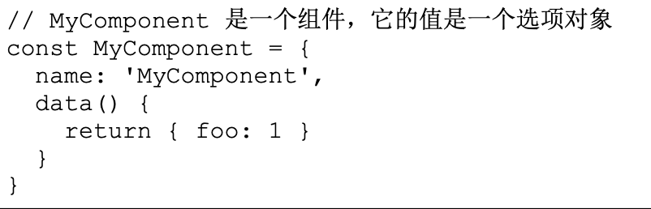
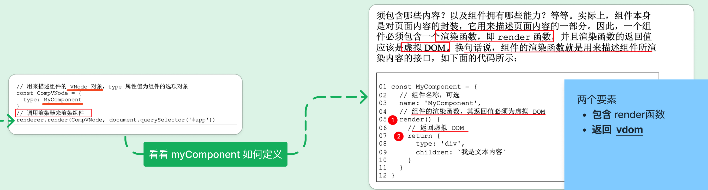
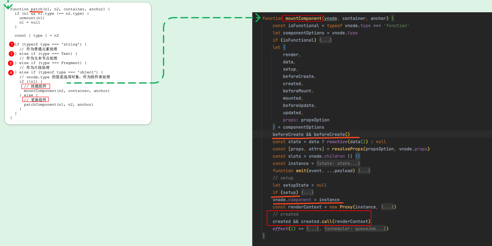
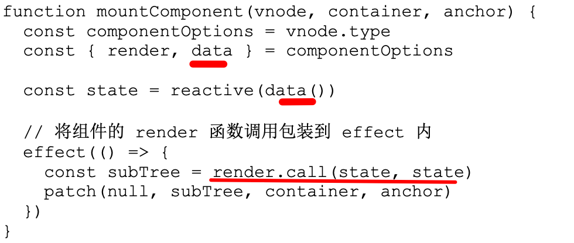
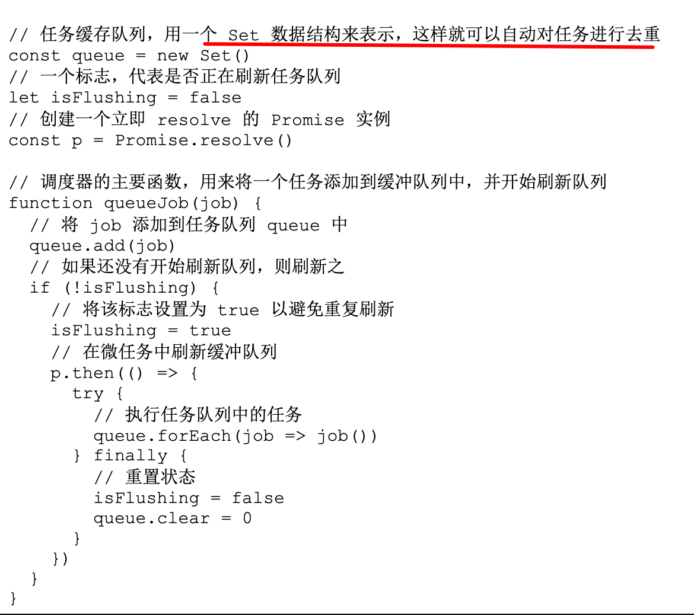
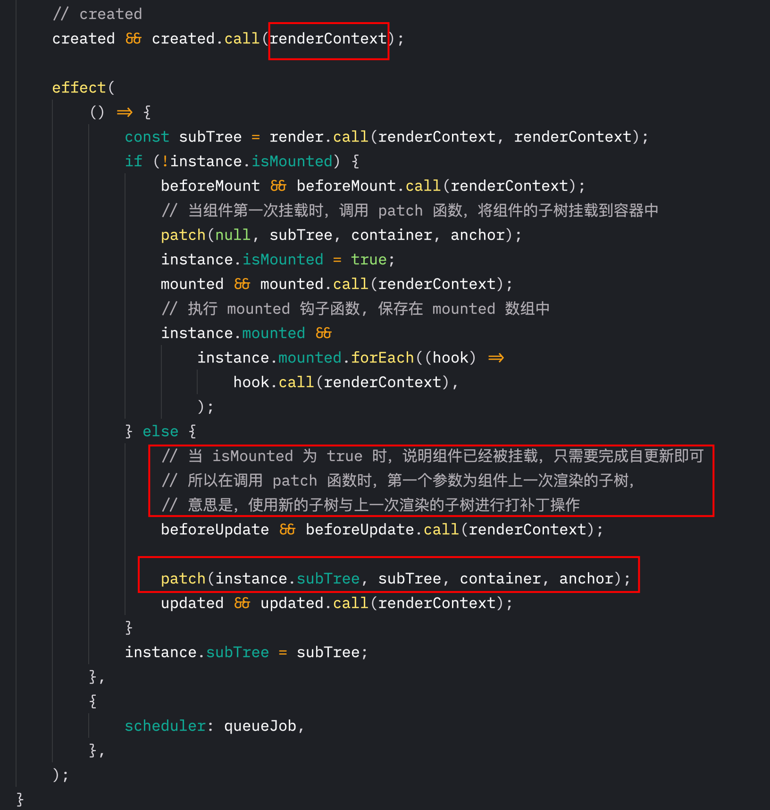
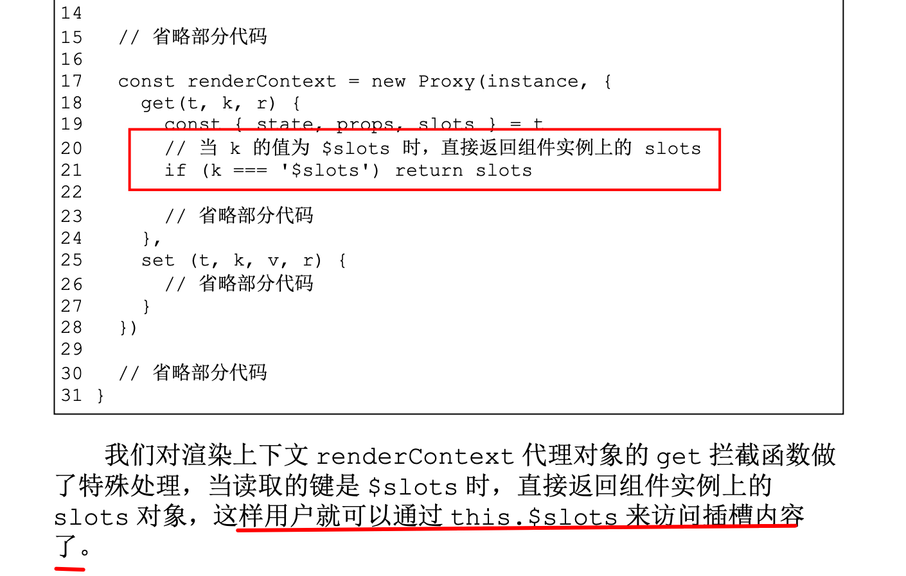
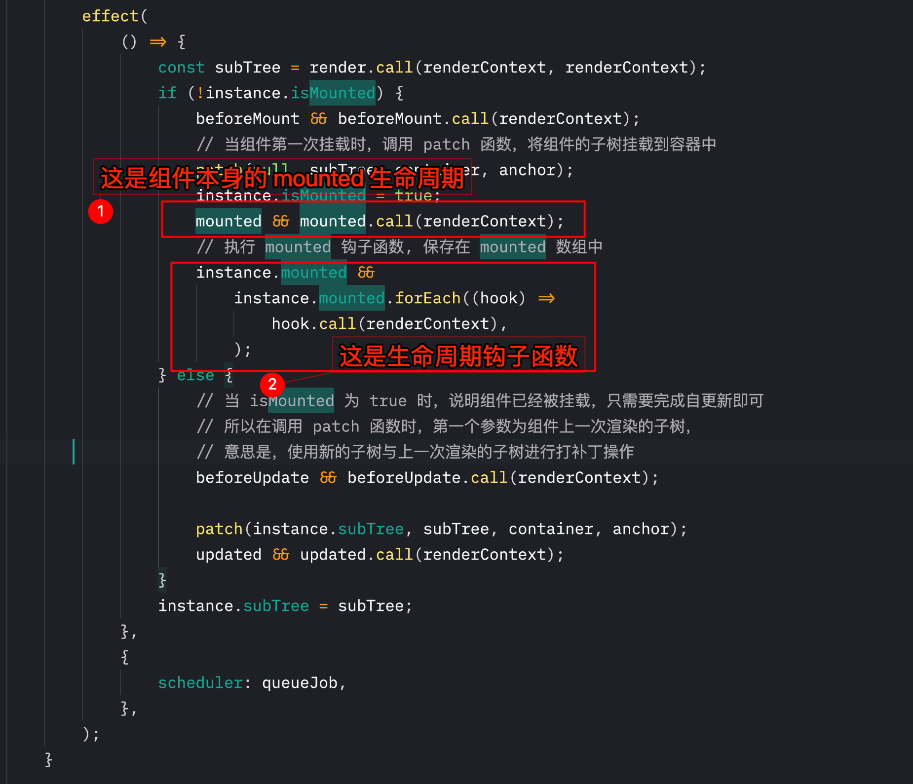

# Vue3 组件的实现原理


`#vue` `#vue3` `#2023/06/10` `#vue原理`


## 目录
<!-- toc -->
 ## 1. 总结 

### 1.1. 摘要

本文详细介绍了Vue3组件的实现原理，包括渲染器、组件和虚拟DOM之间的关系，组件状态的保存和更新机制，组件实例和生命周期的实现，props的处理，setup函数的作用，组件事件和emit的实现，插槽的工作原理，以及生命周期的注册方法。文章深入探讨了Vue3组件系统的核心概念和内部机制，为理解Vue3的工作原理提供了全面的视角。

### 1.2. 关键点

- 渲染器根据 vdom 类型判断是否为组件，并使用 mountComponent 或 patchComponent 进行挂载和更新。
- 组件状态：通过`data()`保存，并使用reactive使其成为响应式数据。
- 组件实例：是一个对象，存储组件运行过程的所有信息，包括状态、props、生命周期等。
- props机制：需要编写大量边界代码，并通过渲染上下文对象暴露数据。
- setup函数：为组合式API设计，可返回**渲染函数**或**数据对象**。
- emit 函数：用于发射组件自定义事件，v-on 指令绑定的事件会存储在props对象中。
- 插槽内容：被编译为插槽函数，`<slot>`标签被编译为插槽函数的调用。
- 生命周期函数通过 `onMounted` 等方法注册，存储在组件实例的相应数组中。

### 1.3. 如何使用虚拟节点来描述组件

- 使用虚拟节点的 `vnode.type` 属性来存储`组件对象类型`，渲染器根据虚拟节点的该属性的类型来判断它是否是组件。
	- 如果是组件，则渲染器会使用 `mountComponent` 和 `patchComponent` 来完成组件的挂载和更新。

### 1.4. 组件的自更新

- 在组件挂载阶段，会为组件创建一个`用于渲染其内容的副作用函数`。
	- 该副作用函数会与组件自身的响应式数据建立响应联系。
	- 当组件自身的响应式数据发生变化时，会触发渲染副作用函数重新执行，即`重新渲染`。
- 但由于默认情况下`重新渲染`是同步执行的，这导致无法对任务去重，因此我们在创建渲染副作用函数时，指定了`自定义的调度器`。
	- 该`调度器`的作用是，当组件自身的响应式数据发生变化时，将渲染副作用函数缓冲到微任务队列中。
	- 有了缓冲队列，我们即可实现对渲染任务的去重，从而避免无用的重新渲染所导致的额外性能开销。

### 1.5. `组件实例`

它本质上是一个对象，包含了组件运行过程中的状态，例如组件是否挂载、组件自身的响应式数据，以及组件所渲染的内容(即 subtree)等。

有了组件实例后，在渲染副作用函数内，我们就可以根据组件实例上的状态标识，来决定应该进行全新的挂载，还是应该打补丁。

### 1.6. 组件的 props 与组件的被动更新

- 副作用自更新所引起的子组件更新叫作子组件的被动更新。

### 1.7. 渲染上下文(renderContext)

它实际上是组件实例的代理对象。在渲染函数内访问组件实例所暴露的数据都是通过该代理对象实现的。

### 1.8. setup 函数

 该函数是为了组合式 API 而生 的，所以我们要避免将其与 Vue.js 2 中的“传统”组件选项混合使用。
  setup 函数的返回值可以是两种类型，
  - 如果返回函数，则将该函数作为组件的渲染函数;
  - 如果返回数据对象，则将该对象暴露到渲染上下文中。
### 1.9. emit 函数

- `emit 函数`包含在 `setupContext 对象`中，可以通过 `emit 函数`发射组件的自定义事件。
- 通过 `v-on 指令`为组件绑定的事件在经过`编译`后，会以 `onXxx` 的形式存储到 `props 对象`中。
- 当 emit 函数执行 时，会在 props 对象中寻找对应的事件处理函数并执行它。

### 1.10. 组件的插槽

- 它借鉴了 Web Component 中 `<slot>` 标签的概念。
- 插槽内容会被`编译`为插槽函数，插槽函数的返回值就是向槽位填充的内容。
- `<slot>` 标签则会被编译为`插槽函数`的调用，通过执行对应的插槽函数，得到外部向槽位填充的内容(即虚拟 DOM)，最后将该内容渲染到槽位中。
### 1.11. 生命周期钩子函数

- 比如 onMounted ，通过 onMounted 注册的生命周期函数会被注册到当前组件实例的 `instance.mounted 数组`中。
- 为了维护当前正在初始化的组件实例，我们定义了全局变量 `currentInstance`，以及用来设置该变量的 `setCurrentInstance` 函数。

## 2. 渲染器、组件与 vdom 之间的关系

前文 [11. Vue3 的渲染器原理](/post/1d4b6077acf55710b1a41f7b8e299b2f.html) 实现了对单个 `vdom` 的渲染，比如对下面 `vdom` 的渲染：

```js
const Fragment = Symbol()
const newVnode = {
  type: 'div',
  children: [
    {
      type: Fragment,
      children: [
        { type: 'p', children: 'text 1' },
        { type: 'p', children: 'text 2' },
        { type: 'p', children: 'text 3' }
      ]
    },
    { type: 'section', children: '分割线' }
  ]
}
```

但实际页面，会包括很多 `vdom` 甚至是各种嵌套的 `vdom`

那么，**如何使用** `vdom` **来描述页面，描述 UI 呢？**

这里直接给出答案：如下结构

```js hl:2
const C1 = {
    name: 'C1',
    type: 'C1',
    render() {
        return {
            type: 'div',
            children: [
                { type: 'p', children: 'text 1' },
                { type: 'p', children: 'text 2' },
                { type: 'p', children: 'text 3' }
            ]
        }
    }
}
```

两个要点：

- ①  包含 `render` 函数
- ②  `return` 一个 `vnode`

下图展示了 `渲染器、组件 、 vnode 的关系` , **很重要，打开看看**
- [figjam](https://www.figma.com/file/hT9k2YbVvV1UIITtUmbJ0C/2023.05.LOG?type=whiteboard&node-id=201-996&t=x2AAJuGlw9iHBGmM-4)

- 总结下就是，渲染器会根据 `vdom` 的类型
	- 是字符串
	- 是文本类型（Symbol）
	- 是 Fragment
	- 是对象或者函数
		- 来判断它是否是否是`组件`，
			- 如果是，则会继续递归使用 `mountComponent` 或者 `patchComponent`来完成组件的挂载和更新
				- 比如 ：
					- 
				- 比如：
					- 
- 部分代码如下：

```js
if (typeof type === 'string') {
    if (!n1) {
        mountElement(n2, container, anchor)
    } else {
        patchElement(n1, n2)
    }
} else if (type === Text) {
    if (!n1) {
        const el = n2.el = createText(n2.children)
        insert(el, container)
    } else {
        const el = n2.el = n1.el
        if (n2.children !== n1.children) {
            setText(el, n2.children)
        }
    }
} else if (type === Fragment) {
    if (!n1) {
        n2.children.forEach(c => patch(null, c, container))
    } else {
        patchChildren(n1, n2, container)
    }
} else if (typeof type === 'object' || typeof type === 'function') {
    // 挂载组件
    if (!n1) {
        mountComponent(n2, container, anchor)
    } else { // 更新组件
        patchComponent(n1, n2, anchor)
    }
}
```

挂载与更新组件，对应不同的生命周期，如下图



## 3. 如何保存组件状态，以及状态改变了同步更新组件

如果保存组件状态呢？答案是 `data()` ，并且需要让 `data 数据`是响应式的，所以代码应该如下

```js
const state = data ? reactive(data()) : null
```

所以，每次更新 data ，会重新渲染



但是浏览器渲染是`同步任务`，所以需要有个**调度器**来调度，它通过`promise` 实现了一个`微任务队列`，避免重复渲染，去重任务队列等。

关于调度器微任务队列的实现，更多参考 [11. 前端/2. 前端架构篇/3. Vue 篇/2. Vue 原理篇/3. Vue3 的响应式的系统设计原理|3. Vue3 的响应式的系统设计原理](/post/d6757822f66e55c483673891ac1025cc.html#11-前端/2-前端架构篇/3-Vue-篇/2-Vue-原理篇/3-Vue3-的响应式的系统设计原理|3-Vue3-的响应式的系统设计原理)

部分代码如下：注意下面的 `scheduler`

```js
 const state = data ? reactive(data()) : null
 effect(() => {
    const subTree = render.call(renderContext, renderContext)
}, {
    scheduler: queueJob
})
```

queueJob 的代码如下：



## 4. 组件实例与组件的生命周期

- **组件实例**，本质就是一个对象，**存储着组件运行过程的所有信息**，比如
	- 组件状态
	- 是否卸载
	- 组件的子树
	- 插槽
	- 生命周期等
- 如下代码：

```js
const instance = {
        state, //  组件自身的状态数据，即 data。
        props: shallowReactive(props),
        isMounted: false, //  一个布尔值，用来表示组件是否被挂载
        subTree: null,
        slots,
        mounted: [] // 都钩子函数数组
}
```

各类生命周期，就在具体位置上添加即可，如下：


一个组件可能存在多个同类型的组件，比如 `mixin` 进来的组件，这时候就需要数组了。但核心原理不变

> 我们通常把生命周期钩子序列化一个数组



## 5. props 与组件的被动更新

- `副作用自更新`所引起的子组件更新叫作`子组件的被动更新`。
- 我们需要检查是否需要真的更新
	- 比如 `props` 如果根本就没变？
	- 如果需要更新，需要同步更新子组件的 `props` 、`slots` 等内容
	- 其实要 **完善 vue 中的 props 机制，需要编写大量的边界代码**

由于 props 数据与组件自身的状态数据都需要暴露到`渲染函数`中，并使得渲染函数能够通过 this 访问它们，因此我们需要封装一个`渲染上下文对象（renderContext）`， 它实际上是组件实例的代理对象。在渲染函数内访问组件实例所暴露的数据都是通过该代理对象实现的。

`renderContext` 它的意义在于拦截数据状态的读取和设置操作，每当在渲染函数或生命周期钩子中通过 this 来读取数据时，都 会优先从组件的自身状态中读取，如果组件本身并没有对应的数据， 则再从 props 数据中读取。最后我们将渲染上下文作为渲染函数以及 生命周期钩子的 this 值即可

vue 中，没有在 `props 选项`中的 `props 数据`都将存储到 `attrs` 对象中

下面是  `patchComponent` 的逻辑

```javascript hl:4,6
function patchComponent(n1, n2, anchor) {
	const instance = (n2.component = n1.component);
	const { props } = instance;
	if (hasPropsChanged(n1.props, n2.props)) {
		// 调用 resolveProps 函数重新获取 props 数据
		const [nextProps, nextAttrs] = resolveProps(
			n2.type.props,
			n2.props,
		);
		// 更新 props
		for (const k in nextProps) {
			props[k] = nextProps[k];
		}
		// 删除不存在的 props
		for (const k in props) {
			if (!(k in nextProps)) delete props[k];
		}
	}
}

function hasPropsChanged(prevProps, nextProps) {
	const nextKeys = Object.keys(nextProps);
	if (nextKeys.length !== Object.keys(prevProps).length) {
		return true;
	}
	for (let i = 0; i < nextKeys.length; i++) {
		const key = nextKeys[i];
		return nextProps[key] !== prevProps[key];
	}
	return false;
}

function resolveProps(options, propsData) {
	const props = {};
	const attrs = {};
	for (const key in propsData) {
		if ((options && key in options) || key.startsWith("on")) {
			props[key] = propsData[key];
		} else {
			attrs[key] = propsData[key];
		}
	}

	return [props, attrs];
}
```

## 6. setup 函数的作用 与 实现

`setup` 函数，它只会在挂载时`执行一次`，该函数是为了`组合式 API` 而生的，==所以我们要避免将其与 `Vue.js 2 中的“传统”组件选项（如 methods watch data）` 混合使用。==

`setup` 函数的返回值可以是**两种类型**
- 如果返回`函数`，则**将该函数作为组件的渲染函数**；
- 如果返回`数据对象`，则将该对象暴露到渲染上下文中，暴露给模板使用。

```js
const InnerComp = {
    name: 'InnerComp',
    /**
     * expose: 暴露给父组件的属性
     * */
    setup(props, {emit, slots,attrs,expose}) {
		// setupContext 中包含与组件接口相关的重要数据
		// const { slots, emit, attrs, expose } = setupContext
        
        const count = ref(0);
        // 返回一个【数据对象】
        return {
            count,
        }
        // 返回一个【渲染函数】
        return () => ({
            type: 'span',
            children: 'inner'
        })
    }
}
```

## 7. 组件事件与 emit

- emit 函数包含在 `setupContext 对象`中，可以通过 `emit 函数` 发射组件的自定义事件。
- 通过 `v-on` 指令为组件绑定的事件在经过`编译`后，会以 `onXxx` 的形式存储到 `props 对象`中。
- 当 `emit` 函数执行时，会在 **props 对象中寻找对应的事件处理函数**并执行它。

```javascript hl:3
function emit(event, ...payload) {
		const eventName = `on${event[0].toUpperCase() + event.slice(1)}`;
		// 从当前组件实例上获取事件处理函数
		const handler = instance.props[eventName];
		if (handler) {
			handler(...payload);
		} else {
			console.error("事件不存在");
		}
	}
```

## 8. 插槽 slot

它借鉴了 Web Component 中 `<slot> 标签`的概念。
- **插槽内容会被编译为插槽函数，插槽函数的返回值就是向槽位填充的内容**。
- `<slot>` 标签则会被编译为插槽函数的调用，通过执行对应的**插槽函数**，得到外部向槽位填充的内容（即虚拟 DOM），最后将该内容渲染到`槽位`中。

我们以 `MyComponent` 组件为例，它的模板如下：


上面的代码会**编译**成如下：


具体使用 `MyComponent` 组件


上面的模板，会编译成如下`渲染函数`：


比如  `this.$slots.header()`  ，在 renderContext 代理对象中获取，如下：



**插槽的实现是不是和 React render props 的概念很像？**，如下图：


## 9. 注册生命周期

先看代码，下面注册两个 `onMounted` ，它会被放到一个数组中。


- 通过 `onMounted` 注册的生命周期函数会被注册到**当前组件实例**的**instance.mounted 数组**中。
- 为了维护当前正在初始化的**组件实例**，我们定义了`全局变量currentinstance`，以及用来设置该变量的 `setCurrentInstance` 函数。
- 其他生命周期同理。


### 9.1. 如何 push 的


### 9.2. 如何执行的



## 10. 最后

一些具体代码实现细节，没有太抠，知道大致的原理即可，真有应用场景再仔细研究一下具体代码实现细节。

## 11. 参考

- 《Vue 设计与实现》