# Vue3 的编译器原理（篇三：编译优化）


 `#vue` `#vue3` 


## 目录
<!-- toc -->
 ## 总结 

- `渲染器`能够得到`编译`器的一些**额外信息**，所以虚拟 DOM 会产生额外的开销
	- 比如，静态节点
	- 所以，`vue.js 3 的编译器`会充分分析模板，提取==关键信息==并将其附着到对应的==虚拟节点==上
- 编译优化的核心在于，区分**动态节点与静态节点**。
	- Vue.js 3 会为`动态节点`打上补丁标志，即 `patchFlag`
- ==静态提升== →  可以理解为（将静态 HTML 内容提取为变量）
	- 能够减少更新时创建虚拟 DOM 带来的性能开销和内存占用
		- ==①== 静态提升的 props
			- hoist-props
		- ==②== 静态提升的 vnode 节点
			- hoist-vnode
		- ③ 静态提升`静态字符串`
			- hoist-html-string
- ==缓存==内联事件处理函数
- v-once
	- cache
		- `虚拟DOM` 被缓存了，所以更新时无须重新创建

## 1. 传统 Diff 算法的问题

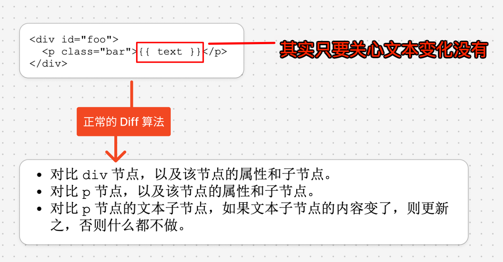

为什么虚拟 DOM 会产生额外的性能开销呢?
- 根本原因在于，**渲染器在运行时得不到足够的信息**。
	- 传统 Diff 算法无法利用编译时提取到的任何关键信息，这导致渲染器在运行时不可能去做相关的优化

## 2. 解决方案：编译优化

- 编译优化指的是通过编译的手段提取`关键信息`，并以此指导生成最优代码的过程。
- 具体来说，Vue.js 3 的编译器会充分分析模板，提取关键信息并将其附着到对应的虚拟节点上。
- 在运行时阶段，渲染器通过这些`关键信息`执行 “**快捷路径**” ，从而提升性能。

### 2.1. Block 和 PatchFlags

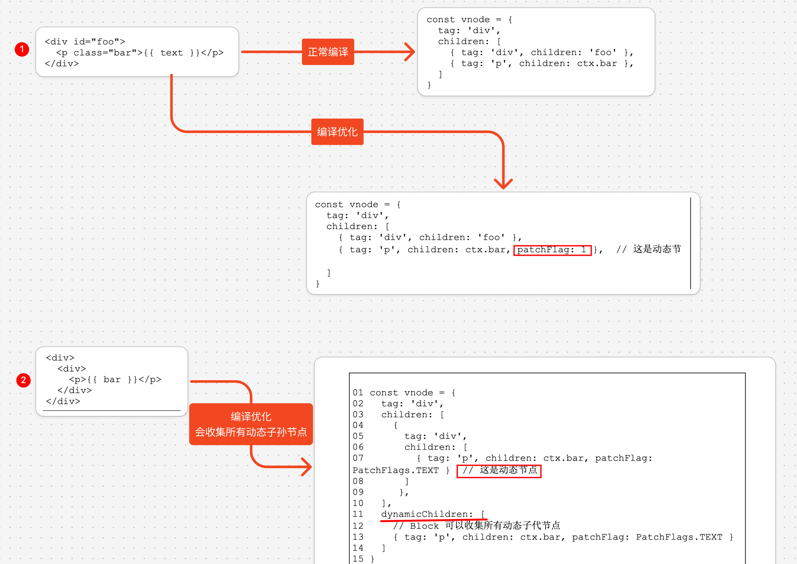

- 观察上面的 `vnode 对象`可以发现，与普通虚拟节点相比，它多出了一个额外的 `dynamicChildren` 属性。
- 我们把带有该属性的虚拟节点称为“块”， 即 `Block`。
	- 所以，一个 Block `本质上`也是一个虚拟 DOM 节点
		- 只不过它比普通的虚拟节点多出来一个用来==存储动态子节点==的 `dynamicChildren` 属性。

这里需要注意的是，一个 Block 不仅能够收集它的直接动态子节点，还能够收集所有`动态子孙节点`。

渲染器的更新操作将会以 Block 为维度。也就是说，当渲染器在更新一个 Block 时，会忽略虚拟节点的 children 数组，而是直接找到该虚拟节点的 `dynamicChildren 数组`，并只更新该数组中的动态节点。这样，在更新时就实现了跳过静态内容，只更新动态内容。

同时，由于动态节点中存在对应的补丁标志，所以在更新动态节点的时候，也能够做到**靶向更新**。
- 例如，当一 个动态节点的 `patchFlag` 值为数字 1 时，我们知道它只存在动态的文本节点，所以只需要更新它的文本内容即可

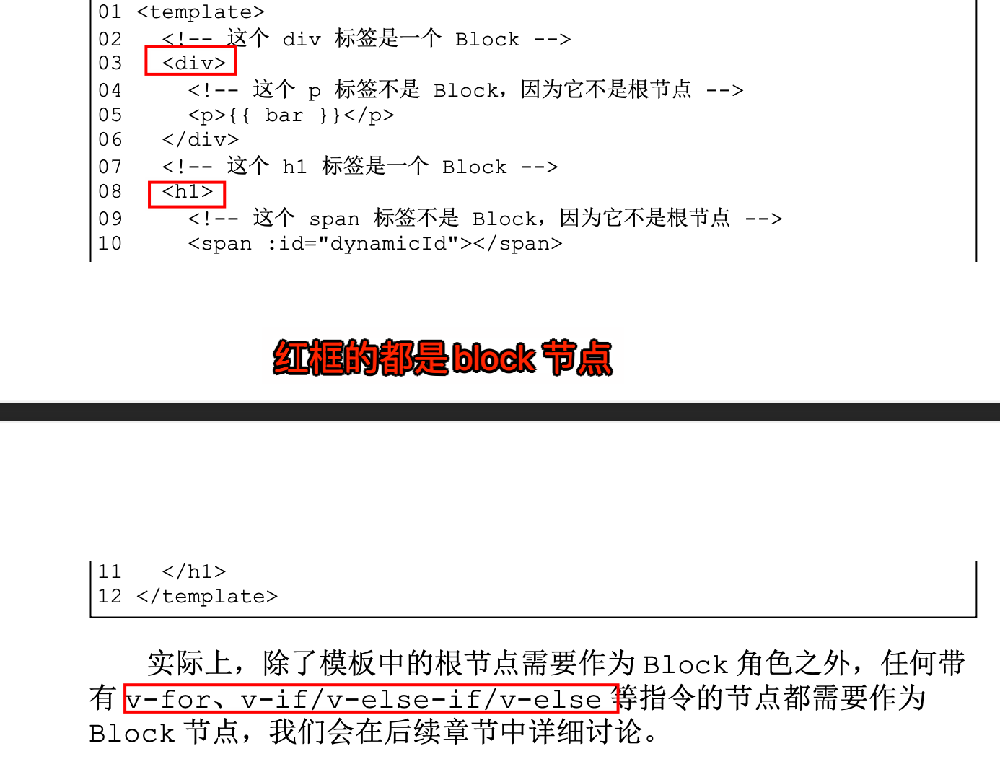

### 2.2. 收集动态节点

在编译器生成的渲染函数代码中，**并不会直接包含用来描述虚拟节点的数据结构，而是包含着用来创建虚拟 DOM 节点的辅助函数**

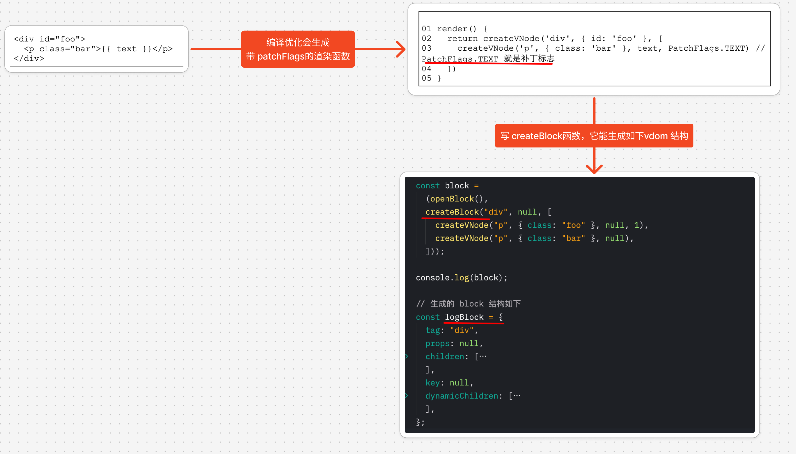

`createBlock` 函数及 `createVNode` 代码如下：

```javascript
function createVNode(tag, props, children, flags) {
  const key = props && props.key;

  // 为什么要删除 key 属性呢？
  // 因为 key 属性是用来做虚拟节点的唯一标识的，不应该被挂载到 props 上
  props && delete props.key;

  const vnode = {
    tag,
    props,
    children,
    key,
    flags,
  };

  if (typeof flags !== "undefined" && currentDynamicChildren) {
    // 动态节点
    currentDynamicChildren.push(vnode);
  }

  return vnode;
}

// 动态节点栈
const dynamicChildrenStack = [];
// 当前动态节点集合
let currentDynamicChildren = null;
// openBlock 用来创建一个新的动态节点集合，并将该集合压入栈中
function openBlock() {
  dynamicChildrenStack.push((currentDynamicChildren = []));
}
// closeBlock 用来将通过 openBlock 创建的动弹节点集合从栈中弹出
function closeBlock() {
  currentDynamicChildren = dynamicChildrenStack.pop();
}

function createBlock(tag, props, children) {
  const block = createVNode(tag, props, children);
  block.dynamicChildren = currentDynamicChildren;

  closeBlock();

  return block;
}

```

运行看效果

```javascript hl:8,10
const block =
  (openBlock(),
  createBlock("div", null, [
    createVNode("p", { class: "foo" }, null, 1),
    createVNode("p", { class: "bar" }, null),
  ]));

console.log(block);

// output：
const vdom = {
  tag: "div",
  props: null,
  children: [
    {
      tag: "p",
      props: {
        class: "foo",
      },
      children: null,
      flags: 1,
    },
    {
      tag: "p",
      props: {
        class: "bar",
      },
      children: null,
    },
  ],
  key: null,
  dynamicChildren: [
    {
      tag: "p",
      props: {
        class: "foo",
      },
      children: null,
      flags: 1,
    },
  ],
};
```

以上 block 或者 vdom 可以直接给 render 函数

```javascript
// render() {
//   return createVNode('div', {}, [
//     createVNode('div', {}, [
//       createVNode('div', {}, [
//         createVNode('div', {}, [
//           createVNode('div', {}, [
//             // ...
//           ])
//         ])
//       ])
//     ])
//   ])
// }
```
 

### 2.3. 渲染器的运行时支持

现在，我们已经有了动态节点集合 `vnode.dynamicChildren`， 以及附着其上的补丁标志。基于这两点，即可在渲染器中实现**靶向更新**。


### 2.4. 总结

- 编译优化的核心在于，区分**动态节点与静态节点**。
	- Vue.js 3 会为`动态节点`打上补丁标志，即 `patchFlag`。
- 同时，Vue.js 3 还提出了 Block 的概念，一个 Block 本质上也是一个虚拟节点，但与普通虚拟节点相比，会多出一个 `dynamicChildren` 数组。
- 该数组用来收集所有动态子代节点
	- 这利用了 `createVNode` 函数和 createBlock 函数的层层嵌套调用的特点，
		- 即以“由内向外”的方式执行。再配合一个 用来临时存储动态节点的节点栈，即可完成**动态子代节点**的收集。

## 3. Block 树

### 3.1. v-if 的问题：使用 key 

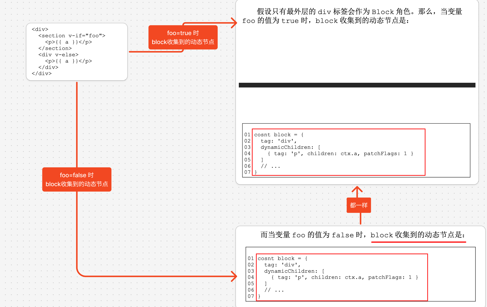

解决方案：

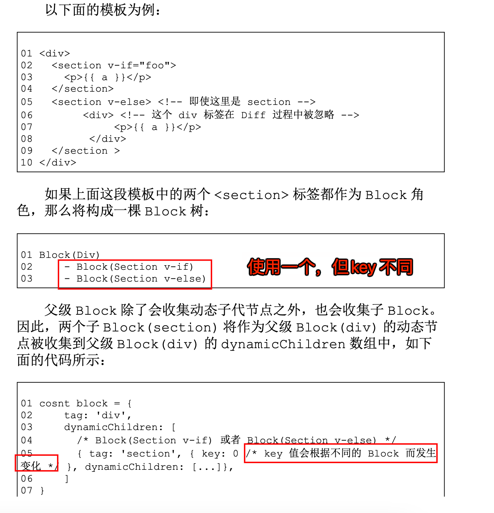

### 3.2. v-for 的解决方案： 让 v-for 的指令也作为 block

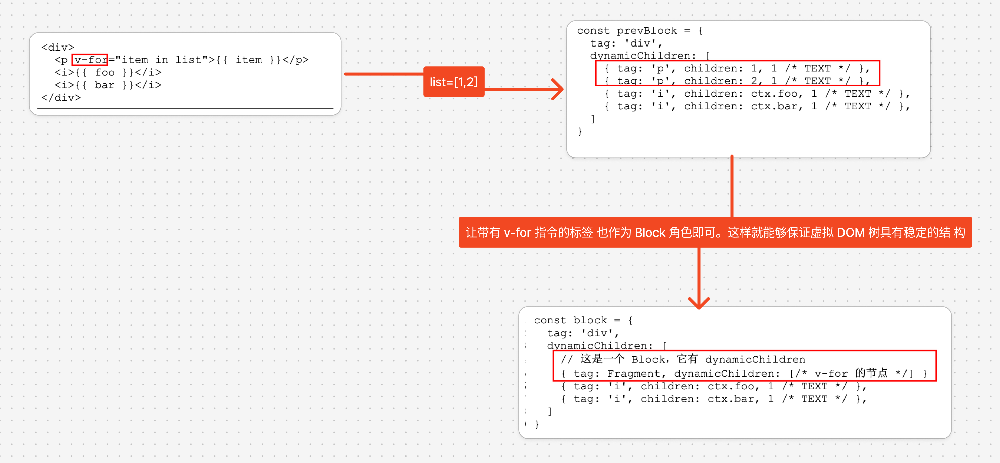

### 3.3. Fragment 的稳定性与不稳定

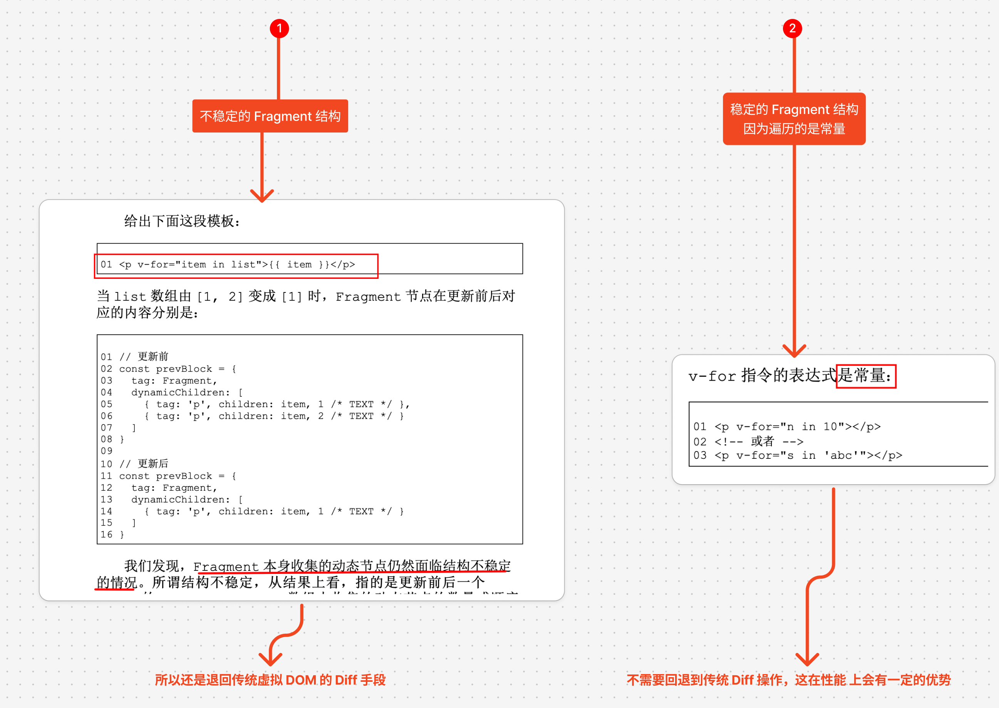

### 3.4. 总结

- 由于 Block 会收集所有动态子代节点，所以对动态节点的比对操作是忽略 DOM 层级结构的。
- 这会带来额外的问题，
	- 即 **v-if、v-for 等结构化指令会影响 DOM 层级结构，使之不稳定。这会间接导致基于 Block 树的比对算法失效**。

而解决方式很简单，只需要让带有 v-if、v-for 等指令的节点也作为 Block 角色即可。

## 4. 静态提升

静态提升: 能够减少更新时创建虚拟 DOM 带来的性能开销和内存占用。

### 4.1. 静态提升静态虚拟节点

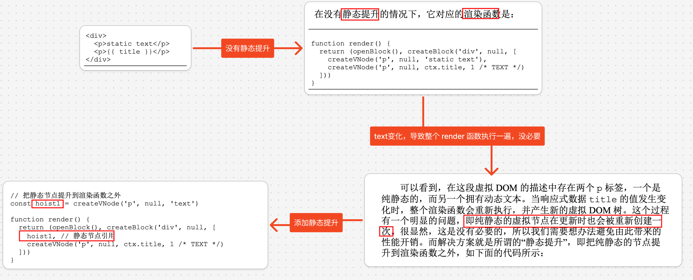

### 4.2. 静态提升静态属性

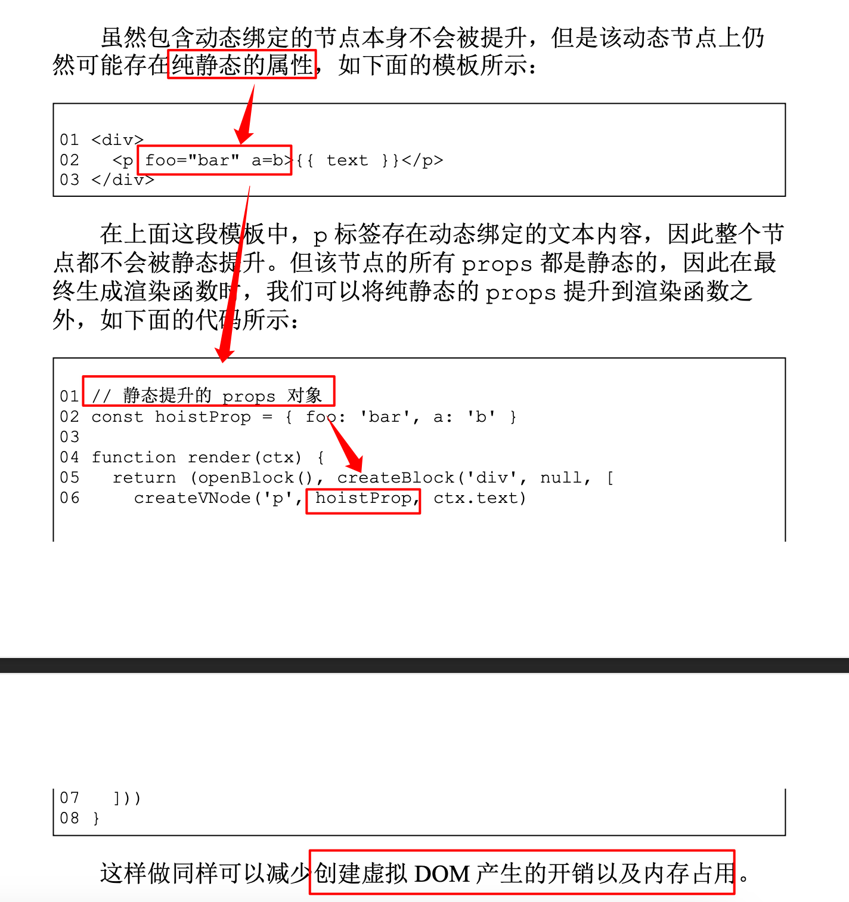

## 5. 预字符串化：静态提升静态字符串

预字符串化: 在静态提升的基础上，对静态节点进行字符串化。 这样做能够减少创建虚拟节点产生的性能开销以及内存占用。

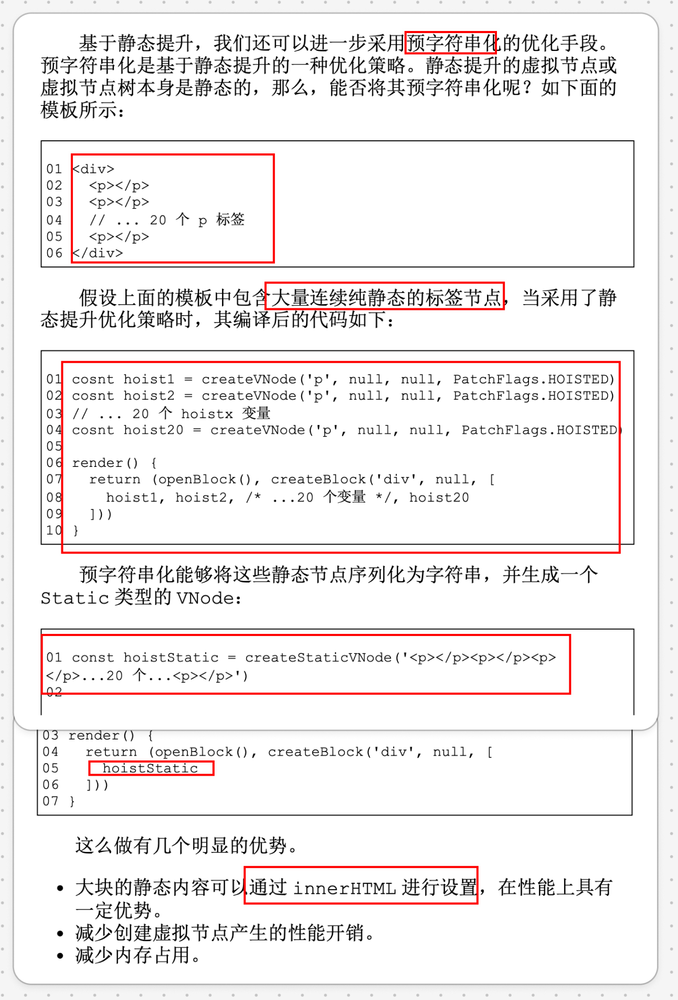

## 6. 缓存内联事件处理函数

避免造成不必要的组件更新

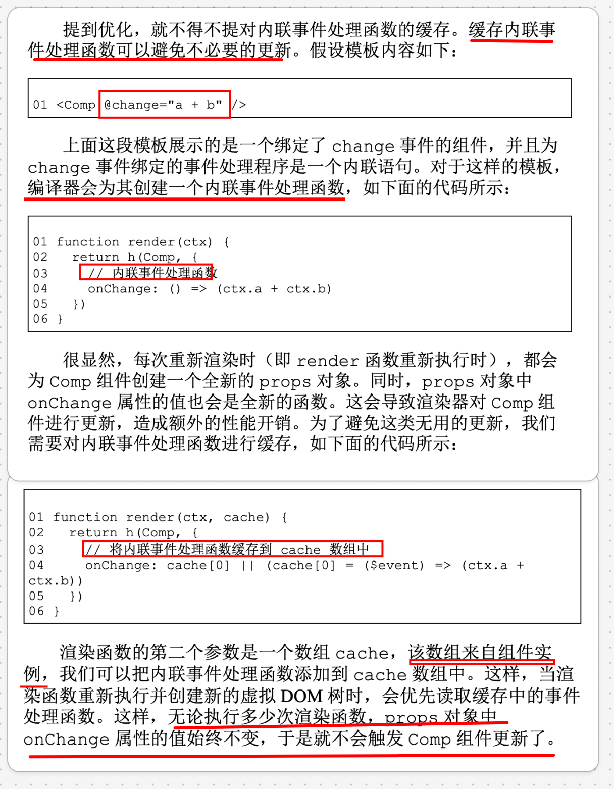

## 7. v-once 指令：缓存全部或部分虚拟节点

缓存全部或部分虚拟节点，能够避免组件更新时重新创建虚拟 DOM 带来的性能开销，也可以避免无用的 Diff 操作。

当编译器遇到 `v-once 指令`时，会利用我们上一节介绍的 `cache 数组`来缓存`渲染函数的全部或者部分执行结果`，如下图

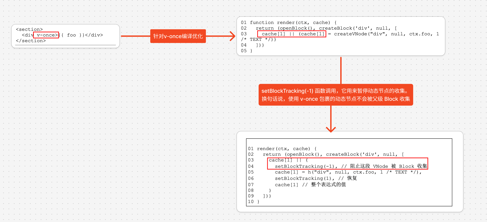

实际上，`v-once 指令`能够从两个方面提升性能。
- 避免组件更新时重新创建虚拟 DOM 带来的性能开销。
	- 因为`虚拟 DOM` 被缓存了，所以更新时无须重新创建。
- 避免无用的 Diff 开销。这是因为被 `v-once 标记`的虚拟 DOM 树不会被父级 Block 节点收集。

