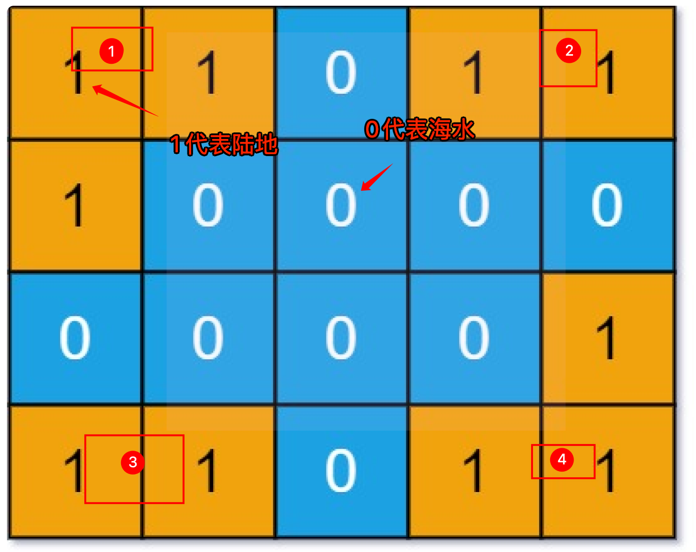

# 岛屿数量


>  [200. 岛屿数量](https://leetcode.cn/problems/number-of-islands/)


## 目录
<!-- toc -->
 ## 1. 总结 

- 只要发现一个`陆地 1`，就把它周边的`陆地 1`都变成`海水 0` 
	- 这样就**不用维护 `visited` 了**
- dfs 没有传入参数 grid，直接写到函数内部，省得传参数了
	- 但是，实际开发中肯定不建议这么搞

```javascript
var numIslands = function (grid) {
  let m = grid.length;
  let n = grid[0].length;
  let res = 0;

  for (let i = 0; i < m; i++) {
    for (let j = 0; j < n; j++) {
      if (grid[i][j] === "1") {
        res++;
        dfs(i, j);
      }
    }
  }

  return res;

  function dfs(i, j) {
    // 超出索引边界
    if (i < 0 || j < 0 || i >= m || j >= n) {
      return;
    }
    // 已经是海水了
    if (grid[i][j] === "0") {
      return;
    }
    grid[i][j] = "0";
    // 淹没上下左右的陆地
    dfs(i + 1, j); // 下
    dfs(i, j + 1); // 右
    dfs(i - 1, j); // 上
    dfs(i, j - 1); // 左
  }
};
```

## 2. 题目



如上图，`0` 代表`海水`，`1` 代表`陆地`，返回独立岛屿的数量为 `4`

## 3. 思路

- 使用 [2.  二维矩阵遍历框架](/post/m91CcQDX.html) ，==只要发现一个陆地，就把它周边的陆地都变成海水==
- 这样主要是为了省事，避免维护 `visited` 数组
	- 因为 `dfs` 函数遍历到值为 `0` 的位置会直接返回
		- 所以只要把经过的位置都设置为 `0`，就可以起到不走回头路的作用


```javascript
var numIslands = function (grid) {
  let res = 0;
  let m = grid.length,
    n = grid[0].length;
  // 遍历 grid
  for (let i = 0; i < m; i++) {
    for (let j = 0; j < n; j++) {
      if (grid[i][j] === "1") {
        // 每发现一个岛屿，岛屿数量加一
        res++;
        // 然后使用 DFS 将岛屿淹了
        dfs(grid, i, j);
      }
    }
  }
  return res;
};

// 从 (i, j) 开始，将与之相邻的陆地都变成海水
var dfs = function (grid, i, j) {
  let m = grid.length,
    n = grid[0].length;
  if (i < 0 || j < 0 || i >= m || j >= n) {
    // 超出索引边界
    return;
  }
  if (grid[i][j] === "0") {
    // 已经是海水了
    return;
  }
  // 将 (i, j) 变成海水
  grid[i][j] = "0";
  // 淹没上下左右的陆地
  dfs(grid, i + 1, j);
  dfs(grid, i, j + 1);
  dfs(grid, i - 1, j);
  dfs(grid, i, j - 1);
};

```

