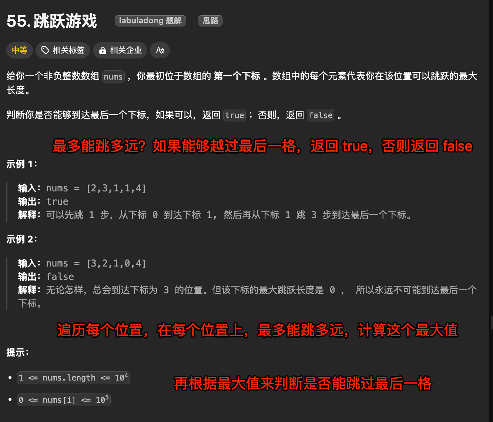

# 跳跃游戏


`#leetcode`   `#2024/08/16`  `#算法/贪心算法`  


## 目录
<!-- toc -->
 ## 题目及理解 

[https://leetcode.cn/problems/jump-game/](https://leetcode.cn/problems/jump-game/)




## 解题思路

### 思路一：贪心算法

1. 贪心算法： 我们可以使用贪心算法来解决这个问题。核心思想是维护一个变量 `maxReach`，表示能够到达的**最远位置**。
2. 遍历数组： 从左到右遍历数组，对于每个位置，我们更新 `maxReach`。
3. 更新 `maxReach`： 对于当前位置 i，我们可以跳到的最远位置是 `i + nums[i]`
	- 因此，`maxReach` 应该更新为 `Math.max(maxReach, i + nums[i])` 
4. 检查是否可以继续： 
	- 如果在某个`位置 i`，`maxReach` 小于或等于 i，且 `i` 还不是最后一个位置，那么我们就无法继续前进，返回 false。
5. 到达终点： 如果我们能够遍历完整个数组，那么就意味着我们可以到达最后一个位置，返回 true。

#### 代码实现

```javascript
/**
 * @param {number[]} nums
 * @return {boolean}
 */
var canJump = function (nums) {
  // 代表当前能到达的最远位置
  let maxReach = 0;

  for (let i = 0; i < nums.length; i++) {
    // 如果当前位置大于最远位置，说明无法到达
    // maxReach 是当前能到达的最远位置
    // 例如 [3, 2, 1, 0, 4]，当 i = 4 时，maxReach = 3，无法到达
    // 例如 [2, 3, 1, 1, 4]，当 i = 4 时，maxReach = 4，可以到达
    if (i > maxReach) {
      return false;
    }
    // 更新最远位置
    // i + nums[i] 代表当前位置能到达的最远位置,i 是当前位置，nums[i] 是当前位置的值
    // question: 为什么要取最大值？
    // answer: 因为当前位置的值是当前位置能到达的最远位置，所以要取最大值
    maxReach = Math.max(maxReach, i + nums[i]);
  }

  // 如果最远位置大于等于数组长度，说明可以到达
  return true;
};

```

#### 复杂度分析

- 时间复杂度是 O(n)，其中 n 是数组的长度，因为我们只遍历了一遍数组。
- 空间复杂度是 O(1)，因为我们只使用了常数额外空间

### 思路二：动态规划

#### 代码实现

#### 复杂度分析

## 错误记录